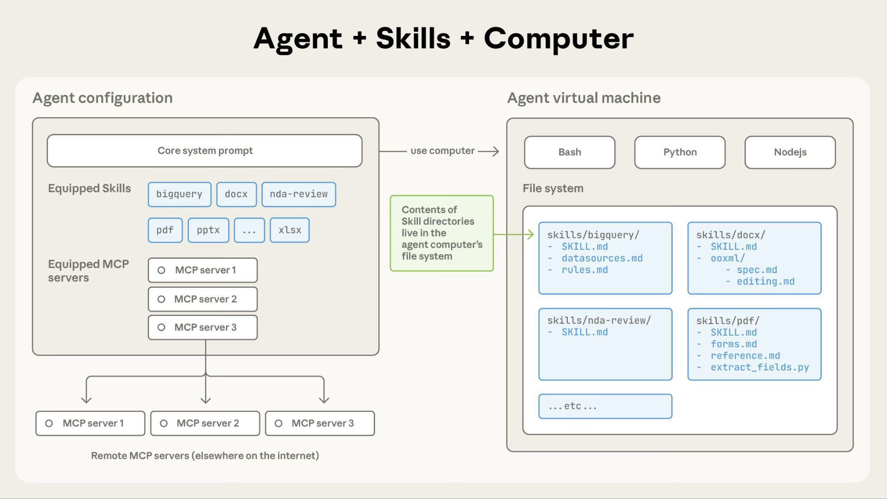
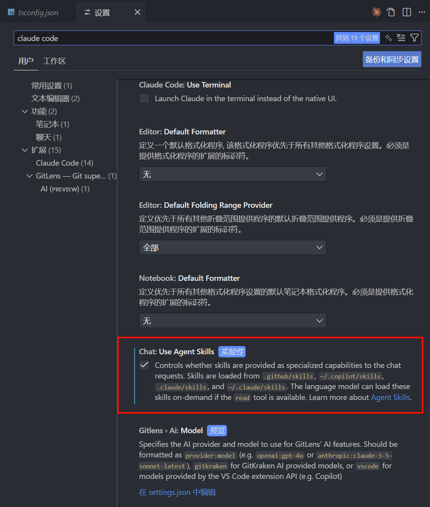
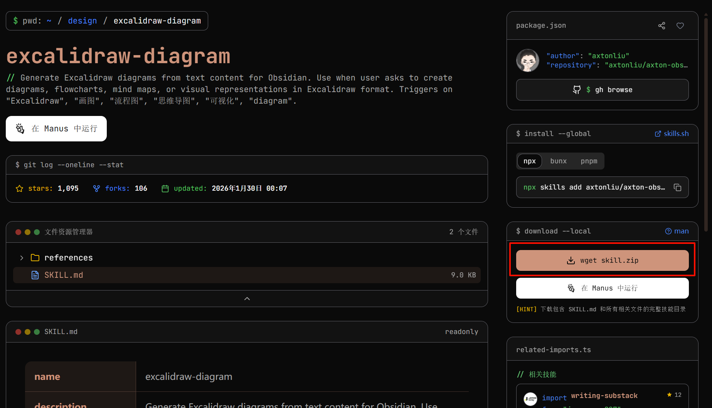
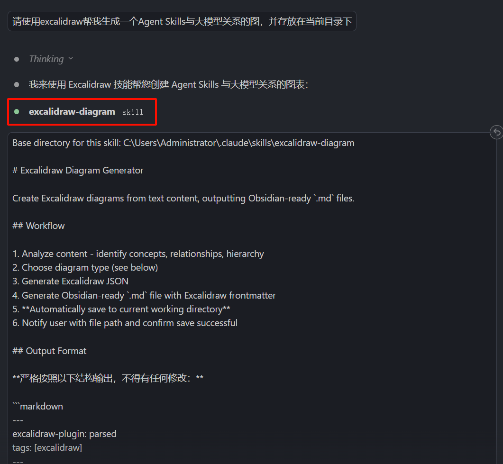
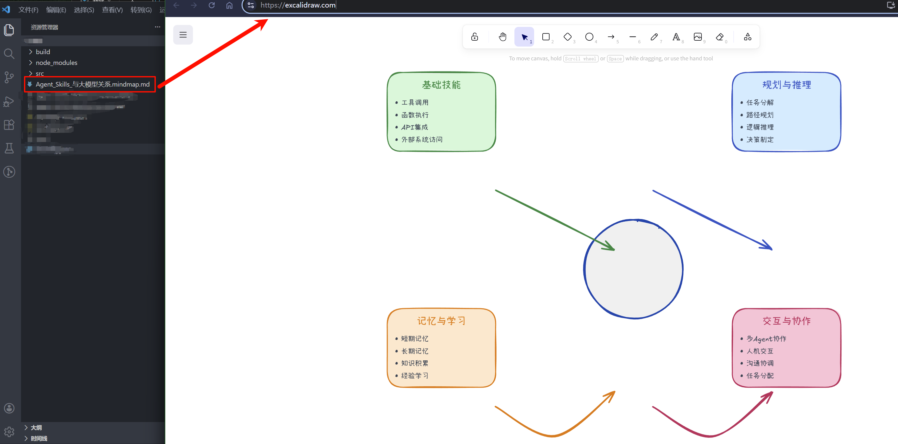
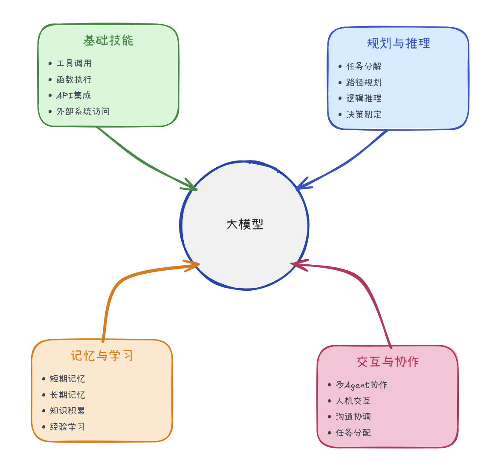
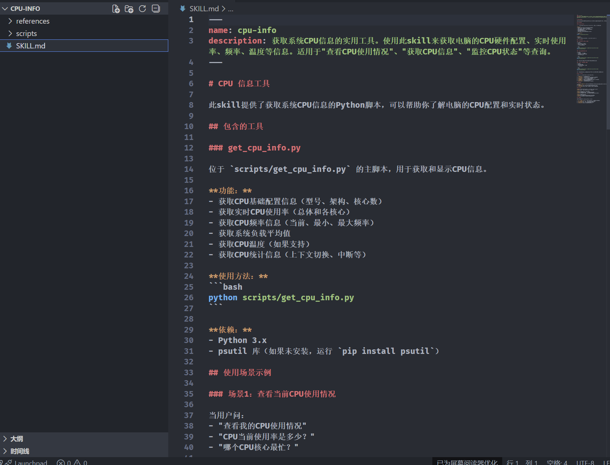
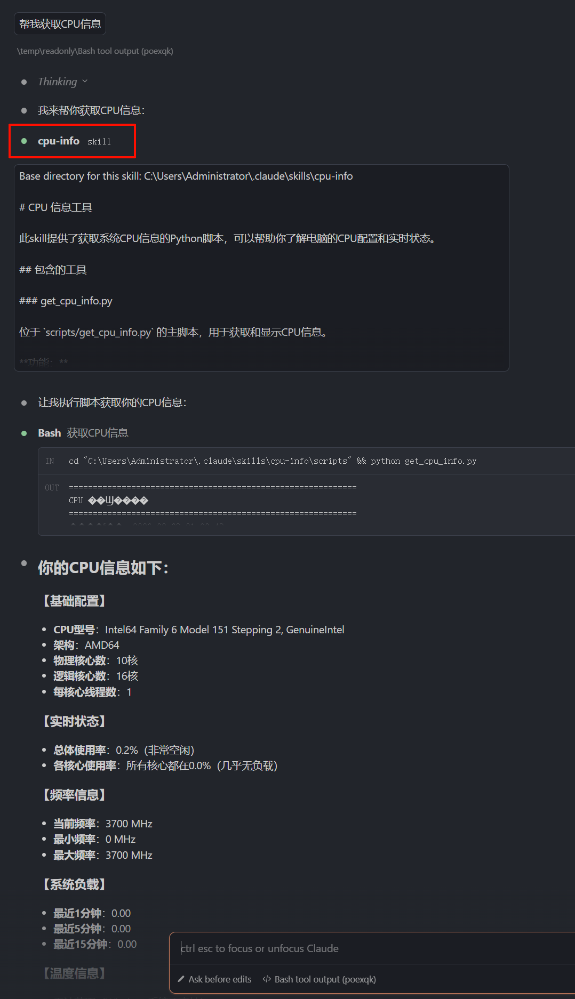
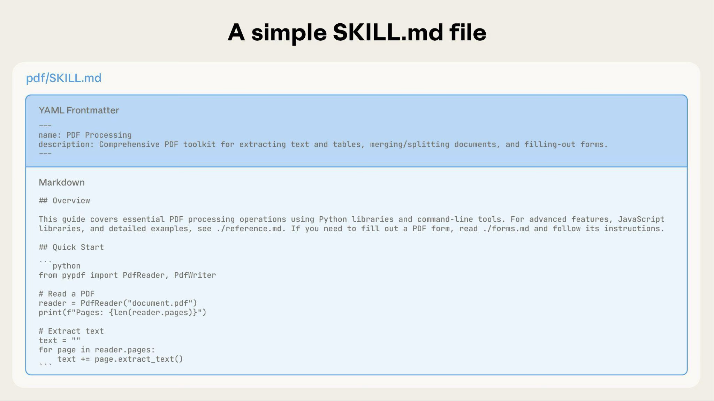
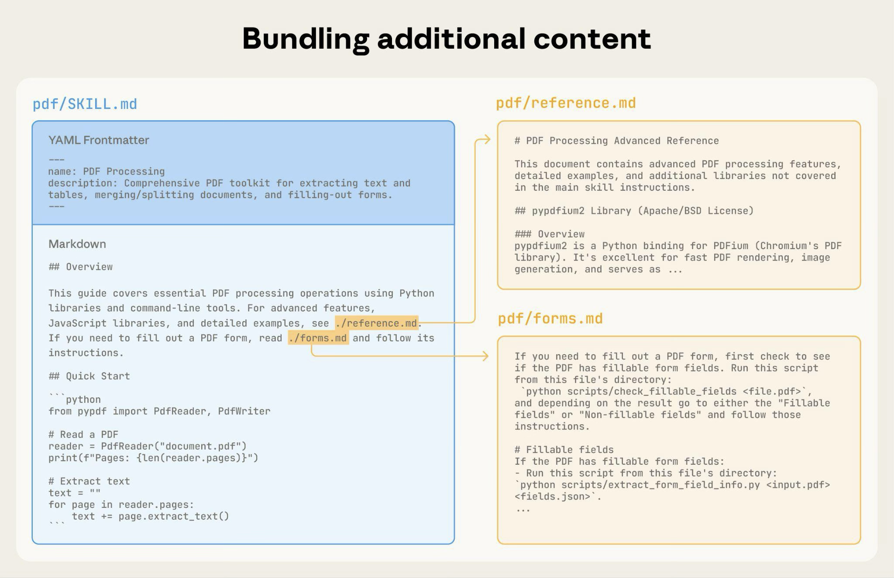

# Agent Skills

> 首发于：2026-02-04

## 什么是 Agent Skills

一句话总结：Agent Skills 就是大模型随时可以翻阅的说明文档。

举个例子，我们需要大模型帮我们做一个周报，但是大模型并不知道周报的格式和内容。这时候，我们就需要给大模型提供一个周报的说明文档，告诉大模型周报的格式和内容。

再来，我们需要大模型帮我们写一段代码，虽然大模型可以学习现有代码仓的代码风格，但是现有代码仓代码很烂，并不符合我们的代码规范，所以我们就需要一个代码规范的说明文档，告诉大模型要按照这个代码规范来写新的代码。

从上面这些例子来看，Agent Skills 是不是跟 System Prompt 有点像，不过他俩的作用是不同的。System Prompt 是全局"定调子"（角色、风格），Skills 是模块化"教方法"（具体执行步骤）；两者互补，非替代关系。

[官方定义](https://agentskills.io/home)：Agent Skills 是一系列指令、脚本和资源的集合，它们可以被大模型发现并利用，来更准确、更高效地完成任务。

## 为什么需要 Agent Skills

因为大模型的能力是有限的，它只能根据训练数据和模型参数进行推理。如果我们想让大模型具备更多的能力，就需要给它提供更多的说明文档。

这些说明文档又是采用“渐进式披露”的机制加载的，只有当大模型需要用到某个说明文档时，才会加载它，所以比起 MCP 会更加节省 token。

另外，Agent Skills 开发起来也比较简单，只需要按照一定的格式组织说明文档，就可以被大模型发现并利用，而 MCP 是需要写代码的，上手难度完全不一样。当然 Agent Skills 也可以调用 MCP 协同工作。

Agent Skills 更擅长执行一些轻量的脚本，教大模型如何处理数据，而 MCP 则是可以直接给大模型提供数据的。MCP 的稳定性和精准度是更高的。

## Agent Skills 的基本工作原理是什么

Agent Skills 是一个说明文档，它包含了大模型可以利用的指令、脚本和资源。当大模型需要完成一个任务时，它会根据任务描述和已有的 Skill 包，来生成一个执行计划。这个执行计划包含了大模型需要调用的指令、脚本和资源。

官方架构图如下图：



这张图展示了 “Agent + Skills + Computer” 的架构，核心是让智能体（Agent）在虚拟环境中调用专业技能完成任务。

在左侧的Agent 配置区，核心系统提示定义了 Agent 的目标，同时为它配备了 bigquery、docx 等Skill，以及可连接的远程 MCP 服务器。这些Skill目录会被同步到右侧的Agent 虚拟机中。

虚拟机提供 Bash、Python、Node.js 等运行环境，技能以目录形式存储在文件系统里。每个技能目录包含 SKILL.md 说明文档和具体执行脚本，比如 pdf 技能目录下就有extract_fields.py脚本。

Agent 通过 bash 命令与这些技能交互，就像在本地电脑上操作文件一样，从而调用对应能力处理各类任务。

下图是一个读取 PDF文件的 Agent Skills 的执行示例：


1. 默认状态下，系统提示词和skill元数据已预先加载
2. Claude通过在Bash中读取SKILL.md文件来触发该Skill
3. Claude会根据需要选择性地阅读其他捆绑文件，如FORMS.md
4. Claude根据阅读到的说明，继续执行任务，直到任务结束

## 怎么使用

> 以 VS Code 为例，且已经配置好了 Claude Code 插件。Claude Code 配置可以参考这两篇文章：
> - [Claude Code 配置](https://docs.bigmodel.cn/cn/coding-plan/tool/claude)
> - [Claude Code IDE 插件配置](https://docs.bigmodel.cn/cn/coding-plan/tool/claude-for-ide)

### 开启 Agent Skills 功能

**Step1**：在 VS Code 中打开设置（File -> Preferences -> Settings）。

**Step2**：在搜索框中输入 "Claude Code"，找到 "Claude Code: Agent Skills" 选项，勾选并**重启 VS Code**。



### 安装一个 Skill 包并使用

**Step1**：可以去 [skillsmp](https://skillsmp.com/zh) 下载一个 Skill 包，然后解压到 `.claude/skills` 目录下。



**Step2**：以 excalidraw 工具的使用为例，我让大模型帮我使用 excalidraw 工具生成一个 Agent Skills 与大模型关系的图，如下图所示命中了 `excalidraw-diagram` ，并使用了该 Skill 包的文件。除了在提示词中体现要用到的 Skill，也可以直接 `/excalidraw-diagram` 去调用该 Skill。



**Step3**：把生成的文件内容复制到 [excalidraw](https://excalidraw.com/) 可以看到效果（我这把生成的东西有点儿翻车了，改巴改巴还是能用）。



先不说内容好不好，至少图是生成出来了。



## 如何开发一个自己的 Skill 包

### skill-creator 方案

最简单的方法就是使用官方提供的 `skill-creator`。我们可以从[这里](https://github.com/anthropics/skills)去下载一堆常用的 Skill 包，里面不仅有 Excel工具、PDF工具、Word工具，还有 `skill-creator`。

我们可以直接使用这个 Skill，通过自然语言描述来帮我们创建一个 Skill 包。

举个例子，我现在打算用它来生成一个获取我电脑 CPU 信息的 Skill 包，我可以这样描述：

> 我需要一个 Skill 包，它可以获取我电脑的 CPU 信息。

然后，大模型就会自动干活儿了，生成好之后如下图所示：



我们来使用一下这个 Skill 包，效果如下图所示。



可以看出我成功生成了新的 Skill 包，并成功调用了它，还是非常方便的。

### 程序员硬核手写方案

如果我们对 Skill 包的功能有特殊要求，或者非常复杂的需求，仅仅靠一些简单的说明文档是无法满足的，那么就需要使用程序员硬核手写方案了。

硬核手写方案的核心就是了解 Skill 包的构成。

`SKILL.md`是必须的，它是 Skill 包的说明文档，包含了 Skill 包的名称、描述等信息。

顶部是 YAML 格式，包含了如下两个必填字段。后面则是 `markdown` 格式的说明文档。

`name`:
- 必须是唯一的，不能与已有的 Skill 包名称冲突。
- 只能包含字母、数字和短横线（-）。
- 不能以短横线开头或结尾。
- 最大64个字符。
- 不能包含 XML 标签。
- 不能包含保留字：“anthropic”、“claude”。

`description`:
- 必须非空。
- 最多1024个字符。
- 不能包含 XML 标签。
- 应描述Skill的作用以及何时使用。

例：



我们可以链接更详细的说明文档来提升Skill的质量，在需要时才会被加载，如下图所示。



完整文件结构示例如下：

```
    pdf/
    ├── SKILL.md              # Main instructions (loaded when triggered)
    ├── FORMS.md              # Form-filling guide (loaded as needed)
    ├── reference.md          # API reference (loaded as needed)
    ├── examples.md           # Usage examples (loaded as needed)
    └── scripts/
        ├── analyze_form.py   # Utility script (executed, not loaded)
        ├── fill_form.py      # Form filling script
        └── validate.py       # Validation script
```
