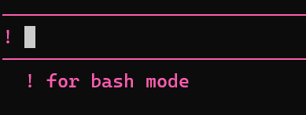
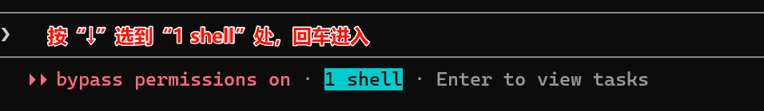
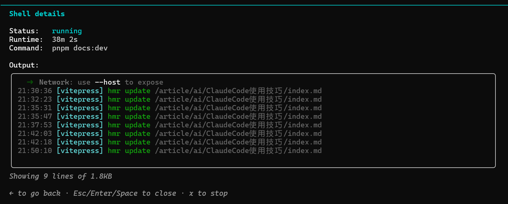
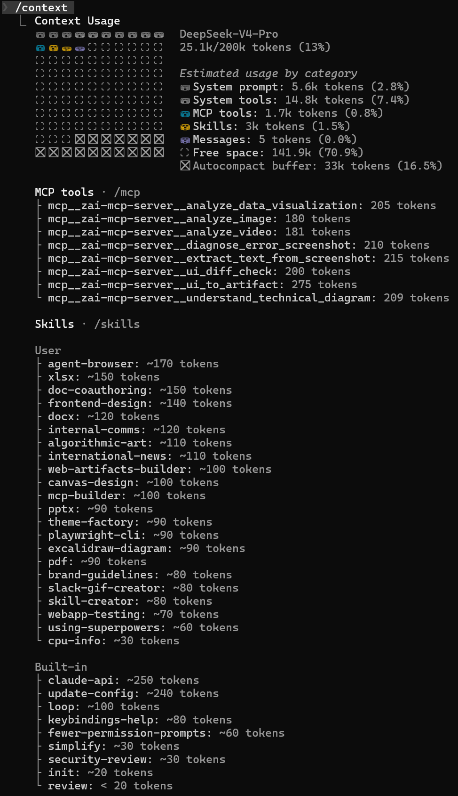
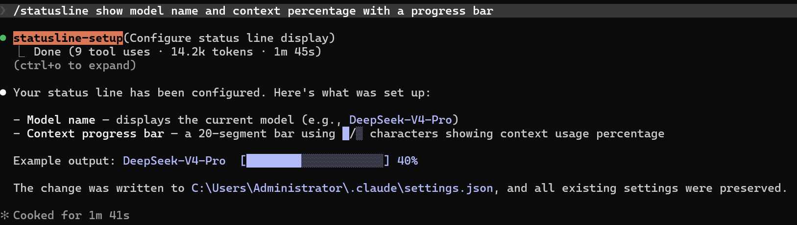
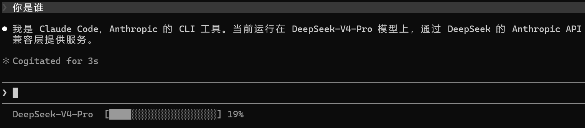

# Claude Code 使用技巧

> 首发于：2026-05-13

> 本文相对更偏个人向，主要用于记录自己一段时间以来使用 Claude Code 的时候遗漏的、容易忘的或者是忽略掉的特性、使用技巧等，非大而全的使用手册。
> 
> 本文使用版本2.1.140
> 
> 后文中 Claude Code 简称 "CC"

## 更新

CC更新很频繁，经常都需要更新。

```bash
claude update
```

## 权限模式

完全访问权限模式，一路绿灯，不用执行命令就确认一下权限。虽然有一定风险，但是其实大多数时候大家都这么在用。

```bash
claude --permission-mode bypassPermissions
# 或
claude --dangerously-skip-permissions
```

## ! for bash mode

在 CC 交互框中如果使用如果想输入 bash 命令可以使用“!”，感叹号进行切换，切换之后，效果如下图所示：



删除“!”就可以退出该模式。

运行命令之后可以可以在 CC 的交互框中选择、查看，如下图所示：





## btw命令

by the way 命令，可以在不干扰现有上下文的情况下问一些主任务无关的问题。

```bash
/btw
```

## Rewind 回滚

回滚 CC 刚才生成的代码等，可以选择回滚到具体的哪段对话，不过，并非万能，安装的一些东西是回滚不了的，最好的方式还是用 git 做好版本管理。

```bash
/rewind
```

## 恢复会话

有多种方式

```bash
claude -c
# 或
claude --continue
```

```bash
/resume
```

## 上下文管理

我们可以主动输入以下命令来进行进行上下文压缩或清除

```bash
/compact

/clear
```

查看当前上下文的使用详情

```bash
/context
```

执行后如下图所示：



使用 `/statusline` 来实时监控你的上下文详情, 参考资料：https://code.claude.com/docs/zh-CN/statusline。

我是直接按照官方文档，输入 `/statusline show model name and context percentage with a progress bar` 让 AI 自动进行了这个配置，配置好的效果如下图所示：



重启一下 CC 检查一下效果，如果不正确让AI继续修bug就行。

使用效果如下图所示：



下面是AI生成的 `setting.json` 的相关配置：

```json
{
  "statusLine": {
  "type": "command",
  "command": "node -e \"let d='';process.stdin.on('data',c=>d+=c);process.stdin.on('end',()=>{let j;try{j=JSON.parse(d)}catch(e){console.log('?  [--------------------] --%');return}let m=(j.model&&j.model.display_name)||'?';let p=j.context_window&&j.context_window.used_percentage;if(p==null){console.log(m+'  [--------------------] --%');return}let n=Math.round(p);if(n>100)n=100;let f=Math.round(n*20/100);let b='';for(let i=0;i<20;i++)b+=i<f?'█':'░';console.log(m+'  ['+b+'] '+n+'%')})\""
  }
}
```

## 未完待续......