# MCP

> 首发于：2025-11-9

## 简介

MCP (Model Context Protocol) 是一个开放源代码的标准，用于连接 AI 应用程序到外部系统。
使用 MCP，AI 应用程序如 Claude 或 ChatGPT 可以连接到数据源（例如本地文件、数据库）、工具（例如搜索引擎、计算器）和工作流（例如专业提示词）—— 启用它们访问关键信息并执行任务。
将 MCP 视为 AI 应用程序的 USB-C 端口。
与 USB-C 提供标准化方式连接电子设备的方式类似，MCP 提供标准化方式连接 AI 应用程序到外部系统。


上图中左侧是 AI 应用程序（对话、IDE等），右侧是外部系统（数据库、搜索引擎、开发工具等）。
AI 应用程序可以使用 MCP 连接到外部系统，从而访问关键信息并执行任务。

比如：可以通过对话，让AI应用程序连接到数据库，并执行对应的SQL操作。

对于开发者来说有了MCP，因为有了标准协议，开发AI应用的时候就可以缩短开发时间并降低复杂性。

**大语言模型再强大，也被锁在训练数据的时间墙与版权墙只能，无法实时获取私有数据，也无法直接操作外部系统。比如：企业想要让 AI 查询订单、修改订单、发送邮件等操作，就需要通过 Function Calling 实现。但是 Function Calling 有一个问题，就是它只能调用预定义的函数，无法动态调用，开发起来也很麻烦，不同应用需要不同的函数，维护起来也很麻烦。MCP 就是为了解决上述问题而生的。**

## 使用现成的MCP服务

借助Cherry Studio，我们可以快速地使用MCP服务。

在网上找了一个可以抓取网页信息的 MCP 服务——[fetch](https://www.npmjs.com/package/mcp-fetch-server)

如下图所示，直接在 Cherry Studio 中添加 fetch 服务，输入以下内容即可。

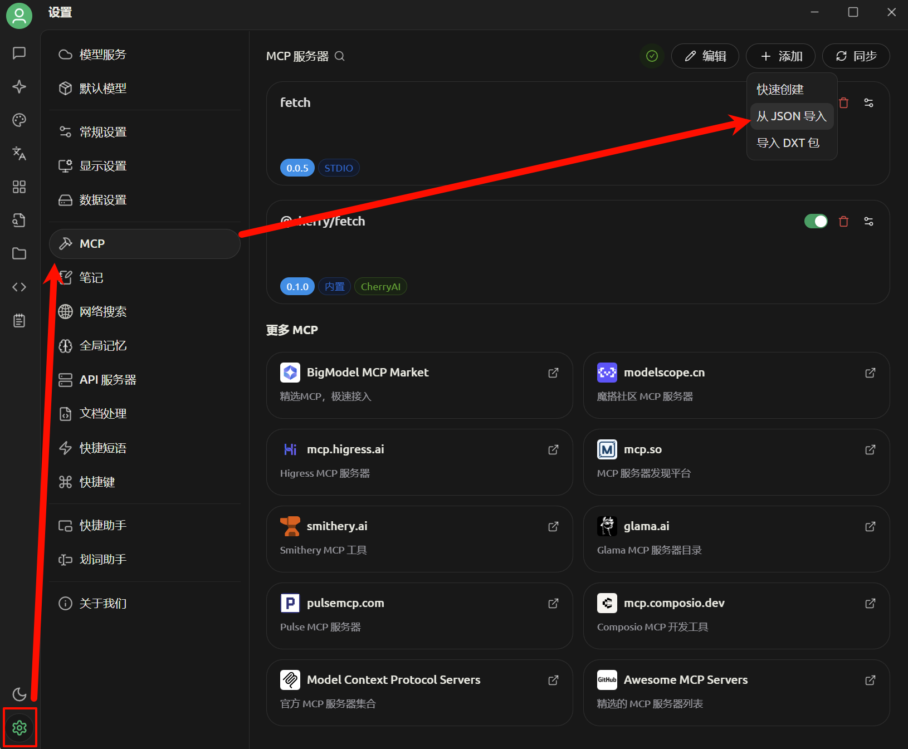

```json
{
  "mcpServers": {
    "fetch": {
      "command": "npx",
      "args": [
        "fetch-mcp"
      ]
    }
  }
}
```

先看一下不使用MCP服务，直接让AI应用程序查询网页信息的效果。

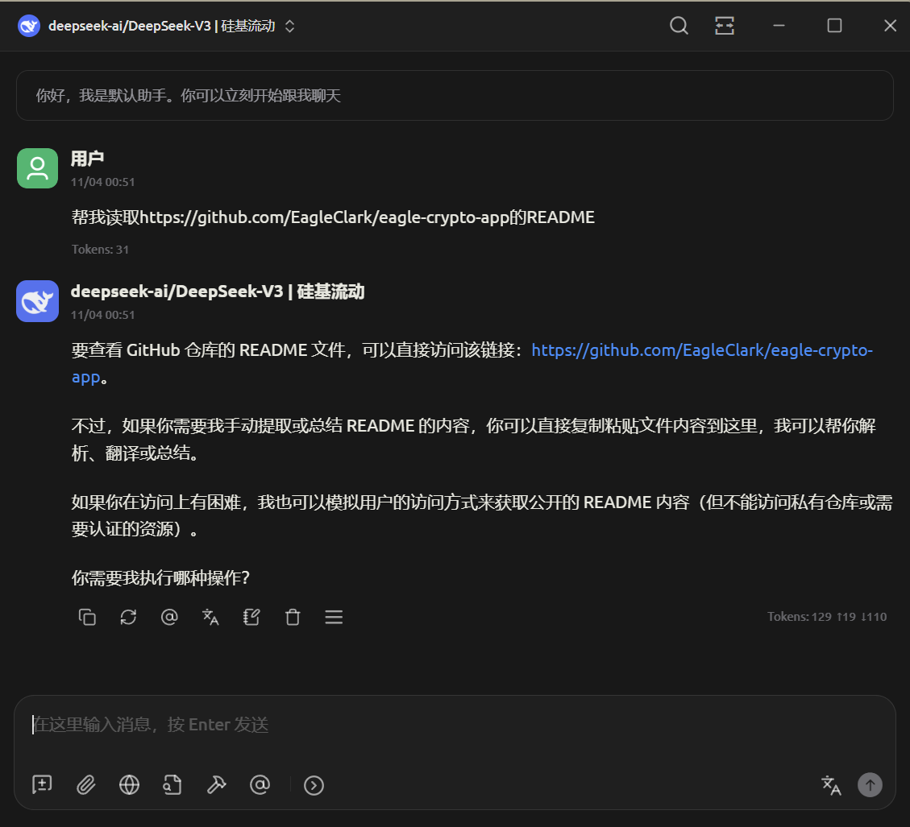

下图是使用MCP服务查询网页信息的效果。

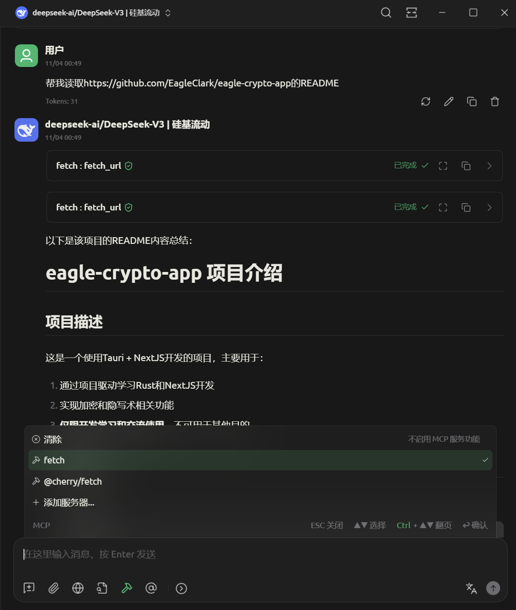

可以看出使用了MCP服务，AI应用程序可以直接查询网页信息，这样就可以直接使用AI帮我们读取网站信息，总结网站信息，不需要手动复制粘贴进行处理了。

## 核心架构

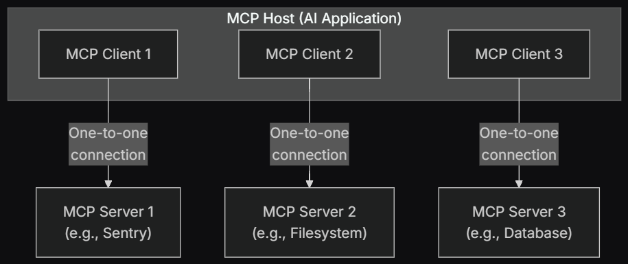

MCP 遵循客户端-服务器架构，架构由以下几个组件组成：

### MCP 主机

LLM 包含在 MCP主机中，也就是 AI 应用或环境，例如由 AI 赋能的 IDE 或对话式 AI。这通常是用户的交互点，MCP 主机会在此使用 LLM 处理可能需要外部数据或工具的请求。
MCP 主机是 MCP 服务器与 MCP 客户端的桥梁，它负责启动、停止和管理 MCP 服务器进程，处理MCP客户端和MCP服务器之间的消息传递，通常内置于支持MCP的客户端应用程序中（如如 Claude Desktop、IDE 或 AI 工具，希望通过 MCP 访问数据的程序）。

**作为开发者我们通常不需要开发 MCP 主机，因为主机已经由客户端应用程序提供了。**

### MCP 客户端

位于 MCP 主机内，帮助 LLM 与 MCP 服务器进行通信。它将 LLM 的请求转换为 MCP 可处理的格式，并将 MCP 的回复转换为 LLM 可理解的格式。它还会发现并调用可用的 MCP 服务器。

**作为开发者我们通常也不需要开发 MCP 客户端，一般都是使用现成的 MCP 客户端，例如 Cherry Studio 提供的 MCP 客户端，当我们要去创建新的 AI 应用时才需要开发 MCP 客户端。**

### MCP 服务器

为 LLM 提供上下文、数据和功能的外部服务。它通过连接数据库和 Web 服务等外部系统来帮助 LLM，将这些系统的响应转换为 LLM 可理解的格式，从而协助开发者提供多样化的功能。

它提供具体的工具（例如数据库查询、天气查询等）和资源（例如读取文件、访问网络等），是一个独立的进程，通过标准输入输出或 HTTP 与 MCP 主机通信。

**开发者通常只需要编写 MCP 服务器，可理解为给现有 AI 应用制作插件。**

## MCP 服务器开发（NodeJS）

接下来先开发一个简单的 MCP 服务器，再去了解 MCP 服务器的核心概念和组件。

我们使用 NodeJS（版本16及以上） 来创建一个 MCP 服务器，该服务器是经典的“查询天气”🤪🤪🤪。

创建项目。

```bash
# 创建项目文件
mkdir mcp
cd mcp

# 初始化一个 NodeJS 项目
npm init -y

# 安装依赖
npm install @modelcontextprotocol/sdk zod
npm install -D @types/node typescript

# 创建目录和文件
mkdir src
touch src/index.ts
```

配置 package.json。

```json
{
  "type": "module",
  "bin": {
    "mymcp": "./build/index.js"
  },
  "scripts": {
    "build": "tsc",
    "start": "node ./build/index.js"
  },
  "files": [
    "build"
  ],
}
```

根目录下创建 tsconfig.json。

```json
{
  "compilerOptions": {
    "target": "ES2022",
    "module": "Node16",
    "moduleResolution": "Node16",
    "outDir": "./build",
    "rootDir": "./src",
    "strict": true,
    "esModuleInterop": true,
    "skipLibCheck": true,
    "forceConsistentCasingInFileNames": true
  },
  "include": ["src/**/*"],
  "exclude": ["node_modules"]
}
```

下面直接上 index.ts 的代码，很简单，解释直接看注释。

```typescript
import { McpServer } from "@modelcontextprotocol/sdk/server/mcp.js";
import { StdioServerTransport } from "@modelcontextprotocol/sdk/server/stdio.js";
import z from "zod";

// 从知心天气获取 https://www.seniverse.com/
const WEATHER_API_KEY = 'YOUR_API_KEY';

// 创建 server instance
const server = new McpServer({
  name: "weather",
  version: "1.0.0",
  capabilities: {
    resources: {},
    tools: {},
  },
});

// Helper function 用于发送 NWS API 请求
async function makeNWSRequest<T>(url: string): Promise<T | null> {
  try {
    const response = await fetch(url);
    if (!response.ok) {
      throw new Error(`HTTP error! status: ${response.status}`);
    }
    return (await response.json()) as T;
  } catch (error) {
    console.error("Error making NWS request:", error);
    return null;
  }
}

interface WeatherResponse {
  status_code?: string;
  results?: Array<{
    location: {
      id: string;
      name: string;
      country: string;
      path: string;
      timezone: string;
      timezone_offset: string;
    },
    now: {
      text: string;
      code: string;
      temperature: string;
    },
    last_update: string;
  }>;
}

server.registerTool(
  'get-forecast',
  {
    inputSchema: {
      // 用于告诉大模型怎么提前你需要的参数，这个参数就是给后面的回调函数使用的
      city: z.string().describe('城市'),
    },
    description: '获取某个城市的天气预报',
  },
  async ({ city }) => {

    const weatherUrl = `https://api.seniverse.com/v3/weather/now.json?key=${WEATHER_API_KEY}&location=${city}&language=zh-Hans&unit=c`;
    const weatherData = await makeNWSRequest<WeatherResponse>(weatherUrl);

    if (weatherData?.status_code || !weatherData?.results) {
      return {
        content: [
          {
            type: 'text',
            text: '当前城市天气不支持查询或出现未知错误',
          },
        ],
      };
    }

    const { location, now, last_update } = weatherData?.results[0];
    return {
      content: [
        {
          type: 'text',
          text: `${location.name}天气：${now.text}，${now.temperature}℃。最后更新时间：${last_update}`,
        },
      ],
    };
  },
);

async function main() {
  const transport = new StdioServerTransport();
  await server.connect(transport);
  console.error("Weather MCP Server running on stdio");
}

main().catch((error) => {
  console.error("Fatal error in main():", error);
  process.exit(1);
});
```

编译。

```bash
npm run build
```

Cherry Studio 中使用，直接从JSON导入，如下图所示：

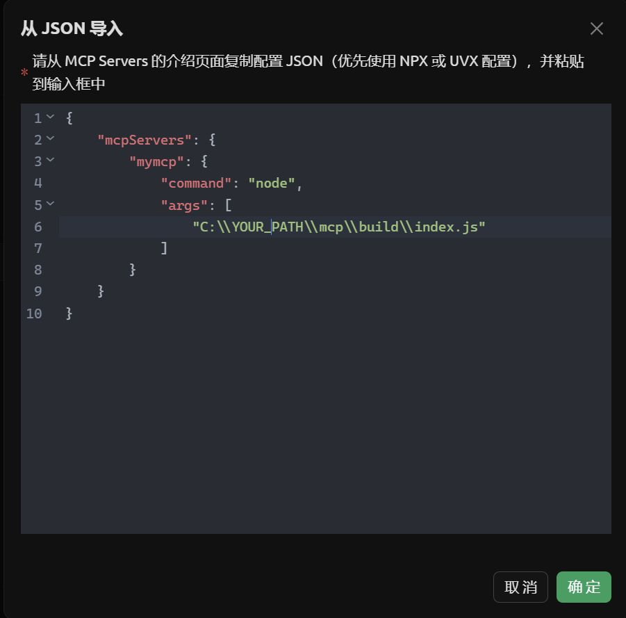

```json
{
    "mcpServers": {
        "mymcp": {
            "command": "node",
            "args": [
                "C:\\YOUR_PATH\\mcp\\build\\index.js"
            ]
        }
    }
}
```

然后就会看到我的 MCP 服务器了。

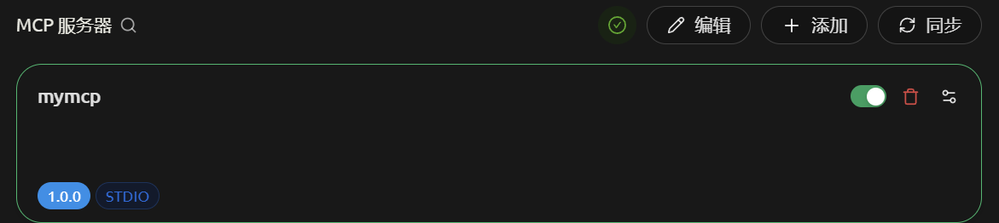

可以看到这个工具就是我们代码中注册的工具。

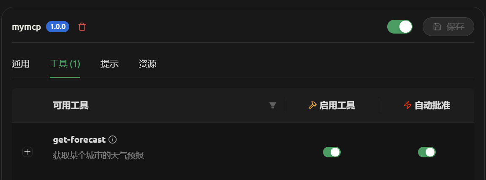

使用效果，首先是查询一个支持的城市的天气，如下图所示：

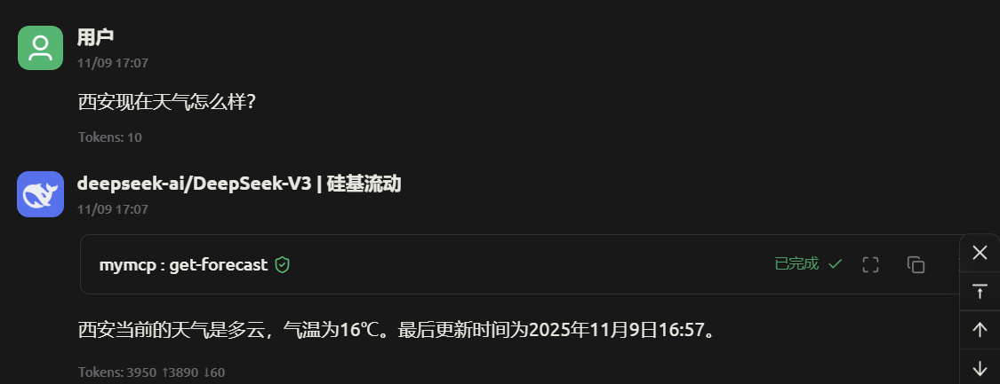

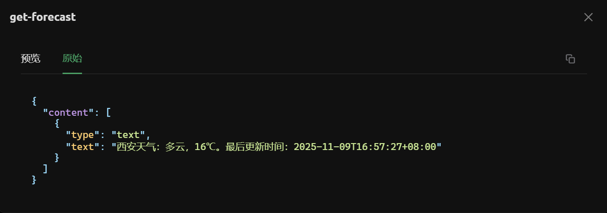

再看一个不支持地区的效果，如下图所示：

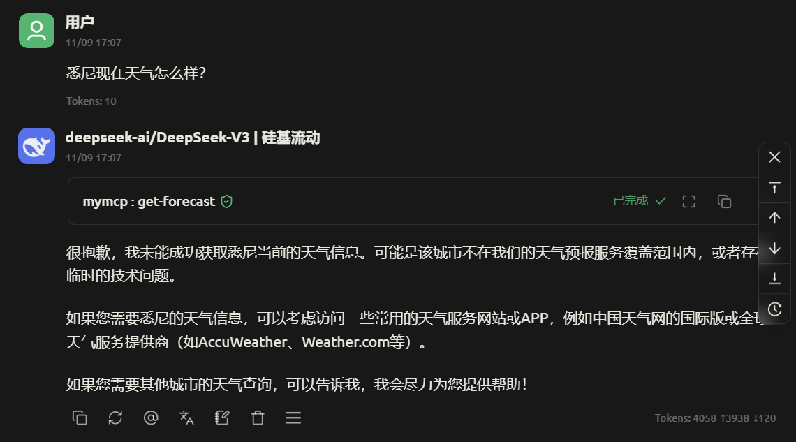

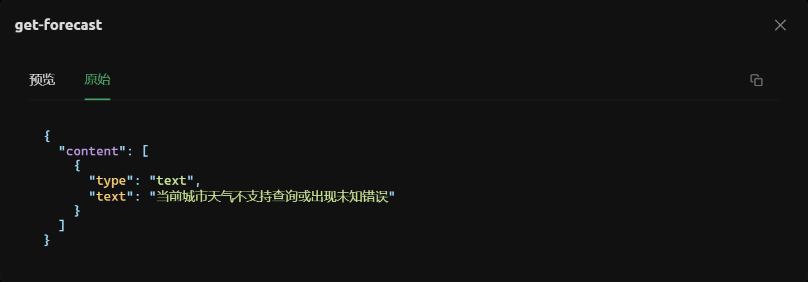

## 核心概念

现在我们已经实现了一个自己的 MCP 服务器，并且注册了一个工具。下面可以结合前面的案例介绍一下开发时需要了解的一些核心概念了。

MCP 服务器可以提供三种主要类型的能力：

- [Resources](https://mcp-docs.cn/docs/concepts/resources): 可以被 clients 读取的类文件数据（如 API 响应或文件内容）
- [Tools](https://mcp-docs.cn/docs/concepts/tools): 可以被 LLM 调用的函数（需要用户批准）
- [Prompts](https://mcp-docs.cn/docs/concepts/prompts): 预先编写的模板，帮助用户完成特定任务

上面的案例中，我们就是开发了一个 Tools 类型的能力。

## [核心组件](https://mcp-docs.cn/docs/concepts/architecture#%E6%A0%B8%E5%BF%83%E7%BB%84%E4%BB%B6)

### 协议层

协议层处理消息框架、请求/响应链接和高级通信模式。

### 传输层

传输层处理 clients 和 servers 之间的实际通信。MCP 支持多种传输机制：

1. **Stdio 传输**

- 使用标准输入/输出进行通信
- 适用于本地进程

2. **通过 HTTP 的 SSE 传输**
- 使用服务器发送事件进行服务器到客户端的消息传递
- 使用 HTTP POST 进行客户端到服务器的消息传递

我们前面做的 MCP 服务器就是使用的 Stdio 传输。

## 参考资料

本文只是对 MCP 的一个简单介绍，很多内容仅是浅浅提了一下，更多内容请参考官方文档。

> [官方文档](https://modelcontextprotocol.io/docs/getting-started/intro)

> [中文文档](https://mcp-docs.cn/introduction)
