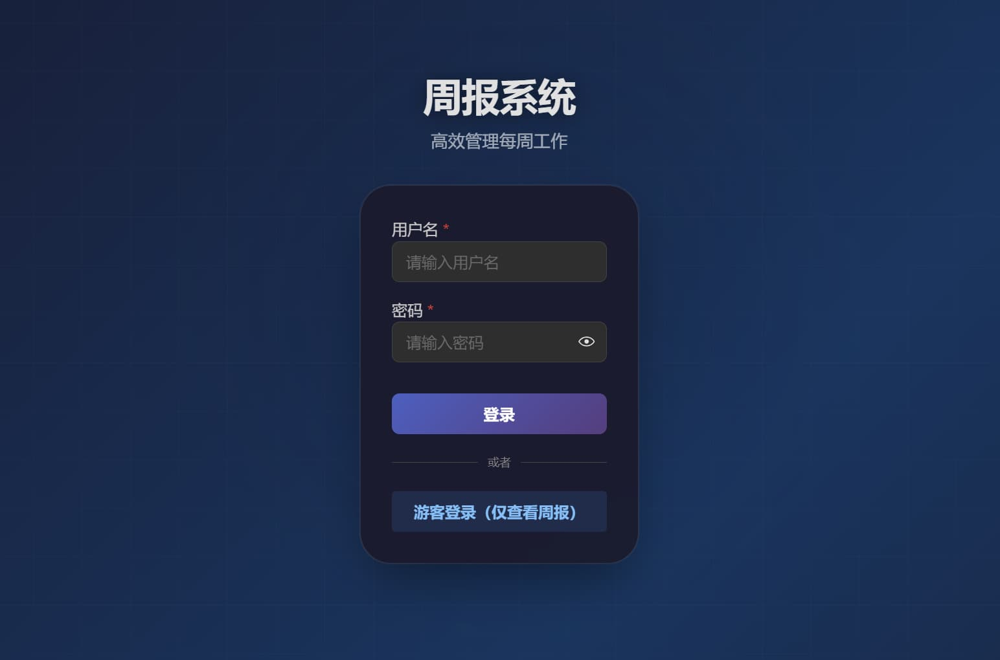
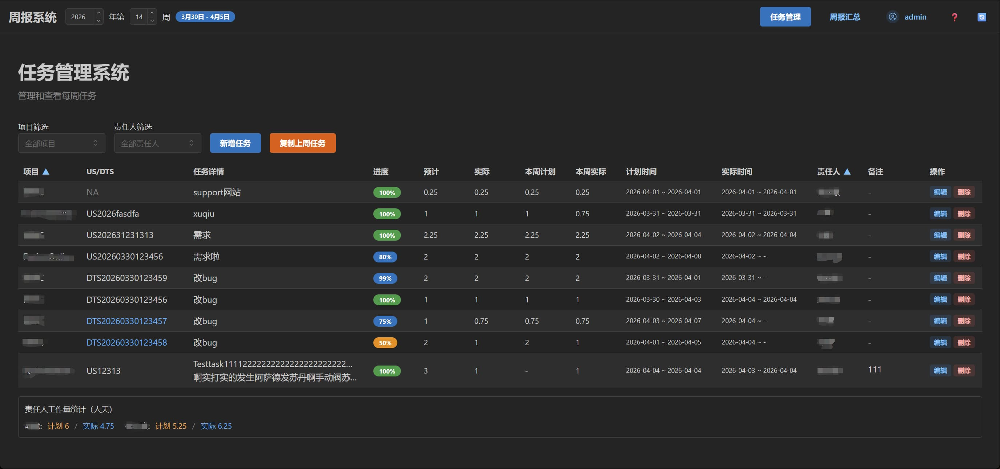
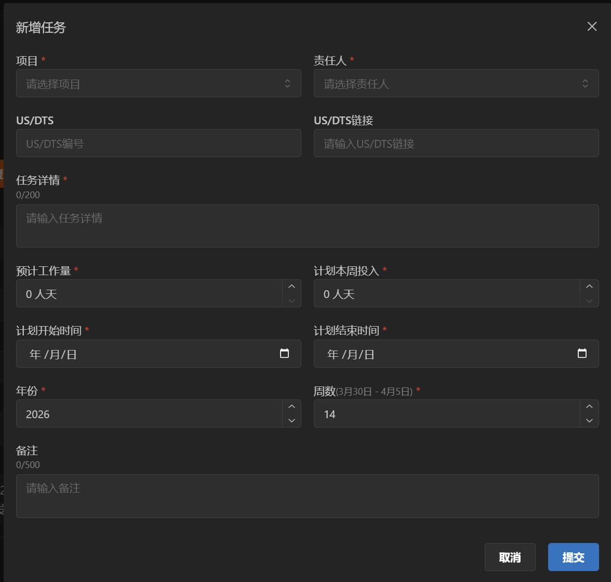
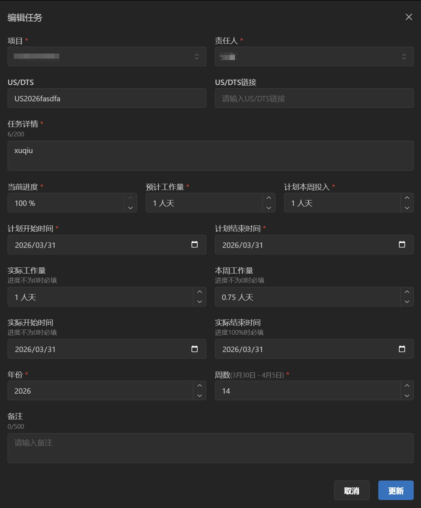
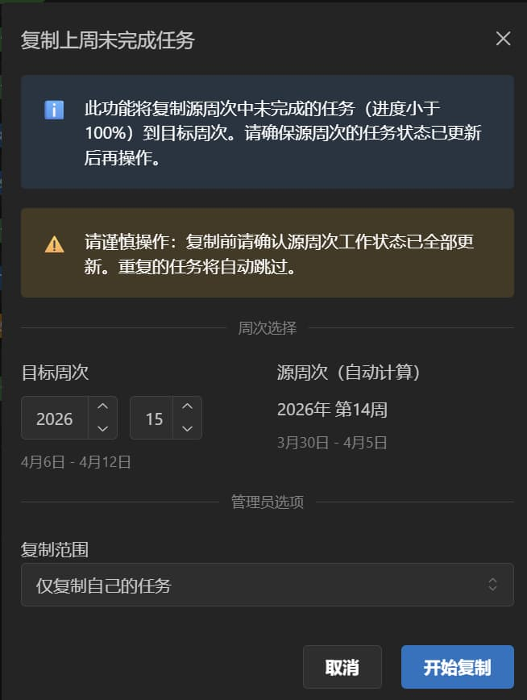
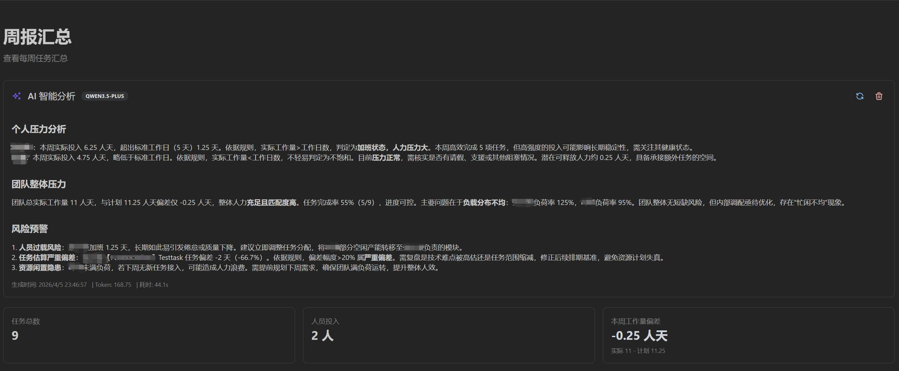
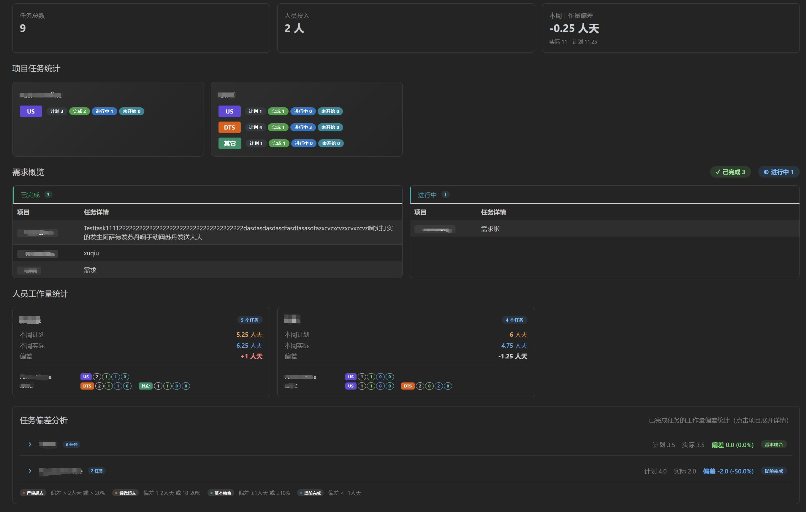
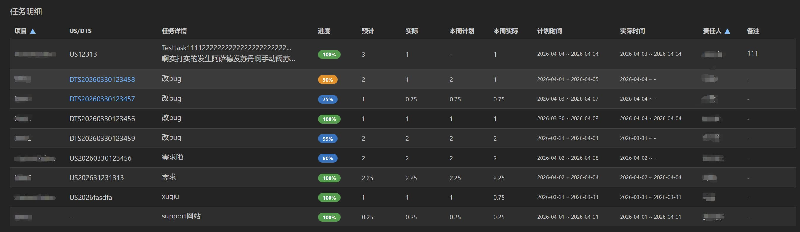

# 从0到1 Vibe Coding 一个项目

> 首发于：2026-04-06

## 前言

最近，我使用AI编程也有一段时间了，不过大多数时候是在公司，使用公司提供的AI服务，不过公司的AI服务实在太慢，尤其是核心工作时间，卡到没法用，所以[Vibe Coding](https://zh.wikipedia.org/wiki/Vibe_coding)的威力一直没有真正体会到。

不过这几天正好是清明假期，闲来无事便想在家里把一个之前一直想做但是又没有时间做的项目给做了，直接用 Vibe Coding 的方式来做，我尽量不自己写代码。

## 项目历程

项目 [work-report-generator](https://github.com/EagleClark/work-report-generator)，其实这个仓库最早是在2025年6月创建的，当时想的就是用 [mantine](https://mantine.dev/) 这个UI库来开发，因为当时觉得这个UI库挺好看的，但是装好这个UI库的环境的之后，这项目就再没动过了，拖了快一年🤦‍♀️，不过这一年也是大模型快速发展的一年，开发项目的方式真的变了。

我想做的项目其实就是一个周报系统，因为每周都需要给领导发周报，汇报我们这个小团队的“战报”，但是这周报都写了这么久了，每次去收集一堆Excel数据，然后再进行整理的过程还是比较繁琐和痛苦。而且任务条目的细节比较多，还会经常出差错，少填、漏填、错填都频频发生，要反复检查，所以我每次发周报其实都要**花费1~2小时不等的时间来整理数据**，汇总，校对，思考一下这些数据到底反应了什么现象，结论是什么，然后还有调邮件的内容的格式，最后才能发送周报邮件。

如果有个在线系统，大家可以在这个系统上填写自己的任务，然后这些任务填写时还有校验，还能自动汇总数据，最后还能用AI分析这些数据代表的含义，直接得出团队的人力情况如何那岂不妙哉！说干就干，把最近学的AI技巧都用上了。

## 项目成品展示

登录页：可以是注册用户登录，也可以是游客登录。

任务管理页面：管理员和普通用户登录进来之后可以看到任务管理页面，可以创建任务，编辑任务。

还能批量复制上周未完成的任务到一下周。

周报汇总页面顶部是一个AI智能分析的区域，管理员可以触发AI智能分析，后台会把周报数据以及一些系统提示词发送给LLM，并返回分析报告。

下面是一些常规数据的统计展示。

除了这些还有一些用户管理、项目管理的小功能未做展示。

## 总结

我的开发方式其实说来也简单，买了个阿里云的 `Coding Plan`，自己电脑上装了一个 `Claude Code CLI`，然后再搞了一堆 SKILL，主要是是 `superpower`，我全程都用的这个。

整个开发过程其实也没什么特别，就是全程用自然语言描述我想要做什么，前后端一把梭，我这项目虽小，但是五脏俱全，前端表格、表单、路由、状态管理一个也没少，后端数据库CRUD、登录鉴权、LLM调用也都具备。总代码量 ts+tsx，大概在一万行左右，99.99%的代码都是AI生成的。

开发过程其实我还是蛮惊讶的，比如：AI智能分析那个功能，涉及前后端代码开发，AI几分钟开发出来的东西居然没有任何报错直接就能跑，再几轮对话优化一下交互体验，优化一下提示词，就成了。

这个小项目放在过去，以我的水平，天天投入大量时间专注开发，可能要开发至少一个星期，如果是在公司里面去评估工作量的话，至少得评个前后端各两周，毕竟也写了一万行左右的代码呢。但是现在我一个人，几乎不怎么写代码，一边玩儿游戏，一边刷视频，就把项目做完了，只能说时代真的变了！
