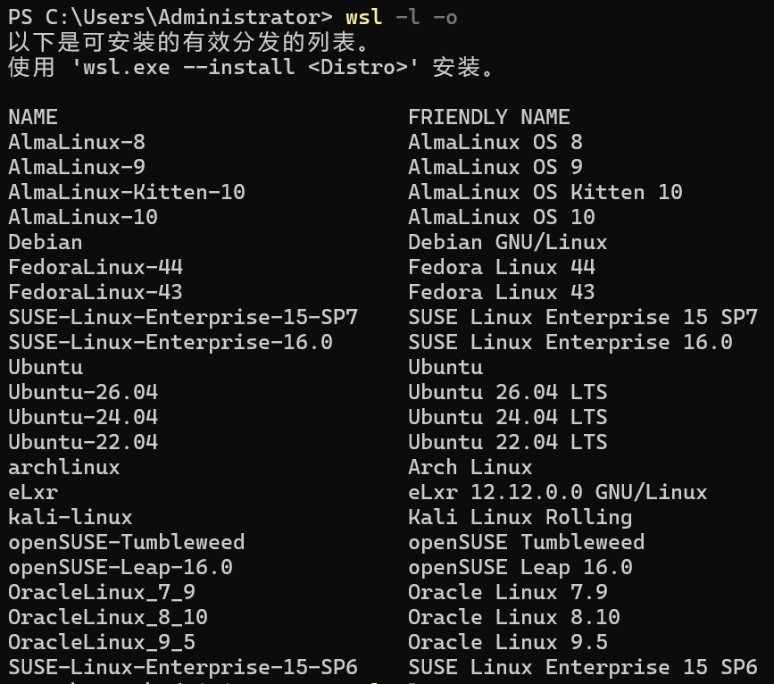
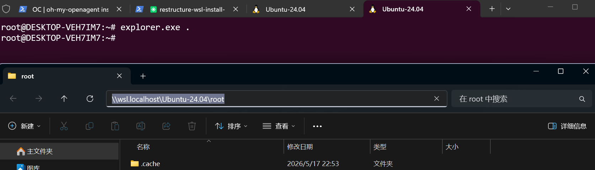
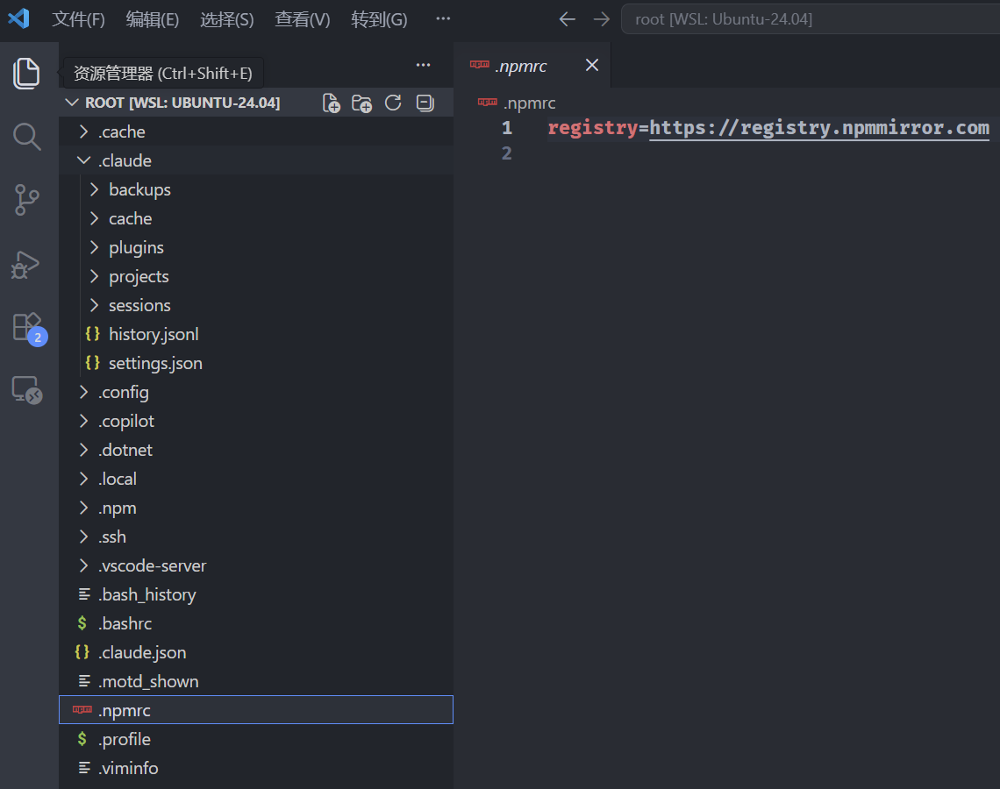
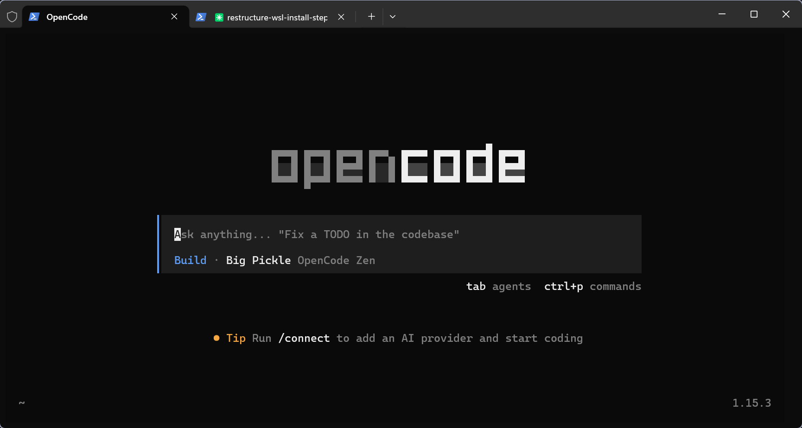
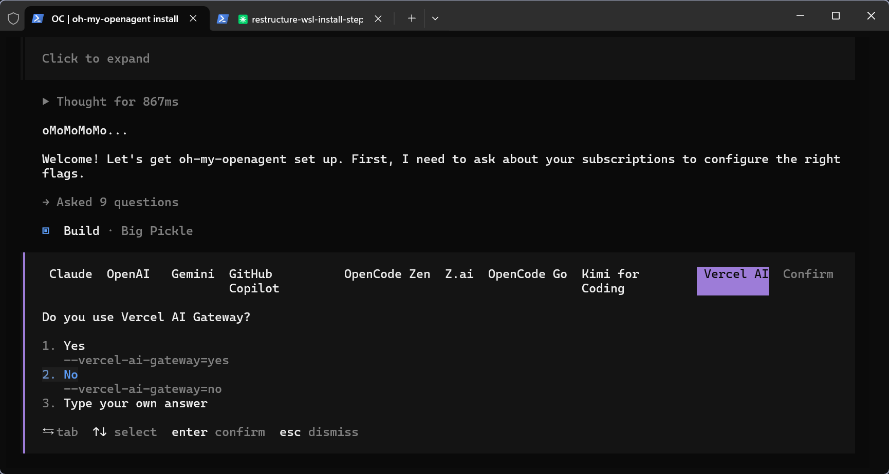
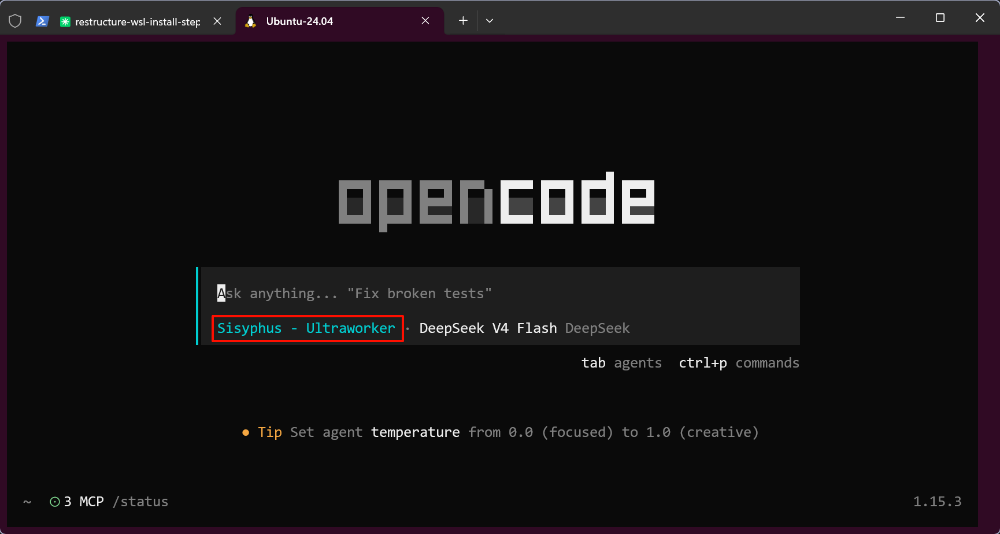

# 基于WSL的AI开发环境搭建

> 首发于：2026-05-17
> 
> 本文部分内容由AI生成

## 前言

其实我在Windows做AI开发也挺长一段时间了，但是最近听了同事的分享才意识到，AI在Linux环境下使用会更好，我也突然想起在AI执行一些命令的时候确实总是先失败报错，然后再处理错误，这很浪费时间和tokens，所以我也决定把自己的开发环境也迁移到WSL上。

本文主要涉及WSL的安装，以及WSL上Claude Code CLI + OpenCode的安装。

## 什么是WSL

WSL（Windows Subsystem for Linux）是微软为 Windows 提供的 Linux 子系统，让你可以在 Windows 上直接运行 Linux 环境，而无需安装虚拟机或双系统。

WSL 目前有两个版本：

- **WSL1**：通过翻译层将 Linux 系统调用转换为 Windows 系统调用，兼容性好但 I/O 性能较差。
- **WSL2**：基于 Hyper-V 运行一个真实的 Linux 内核，拥有完整的系统调用兼容性和接近原生的磁盘 I/O 性能。

当前推荐直接使用 WSL2，微软已经将其设为默认版本。

Windows 10 2004 及以上版本或 Windows 11 已内置 `wsl` 命令，无需额外安装任何东西。通过以下命令确认一切就绪：

```powershell
wsl --version    # 查看 WSL 自身的版本信息
wsl -l -v        # 查看已安装发行版的 WSL 版本（1 还是 2）

# wsl 默认版本设置
wsl --set-default-version 2
```

确保输出中 Version 列为 `2`，说明当前使用的是 WSL2。

### 为什么WSL更适合AI开发

如果你和我一样日常主力是 Windows，在做 AI 开发时大概率遇到过这些问题：

**1. 工具链的"Linux First"倾向**

很多 AI 开发工具默认面向 Linux/macOS。比如 Claude Code CLI 在 Windows 下有路径处理、权限等问题，MCP Server 的很多第三方实现也假设运行在 Unix 环境下。甚至 Python 的某些 AI 相关库在 Windows 下编译都成问题。

**2. 文件系统性能**

AI 项目通常涉及大量小文件的读写（node_modules、Python 包、模型文件等）。WSL2 的 ext4 文件系统在这种场景下比 Windows 的 NTFS 高效得多。

**3. Docker 原生支持**

很多 AI 工具和服务通过 Docker 分发，而在 WSL2 中可以直接使用 Linux 原生的 Docker 引擎，无需 Docker Desktop 的额外开销。

**4. 与服务器环境一致**

最终部署大概率是 Linux 服务器，本地环境与生产环境一致可以避免"我本地能跑啊"的经典问题。

## WSL安装

### Step1 选择并安装Linux发行版

重启后，Ubuntu 会自动启动并提示你创建用户名和密码。如果你想用其他发行版：

```powershell
# 查看可在线下载的发行版列表
wsl --list --online

# 或
wsl -l -o
```

运行后会列出类似以下的内容：



可以看到，在线可选的有 Ubuntu、Debian、Kali、openSUSE 等多个发行版。选择你熟悉的一款安装即可：

```powershell
# 安装指定发行版（例如 Ubuntu 24.04）
wsl --install -d Ubuntu-24.04
```

安装完成后，可以通过以下命令查看已安装的发行版及其运行状态：

```powershell
# 查看已安装的发行版、WSL 版本和运行状态
wsl -l -v
```

输出中带 `*` 的是当前默认发行版。如果有多个发行版，可以切换默认：

```powershell
# 将 Ubuntu-24.04 设为默认发行版
wsl --set-default Ubuntu-24.04

# 简写形式
wsl -s Ubuntu-24.04
```

安装完成后，启动 WSL 有以下几种方式：

```powershell
# 启动默认发行版
wsl

# 启动指定发行版
wsl -d Ubuntu-24.04

# 在 Windows Terminal 中，点击下拉菜单选择对应发行版即可
```
我个人推荐 Ubuntu 24.04 LTS，社区支持最完善，遇到问题容易找到解决方案。

首次启动通常会提示创建用户名和密码，但有时（尤其是通过 `wsl --import` 导入后）会直接以 `root` 身份进入，不会提示配置用户。遇到这种情况，按以下步骤处理：

```bash
# 1. 查看当前登录用户
whoami
# 如果输出 root，说明没有普通用户账号

# 2. 创建新用户（以 eagle 为例）
sudo adduser eagle
# 按提示设置密码和其他信息（全名等可留空直接回车跳过）

# 3. 将新用户加入 sudo 组
sudo usermod -aG sudo eagle

# 4. 修改用户密码（如忘记密码或想重设）
sudo passwd eagle

# 5. 设置该用户为 WSL 默认登录用户
# 在 WSL 内编辑 /etc/wsl.conf，添加：
# [user]
# default=eagle
```

之后 `wsl --shutdown` 重启，再次进入就会自动以你创建的用户登录了。

如果不想创建新用户，直接修改 root 密码即可：

```bash
# 当前是 root 的话直接改
passwd

# 或者用 sudo 提权修改
sudo passwd root
```

### Step2 迁移至非系统盘（可选）

WSL 默认将系统文件存放在 C 盘，随着项目依赖、Docker 镜像等逐渐累积，很容易吃掉几十 GB 空间。如果 C 盘比较紧张，建议安装后立即迁移到其他盘。

首先关闭 WSL，然后导出当前发行版：

```powershell
# 关闭 WSL
wsl --shutdown

# 导出为 tar 文件（以NAME“Ubuntu-24.04”为例），注意：D:\wsl 路径要存在才行
wsl --export Ubuntu-24.04 D:\wsl\Ubuntu-24.04.tar

# 注销 C 盘上的原发行版
wsl --unregister Ubuntu-24.04

# 导入到新位置
wsl --import Ubuntu-24.04 D:\wsl\Ubuntu-24.04 D:\wsl\Ubuntu-24.04.tar

# 删除导出的 tar 文件（可选）
del D:\wsl\Ubuntu-24.04.tar
```

各参数说明：
- `--export <发行版名> <导出路径>` — 将发行版打包导出
- `--unregister <发行版名>` — 注销发行版，删除 C 盘上的原始文件。**注意这会清除该发行版内的所有数据，务必先确认导出成功**
- `--import <发行版名> <安装目录> <tar文件路径>` — 在新位置重新导入

> **注意**：`wsl --import` 导入后默认以 root 用户登录。恢复你的普通用户为默认用户，需要在 WSL 内编辑 `/etc/wsl.conf`：
>
> ```ini
> [user]
> default=你的用户名
> ```
>
> 然后执行 `wsl --shutdown` 重启生效。

### Step3 配置WSL

安装完成后建议做几个基础配置。

**配置内存和CPU**

在 Windows 用户目录下创建 `.wslconfig` 文件：

```config
[wsl2]
memory=8GB
processors=4
```

根据你的机器配置调整。如果不限制，WSL2 默认会吃掉一半内存。

**设置镜像网络模式（可选）**

```config
[wsl2]
networkingMode=mirrored
```

镜像模式下 WSL 和 Windows 共享网络，`localhost` 可以直接访问双方的服务，不需要再记 IP 了。

**配置代理（公司网络环境）**

如果你在公司内网环境，需要通过代理访问外网，可以在 `~/.bashrc` 中添加：

```bash
# HTTP/HTTPS 代理
export HTTP_PROXY=http://proxy.company.com:8080
export HTTPS_PROXY=http://proxy.company.com:8080

# 不需要代理的地址（如内部服务、localhost）
export NO_PROXY=localhost,127.0.0.1,.company.com
```

为了让 `sudo` 命令也能继承代理设置，可以在 `/etc/sudoers` 中添加（通过 `sudo visudo` 编辑）：

```
Defaults env_keep += "HTTP_PROXY HTTPS_PROXY NO_PROXY"
```

配置完执行 `wsl --shutdown` 等待几秒后重新进入即可生效。

**启用 systemd**

编辑 WSL 内的 `/etc/wsl.conf`：

```ini
[boot]
systemd=true
```

这在后续运行 Docker 等需要 systemd 的服务时非常关键。

### Step4 基础开发环境配置

进入 WSL 后，先把基础工具装上：

```bash
sudo apt update && sudo apt upgrade -y
sudo apt install -y build-essential curl git unzip wget
```

安装 Node.js（推荐通过 fnm 管理版本）：

```bash
curl -fsSL https://fnm.vercel.app/install | bash

# 新开命令窗
fnm install 24
fnm default 24

# 淘宝镜像切换
npm config set registry https://registry.npmmirror.com
```

安装 pnpm：

```bash
corepack enable pnpm
```

安装 Python：

```bash
sudo apt install -y python3 python3-pip python3-venv
```

这样基础开发环境就就绪了。

## 跨系统协作技巧

### 文件互访

WSL2 中可以直接访问 Windows 文件：

```bash
# 在WSL中访问Windows目录
cd /mnt/d/Code/blog
```

Windows 中也可以访问 WSL 文件（但不建议直接在 Windows 编辑 WSL 内的项目文件，跨文件系统 I/O 性能很差）：

```
\\wsl$\Ubuntu\home\username\
```

一个小技巧，如下图所示：



直接输入 ` explorer.exe .` 打开当前目录，路径是按照 wsl 的路径进行显示的。

### 推荐的开发模式

**方案一：项目放 WSL 内（推荐）**

代码放在 WSL 的 `~/projects/` 中，所有操作都在 WSL 终端完成。用 VS Code 的 Remote - WSL 插件在 Windows 端编辑。

这种方式文件系统性能最好，Claude Code 和 OpenCode 也能正常工作。

**方案二：项目放 Windows 侧**

代码在 `/mnt/d/Code/` 下，用 Windows 的 IDE 编辑，在 WSL 中运行 AI 工具和脚本。

好处是文件备份和管理方便，坏处是 `npm install` 等操作在跨文件系统时性能明显下降。

建议日常完全在 WSL 终端里操作。

### VS Code 集成

安装 **WSL** 插件，在 VS Code 中打开wsl里面的目录，如下图所示：



## Claude Code CLI 安装与配置

### 主机已有 Claude Code 的情况

如果你在 Windows 主机上已经安装了 Claude Code，得益于 WSL 的 Windows 可执行文件互操作机制，在 WSL 中直接输入 `claude` 就能启动主机上的版本，**不需要在 WSL 中重复安装**。

听起来很方便，但实际使用中会有不少坑：

**1. 路径问题**

这是最大的坑。主机版 Claude Code 是 Windows 程序，它理解的是 Windows 路径（`D:\Code\blog`）。当你在 WSL 中运行它时，当前工作目录是 WSL 路径（`/home/eagle/projects` 或 `/mnt/d/Code/blog`），Claude Code 可能会：

- 把 Linux 路径传递给 Windows 工具导致找不到文件
- 在 Linux 路径和 Windows 路径之间转换出现偏差
- 创建文件时产生路径混乱

**建议**：只在 `/mnt/` 下的 Windows 目录中使用主机版 Claude Code（例如 `/mnt/d/Code/blog`），这样路径转换相对可控。不要在 `~/projects/` 这种纯 WSL 路径中使用。

**2. Git 问题**

WSL 中的 git 和 Windows 主机上的 git 是两个独立的客户端。主机版 Claude Code 会调用 Windows 的 git，而 WSL 中的项目可能用的是 WSL 的 git 仓库，二者的凭据管理、换行符处理（CRLF vs LF）都可能冲突。

**3. Shell 命令执行**

Claude Code 执行终端命令时，主机版会启动 Windows 的 shell（cmd 或 PowerShell），而不是 bash。这导致所有 Linux 原生命令（`apt`、`sudo`、`chmod` 等）都无法直接使用，AI 需要先意识到当前环境是 Windows，再做适配——每次都要先"试错"一次，这正是前言中说的浪费 tokens 的问题。

**4. Node.js 和包管理器**

主机版 Claude Code 使用 Windows 的 Node.js，`npm install` 等操作会在 Windows 文件系统上执行。如果你在 WSL 项目中开发，跨文件系统的包安装性能会明显下降。

**总结**：主机版在 WSL 中可以用，但仅限于 `/mnt/` 下的 Windows 目录中做简单操作。如果你打算深度使用 WSL 开发环境（项目放 WSL 内、用 Linux 原生命令），还是建议在 WSL 中独立安装一份。

### 在 WSL 中独立安装

**进入 WSL 后**，执行以下命令：

```bash
npm install -g @anthropic-ai/claude-code
```

### 配置 Claude Code

配置方式与Windows区别不大。

创建配置文件 `~/.claude/settings.json`，内容如下：

```json
{
  "env": {
    "ANTHROPIC_AUTH_TOKEN": "sk-xxxxxxxxxxxxxxxxxxxxxxxxxxxxxx",
    "ANTHROPIC_BASE_URL": "https://api.xxxxxxxx.com/anthropic",
    "API_TIMEOUT_MS": "3000000",
    "ANTHROPIC_DEFAULT_HAIKU_MODEL": "Your-Model",
    "ANTHROPIC_DEFAULT_SONNET_MODEL": "Your-Model",
    "ANTHROPIC_DEFAULT_OPUS_MODEL": "Your-Model",
    "CLAUDE_CODE_SUBAGENT_MODEL": "Your-Model"
  },
  "skipDangerousModePermissionPrompt": true
}
```

### 如何判断当前用的是哪个版本

```bash
# 查看 claude 命令的实际路径
which claude
```

- 如果输出类似 `/usr/bin/claude` 或 `/home/eagle/.local/bin/claude`，说明是 **WSL 原生安装**的
- 如果输出类似 `/mnt/c/Users/xxx/AppData/.../claude.exe` 或 `/mnt/c/Program Files/...`，说明调用的是 **Windows 主机版**

## OpenCode 安装与配置

OpenCode 是另一个值得配置的 AI 编程终端工具。它支持多种 LLM 提供商，配置灵活。

### 安装本体与模型配置+oh-my-openagent

```bash
npm i -g opencode-ai
```

安装好之后直接输入 `opencode` 执行，就会看到opencode的已经安装好的页面，如下图所示：



然后，输入 `/model` 进行模型选择及配置。如果购买的 `Coding Plan`，也可以使用如下配置（以 deepseek v4 为例）：

`~/.config/opencode/opencode.jsonc`

```jsonc
{
  "$schema": "https://opencode.ai/config.json",
  "provider": {
    "deepseek": {
      "type": "openai",
      "baseUrl": "https://api.deepseek.com/v1", 
      "options": {
        "apiKey": "sk-xxxxxxxxxxxxxxxxxxxxxx" 
      },
      "models": {
        "deepseek-v4-flash": {},
        "deepseek-v4-pro": {}
      }
    }
  }
}
```

### 安装oh-my-openagent

直接再让大模型帮忙安装oh-my-openagent，官方推荐大模型帮忙安装的提示词如下（[参考地址](https://github.com/code-yeongyu/oh-my-openagent)）：

```
Fetch the installation guide and follow it:

curl -s https://raw.githubusercontent.com/code-yeongyu/oh-my-openagent/refs/heads/dev/docs/guide/installation.md
```

执行效果如下图所示：



有模型配正常配，没有就一路选 `No` 就行了。安装过程中，可以看到会自动安装 `bun`，修改 `opencode.jsonc` 的plugin配置、新增 `oh-my-openagent.json` 配置文件等。

`oh-my-openagent.json` 里面有不同作用的agent使用什么模型的配置，如果前面一路选的 `No`，可以手动修改一下这个文件的配置，比如我的配置如下所示：

```json
{
  "$schema": "https://raw.githubusercontent.com/code-yeongyu/oh-my-openagent/dev/assets/oh-my-opencode.schema.json",
  "agents": {
    "hephaestus": {
      "model": "deepseek/deepseek-v4-pro"
    },
    "oracle": {
      "model": "deepseek/deepseek-v4-flash"
    },
    "librarian": {
      "model": "deepseek/deepseek-v4-flash"
    },
    "explore": {
      "model": "deepseek/deepseek-v4-flash"
    },
    "multimodal-looker": {
      "model": "deepseek/deepseek-v4-flash"
    },
    "prometheus": {
      "model": "deepseek/deepseek-v4-flash"
    },
    "metis": {
      "model": "deepseek/deepseek-v4-flash"
    },
    "momus": {
      "model": "deepseek/deepseek-v4-flash"
    },
    "atlas": {
      "model": "deepseek/deepseek-v4-flash"
    },
    "sisyphus-junior": {
      "model": "deepseek/deepseek-v4-pro"
    }
  },
  "categories": {
    "visual-engineering": {
      "model": "deepseek/deepseek-v4-flash"
    },
    "ultrabrain": {
      "model": "deepseek/deepseek-v4-flash"
    },
    "deep": {
      "model": "deepseek/deepseek-v4-flash"
    },
    "artistry": {
      "model": "deepseek/deepseek-v4-flash"
    },
    "quick": {
      "model": "deepseek/deepseek-v4-flash"
    },
    "unspecified-low": {
      "model": "deepseek/deepseek-v4-flash"
    },
    "unspecified-high": {
      "model": "deepseek/deepseek-v4-flash"
    },
    "writing": {
      "model": "deepseek/deepseek-v4-flash"
    }
  }
}
```

退出，重新进入 opencode，如下图所示，说明安装成功了：

