# 快速搭建自己的RAG知识库

> 首发于：2025-03-09

## RAG 简介

先解释一下字面意思：RAG Retrieal-Augmented Generation 检索增强生成。

RAG 可以帮助我们减少大模型的“幻觉”问题，还可以注入最新资讯及特定领域的关键信息，是一种低成本（相比于模型微调，肯定是成本低得多）的让大模型知道专业领域知识或者一些隐私数据的手段。

RAG 工作的大致流程：

1. 首先将我们的知识库（一些专用领域的数据或者隐私数据等，可以是 PDF、CSV、txt、md 等多种格式）分割为文本块。
2. 使用 Embedding Model 将文本块转为向量（Vector Embeddings）。
3. 存储到向量数据库（可以作为AI的长期记忆库）。
4. 向量数据库检索的信息将被作为 Context，结合用户的输入生成提示词喂给 LLM。

## 量化工具

要搭建 RAG 知识库首先我们需要找到一个合适的量化工具，把我们的“知识”做量化处理，否则大模型是无法理解这些“知识”的。

[上一篇](https://juejin.cn/post/7479043382137356328)我们已经安装了Ollama，所以这里我也使用Ollama来快速安装一个文本嵌入模型。

可以在Ollama官方提供的模型中找到 [nomic-embed-text](https://ollama.com/library/nomic-embed-text) 模型，这是一个比较流行的高性能文本嵌入模型。

输入以下命令就行下载：

```sh
ollama pull nomic-embed-text
```

## Page Assist

[Page Assist](https://chromewebstore.google.com/detail/page-assist-a-web-ui-for/jfgfiigpkhlkbnfnbobbkinehhfdhndo) 是一个谷歌浏览器的插件，直接提供 Web UI 页面可以访问我们的本地大模型。

下载并安装这个插件之后点击这个插件可以直接打开一个Web页面。

如下图所示，点击右上角设置：

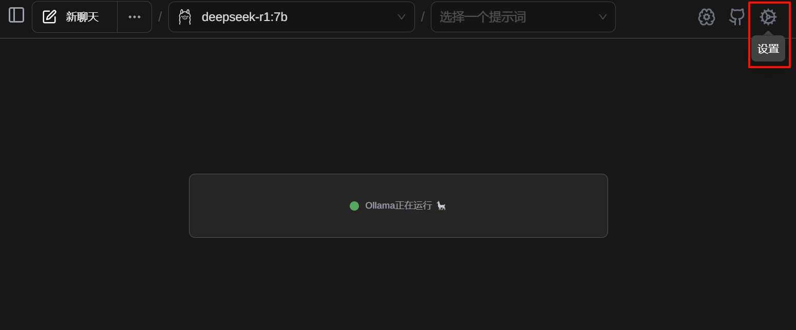

在点击 RAG 设置，主要就是配置文本嵌入模型。

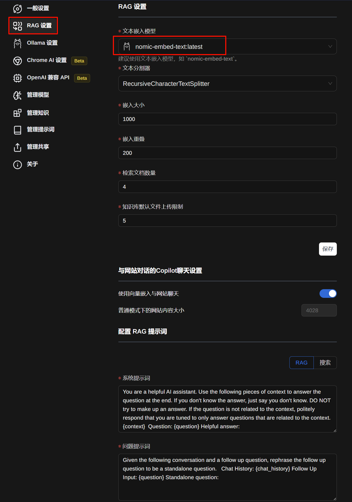

再点击“管理知识”，添加我们想要大模型学习的文件即可。

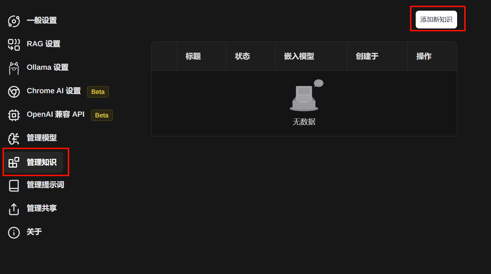

这里我添加了一下我前东家的一个企业文化相关的文档。

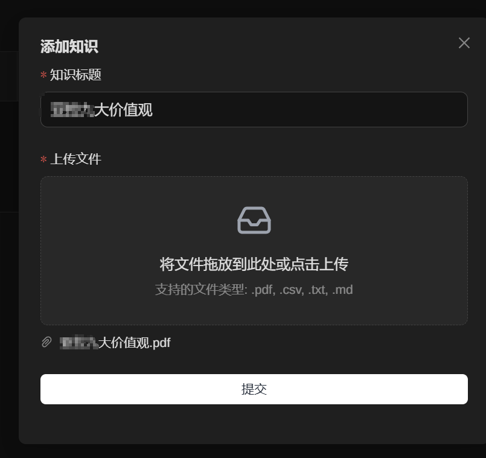

提交后等待处理完成，刷新页面配置好我们的知识库。

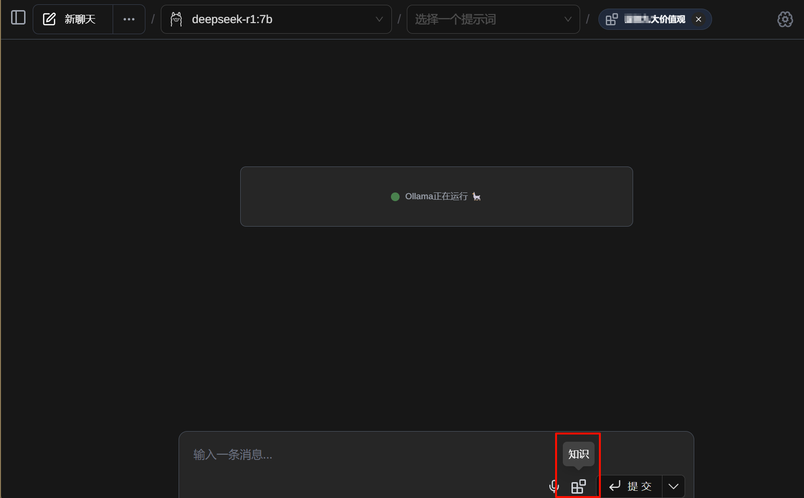

我们对比一下不配置知识库和配置了知识库生成的结果会有什么区别。

先看看没有配置知识库的回答，不能说毫不相关吧，只能说完全不知所云，满分100分只能打0分。

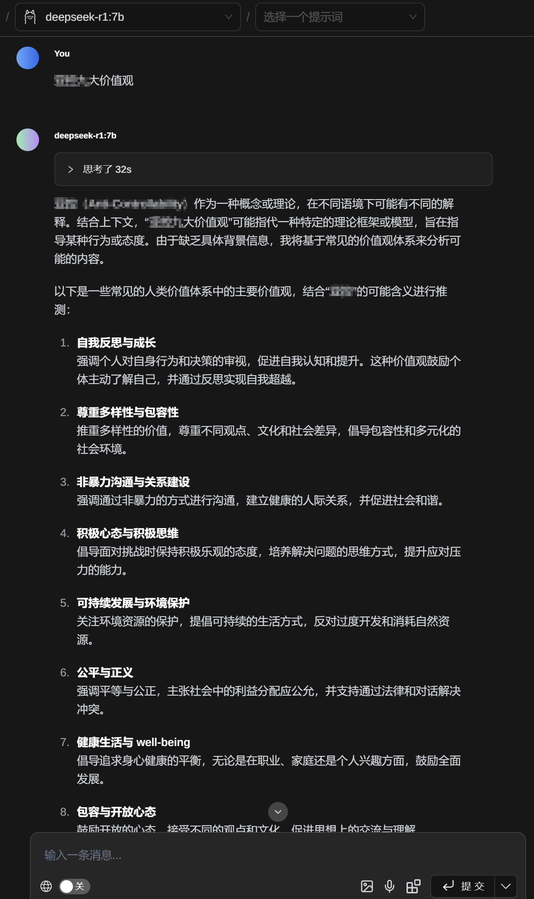

再来看看结合了知识库的回答，虽然没有完全正确，但是也已经非常接近正确答案了，满分100分能打90分，目前我跑的模型只是7B的，网上说14B+的模型效果会好很多。

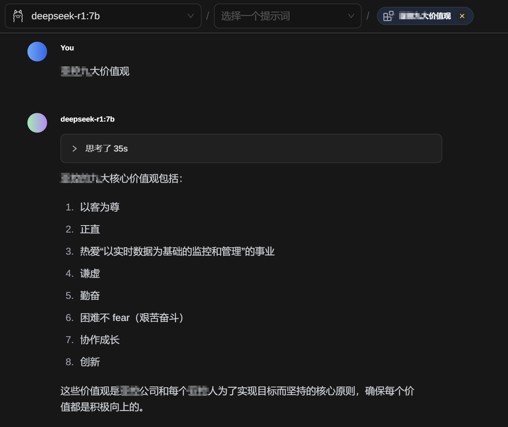

## Anything LLM

[Anything LLM](https://anythingllm.com/) 也是一个开箱即用的AI工具，是一个桌面端的应用，比前面介绍的 Page Assist 要更加强大。

先进行基本配置：

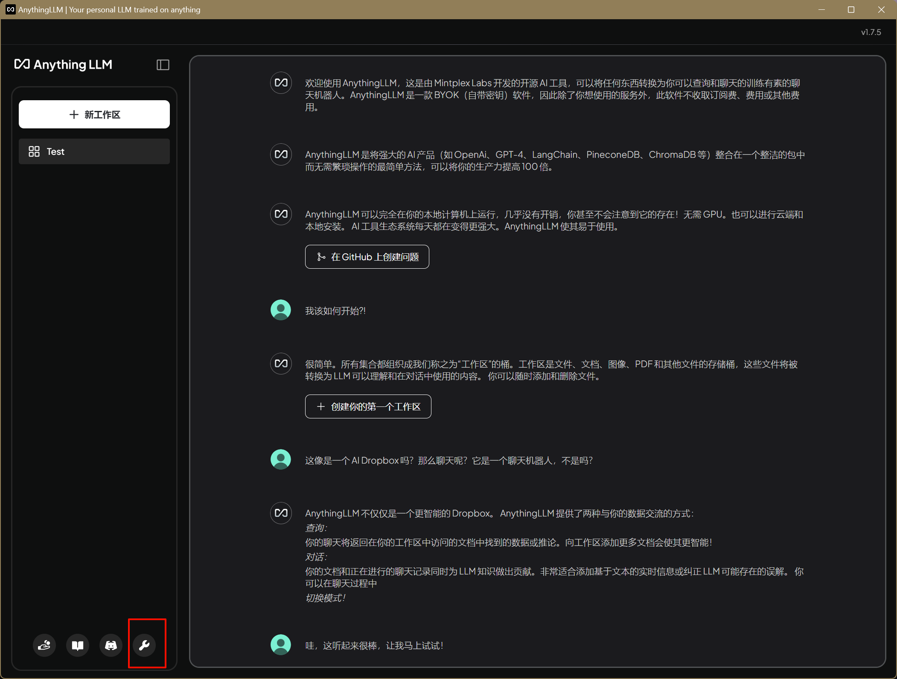

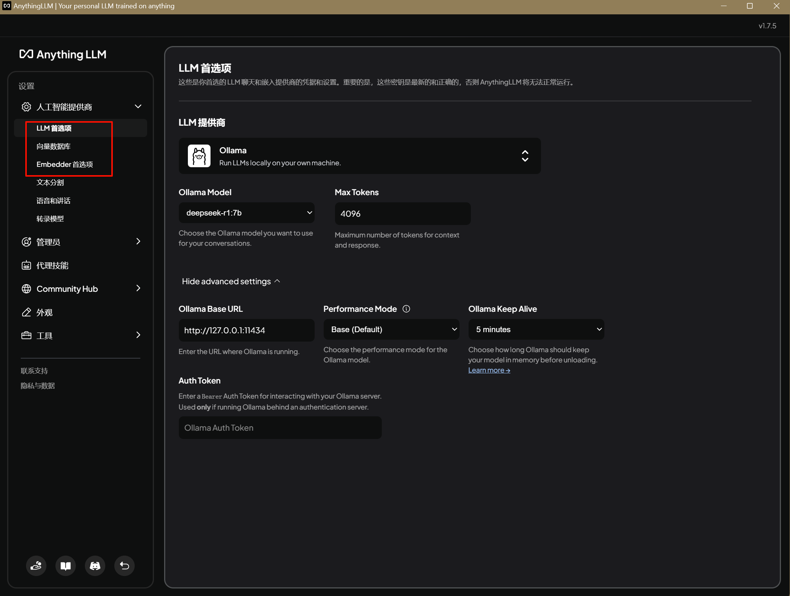

向量数据库选默认的就好，Embedder 首选项还是选我们的 Ollama 的 nomic-embed-text，记得都要点保存。

然后，添加知识库相关的文件，Anything LLM比较强大，添加的文件可以是文本、音视频、图片、网页等。

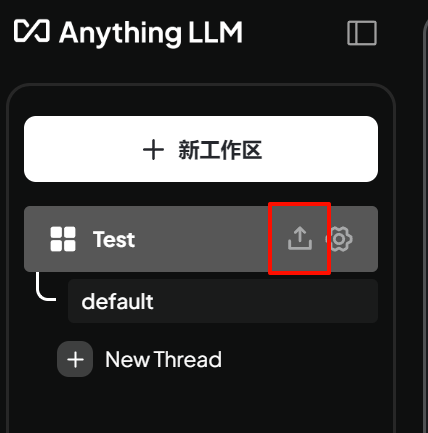

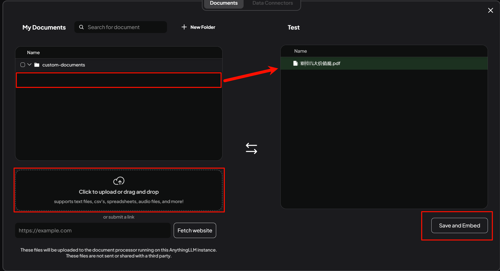

还是刚才前文中那个问题，这个回答就非常好了，满分100分可以打99分了。

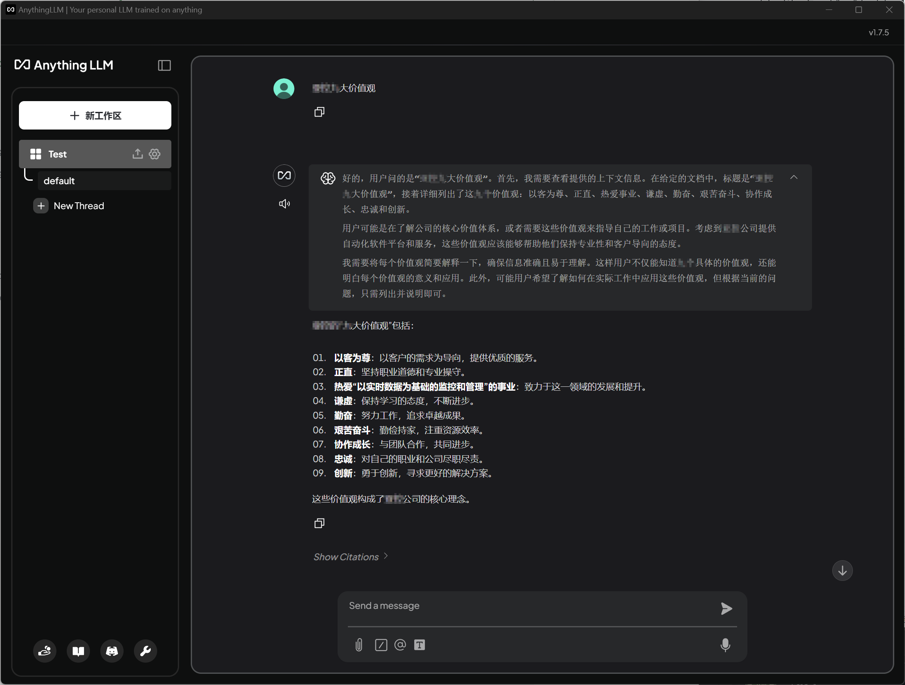

同样我也试了一下把知识库删掉会是效果，还是已读乱回。

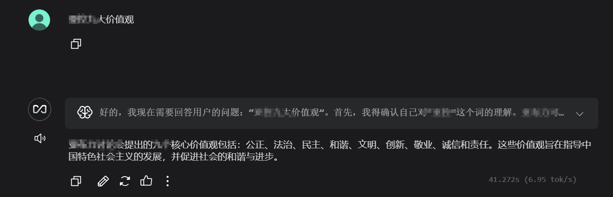
