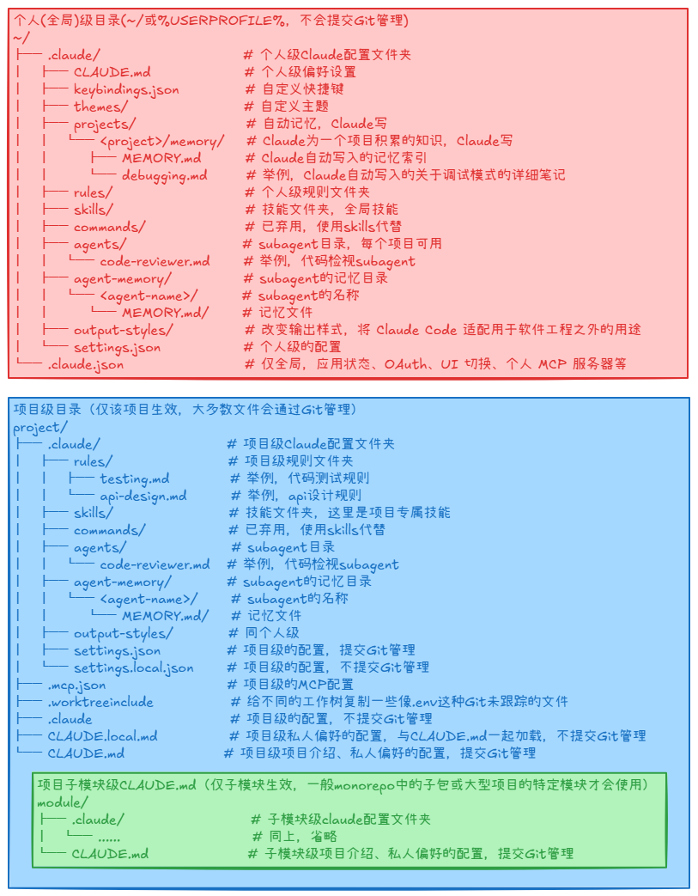
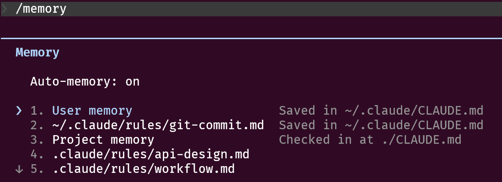
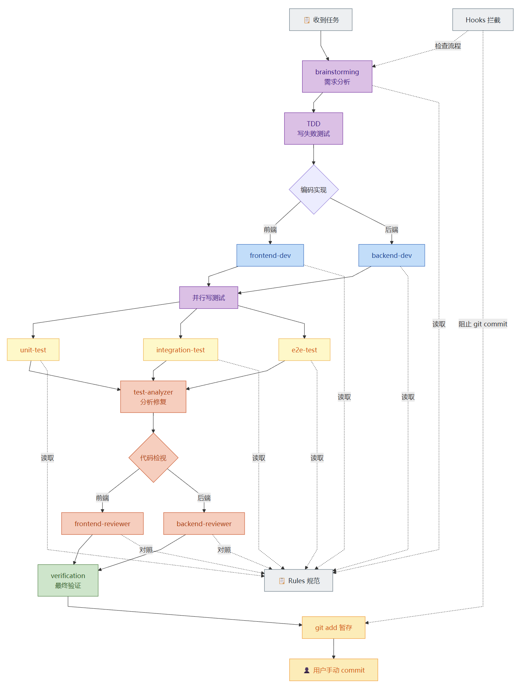
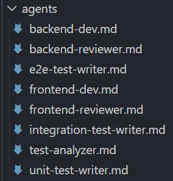
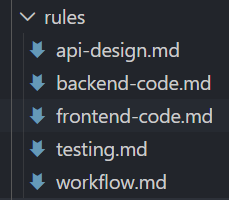
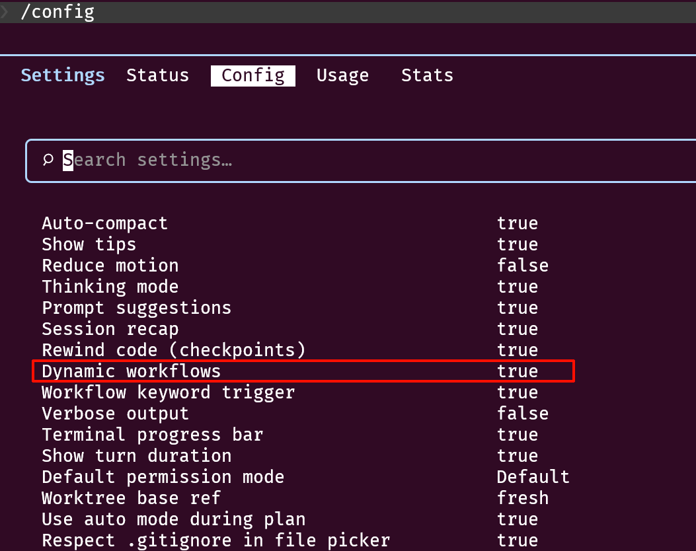
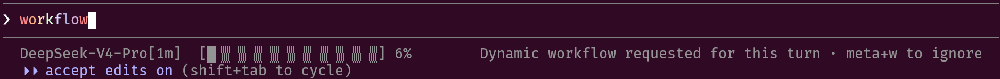
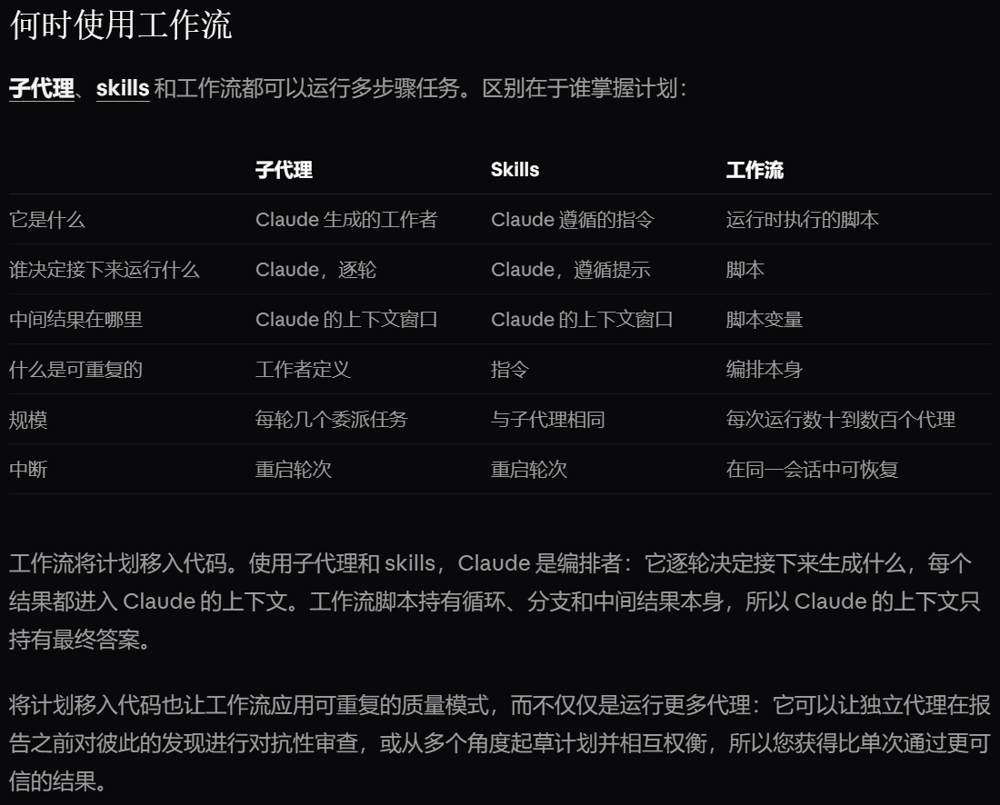

# 我的AI工作流

> 首发于：2026-05-28

> 注：本文的AI工作流基于 Claude Code CLI，如果使用OpenCode或者其它工具可能会有区别。
>
> 本文侧重将AI工作流需要用到的基础知识，不会面面俱到，更多细节请查阅官方文档。
>
> 本文部分内容由AI生成。

## 前言

看了好多的教程，听了好多概念，什么 `SPEC Coding`、`Harness Engineering` 等等，给我的感觉都是在讲“大道理”，很少有讲具体如何实操的，所以我一直感到困惑，不知道到底应该如何把这些“先进概念”用于实战。

思考良久，我也不想执着于这些理论了，也不谈论什么 Harness Engineering 应该包含哪些组成部分，其实我一直想要搭建一个自己的AI工作流，索性就按照自己的理解摸索了，搭了一个出来一个我自己的AI工作流。它可能还不够完善，也无法直接复刻到其它项目中去，但我仍然认为这是一件很有意义的事情。

下面我将从搭建这个AI工作流的**基础知识**、**工作流思路**以及具体**实例**来讲述搭建这个工作流的心路历程。

## 基础知识

### 探索.claude目录

一张图展示各个级别Claude配置文件及目录结构。



Claude的配置一般分为个人级、项目级、项目子模块级，每个级别的配置项其实差别不大，主要就是优先级和作用域不一样。其实用好Claude Code 本身就是在践行 `Harness Engineering`。

### 关于记忆

其实不管是MEMORY.md、CLAUDE.md，还是rules，我理解他们本质都是“记忆”，只是使用的场景、作用域、加载机制、更新频率、共享方式和典型内容等方面做了差异化，因为这更符合软件工程的原则，更利于实操，不会把记忆搞成一堆乱麻。

#### CLAUDE.md

这个文件是非常关键的一个文件，LLM每次对话都会带着它，**为Claude提供持久上下文**，所以CLAUDE.md的文件通常也不能搞太大（200行以下，较长的文件消耗更多上下文并降低遵守度）。最常见的CLAUDE.md通常在项目具备一定规模之后使用 `/init` 自动生成，自动生成的这个CLAUDE.md通常会带有架构介绍、项目目录结构、基础命令介绍、CI/CD介绍等，不同项目生成出来的内容还是会有不小的差异。当然，CLAUDE.md我们也可以自己手写，或者指挥LLM让其辅助我们编写。

CLAUDE.md分布在不同目录层级：

*   个人级：用来描述个人偏好，比如：让Claude Code全程用中文来回答问题；每个回答后都增加一个微笑的emoji；在所有项目中使用 `pnpm` 而非 `npm` 等。
*   项目级：跟着项目走，项目成员一起维护，用于让LLM能快速了解项目，里面的内容不会经常发生改变。如果添加 `CLAUDE.local.md` 则是用来描述针对项目的个人偏好设置。
*   模块级：针对一个项目中的子项目或者比较复杂的模块来进行编写。

优先级：模块级 > 项目级 > 个人级

#### 规则(Rules)

规则就是 Claude Code 的模块化“操作手册”。它可以根据目录或者文件类型来精准指导LLM哪里该使用什么规则，按需加载。

规则文件分成两种，一种是不区分哪里使用的，一种是区分具体哪里使用的，其核心是头部有个 YAML 格式的区块，通过`paths`字段精准控制作用范围。

以下面这个文件为例，这里的规则只会作用于 `src/frontend` 目录下的 `tsx` 和 `jsx` 格式的文件，其它文件则不受影响，如果不写 `paths` 的内容，这个规则将在处理所有文件的时候都要去检查一下，就非常浪费资源了。

```markdown
---
paths:
  - "src/frontend/**/*.tsx"
  - "src/frontend/**/*.jsx"
---

# React 前端开发规范
- 必须使用函数式组件和 Hooks，禁止使用 Class 组件。
- 所有 Props 必须有 TypeScript 类型定义。
- 单个组件代码不超过 200 行。
```

规则也分个人级、项目级、模块级，下面是几个例子：

**个人级**

`~/.claude/rules/my-personal-style.md`

```markdown
---
# 无 paths 字段 → 在所有项目中始终加载
---

# 我的个人编码习惯

- 所有异步函数必须显式标注返回类型 `Promise<T>`，不要依赖类型推断。
- 写 `if` 语句时，始终使用花括号 `{}`，即使只有一行。
- 注释使用英文，但回复我时用中文。
- 个人常用命令别名：`gs` = `git status`，`gp` = `git push`。
```

**项目级/模块级**

这个例子其实既算项目级也算模块级，他放在项目目录，但是规定了具体某个模块的规则。

`my-project/.claude/rules/api-design.md`

```markdown
---
paths: "src/api/**/*.ts"
---

# API 模块开发规范

- 所有 API 请求函数必须以 `Api` 结尾，例如 `getUserApi`。
- 请求参数类型定义在 `src/api/types.ts` 中。
- 错误处理必须使用统一的 `handleApiError` 函数。
- 每个 API 函数必须包含 JSDoc 注释，说明用途和参数。
```

可能有人会有疑惑“规则的内容写CLAUDE.md不是也行吗？”，的确可以，而且也能生效，但是如果规则增加可能导致 `CLAUDE.md` 内容过于膨胀，而且很多时候不需要这些规则，也会每次都加载，十分浪费上下文。

#### 自动记忆(Auto Memory)

自动记忆让 Claude 跨会话积累知识，无需你编写任何内容。Claude 在工作时为自己保存笔记：构建命令、调试见解、架构笔记、代码样式偏好和工作流习惯。Claude 不会每个会话都保存内容。它根据信息在未来对话中是否有用来决定什么值得记住。

自动记忆一般是自动开启的，可以用 `/memory` 查看启用状态，如下图所示：



一般存储在 `.claude/projects/<project>/memory/` 目录，`<project>` 路径来自 git 存储库，因此同一存储库中的所有 worktrees 和子目录共享一个自动记忆目录。在 git 存储库外，改用项目根目录。

下面是一个项目记忆的目录的结构举例：
```
    ~/.claude/projects/<project>/memory/
    ├── MEMORY.md          # 简洁索引，加载到每个会话
    ├── debugging.md       # 关于调试模式的详细笔记
    ├── api-conventions.md # API 设计决策
    └── ...                # Claude 创建的任何其他主题文件
```

`MEMORY.md` 是记忆入口点，充当记忆索引，它的前 200 行或前 25KB（以先到者为准）在每次对话开始时加载。超过该阈值的内容在会话开始时不加载。Claude 通过将详细笔记移到单独的主题文件中来保持 `MEMORY.md` 简洁。

有人问“memory有什么用，我写到rules里面或者CLAUDE.md里面不就好了吗？”，确实，部分memory确实可以经过整理写到rules里面，但前提是你能意识得到这是一个需要被整理成规则的内容了，不可忽视memory其实是可以被动发现的，发现你的一些有用信息并记录下来，等你有空去整理这些记忆说不定能整理处理新的规则。

### 关于Subagents

Subagents 是处理特定类型任务的专业 AI 助手。

当我们的主会话需一次性要用到一些辅助任务（搜索结果、日志或文件内容）的结果，充斥主对话的时候，请使用一个 subagent。

该 subagent 在自己的上下文中完成这项工作，仅返回摘要。当我们不断生成相同类型的工作者并使用相同的指令时，定义一个自定义 subagent。每个 subagent 在自己的 context window 中运行，具有自定义系统提示、特定的工具访问权限和独立的权限。

当 Claude 遇到与 subagent 描述相匹配的任务时，它会委托给该 subagent，该 subagent 独立工作并返回结果。

Subagents 能帮我们做哪些事情：

*   **保留上下文**，通过将探索和实现保持在主对话之外
*   **强制执行约束**，通过限制 subagent 可以使用的工具
*   **跨项目重用配置**，使用用户级 subagents
*   **专门化行为**，为特定领域使用专注的系统提示
*   **控制成本**，通过将任务路由到更快、更便宜的模型（如 Haiku）

Claude Code 包括几个内置 subagents，如 **Explore**、**Plan** 和 **general-purpose**。我们也可以创建自定义 subagents 来处理特定任务。

Subagent 的本体其实就是 `.claude/agents/xxxx.md` 这个文件，可以手动写，也可以使用 `/agents` 让Claude辅助写。

一个最简单的 subagent 示例：

```markdown
---
name: code-reviewer
description: Reviews code for quality and best practices
memory: user
---

You are a code reviewer. As you review code, update your agent memory with
patterns, conventions, and recurring issues you discover.
```

上面只是一个骨架示例，真正的威力在于给 Subagent 配上详细的 prompt、限制工具、指定模型、甚至让多个 Subagent 协作。

### 关于Hooks

当 Claude Code 编辑文件、完成任务或需要输入时自动运行 shell 命令。格式化代码、发送通知、验证命令并强制执行项目规则。

Hooks 配置在 `settings.json` 中（个人级、项目级、模块级都支持），主要分为以下几类：

**支持的事件类型（部分）**

| 事件 | 触发时机 | 典型用途 |
|------|---------|---------|
| `PreToolUse` | 在任何 Edit 或 Write 工具调用之前运行脚本 | 校验参数、阻止危险操作 |
| `PostToolUse` | 在任何 Edit 或 Write 工具调用之后运行脚本 | 日志记录、自动提交 |
| `Notification` | Claude 发送通知时 | 桌面通知、声音提醒 |
| `UserPromptSubmit` | 用户提交消息时 | 注入额外上下文 |
| `Stop` | Claude 完成响应时 | 自动格式化、补充信息 |
| `PreCompact` | 压缩上下文之前 | 环境检查、加载配置 |

全部事件类型见[官方文档](https://code.claude.com/docs/zh-CN/hooks#hook-生命周期)。

支持的匹配器（matcher）见[官方文档](https://code.claude.com/docs/zh-CN/hooks#匹配器模式)

**配置示例**

```json
{
  "hooks": {
    "PostToolUse": [
      {
        "matcher": "Edit|Write",
        "hooks": [
          {
            "type": "command",
            "command": "npm run lint"
          }
        ]
      }
    ],
    "Notification": [
      {
        "matcher": "",
        "hooks": [
          {
            "type": "command",
            "command": "powershell.exe -Command \"[System.Reflection.Assembly]::LoadWithPartialName('System.Windows.Forms'); [System.Windows.Forms.MessageBox]::Show('Claude Code needs your attention', 'Claude Code')\""
          }
        ]
      }
    ]
  }
}
```

上面这个配置做了两件事：
1. 每次 `Edit` 或 `Write` 工具执行后（每次LLM改完代码），触发 hook（这里用了一个 npm 脚本去执行代码格式化）。
2. 当Claude完成任务时，弹出桌面通知提醒你回来查看。

---
至此，已经介绍完搭建我这套AI工作流所需要的所有基础知识，下面讲思路。

## 工作流思路



**流程**:
1. brainstorming(using-superpowers，编写设计和计划文档)
2. TDD(写失败测试用例)
3. 编码
4. 三类测试用例并行编写（单元测试、集成测试、E2E测试）
5. 分析修复测试问题
6. 检视代码
7. 验证
8. git暂存，用户确认后提交

## 工作流实例

我这里有个[周报项目](https://github.com/EagleClark/work-report-generator)，就是一个填任务生成周报，AI分析人力情况的一个小项目，不过麻雀虽小五脏俱全，登录、用户管理、表单、复杂表格、AI分析、数据库操作等应有尽有。

我在这个项目开发过程中我就配置了一套AI工作流。

### 全局规则

首先是我本地的个人级配置（~/.claude/CALUDE.md），我直接配置的 [Karpathy的CLAUDE.md](https://github.com/multica-ai/andrej-karpathy-skills/blob/main/CLAUDE.md)，本质是一个AI工程纪律规范。这个配置也可以放项目级配置里面，不过我觉得很好用每个项目我都期望用，再增加了一些自我介绍和自己的工作风格等内容。

```
......
上面的Karpathy的配置省略

# 关于我

- 称呼：Eagle
- 角色：全栈工程师，但更擅长前端
- 时区：Asia/Shanghai
- 常用语言：中文、英文

# 日常工作

- 主要处理的任务类型：Web开发、学习笔记
- 常用技术栈：React、Vue + TypeScript + Node.js
- 偏好的包管理器：pnpm

# 沟通风格

- 用简洁、直接的方式回答，不要过度解释基础概念
- 用中文回答，但技术术语保留英文
- 如果有不确定的地方，不要猜测，直接问我

# 代码偏好

- 不管前端代码还是后端Node.JS代码优先使用 TypeScript
- 每个函数必须有类型声明（TypeScript）
- 写测试测试优先用 vitest、Playwright
```

### Subagent配置

我给我的项目配置了8个subagent，可以到[代码仓](https://github.com/EagleClark/work-report-generator/tree/main/.claude/agents) 查看。这些subagent分别是管前后端开发、代码检视、测试用例检视、测试结果分析的，使用不同的模型，不同的权限，各自干各自擅长的事情。



### Rules配置

规则我配置了5个，可以到[代码仓](https://github.com/EagleClark/work-report-generator/tree/main/.claude/rules) 查看。有 API 开发设计的规则，有前后端代码的规则，有测试的规则，这些规则都有自己的作用域。最重要的还有工作流的规则（workflow.md），这个工作流规则就规定了我做各种任务的时候要怎么个流程来做，用什么SKILL，谁（哪个subagent）来做，哪些事情一定要做，哪些事情禁止做。



### hooks配置

我这个项目[hooks配置](https://github.com/EagleClark/work-report-generator/blob/main/.claude/settings.json)主要是控制AI不要随便给我提交代码，仅暂存即可，还有就是编码强制提醒要根据工作流的规范来做事儿。

## Dynamic Workflows

刚把我自己的工作流搞出来不久，Claude Code官方就出了动态工作流，这是最近（2026-05-28）新出的功能，Claude Code v2.1.154 或更高版本才能支持。

支持之后效果如下图所示：





该功能专为复杂任务而生，可以动态生成工作流，相当于就是自动触发Harness Engineering，并指挥上百个subagent同时干活儿。

下面是官方给出的Subagent、SKILL和动态工作流的对比：



Bun 的创始人 Jarred Sumner 使用动态工作流完成了一项极具挑战的任务：将整个 Bun 运行时从 Zig 语言全面迁移到了 Rust 语言。最终交付了约 **75 万行** Rust 代码，从第一笔提交到合并仅耗时 **11 天**，现有测试套件通过率高达 **99.8%**。

目前，该功能尚在研究中，而且烧tokens也是很恐怖的，所以并非什么任务都需要使用这个模式，也不代表我们前面研究了半天自己的AI工作流毫无意义。不过，动态工作流确实很强，很可能又是一场革命性的升级。

## 参考资料

*   [探索 .claude 目录](https://code.claude.com/docs/zh-CN/claude-directory)
*   [存储指令和记忆](https://code.claude.com/docs/zh-CN/memory)
*   [使用 hooks 自动化](https://code.claude.com/docs/zh-CN/hooks-guide)
*   [创建自定义 subagents](https://code.claude.com/docs/zh-CN/sub-agents#enable-persistent-memory)
*   [Agent-teams](https://code.claude.com/docs/zh-CN/agent-teams)
*   [使用动态工作流大规模编排子代理](https://code.claude.com/docs/zh-CN/workflows)
