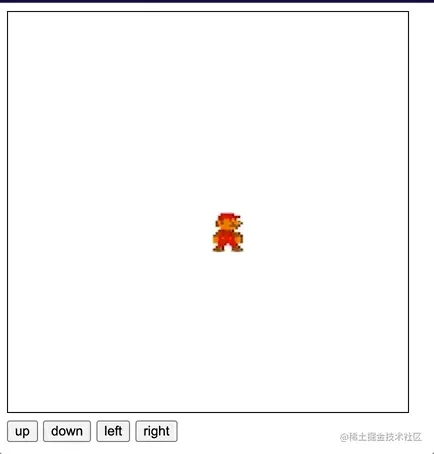

# 命令模式

> 首发于：2022-04-11

## 基本概念

**命令模式** （Command Pattern）又称事务模式，将请求封装成对象，将命令的发送者和接受者解耦。本质上是对**方法调用的封装**。

通过封装方法调用，也可以做一些有意思的事，例如记录日志，或者重复使用这些封装来实现撤销（undo）、重做（redo）操作。

## 现实生活中的例子

经典的餐厅点餐的例子，你去餐厅吃饭，找服务员点餐，服务员给你下单之后，过一会儿自然就会有厨师给你出餐，但是过程中具体是哪个厨子你不用知道，谁点的餐厨子也不用知道。服务员下的单就是一个命令，厨子一旦做完前面的订单就会做你的。

## 应用场景

1. 需要将请求调用者和请求的接收者解耦的时候；
2. 需要将请求排队、记录请求日志、撤销或重做操作时；

## 优缺点

优点：

1. 命令模式将调用命令的请求对象与执行该命令的接收对象解耦，因此系统的可扩展性良好，加入新的命令不影响原有逻辑，所以增加新的命令也很容易；
2. 命令对象可以被不同的请求者角色重用，方便复用；
3. 可以将命令记入日志，根据日志可以容易地实现对命令的撤销和重做；

缺点：

1. 命令类或者命令对象随着命令的变多而膨胀，如果命令对象很多，那么使用者需要谨慎使用，以免带来不必要的系统复杂度。

## 实现

下面来实现一个可以上、下、左、右移动马里奥大叔的例子。

先用一种比较传统的方法来实现：

```html
<!DOCTYPE html>
<html lang="en">

<head>
    <meta charset="UTF-8">
    <meta http-equiv="X-UA-Compatible" content="IE=edge">
    <meta name="viewport" content="width=device-width, initial-scale=1.0">
    <title>Document</title>
    <style>
        #my-canvas {
            border: 1px solid black;
        }
    </style>
</head>

<body>
    <canvas id="my-canvas"></canvas>
    <div>
        <button id="up-btn">up</button>
        <button id="down-btn">down</button>
        <button id="left-btn">left</button>
        <button id="right-btn">right</button>
    </div>
    <script>
        const canvas = document.getElementById('my-canvas')
        const CanvasWidth = 400 // 画布宽度
        const CanvasHeight = 400 // 画布高度
        const CanvasStep = 40 // 动作步长
        canvas.width = CanvasWidth
        canvas.height = CanvasHeight

        // 移动对象类
        class Role {
            constructor(x, y, imgSrc) {
                this.position = { x, y }
                this.canvas = document.getElementById('my-canvas')

                this.ctx = this.canvas.getContext('2d')
                this.img = new Image()
                this.img.style.width = CanvasStep
                this.img.style.height = CanvasStep
                this.img.src = imgSrc
                this.img.onload = () => {
                    this.ctx.drawImage(this.img, x, y, CanvasStep, CanvasStep)
                    this.move(0, 0)
                }
            }

            move(x, y) {
                const pos = this.position
                this.ctx.clearRect(pos.x, pos.y, CanvasStep, CanvasStep)
                pos.x += x
                pos.y += y
                this.ctx.drawImage(this.img, pos.x, pos.y, CanvasStep, CanvasStep)
            }
        }

        const mario = new Role(200, 200, 'https://i.loli.net/2019/08/09/sqnjmxSZBdPfNtb.jpg')

        // 设置按钮回调
        const elementUp = document.getElementById('up-btn')
        elementUp.onclick = function () {
            mario.move(0, -CanvasStep)
        }

        const elementDown = document.getElementById('down-btn')
        elementDown.onclick = function () {
            mario.move(0, CanvasStep)
        }

        const elementLeft = document.getElementById('left-btn')
        elementLeft.onclick = function () {
            mario.move(-CanvasStep, 0)
        }

        const elementRight = document.getElementById('right-btn')
        elementRight.onclick = function () {
            mario.move(CanvasStep, 0)
        }
    </script>
</body>

</html>
```

运行效果如下图所示：




上面的代码逻辑是没有问题的，但是可以看到，我们在对对象进行操作的时候会把 DOM 事件和对象耦合在一起，也就是说这里的事件发送者和接收者的代码是耦合的，如果想要增加对象，那么 DOM 事件这块的代码全部都要改。

下面，我们将使用命令模式进行改造：

```html
<!DOCTYPE html>
<html lang="en">

<head>
    <meta charset="UTF-8">
    <meta http-equiv="X-UA-Compatible" content="IE=edge">
    <meta name="viewport" content="width=device-width, initial-scale=1.0">
    <title>Document</title>
    <style>
        #my-canvas {
            border: 1px solid black;
        }
    </style>
</head>

<body>
    <canvas id="my-canvas"></canvas>
    <div>
        <button id="up-btn">up</button>
        <button id="down-btn">down</button>
        <button id="left-btn">left</button>
        <button id="right-btn">right</button>
    </div>
    <script>
        const canvas = document.getElementById('my-canvas')
        const CanvasWidth = 400 // 画布宽度
        const CanvasHeight = 400 // 画布高度
        const CanvasStep = 40 // 动作步长
        canvas.width = CanvasWidth
        canvas.height = CanvasHeight

        const btnUp = document.getElementById('up-btn')
        const btnDown = document.getElementById('down-btn')
        const btnLeft = document.getElementById('left-btn')
        const btnRight = document.getElementById('right-btn')

        // 移动对象类
        class Role {
            constructor(x, y, imgSrc) {
                this.x = x
                this.y = y
                this.canvas = document.getElementById('my-canvas')
                this.ctx = this.canvas.getContext('2d')
                this.img = new Image()
                this.img.style.width = CanvasStep
                this.img.style.height = CanvasStep
                this.img.src = imgSrc
                this.img.onload = () => {
                    this.ctx.drawImage(this.img, x, y, CanvasStep, CanvasStep)
                    this.move(0, 0)
                }
            }

            move(x, y) {
                this.ctx.clearRect(this.x, this.y, CanvasStep, CanvasStep)
                this.x += x
                this.y += y
                this.ctx.drawImage(this.img, this.x, this.y, CanvasStep, CanvasStep)
            }
        }

        // 向上移动命令类
        class MoveUpCommand {
            constructor(receiver) {
                this.receiver = receiver
            }

            execute(role) {
                this.receiver.move(0, -CanvasStep)
            }
        }

        // 向下移动命令类
        class MoveDownCommand {
            constructor(receiver) {
                this.receiver = receiver
            }

            execute(role) {
                this.receiver.move(0, CanvasStep)
            }
        }

        // 向左移动命令类
        class MoveLeftCommand {
            constructor(receiver) {
                this.receiver = receiver
            }

            execute(role) {
                this.receiver.move(-CanvasStep, 0)
            }
        }

        // 向右移动命令类
        class MoveRightCommand {
            constructor(receiver) {
                this.receiver = receiver
            }

            execute(role) {
                this.receiver.move(CanvasStep, 0)
            }
        }

        // 设置按钮命令
        const setCommand = function (element, command) {
            element.onclick = function () {
                command.execute()
            }
        }

        /* ----- 客户端 ----- */
        const mario = new Role(200, 200, 'https://i.loli.net/2019/08/09/sqnjmxSZBdPfNtb.jpg')
        const moveUpCommand = new MoveUpCommand(mario)
        const moveDownCommand = new MoveDownCommand(mario)
        const moveLeftCommand = new MoveLeftCommand(mario)
        const moveRightCommand = new MoveRightCommand(mario)

        setCommand(btnUp, moveUpCommand)
        setCommand(btnDown, moveDownCommand)
        setCommand(btnLeft, moveLeftCommand)
        setCommand(btnRight, moveRightCommand)
    </script>
</body>

</html>
```

这两端代码实现的效果是一模一样的，但是使用了命令模式之后事件的发送者和接收者就解耦了。

有了命令模式我们就能更容易的开发撤销/重做这样的功能。

```html
<!DOCTYPE html>
<html lang="en">

<head>
    <meta charset="UTF-8">
    <meta http-equiv="X-UA-Compatible" content="IE=edge">
    <meta name="viewport" content="width=device-width, initial-scale=1.0">
    <title>Document</title>
    <style>
        #my-canvas {
            border: 1px solid black;
        }
    </style>
</head>

<body>
    <canvas id="my-canvas"></canvas>
    <div>
        <button id="up-btn">up</button>
        <button id="down-btn">down</button>
        <button id="left-btn">left</button>
        <button id="right-btn">right</button>
        <button id="undo">undo</button>
        <button id="redo">redo</button>
    </div>
    <script>
        const canvas = document.getElementById('my-canvas')
        const CanvasWidth = 400 // 画布宽度
        const CanvasHeight = 400 // 画布高度
        const CanvasStep = 40 // 动作步长
        canvas.width = CanvasWidth
        canvas.height = CanvasHeight

        const btnUp = document.getElementById('up-btn')
        const btnDown = document.getElementById('down-btn')
        const btnLeft = document.getElementById('left-btn')
        const btnRight = document.getElementById('right-btn')
        const undo = document.getElementById('undo')
        const redo = document.getElementById('redo')

        // 移动对象类
        class Role {
            constructor(x, y, imgSrc) {
                this.x = x
                this.y = y
                this.canvas = document.getElementById('my-canvas')
                this.ctx = this.canvas.getContext('2d')
                this.img = new Image()
                this.img.style.width = CanvasStep
                this.img.style.height = CanvasStep
                this.img.src = imgSrc
                this.img.onload = () => {
                    this.ctx.drawImage(this.img, x, y, CanvasStep, CanvasStep)
                    this.move(0, 0)
                }
            }

            move(x, y) {
                this.ctx.clearRect(this.x, this.y, CanvasStep, CanvasStep)
                this.x += x
                this.y += y
                this.ctx.drawImage(this.img, this.x, this.y, CanvasStep, CanvasStep)
            }
        }

        // 向上移动命令类
        const MoveUpCommand = {
            execute(role) {
                role.move(0, -CanvasStep)
            },undo(role) {
                role.move(0, CanvasStep)
            }
        }

        // 向下移动命令类
        const MoveDownCommand = {
            execute(role) {
                role.move(0, CanvasStep)
            },
            undo(role) {
                role.move(0, -CanvasStep)
            }
        }

        // 向左移动命令类
        const MoveLeftCommand = {
            execute(role) {
                role.move(-CanvasStep, 0)
            },
            undo(role) {
                role.move(CanvasStep, 0)
            }
        }

        // 向右移动命令类
        const MoveRightCommand = {
            execute(role) {
                role.move(CanvasStep, 0)
            },
            undo(role) {
                role.move(-CanvasStep, 0)
            }
        }

        const CommandManager = {
            undoStack: [], // 撤销命令栈
            redoStack: [], // 重做命令栈

            executeCommand(role, command) {
                this.redoStack.length = 0 // 每次执行清空重做命令栈
                this.undoStack.push(command) // 推入撤销命令栈
                command.execute(role)
            },

            /* 撤销 */
            undo(role) {
                if (this.undoStack.length === 0) return
                const lastCommand = this.undoStack.pop()
                lastCommand.undo(role)
                this.redoStack.push(lastCommand) // 放入redo栈中
            },

            /* 重做 */
            redo(role) {
                if (this.redoStack.length === 0) return
                const lastCommand = this.redoStack.pop()
                lastCommand.execute(role)
                this.undoStack.push(lastCommand) // 放入undo栈中
            }
        }

        // 设置按钮命令
        const setCommand = function (element, role, command) {
            if (typeof command === 'object') {
                element.onclick = function () {
                    CommandManager.executeCommand(role, command)
                }
            } else {
                element.onclick = function () {
                    command.call(CommandManager, role)
                }
            }
        }

        /* ----- 客户端 ----- */
        const mario = new Role(200, 200, 'https://i.loli.net/2019/08/09/sqnjmxSZBdPfNtb.jpg')

        setCommand(btnUp, mario, MoveUpCommand)
        setCommand(btnDown, mario, MoveDownCommand)
        setCommand(btnLeft, mario, MoveLeftCommand)
        setCommand(btnRight, mario, MoveRightCommand)
        setCommand(undo, mario, CommandManager.undo)
        setCommand(redo, mario, CommandManager.redo)
    </script>
</body>

</html>
```
