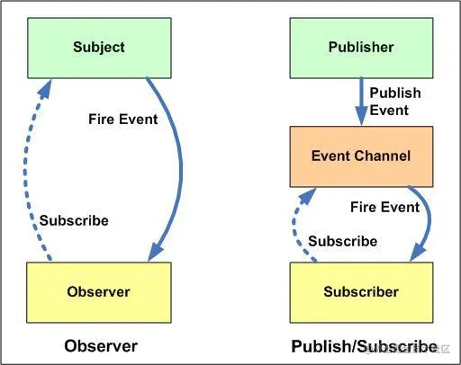

# 观察者模式与发布-订阅模式

> 首发于：2022-04-01

## 基本概念

**观察者模式（Observer Pattern）** 与 **发布-订阅模式（Publish-Subscribe Pattern, pub-sub）** 是非常相似的，经常被当成是同一个设计模式来处理，其实他俩还是有一些差异的。

事实上，**发布-订阅模式**是**观察者模式**最常用的一种观察者模式的实现，并且从解耦和重用角度来看，更优于典型的观察者模式。

在**观察者模式**中，观察者需要直接订阅目标事件，在目标发出内容改变的事件后，直接接收事件并作出响应。

而在**发布-订阅模式**中，发布者和订阅者之间多了一个发布通道，一方面从发布者接收事件，另一方面向订阅者发布事件，订阅者需要从事件通道订阅事件。

不管是**观察者模式**还是**发布-订阅模式**，它都定义了一种一对多的关系，让多个订阅者对象同时监听某一个发布者，或者叫主题对象，这个主题对象的状态发生变化时就会通知所有订阅自己的订阅者对象，使得它们能够自动更新自己。

**注：本文主要讨论发布-订阅模式。**

## 现实生活中的例子

即时在线通讯的应用其实都会用到这个模式，就是我发消息你就能即时收到，你发消息我也能即时收到，如果是群发消息的话，群里所有人都能收到。我们加好友或者进入群聊就相当于订阅了这个好友或者群聊的消息。

再比如我们订外卖，订完我们就可以等着了，等外卖小哥到了就会打电话通知你，外卖已送到，你就可以去取了，订外卖的过程其实就是订阅的过程，外卖送到了，自然就会通知你。

## 应用场景

DOM 的事件就是一个典型的应用场景，通常我们会先 `addEventListener` 然后等待事件触发，执行我们的回调函数。

Vue 的数据双向绑定也是一个很典型的应用场景，有兴趣可以看一下这一篇 [Vue数据双向绑定原理](https://juejin.cn/post/6955132767008980999)。

总结起来，发布-订阅模式的应用场景具备这样的特点：当一个对象的改变需要同时改变其它对象，并且它不知道具体有多少对象需要改变。

## 优缺点

发布 - 订阅模式的优点：

1. **时间上的解耦** ：注册的订阅行为由消息的发布方来决定何时调用，订阅者不用持续关注，当消息发生时发布者会负责通知；
2. **对象上的解耦** （观察者模式不具备这个优点）：发布者不用提前知道消息的接受者是谁，发布者只需要遍历处理所有订阅该消息类型的订阅者发送消息即可（迭代器模式），由此解耦了发布者和订阅者之间的联系，互不持有，都依赖于抽象，不再依赖于具体；

发布 - 订阅模式的缺点：

1. **增加消耗** ：创建结构和缓存订阅者这两个过程需要消耗计算和内存资源，即使订阅后始终没有触发，订阅者也会始终存在于内存；
2. **增加复杂度** ：订阅者被缓存在一起，如果多个订阅者和发布者层层嵌套，那么程序将变得难以追踪和调试，参考一下 Vue 调试的时候你点开原型链时看到的那堆 deps/subs/watchers 们…

缺点主要在于理解成本、运行效率、资源消耗，特别是在多级发布 - 订阅时，情况会变得更复杂。

## 观察者模式与发布-订阅模式的区别

借用网的一张图，表示一下观察者模式与发布-订阅模式的区别：



左边这个就是观察者模式，观察者直接订阅要观察的对象，被观察的对象被订阅后一旦触发事件，就会把消息发给观察者，观察者就能收到自己订阅的事件。

右边这个是发布-订阅模式，可以看到相比观察者模式它多了一个事件发布的模块，发布者将自己要发布的内容以及内容相关的事件发布到这个模块，订阅者会从事件发布模块拿数据，订阅者和发布者并不会直接接触，也就是把订阅者和发布者解耦了。

## 实现

要实现发布-订阅模式需要清楚以下几个概念：

1. Publisher，发布者，当消息发生时负责通知对应订阅者

2. Subscriber，订阅者，当消息发生时被通知的对象

3. SubscriberMap，持有不同 type 的数组，存储有所有订阅者的数组

4. type，消息类型，订阅者可以订阅的不同消息类型

5. subscribe，该方法为将订阅者添加到 SubscriberMap 中对应的数组中

6. unSubscribe，该方法为在 SubscriberMap 中删除订阅者

7. notify，该方法遍历通知 SubscriberMap 中对应 type 的每个订阅者

下面是一个通用实现：

```js
class Publisher {
  constructor() {
    this._subscriberMap = {} // 也可以用 Map 或 Set 类实现
  }

  /* 消息订阅 */
  subscribe(type, cb) {
    if (this._subscriberMap[type]) {
      if (!this._subscriberMap[type].includes(cb)) { // 已有的订阅类型的新订阅
        this._subscriberMap[type].push(cb)
      }
    } else { // 新的订阅类型
      this._subscriberMap[type] = [cb]
    }
  }

  /* 消息退订 */
  unsubscribe(type, cb) {
    if (!this._subscriberMap[type] || !this._subscriberMap[type].includes(cb)) { // 未订阅过
      return
    }
    const idx = this._subscriberMap[type].indexOf(cb)
    this._subscriberMap[type].splice(idx, 1)
  }

  /* 消息发布 */
  notify(type, ...payload) {
    if (!this._subscriberMap[type]) { // 未订阅此类消息
      return
    }
    this._subscriberMap[type].forEach(cb => cb(...payload))
  }
}

// 使用
// 以买冰墩墩为例
const store = new Publisher()

store.subscribe('大号冰墩墩娃娃', message => console.log('买家电话：1521067xxxx。' + message)) // 订大号冰墩墩娃娃
store.subscribe('冰墩墩钥匙链', message => console.log('买家电话：1316165xxxx。' + message)) // 订冰墩墩钥匙链

store.notify('大号冰墩墩娃娃', '到了，快来买') // 商店打电话通知买家
store.notify('冰墩墩钥匙链', '到货了，来提货吧') // 商店打电话通知买家
```

运行结果：

```
买家电话：1521067xxxx。到了，快来买
买家电话：1316165xxxx。到货了，来提货吧
```
