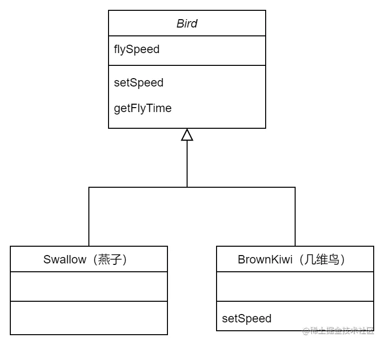
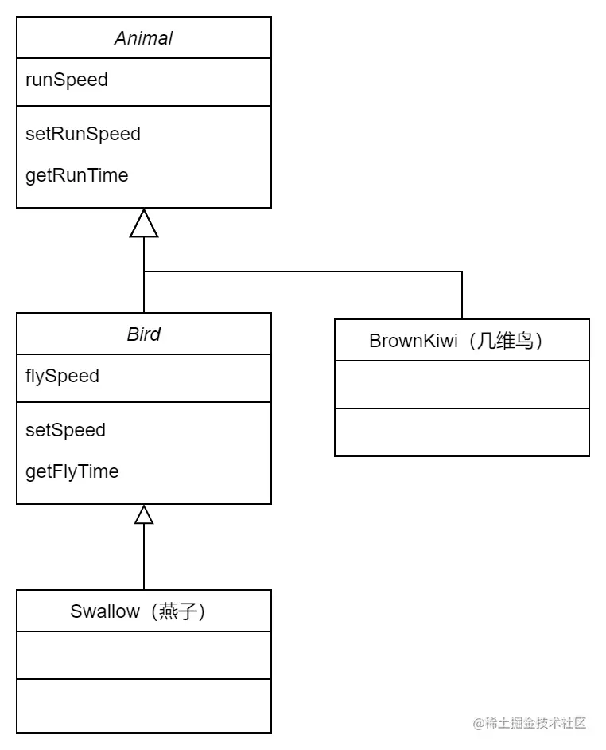
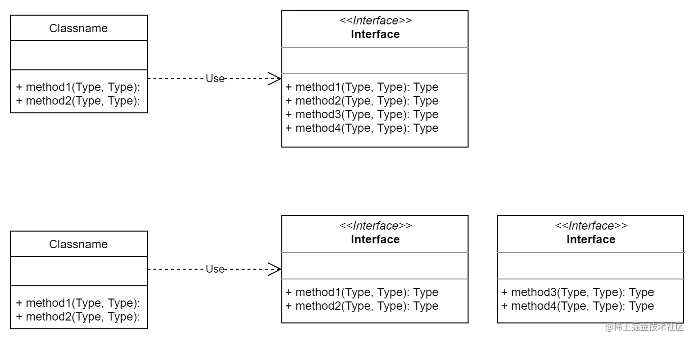
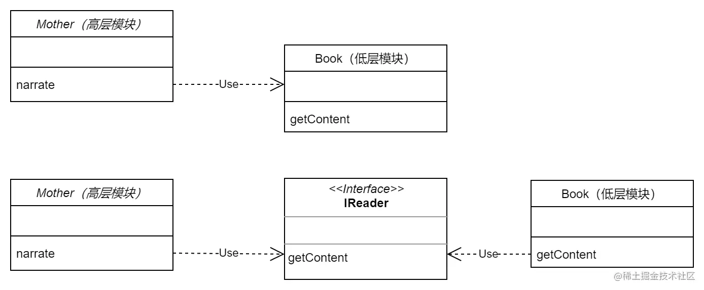

# 设计原则

>  首发于：2022-02-19

在学习设计模式之前我们应该先知道`设计原则`，这是设计模式的基本原则，设计原则是设计模式的指导思想，而设计模式则为实现手段。

> 注意，遵守设计原则是好，但是过犹不及，在实际项目中我们不要刻板遵守，需要根据实际情况灵活运用。

## SOLID

**设计模式的六大原则：**

- 单一职责原则（Single Responsibility Principle, SRP）
- 开闭原则（Open Closed Principle, OCP）
- 里氏替换原则（Liskov Substitution Principle, LSP）
- 迪米特法则，又被称为最少知识原则（Law of Demeter, LOD; Least Knowledge Principle, LKP）
- 接口隔离原则（Interface Segregation Principle, ISP）
- 依赖倒置原则（Dependence Inversion Principle, DIP）

把这六个原则的首字母联合起来（两个 `L` 合为一个）就是 `SOLID`。

## 单一职责原则

单一职责原则是指对一个类（方法、对象，下文统称对象）来说，应该仅有一个引起它变化的原因，简单的说就是一个对象只做一件事。

单一职责原则可以让我们对对象的维护变得简单，如果一个对象具有多个职责的话，那么如果一个职责的逻辑需要修改，那么势必会影响到其他职责的代码。如果一个对象具有多种职责，职责之间相互耦合，对一个职责的修改会影响到其他职责的实现，这就是属于模块内低内聚高耦合的情况。负责的职责越多，耦合越强，对模块的修改就越来越危险。

**优点：**

1. 降低单个类（方法、对象）的复杂度，提高可读性和可维护性，功能之间界限更清楚；

2. 类（方法、对象）之间根据功能被分为更小的粒度，有助于代码的复用。

**缺点：**

1. 增加系统中类（方法、对象）的个数，实际上也增加了这些对象之间相互联系的难度，同时也引入了额外的复杂度。

## 开闭原则

开放封闭原则是指一个模块在扩展性方面应该是开放的，而更改性方面应该是封闭的，也就是对扩展开放，对修改封闭。

当需要增加需求的时候，则尽量通过扩展新代码的方式，而不是修改已有代码。因为修改已有代码，则会给依赖原有代码的模块带来隐患，因此修改之后需要把所有依赖原有代码的模块都测试一遍，修改一遍测试一遍，带来的成本很大，如果是上线的大型项目，那么代价和风险可能更高。

**优点：** 

1. 增加可维护性，避免因为修改给系统带来的不稳定性。

## 里氏替换原则

所有引用基类（父类）的地方必须能透明地使用其子类的对象。通俗来讲就是：子类可以扩展父类的功能，但不能改变父类原有的功能。子类继承父类时，除添加新的方法完成新增功能外，尽量不要重写父类的方法。

**作用：**

1. 里氏替换原则是实现开闭原则的重要方式之一；

2. 它客服了继承中重写父类造成的可复用性变差的缺点；

3. 它是动作正确性的保证，即类的扩展不会给已有的系统引入新的错误，降低了代码出错的可能性；

4. 加强程序的健壮性，同时变更时可以做到非常好的兼容性，提高程序的维护性、可扩展性，降低需求变更时引入的风险。

**实现方法：**

1. 子类可以实现父类的抽象方法，但不能覆盖父类的非抽象方法；

2. 子类中可以增加自己特有的方法；

3. 当子类的方法重载父类的方法时，方法的前置条件（即方法的输入参数）要比父类的方法更宽松；

4. 当子类的方法实现父类的方法时（重写/重载或实现抽象方法），方法的后置条件（即方法的的输出/返回值）要比父类的方法更严格或相等。

### 例子

几维鸟不是鸟。鸟一般会飞，但是但是新西兰的几维鸟由于翅膀退化无法飞行。现在要设计一个实例，计算这两种鸟飞行一段举例需要多长时间。

**第一种设计：**



几维鸟不会飞所以它的飞行速度为0，它重写了父类的 `setSpeed`  方法，将  `flySpeed` 设置成了0，这违背了里氏替换原则，最终导致计算时的除零错误。

**第二种设计：**

取消几维鸟原来的继承关系，定义鸟和几维鸟的更一般的父类，如动物类，它们都有奔跑的能力。几维鸟的飞行速度虽然为 0，但奔跑速度不为 0，可以计算出其奔跑所要花费的时间。



## 迪米特法则（最少知识原则）

迪米特法则有叫最少知识原则，一个对象应该对其他对象有最少的了解。

通俗地讲，一个类应该对自己需要耦合或调用的类知道得最少，类的内部如何实现、如何复杂都与调用者或者依赖者没关系，调用者或者依赖者只需要知道他需要的方法即可，其他的我一概不关心。类与类之间的关系越密切，耦合度越大，当一个类发生改变时，对另一个类的影响也越大。

通常为了减少对象之间的联系，是通过引入一个第三者来帮助进行通信，阻隔对象之间的直接通信，从而减少耦合。

**优点：**

1. 降低类（方法、对象）之间不必要的依赖，减少耦合。

**缺点：**

1. 类（方法、对象）之间不直接通信也会经过一个第三者来通信，那么就要权衡引入第三者带来的复杂度是否值得。

## 接口隔离原则

接口隔离原则是指：

1. 客户端不应该依赖它不需要的接口。

2. 类间的依赖关系应该建立在最小的接口上。

简单的举个例子，假如某个接口定义了方法1、2、3、4，但是某个类其实只需要实现方法1、2，那么方法3、4就多余了，就算实现了也没用，但是又不得不实现，就非常多余。所以在设计接口的时候应该把接口拆分一下（比如拆分成2个接口，一个定义了方法1、2，一个定义了方法3、4），这样就不会有多余的方法了。



显然下面这种设计优于上面这种设计。

## 依赖倒置原则

依赖倒置原则指：

1. 上层模块不应该依赖底层模块，它们都应该依赖于抽象。

2. 抽象不应该依赖于细节，细节应该依赖于抽象。

要针对接口编程而非针对实现编程。

### 例子

1、母亲给孩子将故事，给她一本书就可以按照书的内容讲了。

```ts
class Book {
    getContent() {
        return '山上有座庙，庙里有座山...';
    }
}
class Mother {
    narrate(book: Book) {
        console.log('妈妈开始讲故事：');
        console.log(book.getContent());
    }
}

const book = new Book();
const mother = new Mother();
mother.narrate(book);
```

输出：

```
妈妈开始讲故事：
山上有座庙，庙里有座山...
```

2、突然有一天，需求变了，书变成了报纸。

```ts
class Newspasper {
    getContent() {
        return '中国队勇夺世界杯...';
    }
}
```

这时母亲居然不会读了。需要修改母亲的代码才行。不仅是报纸不会读，杂志、网页等等，其它的一切都不会读，所以这显然不是一个好的设计，`Month` 和 `Book` 的耦合太高了，必须要降低耦合度。

3、引入抽象接口 `IReader`，只要是带文字的都数据读物，都需要实现这个接口。

```ts
interface IReader {
    getContent(): string;
}
```

重新实现几个类：

```ts
class Book implements IReader {
    getContent() {
        return '山上有座庙，庙里有座山...';
    }
}

class Newspasper implements IReader {
    getContent() {
        return '中国队勇夺世界杯...';
    }
}
class Mother {
    narrate(reader: IReader) {
        console.log('妈妈开始讲故事：');
        console.log(reader.getContent());
    }
}

const book = new Book();
const newspasper = new Newspasper();
const mother = new Mother();
mother.narrate(book);
mother.narrate(newspasper);
```

输出：

```
妈妈开始讲故事：
山上有座庙，庙里有座山...
妈妈开始讲故事：
中国队勇夺世界杯...
```

下面用一个类图来诠释一下：



可以看到第一种设计，`Monther` 依赖 `Book`，而第二种设计他们俩都依赖抽象的 `IReader` 接口，这样依赖就倒置了。
