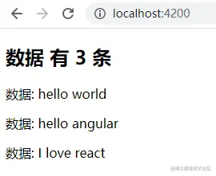
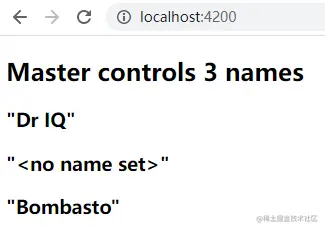
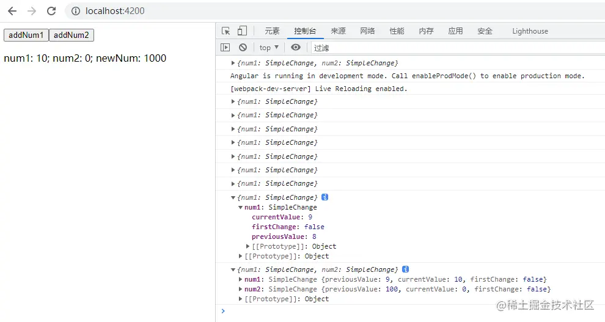
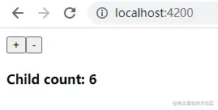
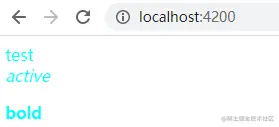
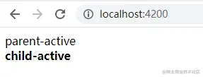
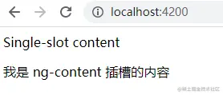
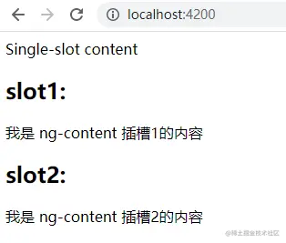
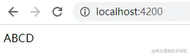

# Angular基础

> 首发于：2022-01-29
> 
> 本文基本遵从[官方文档](https://angular.cn/docs) 来学习 Angular

## 什么是 Angular

Angular 是一个基于 TypeScript 构建的开发平台。它包括：

- 一个基于组件的框架，用于构建可伸缩的 Web 应用
- 一组完美集成的库，涵盖各种功能，包括路由、表单管理、客户端-服务器通信等
- 一套开发工具，可帮助你开发、构建、测试和更新代码

## 环境搭建

### Step1 安装 Angular CLI

Angular 可以使用 Angular CLI 工具搭建开发环境。

```sh
# 安装 Angular CLI
npm i -g @angular/cli

# 查版本，显式正常的版本号就说明安装成功了
ng version

# 查命令
ng help

# 查命令帮助，例如：新建项目的帮助
ng new --help
```

### Step2 创建工作区和初始应用

```sh
# 创建新项目
ng new projectName
```

输入命令后会有一些选择，根据提示选择即可

### Step3 运行应用

```sh
cd projectName

ng sever --open
# 或者
ng sever --o
# 或者
npm start
```

然后就可以访问 [http://localhost:4200/](http://localhost:4200/) 了。

### 版本切换

我们有时候可能需要使用不同版本的 Angular，需要切换 angular/cli 来实现，切换的时候容易遇到坑，可以使用下面的命令来处理：

```sh
ng uninstall -g @angular/cli

npm cache clean --force

# 例如安装12
ng i -g @angular/cli@12
```

## 组件（component）

组件是 Angular 应用的主要构造块。每个组件包括如下部分：

- 一个 HTML 模板，用于声明页面要渲染的内容
- 一个用于定义行为的 Typescript 类
- 一个 CSS 选择器，用于定义组件在模板中的使用方式
- （可选）要应用在模板上的 CSS 样式

在使用 `ng 命令` 创建好的项目在 `app 目录` 下已经创建好了一个 `app 组件了`。

### 创建一个组件

#### 使用 Angular CLI 创建

首先，在终端窗口中，进入到要放置你组件的目录，然后输入以下命令：

```sh
# generate 可以简写为 g
ng generate component <component-name>
```
**注意：这个命令在 Windows 上可能会遇到坑 `ng : 无法加载文件  C:\Users\xxxx\AppData\Roaming\npm\ng.ps1的` 的情况。解决方法：管理员身份运行 `PowerShell`，输入 `Set-ExecutionPolicy Unrestricted` 执行，选 `[A] 全是(A)`**

默认情况下，该命令会创建以下内容：

- 一个以该组件命名的文件夹
- 一个组件文件 `<component-name>.component.ts`
- 一个模板文件 `<component-name>.component.html`
- 一个 CSS 文件， `<component-name>.component.css`
- 测试文件 `<component-name>.component.spec.ts`

其中 `<component-name>` 是组件的名称。

更多命令详细使用方式可以参考[官方文档](https://angular.cn/cli/generate#component-command)。

#### 手动创建

1. 进入到要放置你组件的目录
2. 创建文件 `<component-name>.component.ts`
3. 在文件中添加代码

```ts
import { Component } from '@angular/core';

@Component({
  selector: 'app-manual-component', // 每个组件都需要一个 CSS 选择器，在 HTML 中使用的时候就是用这个名字
  templateUrl: './manual-component.component.html', // HTML 模板 URL
  styleUrls: ['./manual-component.component.css'], // 样式模板 URL
})

export class ManualComponentComponent {

}
```

也可以是下面这种写法：

```ts
import { Component } from '@angular/core';

@Component({
  selector: 'app-manual-component', // 每个组件都需要一个 CSS 选择器
  template: `
    <h1>Hello World!</h1>
    <p>This template definition spans multiple lines.</p>
  `,
  styles: ['h1 { font-weight: normal; }']
})

export class ManualComponentComponent {

}
```

4. 添加一个模板中定义用到的 HTML 和 CSS 文件（如果用到的话）

#### 组件使用

需要在 `scr/app/app.module.ts` 中进行配置：

```ts
import { NgModule } from '@angular/core';
import { BrowserModule } from '@angular/platform-browser';

import { AppRoutingModule } from './app-routing.module';
import { AppComponent } from './app.component';
import { AutoComponentComponent } from './component/auto-component/auto-component.component';
import { ManualComponentComponent } from './component/manual-component/manual-component.component'; // 首先是引入组件

@NgModule({
  declarations: [
    AppComponent,
    AutoComponentComponent,
    ManualComponentComponent, // 然后添加组件声明
  ],
  imports: [
    BrowserModule,
    AppRoutingModule
  ],
  providers: [],
  bootstrap: [AppComponent]
})
export class AppModule { }
```

使用，例如放到 `src/app/app.componnent.html` 中：

```html
<app-manual-component></app-manual-component>
```
按照上面的方法使用即可。

### 生命周期

可以通过实现一个或多个 Angular core 库中定义的生命周期钩子接口来响应组件或指令生命周期中的事件。这些钩子让你有机会在适当的时候对组件或指令实例进行操作，比如 Angular 创建、更新或销毁这个实例时。

每个接口都有唯一的一个钩子方法，它们的名字是由接口名再加上 ng 前缀构成的。比如，OnInit 接口的钩子方法叫做 ngOnInit()。如果你在组件或指令类中实现了这个方法，Angular 就会在首次检查完组件或指令的输入属性后，紧接着调用它。

你不必实现所有生命周期钩子，只要实现你需要的那些就可以了。

| 钩子方法                | 用途                                                         | 时机                                                         |
| ----------------------- | ------------------------------------------------------------ | ------------------------------------------------------------ |
| ngOnChanges()           | 当 Angular 设置或重新设置数据绑定的输入属性时响应。 该方法接受当前和上一属性值的 SimpleChanges 对象。注意，这发生的非常频繁，所以你在这里执行的任何操作都会显著影响性能。 | 如果组件绑定过输入属性，那么在 ngOnInit() 之前以及所绑定的一个或多个输入属性的值发生变化时都会调用。注意，如果你的组件没有输入属性，或者你使用它时没有提供任何输入属性，那么框架就不会调用 ngOnChanges()。 |
| ngOnInit()              | 在 Angular 第一次显示数据绑定和设置指令/组件的输入属性之后，初始化指令/组件 | 在第一轮 ngOnChanges() 完成之后调用，只调用一次。而且即使没有调用过 ngOnChanges()，也仍然会调用 ngOnInit()（比如当模板中没有绑定任何输入属性时）。 |
| ngDoCheck()             | 检测，并在发生 Angular 无法或不愿意自己检测的变化时作出反应。 | 紧跟在每次执行变更检测时的 ngOnChanges() 和 首次执行变更检测时的 ngOnInit() 后调用。 |
| ngAfterContentInit()    | 当 Angular 把外部内容投影进组件视图或指令所在的视图之后调用。 | 第一次 ngDoCheck() 之后调用，只调用一次。                    |
| ngAfterContentChecked() | 每当 Angular 检查完被投影到组件或指令中的内容之后调用。      | ngAfterContentInit() 和每次 ngDoCheck() 之后调用             |
| ngAfterViewInit()       | 当 Angular 初始化完组件视图及其子视图或包含该指令的视图之后调用。 | 第一次 ngAfterContentChecked()                               |
| ngAfterViewChecked()    | 每当 Angular 做完组件视图和子视图或包含该指令的视图的变更检测之后调用。 | ngAfterViewInit() 和每次 ngAfterContentChecked()             |
| ngOnDestroy()           | 每当 Angular 每次销毁指令/组件之前调用并清扫。 在这儿反订阅可观察对象和分离事件处理器，以防内存泄漏。 | 在 Angular 销毁指令或组件之前立即调用。                      |

```ts
import {
  Component,
  OnChanges,
  OnInit,
  DoCheck,
  AfterContentInit,
  AfterContentChecked,
  AfterViewInit,
  AfterViewChecked,
  OnDestroy,
} from '@angular/core';

@Component({
  selector: 'app-auto-component',
  templateUrl: './auto-component.component.html',
  styleUrls: ['./auto-component.component.css']
})
export class AutoComponentComponent implements 
  OnChanges,
  OnInit,
  DoCheck,
  AfterContentInit,
  AfterContentChecked,
  AfterViewInit,
  AfterViewChecked,
  OnDestroy
{

  constructor() { }

  ngOnChanges(): void {
    console.log('ngOnChanges');
  }

  ngOnInit(): void {
    console.log('ngOnInit');
  }

  ngDoCheck(): void {
    console.log('ngDoCheck');
  }

  ngAfterContentInit(): void {
    console.log('ngAfterContentInit');
  }

  ngAfterContentChecked(): void {
    console.log('ngAfterContentChecked');
  }

  ngAfterViewInit(): void {
    console.log('ngAfterViewInit');
  }

  ngAfterViewChecked(): void {
    console.log('ngAfterViewChecked');
  }

  ngOnDestroy(): void {
    console.log('ngOnDestroy');
  }
}
```

### 视图封装模式

在 Angular 中，组件的 CSS 样式被封装进了自己的视图中，而不会影响到应用程序的其它部分。

通过在组件的元数据上设置视图封装模式，你可以分别控制每个组件的封装模式。可选的封装模式一共有如下几种：

- `ShadowDom` 模式使用浏览器内置的 Shadow DOM 实现（参阅 Shadow DOM）来为组件的宿主元素附加一个 Shadow DOM。组件的视图被附加到这个 Shadow DOM 中，组件的样式也被包含在这个 Shadow DOM 中。
- `Emulated` 模式（默认值）通过预处理（并改名）CSS 代码来模拟 Shadow DOM 的行为，以达到把 CSS 样式局限在组件视图中的目的。
- `None` 意味着 Angular 不使用视图封装。 Angular 会把 CSS 添加到全局样式中。而不会应用上前面讨论过的那些作用域规则、隔离和保护等。 从本质上来说，这跟把组件的样式直接放进 HTML 是一样的。

简单的说就是，一个组件的样式一般来说就自己用，它不会应用到别的组件上去。但是 Angular 给我们开放了一个配置项可以控制某个组件上的样式应不应用到别的组件上去。

举个例子，有两个组件，第一个组件定义了一个样式：`.none-message { color: red; }`，第一个组件和第二个组件都有 `.none-message`。

```ts
// no-encapsulation.component.ts
import { Component, ViewEncapsulation } from '@angular/core';

@Component({
  selector: 'app-no-encapsulation',
  template: `
    <h2>None</h2>
    <div class="none-message">Hello World!</div>
  `,
  styles: ['.none-message { color: red; }'],
  encapsulation: ViewEncapsulation.None,
  // encapsulation: ViewEncapsulation.Emulated, // 默认
  // encapsulation: ViewEncapsulation.ShadowDom,
})
export class NoEncapsulationComponent { }
```

```ts
// manual-component.component.ts
import { Component } from '@angular/core';

@Component({
  selector: 'app-manual-component', // 每个组件都需要一个 CSS 选择器
  template: `
    <h1 class="none-message">Hello World!</h1>
    <p>This template definition spans multiple lines.</p>
  `,
  styles: ['h1 { font-weight: normal; }']
})

export class ManualComponentComponent { }
```

如果设置第一个组件 `ViewEncapsulation.None` 那么第一个组件和第二个组件的 `Hello World!` 都会变红，如果不配做或者配置为 `ViewEncapsulation.ShadowDom`，那么就只有第一个组件自己会变红。

### 组件交互

#### 父传子 - 通过输入型绑定数据

父组件

```ts
import { Component } from '@angular/core';

const datas = [
  { a: 'hello', b: 'world' },
  { a: 'hello', b: 'angular' },
  { a: 'I love', b: 'react' },
];

@Component({
  selector: 'app-parent-component',
  template: `
    <h2>{{desp}} 有 {{ds.length}} 条</h2>

    <app-child-component
      *ngFor="let d of ds"
      [data]="d"
      [despAlias]="desp">
    </app-child-component>
  `,
  styleUrls: ['./parent-component.component.css']
})
export class ParentComponentComponent {
  ds = datas;
  desp = '数据';
}
```

子组件

```ts
import { Component, Input } from '@angular/core';

interface IData {
  a: string,
  b: string,
};

@Component({
  selector: 'app-child-component',
  template: `
    <p>{{desp}}: {{data.a}} {{data.b}}</p>
  `,
  styleUrls: ['./child-component.component.css']
})
export class ChildComponentComponent {

  constructor() { }

  @Input() data!: IData; // ! 是非空断言
  @Input('despAlias') desp = ''; // 为子组件的属性名 desp 指定一个别名 despAlias(不推荐为起别名).
}
```

效果图：



#### 父传子 - 通过 setter 截听输入属性值的变化

父组件

```ts
import { Component } from '@angular/core';

@Component({
  selector: 'app-parent-component',
  template: `
    <h2>Master controls {{names.length}} names</h2>

    <app-child-component *ngFor="let name of names" [name]="name"></app-child-component>
  `,
  styleUrls: ['./parent-component.component.css']
})
export class ParentComponentComponent {
  // Displays 'Dr IQ', '<no name set>', 'Bombasto'
  names = ['Dr IQ', '   ', '  Bombasto  '];
}
```

子组件

```ts
import { Component, Input } from '@angular/core';

@Component({
  selector: 'app-child-component',
  template: '<h3>"{{name}}"</h3>',
  styleUrls: ['./child-component.component.css']
})
export class ChildComponentComponent {
  @Input()
  get name(): string { return this._name; }
  set name(name: string) {
    this._name = (name && name.trim()) || '<no name set>';
  }
  private _name = '';
}
```

效果图：



#### 父传子 - 通过ngOnChanges()来截听输入属性值的变化

当需要监视多个、交互式输入属性的时候，本方法比用属性的 setter 更合适。

父组件

```ts
import { Component } from '@angular/core';

@Component({
  selector: 'app-parent-component',
  template: `
    <button (click)="addNum1()">addNum1</button>
    <button (click)="addNum2()">addNum2</button>
    <app-child-component [num1]="num1" [num2]="num2"></app-child-component>
  `,
  styleUrls: ['./parent-component.component.css']
})
export class ParentComponentComponent {
  num1 = 1;
  num2 = 100;

  addNum1() {
    this.num1++;
  }

  addNum2() {
    this.num1++;
    this.num2 = 0;
  }
}
```

子组件

```ts
import { Component, Input, OnChanges, SimpleChanges } from '@angular/core';

@Component({
  selector: 'app-child-component',
  template: '<p>num1: {{num1}}; num2: {{num2}}; newNum: {{newNum}}</p>',
  styleUrls: ['./child-component.component.css']
})

export class ChildComponentComponent implements OnChanges {
  @Input() num1 = 0;
  @Input() num2 = 0;
  newNum = 0;

  ngOnChanges(changes: SimpleChanges) {
    console.log(changes);
    this.newNum = this.num1 * 100 + this.num2;
  }
}
```

效果图：



#### 子传父 - 父组件监听子组件的事件

子组件暴露一个 `EventEmitter` 属性，当事件发生时，子组件利用该属性 `emits`(向上弹射)事件。父组件绑定到这个事件属性，并在事件发生时作出回应。

子组件是投票者

```ts
import { Component, EventEmitter, Input, Output } from '@angular/core';

@Component({
  selector: 'app-child-component',
  template: `
    <h4>{{name}}</h4>
    <button (click)="vote(true)"  [disabled]="didVote">Agree</button>
    <button (click)="vote(false)" [disabled]="didVote">Disagree</button>
  `,
  styleUrls: ['./child-component.component.css']
})
export class ChildComponentComponent {
  @Input()  name = '';
  @Output() voted = new EventEmitter<boolean>(); // 暴露一个输出类型的属性给父组件，这样父组件就可以接收子组件的数据了
  didVote = false;

  vote(agreed: boolean) {
    this.voted.emit(agreed); // 通知父组件投票结果
    this.didVote = true;
  }
}
```

父组件是汇总投票结果的

```ts
import { Component } from '@angular/core';

@Component({
  selector: 'app-parent-component',
  template: `
    <h2>Should mankind colonize the Universe?</h2>
    <h3>Agree: {{agreed}}, Disagree: {{disagreed}}</h3>

    <app-child-component
      *ngFor="let voter of voters"
      [name]="voter"
      (voted)="onVoted($event)">
    </app-child-component>
  `, // (voted)="onVoted($event)" 定义了收到子组件的事件通知之后父组件哪个方法来处理
  styleUrls: ['./parent-component.component.css']
})
export class ParentComponentComponent {
  agreed = 0;
  disagreed = 0;
  voters = ['Narco', 'Celeritas', 'Bombasto'];

  onVoted(agreed: boolean) {
    agreed ? this.agreed++ : this.disagreed++;
  }
}
```

效果图：


#### 父调子 - 父组件与子组件通过本地变量互动

父组件

```ts
import { Component } from '@angular/core';

@Component({
  selector: 'app-parent-component',
  template: `
    <button (click)="child.add()" >+</button>
    <button (click)="child.minus()" >-</button>

    <app-child-component #child></app-child-component>
  `, // 使用 #child 将子组件的引用绑定到 child 变量上
  styleUrls: ['./parent-component.component.css']
})
export class ParentComponentComponent { }
```

子组件

```ts
import { Component } from '@angular/core';

@Component({
  selector: 'app-child-component',
  template: `
    <h4>Child count: {{count}}</h4>
  `,
  styleUrls: ['./child-component.component.css']
})
export class ChildComponentComponent {
  count = 0;
  add() {
    this.count++;
  }

  minus() {
    this.count--;
  }
}
```

父组件的按钮可以正常控制子组件的值，效果图：



#### 父调子 - 父组件调用 @ViewChild

上面使用 `本地变量` 方法是个简单明了的方法。但是它也有局限性，因为父组件-子组件的连接必须全部在父组件的模板中进行。父组件本身的代码对子组件没有访问权。

如果父组件的类需要依赖于子组件类，就不能使用 `本地变量` 方法。组件之间的父子关系 组件的父子关系不能通过在每个组件的*类*中各自定义 `本地变量` 来建立。这是因为这两个类的实例互相不知道，因此父类也就不能访问子*类*中的属性和方法。

当父组件类需要这种访问时，可以把子组件作为 `ViewChild`，注入到父组件里面。

还是上面那个例子，改造一下父组件的代码如下：

```ts
import { Component, ViewChild } from '@angular/core';
import { ChildComponentComponent } from '../child-component/child-component.component';

@Component({
  selector: 'app-parent-component',
  template: `
    <button (click)="add()" >+</button>
    <button (click)="minus()" >-</button>

    <app-child-component></app-child-component>
  `,
  styleUrls: ['./parent-component.component.css']
})
export class ParentComponentComponent {
  @ViewChild(ChildComponentComponent)
  private childComponent!: ChildComponentComponent;

  add() { this.childComponent.add(); }
  minus() { this.childComponent.minus(); }
}
```

#### 父子互通 - 父组件和子组件通过服务来通讯

父组件和它的子组件共享同一个服务，利用该服务在组件家族内部实现双向通讯。

该服务实例的作用域被限制在父组件和其子组件内。这个组件子树之外的组件将无法访问该服务或者与它们通讯。

服务代码 `component.service.ts` ：

```ts
import { Injectable } from '@angular/core';
import { Subject } from 'rxjs';

@Injectable()
export class ComponentService {

  // Observable string sources
  private parentToChildSource = new Subject<string>(); // 主体，相当于 EventEmitter
  private childToParentSource = new Subject<string>();

  // Observable string streams
  parentToChild$ = this.parentToChildSource.asObservable(); // 可观察对象
  childToParent$ = this.childToParentSource.asObservable();

  // Service message commands
  parentMessageToChild(msg: string) { // 从父组件发出消息，给子组件
    this.parentToChildSource.next(msg);
  }

  childMessageToParent(msg: string) { // 从子组件发出消息，给父组件
    this.childToParentSource.next(msg);
  }
}
```

这里用到了 `RxJS`， 它与 `Angular` 其实没有直接的关系，不过 `Angular` 经常用它来编写异步或基于事件的程序，[官方网站](https://cn.rx.js.org/manual/overview.html#-)。

使用装饰器 `@Injectable` 标记一个类可确保编译器将在注入类时生成必要的元数据，以创建类的依赖项。

父组件 `parent-component.component.ts`：

```ts
import { Component } from '@angular/core';
import { ComponentService } from '../component.service';

@Component({
  selector: 'app-parent-component',
  template: `
    <p>Message from Child: {{msgFromChild}}</p>
    <button (click)="sendMessageToChild()">Send Message to Child</button>
    <app-child-component></app-child-component>
  `,
  styleUrls: ['./parent-component.component.scss'],
  providers: [ComponentService]
})
export class ParentComponentComponent {
  msgFromChild = '';

  constructor(private componentService: ComponentService) {
    // 订阅子组件的可观察对象
    componentService.childToParent$.subscribe(msg => {
        this.msgFromChild = msg;
      }
    );
  }

  sendMessageToChild() {
    this.componentService.parentMessageToChild(Math.random() + '');
  }
}
```

子组件 `child-component.component.ts`：

```ts
import { Component } from '@angular/core';
import { ComponentService } from '../component.service';

@Component({
  selector: 'app-child-component',
  template: `
    <h2>Child</h2>
    <p>Message from Parent: {{msgFromParent}}</p>
    <button (click)="sendMessageToParent()">Send Message to Parent</button>
  `,
  styleUrls: ['./child-component.component.scss'],
})
export class ChildComponentComponent {
  msgFromParent = '';

  constructor(private componentService: ComponentService) {
    // 订阅父组件的可观察对象
    componentService.parentToChild$.subscribe(msg => {
      this.msgFromParent = msg;
    });
  }

  sendMessageToParent() {
    this.componentService.childMessageToParent(Math.random() + '');
  }
}
```

### 组件样式

#### 特殊选择器

##### `:host`

每个组件都会关联一个与其组件选择器相匹配的元素。这个元素称为宿主元素，模板会渲染到其中。`:host` 伪类选择器可用于创建针对宿主元素自身的样式，而不是针对宿主内部的那些元素。

`:host` 选择是是把宿主元素作为目标的唯一方式。除此之外，你将没办法指定它， 因为宿主不是组件自身模板的一部分，而是父组件模板的一部分。

要把宿主样式作为条件，就要像函数一样把其它选择器放在 `:host` 后面的括号中。

`parent-component.component.css`

```css
:host {
    color: aqua;
}

:host p {
    font-weight: bold;
}

:host .active {
    font-style: italic;
}
```

`parent-component.component.ts`

```ts
import { Component } from '@angular/core';

@Component({
  selector: 'app-parent-component',
  template: `
    <div>test</div>
    <div class='active'>active</div>
    <p>bold</p>
  `,
  styleUrls: ['./parent-component.component.css']
})
export class ParentComponentComponent { }
```
效果图：



##### `:host-context`

有时候，需要以某些来自宿主的祖先元素为条件来决定是否要应用某些样式。 例如，在文档的 `<body>` 元素上可能有一个用于表示样式主题 (theme) 的 CSS 类，你应当基于它来决定组件的样式。

这时可以使用 `:host-context()` 伪类选择器。它也以类似 `:host()` 形式使用。它在当前组件宿主元素的祖先节点中查找 CSS 类， 直到文档的根节点为止。它只能与其它选择器组合使用。

`app.component.html`

```html
<div class="active">
    <app-parent-component></app-parent-component>
</div>
```

`parent-component.component.ts`

```ts
import { Component } from '@angular/core';

@Component({
  selector: 'app-parent-component',
  template: `
    <div>parent-active</div>
    <app-child-component></app-child-component>
  `,
  styleUrls: ['./parent-component.component.css']
})
export class ParentComponentComponent { }
```

`child-component.component.ts`

```ts
import { Component } from '@angular/core';

@Component({
  selector: 'app-child-component',
  template: `
    <div>child-active</div>
  `,
  styleUrls: ['./child-component.component.css']
})
export class ChildComponentComponent { }
```

`child-component.component.ts`

```css
:host-context(.active) {
    font-weight: bold;
}
```

效果图：



#### 把样式加载进组件中

##### 元数据中的样式

其实就是 `styles` 属性，不在此赘述了，值得一提的是创建组件的时候可以加入 `--inline-styles` 来创建带 `styles` 空数组的样式，而不是 `styleUrls`。

```sh
ng generate component component-name --inline-style
```

##### 组件元数据中的样式文件

其实就是 `styleUrls` 属性。

##### 模板内联样式

其实就是在 `template` 里面加 `<style></style>` 块。

##### 模板中的 link 标签

其实就是在 `template` 里面加类似 `<link rel="stylesheet" href="../assets/hero-team.component.css" >` 的标签。

##### CSS @imports 语法

在 `css` 文件中使用 `@imports` 语法

```css
@import url(./test.css);
```

##### 外部以及全局样式文件

在 `angular.json` 中进行配置，详见[官方样式配置指南](https://angular.cn/guide/workspace-config#styles-and-scripts-configuration)。

##### 非 CSS 样式文件

在 `ng generate component` 的的时候可以选择使用 `scss` 或 `less`。

### 在父子指令及组件之间共享数据

这个其实在 `组件交互` 那个章节已经演示过了，就是利用 `@Input` 和 `@Output` 装饰器来表示属性可以从父组件获取值和允许数据从子组件传给父组件。

### 内容投影

内容投影是一种模式，你可以在其中插入或投影要在另一个组件中使用的内容。例如，你可能有一个 Card 组件，它可以接受另一个组件提供的内容。

#### 单插槽内容投影

内容投影的最基本形式是单插槽内容投影。单插槽内容投影是指创建一个组件，你可以在其中投影一个组件。使用 `<ng-content>` 来创建投影。

`<ng-content>` 元素是一个占位符，它不会创建真正的 DOM 元素。

`parent-component.component.ts`

```ts
import { Component } from '@angular/core';

@Component({
  selector: 'app-parent-component',
  template: `
    <div>Single-slot content</div>
    <ng-content></ng-content>
  `,
  styleUrls: ['./parent-component.component.css']
})
export class ParentComponentComponent { }
```

`app.component.html`

```html
<app-parent-component>
    <p>我是 ng-content 插槽的内容</p>
</app-parent-component>
```

效果图：



#### 多插槽内容投影

一个组件可以具有多个插槽。每个插槽可以指定一个 CSS 选择器，该选择器会决定将哪些内容放入该插槽。该模式称为多插槽内容投影。使用此模式，你必须指定希望投影内容出现在的位置。你可以通过使用 `<ng-content>` 的 `select` 属性来完成此任务。

`parent-component.component.ts`

```ts
import { Component } from '@angular/core';

@Component({
  selector: 'app-parent-component',
  template: `
    <div>Single-slot content</div>
    <h2>slot1:</h2>
    <ng-content select="[slot1]"></ng-content>
    <h2>slot2:</h2>
    <ng-content select="[slot2]"></ng-content>
  `,
  styleUrls: ['./parent-component.component.css']
})
export class ParentComponentComponent { }
```
`app.component.html`

```html
<app-parent-component>
    <p slot2>我是 ng-content 插槽2的内容</p>
    <p slot1>我是 ng-content 插槽1的内容</p>
</app-parent-component>
```

效果图：



#### 有条件的内容投影

如果你的组件需要有条件地渲染内容或多次渲染内容，则应配置该组件以接受一个 `<ng-template>` 元素，其中包含要有条件渲染的内容。

## 模板

在 Angular 中，模板就是一块 HTML。你可以在模板中通过一种特殊的语法来使用 Angular 的诸多特性。

### 文本插值

就是 `{{ xxxx }}` 语法，可以写变量、函数，也可以写部分表达式。

### 模板语句

就是 `(event)="statement"` 语法，`event` 常用的有 `click`、`blur`、`change` 等，`statement` 可以是变量、函数等。

### 管道

管道用来对字符串、货币金额、日期和其他显示数据进行转换和格式化。管道是一些简单的函数，可以在模板表达式中用来接受输入值并返回一个转换后的值。例如，你可以使用一个管道把日期显示为 1988 年 4 月 15 日，而不是其原始字符串格式。

Angular 为典型的数据转换提供了内置的管道，包括国际化的转换（i18n），它使用本地化信息来格式化数据。数据格式化常用的内置管道如下：

- DatePipe：根据本地环境中的规则格式化日期值。
- UpperCasePipe：把文本全部转换成大写。
- LowerCasePipe ：把文本全部转换成小写。
- CurrencyPipe ：把数字转换成货币字符串，根据本地环境中的规则进行格式化。
- DecimalPipe：把数字转换成带小数点的字符串，根据本地环境中的规则进行格式化。
- PercentPipe ：把数字转换成百分比字符串，根据本地环境中的规则进行格式化。

[官方文档](https://angular.cn/api/common#%E7%AE%A1%E9%81%93)。

模板表达式中使用管道操作符（|），紧接着是该管道的名字，管道名字后面还可以使用 `: + 参数`。

`parent-component.component.ts`

```ts
import { Component } from '@angular/core';

@Component({
  selector: 'app-parent-component',
  template: `
    <div>{{ "abcd" | uppercase }}</div>
  `,
  styleUrls: ['./parent-component.component.css']
})
export class ParentComponentComponent { }
```

效果图：



#### 自定义管道

创建自定义管道来封装那些内置管道没有提供的转换。然后就可以在模板表达式中使用自定义管道了，像内置管道一样，把输入值转换成显示输出。

在自定义管道类中实现 `PipeTransform` 接口来执行转换。

`parent-component.component.ts`，这里需要注意 `exponentialStrength` 需要在 `app.module.ts` 的 `declarations` 中声明，否则无法使用。

```ts
import { Component } from '@angular/core';

@Component({
  selector: 'app-parent-component',
  template: `
    <h2>Power Booster</h2>
    <p>Super power boost: {{2 | exponentialStrength: 10}}</p>
  `,
  styleUrls: ['./parent-component.component.css']
})
export class ParentComponentComponent { }
```

`exponential-strength.pipe.ts`

```ts
import { Pipe, PipeTransform } from '@angular/core';
/*
 * Raise the value exponentially
 * Takes an exponent argument that defaults to 1.
 * Usage:
 *   value | exponentialStrength:exponent
 * Example:
 *   {{ 2 | exponentialStrength:10 }}
 *   formats to: 1024
*/
@Pipe({name: 'exponentialStrength'})
export class ExponentialStrengthPipe implements PipeTransform {
  // 必须实现 transform 方法
  transform(value: number, exponent = 1): number {
    return Math.pow(value, exponent);
  }
}
```

#### 优先级

管道操作符要比三目运算符 `(?:)` 的优先级高，这意味着 `a ? b : c | x` 会被解析成 `a ? b : (c | x)`。

由于这种优先级设定，如果你要用管道处理三目元算符的结果，就要把整个表达式包裹在括号中，比如 `(a ? b : c) | x`。

### 属性绑定

Angular 中的属性绑定可帮助你设置 HTML 元素或指令的属性值。使用属性绑定，可以执行诸如切换按钮、以编程方式设置路径，以及在组件之间共享值之类的功能。

#### 绑定到属性

使用方括号 `[]` 为目标属性赋值。目标属性就是你要对其进行赋值的 DOM 属性。例如，以下代码中的目标属性是 img 元素的 src 属性。

```HTML

```

如果不使用方括号，Angular 就会将右侧视为字符串字面量并将此属性设置为该静态值。

```HTML
<app-item-detail childItem="parentItem"></app-item-detail>
```

#### 将元素的属性设置为组件属性的值

比如 `colspan 和 colSpan`，一个 `Attribute`，一个 `Property`。

`<td>` 元素没有 `colspan Property`。这是正确的，因为 `colspan` 是一个 `Attribute — colSpan`（带大写 S）才是相应的 `Property`。插值和 `Property` 绑定只能设置 `Property`，不能设置 `Attribute`。

#### 切换按钮功能

```HTML
<button [disabled]="isUnchanged">Disabled Button</button>
```

#### 设置指令的属性

要设置指令的属性，请将指令放在方括号中，例如 `[ngClass]`，后跟等号和一个源属性。在这里，这个源属性的值是 `classes` 。

```HTML
<p [ngClass]="classes">[ngClass] binding to the classes property making this blue</p>
```

要使用该属性，必须在组件类中声明它:

```ts
classes = 'special';
```

Angular 会将 special 类应用到 `p` 元素，以便你可以通过 special 来应用 CSS 样式。

#### 在组件之间绑定值

`childItem` 是一个 `@Input` 变量

```HTML
<app-item-detail [childItem]="parentItem"></app-item-detail>
```

#### 属性绑定与安全性

属性绑定可以帮助确保内容的安全。下面这个例子，浏览器不会处理 HTML，而是原样显示它。

```ts
evilTitle = 'Template <script>alert("evil never sleeps")</script> Syntax';
```

```HTML
<p><span>"{{evilTitle}}" is the <i>interpolated</i> evil title.</span></p>
```

Angular 不允许带有 `<script>` 标记的 HTML，既不能用于插值也不能用于属性绑定，这样就会阻止运行 JavaScript。

但是，在以下示例中，Angular 在显示值之前会先对它们进行无害化处理。

```HTML
 <p>"<span [innerHTML]="evilTitle"></span>" is the <i>property bound</i> evil title.</p>
```

最终显示：

```
"Template Syntax" is the property bound evil title.
```

#### 属性绑定和插值

```html
<p> is the <i>interpolated</i> image.</p>
<p> is the <i>property bound</i> image.</p>
```

将数据值渲染为字符串时，可以使用任一种形式，只是插值形式更易读。但是，要将元素属性设置为非字符串数据值时，必须使用属性绑定。

#### Attribute 绑定、类绑定和样式绑定

建议你尽可能设置带有 Property 绑定的元素的 Property。但是，有时你没有可绑定的元素 Property。在这种情况下，可以使用 Attribute 绑定。

例如，ARIA 和 SVG 只有 Attribute。 ARIA 和 SVG 都不对应于元素的 Property，也不设置元素的 Property。在这些情况下，必须使用 Attribute 绑定，因为没有相应的目标 Property。

##### 语法

Attribute 绑定语法类似于 Property 绑定，但不是直接在方括号之间放置元素的 Property，而是在 Attribute 名称前面加上前缀 `attr`，后跟一个点 `.`。然后，使用解析为字符串的表达式设置 Attribute 值。

当表达式解析为 `null` 或 `undefined` 时，Angular 会完全删除该 Attribute。

```html
<p [attr.attribute-you-are-targeting]="expression"></p>
```

```html
<!-- create and set an aria attribute for assistive technology -->
<button [attr.aria-label]="actionName">{{actionName}} with Aria</button>
```

```html
<!--  expression calculates colspan=2 -->
<tr><td [attr.colspan]="1 + 1">One-Two</td></tr>
```

##### 绑定到 class Attribute

| 绑定类型   | 语法                        | 输入类型                                   | 范例输入值                           |
| :--------- | :-------------------------- | :----------------------------------------- | :----------------------------------- |
| 单一类绑定 | `[class.sale]="onSale"`     | `boolean | undefined | null`               | `true`, `false`                      |
| 多重类绑定 | `[class]="classExpression"` | `string`                                   | `"my-class-1 my-class-2 my-class-3"` |
| 多重类绑定 | `[class]="classExpression"` | `Record<string, boolean |undefined |null>` | `{foo: true, bar: false}`            |
| 多重类绑定 | `[class]="classExpression"` | `Array`<`string`>                          | `['foo', 'bar']`                     |

##### 绑定到 style Attribute

| 绑定类型             | 语法                        | 输入属性                                  | 范例输入值                          |
| :------------------- | :-------------------------- | :---------------------------------------- | :---------------------------------- |
| 单一样式绑定         | `[style.width]="width"`     | `string | undefined | null`               | `"100px"`                           |
| 带单位的单一样式绑定 | `[style.width.px]="width"`  | `number | undefined | null`               | `100`                               |
| 多重样式绑定         | `[style]="styleExpression"` | `string`                                  | `"width: 100px; height: 100px"`     |
| 多重样式绑定         | `[style]="styleExpression"` | `Record<string, string |undefined |null>` | `{width: '100px', height: '100px'}` |

##### 样式优先级

模板绑定 > 命令宿主绑定 > 组件宿主绑定

#### 事件绑定

类似如下语法，不赘述。

```html
<button (click)="onSave()">Save</button>
```

#### 双向绑定

双向绑定为应用中的组件提供了一种共享数据的方式。使用双向绑定绑定来侦听事件并在父组件和子组件之间同步更新值。

Angular 的双向绑定语法是方括号和圆括号的组合 `[()]`。`[]` 进行属性绑定，`()` 进行事件绑定

```html
<app-sizer [(size)]="fontSizePx"></app-sizer>
```

为了使双向数据绑定有效，`@Output()` 属性的名字必须遵循 `inputChange` 模式，其中 `input` 是相应 `@Input()` 属性的名字。例如，如果 `@Input()` 属性为 `size` ，则 `@Output()` 属性必须为 `sizeChange` 。

举个例子： `SizerComponent` 具有值属性 `size` 和事件属性 `sizeChange`。 `size` 属性是 `@Input()`，因此数据可以流入 `sizerComponent` 。 `sizeChange` 事件是一个 `@Output()` ，它允许数据从 `SizerComponent` 流出到父组件。

`sizer.component.ts`

```ts
import { Component, Input, Output, EventEmitter } from '@angular/core';

@Component({
  selector: 'app-sizer',
  templateUrl: './sizer.component.html',
  styleUrls: ['./sizer.component.css']
})
export class SizerComponent {

  @Input()  size!: number | string;
  @Output() sizeChange = new EventEmitter<number>(); // 名字不能错

  dec() { this.resize(-1); }
  inc() { this.resize(+1); }

  private resize(delta: number) {
    this.size = Math.min(40, Math.max(8, +this.size + delta));
    this.sizeChange.emit(this.size);
  }
}
```

`sizer.component.html`

```html
<div>
  <button (click)="dec()" title="smaller">-</button>
  <button (click)="inc()" title="bigger">+</button>
  <label [style.font-size.px]="size">FontSize: {{size}}px</label>
</div>
```

`app.component.ts` 相当于是父组件，在其中加入变量

```ts
fontSizePx = 16;
```

`app.component.html`

```html
<app-sizer [(size)]="fontSizePx"></app-sizer>
<!-- 上面这句是下面这句的语法糖 -->
<!-- <app-sizer [size]="fontSizePx" (sizeChange)="fontSizePx=$event"></app-sizer> -->
<div [style.font-size.px]="fontSizePx">Resizable Text</div>
```

因为没有任何原生 HTML 元素遵循了 `x` 值和 `xChange` 事件的命名模式，所以与表单元素进行双向绑定需要使用 `NgModel`。关于如何在表单中使用双向绑定的更多信息，请参见 Angular [NgModel](https://angular.cn/guide/built-in-directives#ngModel) 。

#### 模板引用变量

在模板中，要使用井号 `#` 来声明一个模板变量。下列模板变量 `#phone` 语法在 `<input>` 元素上声明了一个名为 `phone` 的变量：

```html
<input #phone placeholder="phone number" />

<button (click)="callPhone(phone.value)">Call</button>
```

##### 访问 `<ng-template>` 的模板变量

```html
<ng-template #ref3></ng-template>
<button (click)="log(ref3)">Log type of #ref</button>
```

`log` 函数的实现就是一个 `console.log`，最后打印出来的对象：

```
▼ ƒ TemplateRef()
name: "TemplateRef"
__proto__: Function
```

## 指令

指令是为 Angular 应用程序中的元素添加额外行为的类。使用 Angular 的内置指令，你可以管理表单、列表、样式以及要让用户看到的任何内容。

### 内置指令

#### ngClass

用来同时添加或删除多个 CSS 类。

```html
<!--表达式方式，isSpecial 为真就会绑定 special 类 -->
<div [ngClass]="isSpecial ? 'special' : ''">This div is special</div>
```

使用方法来绑定（返回对象的 key 就是类名）：

```ts
currentClasses: Record<string, boolean> = {};
/* . . . */
setCurrentClasses() {
  // CSS classes: added/removed per current state of component properties
  this.currentClasses =  {
    saveable: this.canSave,
    modified: !this.isUnchanged,
    special:  this.isSpecial
  };
}
```

```html
<div [ngClass]="currentClasses">This div is initially saveable, unchanged, and special.</div>
```

#### ngStyle

使用方法来绑定：

```ts
currentStyles: Record<string, string> = {};
/* . . . */
setCurrentStyles() {
  // CSS styles: set per current state of component properties
  this.currentStyles = {
    'font-style':  this.canSave      ? 'italic' : 'normal',
    'font-weight': !this.isUnchanged ? 'bold'   : 'normal',
    'font-size':   this.isSpecial    ? '24px'   : '12px'
  };
}
```

```html
<div [ngStyle]="currentStyles">
  This div is initially italic, normal weight, and extra large (24px).
</div>
```

#### ngModule

可以用 `NgModel` 指令显示数据属性，并在用户进行更改时更新该属性。

`app.module.ts`

```ts
import { FormsModule } from '@angular/forms'; // <--- JavaScript import from Angular
/* . . . */
@NgModule({
  /* . . . */

  imports: [
    BrowserModule,
    FormsModule // <--- import into the NgModule
  ],
  /* . . . */
})
export class AppModule { }
```

```html
<label for="example-ngModel">[(ngModel)]:</label>
<input [(ngModel)]="currentItem.name" id="example-ngModel">
```

此 `[(ngModel)]` 语法只能设置数据绑定属性。

要自定义配置，你可以编写可展开的表单，该表单将属性绑定和事件绑定分开。使用属性绑定来设置属性，并使用事件绑定来响应更改。以下示例将 `<input>` 值更改为大写：

```html
<input [ngModel]="currentItem.name" (ngModelChange)="setUppercaseName($event)" id="example-uppercase">
```

#### ngIf

从模板中创建或销毁子视图。

```html
<app-item-detail *ngIf="isActive" [item]="item"></app-item-detail>
```

#### ngFor

为列表中的每个条目重复渲染一个节点。

```html
<div *ngFor="let item of items">{{item.name}}</div>
```

```html
<div *ngFor="let item of items; let i=index">{{i + 1}} - {{item.name}}</div>
```

#### ngSwitch

一组在备用视图之间切换的指令。

```html
<div [ngSwitch]="currentItem.feature">
  <app-stout-item    *ngSwitchCase="'stout'"    [item]="currentItem"></app-stout-item>
  <app-device-item   *ngSwitchCase="'slim'"     [item]="currentItem"></app-device-item>
  <app-lost-item     *ngSwitchCase="'vintage'"  [item]="currentItem"></app-lost-item>
  <app-best-item     *ngSwitchCase="'bright'"   [item]="currentItem"></app-best-item>
<!-- . . . -->
  <app-unknown-item  *ngSwitchDefault           [item]="currentItem"></app-unknown-item>
</div>
```

### 属性型指令

属于自定义的内容，直接看[官方文档](https://angular.cn/guide/attribute-directives)。

### 结构型指令

属于自定义的内容，直接看[官方文档](https://angular.cn/guide/structural-directives)。

## 依赖注入

### Angular 中的依赖注入

依赖项是指某个类执行其功能所需的服务或对象。依赖项注入（DI, Dependency Injection）是一种设计模式，在这种设计模式中，类会从外部源请求依赖项而不是创建它们。
