# Git最佳实践

> 首发于：2026-06-16
>
> 本文部分内容由AI辅助生成

## 行业规范

### Commit 规范

这里采用业界通用的 [Conventional Commits](https://www.conventionalcommits.org/) 标准，每条 commit message 由 **Header**、**Body**、**Footer** 三部分组成：

```
<type>(<scope>): <subject>
// 空一行
<body>
// 空一行
<footer>
```

Header 是必需的，Body 和 Footer 可以省略。任何一行都不超过 72 个字符，避免自动换行影响美观。

这种格式化的Commit message，有几个好处：

- 可以过滤某些commit（比如文档改动），便于快速查找信息。
- 提供更多的历史信息，方便快速浏览。
- 可以直接从commit生成Change log。

#### Header

只有一行，包含三个字段：

| 字段 | 必需 | 说明 |
|------|------|------|
| `type` | ✅ | commit 类别 |
| `scope` | ❌ | 影响范围（如 `api`、`ui`、`db`） |
| `subject` | ✅ | 简短描述，不超过 50 字符 |

**type 完整列表：**

| type | 说明 |
|------|------|
| `feat` | 新功能 |
| `fix` | 修 Bug |
| `perf` | 性能优化 |
| `refactor` | 重构（非新功能、非修 Bug） |
| `style` | 代码格式（不影响逻辑） |
| `docs` | 文档变更 |
| `test` | 增删测试 |
| `chore` | 构建/工具/依赖变更 |
| `ci` | CI/CD 配置变更 |
| `build` | 构建系统或外部依赖变更 |
| `revert` | 回滚某次 commit |
| `wip` | 半路存盘（最终会被 squash） |

> 注：`feat` 和 `fix` 一定会出现在 Changelog 中，其余类型放不放可选。

**subject 规范：**

- 以动词开头，第一人称现在时（如"新增"而非"新增了"）
- 中文描述控制在 30 字以内
- 结尾不加句号
- 直接陈述，不加"优化了"、"修改了"这类废话前缀

#### Body

对本次 commit 的详细说明，可多行，每行不超过 72 字符：

```
新增用户管理模块的CRUD接口，支持分页查询和批量删除。

原先的分页逻辑散落在多个 Controller 中，本次统一抽到
PageHelper 中间件处理。
```

要点：
- 说明**动机**——为什么改，而非仅仅做了什么
- 必要时描述与原先行为的差异

#### Footer

两种用途：

**1. 标记 Breaking Change：**

```
BREAKING CHANGE: 用户认证接口从 session 改为 JWT。

    To migrate the code follow the example below:

    Before:
    req.user.id

    After:
    req.userId (from decoded JWT payload)
```

**2. 关闭 Issue：**

```
Closes #234
Closes #123, #245
```

#### Revert

撤销 commit 使用 `revert:` 前缀，Body 固定格式：

```
revert: feat(user): add 'avatar' field

This reverts commit 667ecc1654a317a13331b17617d973392f415f02.
```


### 提交 PR/MR 的规范

PR（Pull Request，拉取请求）和 MR（Merge Request，合并请求）是同一件事——向目标分支发起合并申请。GitHub 称 PR，GitLab 称 MR，下文统一用 PR。

#### 一个 PR 只做一件事

这是最重要的一条原则。一个 PR 应该对应一个独立的逻辑变更：

- ✅ 修一个 Bug
- ✅ 加一个功能
- ✅ 一次小范围重构
- ❌ 修 Bug 的同时顺手加新功能
- ❌ 一个 PR 里混着重构和功能变更

一个 PR 可以包含多个 commit，但一般不超过 3 个：

- 1 个 commit：最理想，一个 PR 就是一个干净的提交
- 2-3 个 commit：可以接受，比如"新增功能 + 补充测试 + 更新文档"
- 超过 3 个：大概率这个 PR 做的事太多了，考虑拆分

如果开发过程中产生了大量零碎 commit（wip、fix typo 之类），合并前用 `git rebase -i` 整理成 1-3 个有意义的 commit。

#### PR 标题

PR 标题沿用 Conventional Commits 格式，和 commit message 保持一致：

```
feat(user): 新增JWT登录鉴权
fix(api): 修复登录超时未重定向
refactor(helper): 统一分页逻辑到 PageHelper
```

#### PR 描述

一个好的 PR 描述至少包含：

```markdown
## 改动说明
> 简述本次改动的动机和内容，一两句话即可。

## 改动清单
- 新增 xxx 接口
- 修改 xxx 逻辑
- 补充 xxx 测试

## 测试报告
> 贴可验证的证据，比写"我跑过测试了"更有说服力
```

PR 描述不需要写很多，但要让 reviewer 能在 30 秒内理解这个 PR 干了什么、为什么改、有没有证据。

## 最佳实践实操

### 0. 整体流程

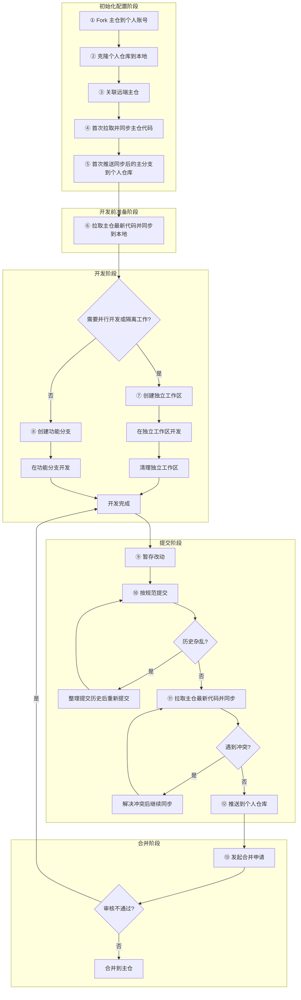

### 1. 初始化配置（远端与本地仓库配置）

参与开源项目或公司团队项目时，通常不是直接往主仓 push，而是走 **Fork 工作流**：先把主仓 fork 到自己的账号下，改完代码再发 PR/MR 合并到主仓。

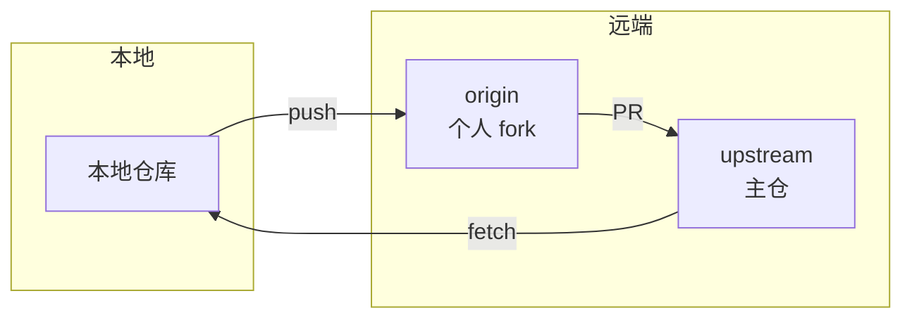

| 仓库 | 别名 | 作用 | 写权限 |
|------|------|------|:------:|
| 主仓 | `upstream` | 官方代码，接受 PR 合并 | ❌ |
| 个人 fork | `origin` | 你的远程副本 | ✅ |
| 本地 | — | 实际写代码的地方 | ✅ |

#### 命令行方式

```bash
# 1. Clone 你自己的 fork
git clone git@github.com:你的用户名/project.git
cd project

# 2. 添加主仓为 upstream
git remote add upstream git@github.com:主仓用户名/project.git

# 3. 验证
git remote -v
# origin    git@github.com:你的用户名/project.git (fetch)
# origin    git@github.com:你的用户名/project.git (push)
# upstream  git@github.com:主仓用户名/project.git (fetch)
# upstream  git@github.com:主仓用户名/project.git (push)
```

配置完成后，日常同步主仓代码：

```bash
git fetch upstream          # 拉取主仓最新代码（不合并）
git checkout main           # 切到本地 main 分支
git rebase upstream/main    # 将本地 main 变基到主仓最新状态
git push origin main        # 同步到你的 fork
```

#### TortoiseGit 方式

添加 upstream：

1. 仓库目录右键 → **TortoiseGit** → **Settings**
2. 左侧 **Git** → **Remote**，填写 Remote 名称和 URL，点击 Add

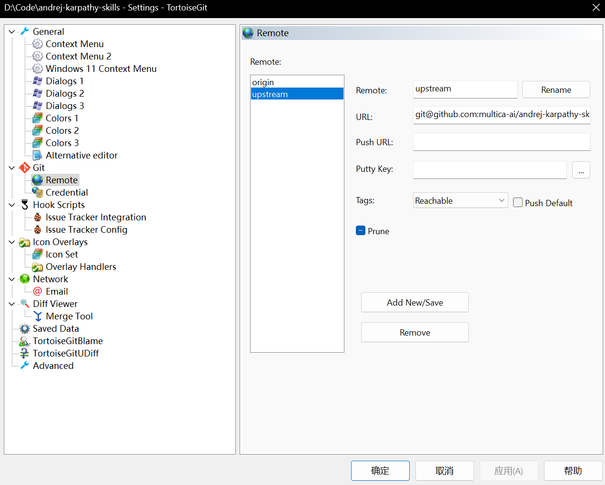

同步 upstream：

1. 右键 → **TortoiseGit** → **Pull...**
2. Remote 选择 `upstream`，Branch 选择 `main`，勾选 **Rebase**

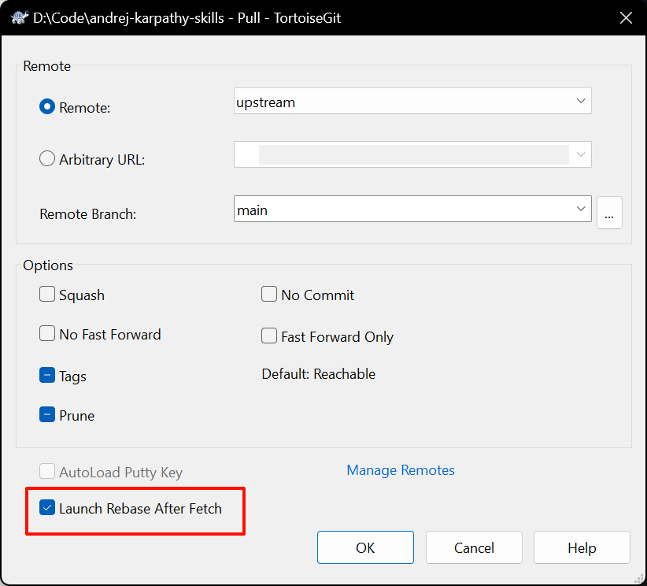

### 2. 开发前准备

开发代码前，重新走一遍拉取主仓最新代码并同步到本地，这是一个好习惯，这会减小后期我们需要处理冲突的概率。

### 3. Worktree 配置

`git worktree` 允许你在同一个仓库中同时检出多个分支到不同目录。每个 worktree 有独立的工作区，互不干扰。

所以开发之前我们最好思考一下，是否需要并行开发或者隔离工作。比如，开发新需求我们要在需求分支开发，但是修改bug又要在主分支上搞，这种情况下，如果我们都要兼顾，就不得不来回来去切分支，这非常麻烦。当然，你要可以简单粗暴地把代码仓复制多分，但是这会带来些问题（同步成本增加、分支无法锁定在一个工作区、磁盘占用等）。

#### Worktree 关系

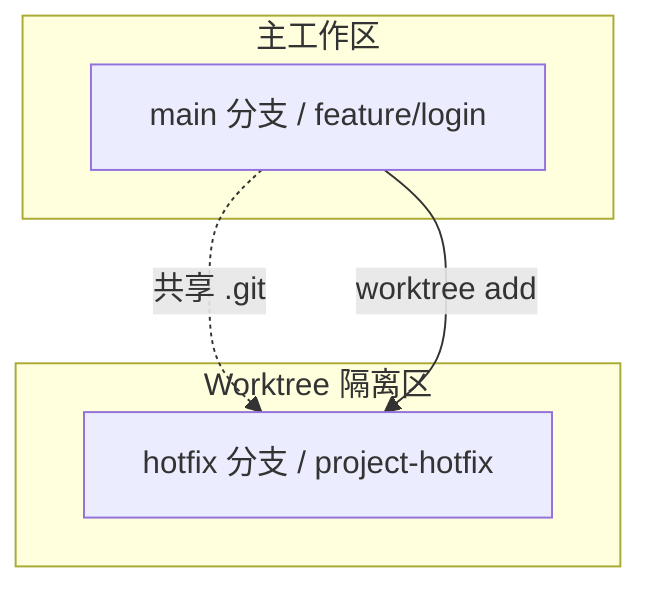

**核心特点：**

| 特性 | 说明 |
|------|------|
| 共享仓库 | 所有 worktree 共享同一个 `.git`，省空间 |
| 独立工作区 | 每个 worktree 有自己的文件系统，互不干扰 |
| 独立分支 | 每个 worktree 可以 checkout 不同分支 |
| 随时删除 | 用完 `remove`，不留痕迹 |

#### 命令行方式

```bash
# 创建一个新的 worktree，基于 main 分支切出新分支
git worktree add -b hotfix/login-timeout ../project-hotfix main

# 列出所有 worktree
git worktree list

# 在新 worktree 中工作
cd ../project-hotfix
```

**常用命令速查：**

| 命令 | 作用 |
|------|------|
| `git worktree add -b <新分支> <路径> <基础分支>` | 创建新 worktree 并切出新分支 |
| `git worktree list` | 查看所有 worktree |
| `git worktree remove <路径>` | 删除 worktree（有未提交改动需加 `--force`）|
| `git worktree prune` | 清理已被删除但未 unregister 的 worktree |

#### TortoiseGit 方式

TortoiseGit 从 2.13 版本开始支持 Worktree：

1. 在仓库目录右键 → **TortoiseGit** → **Worktree...**
2. 点击 **Add**：
   - **Path**：新 worktree 的本地路径（如 `../project-hotfix`）
   - **Branch**：选择目标分支（或创建新分支）
   - 点击 **OK**
3. 删除：打开 Git Worktree 窗口 → 选中 → **Remove**

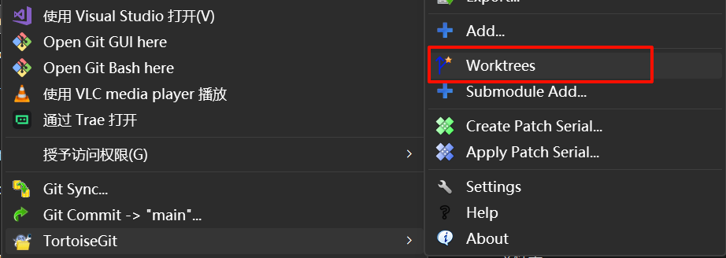

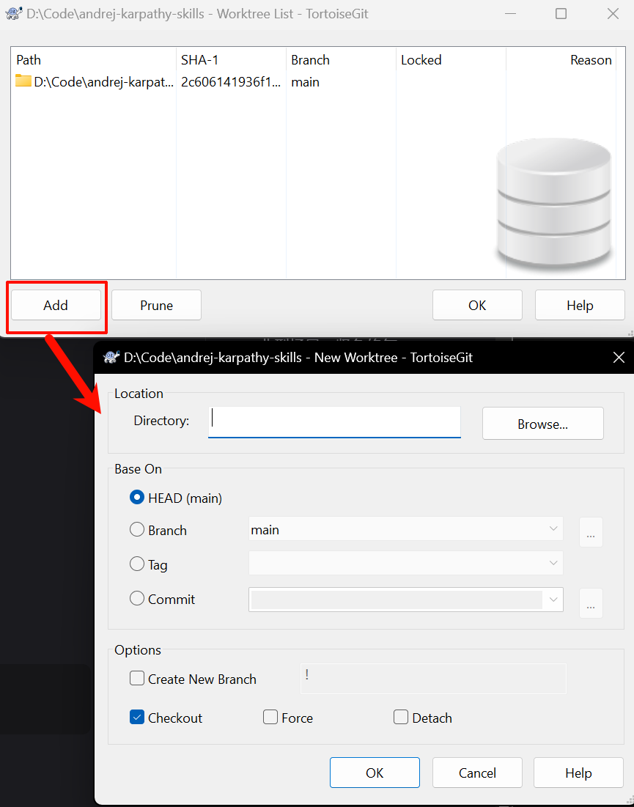

### 4. Commit整理

#### 修改 Commit 描述

**改最近一次**：

```bash
git commit --amend -m "fix(api): 修复登录超时未重定向"
```

**改历史 commit**：

```bash
# 2c606141936 是你要修改的Commit的前面一个Commit的SHA-1值，可以只取前几位
git rebase -i 2c606141936
```

在交互界面中把 `pick` 改成 `reword`，保存后 Git 会逐个弹窗让你编辑 message。

#### 合并 Commit

开发过程中难免产生 `test`、`fix typo`、`处理冲突` 之类的零碎 commit，如下图所示：

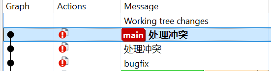

发 PR 前整理成 1-3 个有意义的 commit，是基本的代码礼仪。

整理操作主要靠交互式 rebase：

```bash
git rebase -i HEAD~3    # 整理最近 3 个 commit
```

会弹出编辑器，列出目标 commit，前面是操作指令：

| 指令 | 作用 |
|------|------|
| `pick` | 保留 commit |
| `reword` | 保留，但修改 message |
| `squash` | 合并到上一个 commit，保留 message |
| `fixup` | 合并到上一个 commit，丢弃 message |
| `drop` | 直接删除 |
| `edit` | 暂停，允许你修改内容后继续 |

也可以直接 TortoiseGit 方式，Show Log -> 选择要合并的Commit -> 右键 -> Combine to one commit，如下图所示：

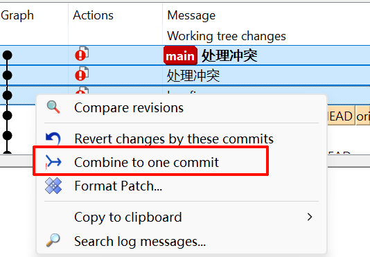


**典型场景**：把 "feat: 新增登录接口"、"wip: 调接口"、"fix: 修登录 bug" 三个 squash 成一个干净的 "feat(auth): 新增登录接口"。

在 `rebase -i` 中，第一个保留，后面用 `squash` 或 `fixup`：

```bash
pick abc1234 feat(auth): 新增登录接口
squash def5678 wip: 调接口
squash ghi9012 fix: 修登录 bug
```

- `squash`：合并后保留所有 message，让你编辑
- `fixup`：合并后直接丢弃被合并的 message


#### 删除 Commit

在 `rebase -i` 中把不需要的 commit 前面改成 `drop`，或者直接删掉那行。

```bash
pick abc1234 feat(auth): 新增登录接口
drop def5678 wip: 调试代码
```

### 5. 更新代码并处理冲突

提交代码前，先拉取主仓最新代码并同步到当前分支。这样能在本地提前发现和解决冲突，而不是推到 PR 才暴露问题。

#### 拉取并同步主仓代码

**命令行方式**

```bash
git fetch upstream              # 拉取主仓最新代码（不合并）
git rebase upstream/main        # 将当前分支变基到主仓最新状态
```

如果当前在 feature 分支，执行 `git rebase upstream/main` 会把你的 feature commit "接" 到 upstream 最新的 main 后面，形成一条干净的直线历史。

**TortoiseGit 方式**

右键 → **TortoiseGit** → **Pull...** → Remote 选择 `upstream`，Branch 选择 `main`，勾选 **Rebase** → OK。

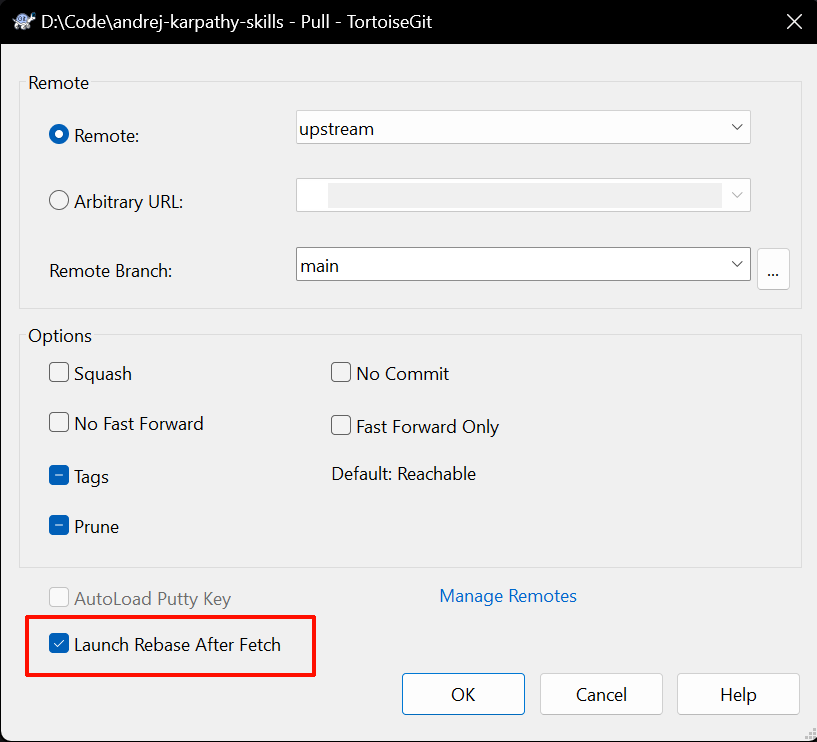

#### 冲突处理

冲突的本质：你和别人改了同一个文件的同一个地方，Git 不知道听谁的。

**命令行方式**

```bash
# rebase 过程中冲突了，先看哪些文件有冲突
git status

# 打开冲突文件，手动解决（<<<<<< HEAD 到 ====== 之间是对方代码，====== 到 >>>>>> 之间是你的代码）
# 解决后

git add <冲突文件>
git rebase --continue

# 如果发现搞不定了，直接放弃重来
git rebase --abort
```

**TortoiseGit 方式**

冲突文件会显示感叹号。右键 → **TortoiseGit** → 选中冲突文件 → **Edit conflicts**，会打开三路合并工具（Theirs / Base / Yours），手动处理后点击 **Mark as resolved**。

### 6. 代码推送

本地一切就绪后，推送到你的个人 fork。

**命令行方式**

```bash
git push origin feature/login-timeout
```

如果整理过提交历史（rebase -i 或 rebase upstream），本地 commit hash 变了，直接 push 会被拒绝。这时候用安全强制推送：

```bash
git push --force-with-lease origin feature/login-timeout
```

`--force-with-lease` 比 `--force` 安全：它会检查远端分支是否有你本地没有的提交，如果有就拒绝推送，防止覆盖别人的工作。

**TortoiseGit 方式**

右键 → **TortoiseGit** → **Push...** → Remote 选择 `origin`，Local Branch 选择当前分支 → OK。

如果需要 force push，勾选 **Force with lease**。

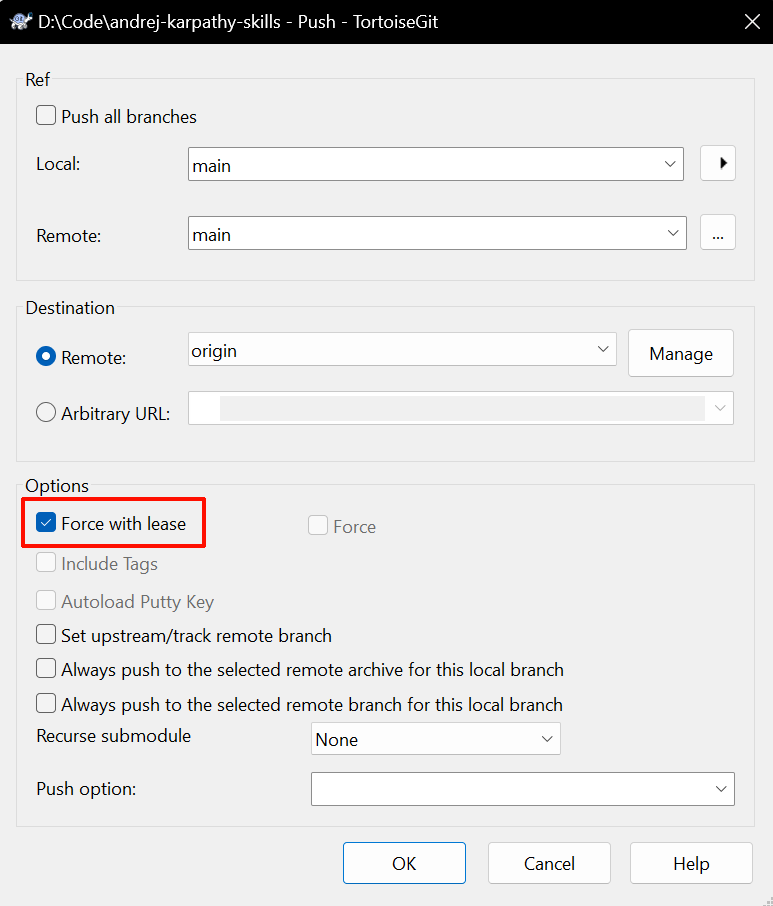

## 其它Git使用技巧

### Commit 模板配置

每次手动敲 Conventional Commits 格式的 message 容易遗漏字段或写错格式。配置一个 commit 模板，执行 `git commit` 时自动加载，减少犯错。

**全局配置（所有仓库生效）**

```bash
# 1. 创建模板文件
cat > ~/.gitmessage << 'EOF'
<type>(<scope>): <subject>

<body>

<footer>
EOF

# 2. 配置 Git 全局使用
git config --global commit.template ~/.gitmessage
```

**项目配置（仅当前仓库生效）**

把模板文件放入项目根目录，只对本项目生效：

```bash
# 项目根目录创建 .gitmessage
cat > .gitmessage << 'EOF'
<type>(<scope>): <subject>

<body>

<footer>
EOF

# 配置当前项目
git config commit.template .gitmessage
```

> 建议把 `.gitmessage` 加入版本控制，团队成员共享同一套提交规范。

配置后，执行 `git commit`（不加 `-m`）时会自动在编辑器中加载模板，按格式填空即可。

### Stash（贮藏）

临时需要切分支处理别的事，但当前改动还没准备好 commit，用 stash 先存起来。


```bash
# 贮藏当前改动（含暂存区）
git stash push -m "wip: 实验性改动"

# 查看 stash 列表
git stash list

# 恢复最新 stash（并从列表中删除）
git stash pop

# 只恢复不删除
git stash apply

# 删除指定 stash
git stash drop stash@{0}
```

> 注意：未被跟踪的文件（untracked）默认不会被 stash，需要加 `-u`：
> ```bash
> git stash push -u -m "包含未跟踪文件"
> ```

### Cherry-pick（精挑）

只想"搬运"另一个分支上的某个 commit，而不是整分支合并。

**命令行方式**

```bash
# 把 abc1234 这个 commit 搬到当前分支
git cherry-pick abc1234

# 如果有冲突，解决后
git cherry-pick --continue

# 搞不定就放弃
git cherry-pick --abort
```

**TortoiseGit 方式**

Show Log → 左上角切换到目标分支 -> 找到目标 commit → 右键 → **Cherry Pick this commit...**。

### 文件重命名

不要用操作系统的重命名功能，Git 会把它识别为"删除旧文件 + 新建文件"，丢失历史关联。

```bash
git mv old-name.js new-name.js
```

### Reset（回退）

| 模式 | HEAD | 暂存区 | 工作区 | 适用场景 |
|------|:----:|:------:|:------:|----------|
| `--soft` | 回退 | 保留 | 保留 | 撤销 commit，改动留在暂存区，重新提交 |
| `--mixed` | 回退 | 清空 | 保留 | 默认模式，改动退回工作区 |
| `--hard` | 回退 | 清空 | 清空 | 彻底丢弃，**慎用** |

**命令行方式**

```bash
git reset --soft HEAD~1    # 撤销最近一次 commit，改动留在暂存区
git reset --mixed HEAD~1   # 撤销最近一次 commit，改动退回工作区
git reset --hard HEAD~1    # 彻底丢弃最近一次 commit 及其改动
```

**TortoiseGit 方式**

右键 → **TortoiseGit** → **Reset...** → 选择模式（Soft / Mixed / Hard）→ OK。

### Reflog（后悔药）

`git reflog` 记录了 HEAD 的所有变动历史，是找回丢失 commit 的终极手段。

**命令行方式**

```bash
git reflog

# 找到丢失 commit 的 hash，比如 abc1234
git cherry-pick abc1234
# 或者直接把 HEAD 移回去
git reset --hard abc1234
```

**TortoiseGit 方式**

右键 → **TortoiseGit** → **RefLog**，查看所有操作记录，右键选中某条记录 → **Reset HEAD to this** 或 **Cherry-Pick**。

### Bisect（二分法定位 Bug）

不知道哪个 commit 引入了 Bug？用 bisect 自动二分查找。

**命令行方式**

```bash
git bisect start
git bisect bad                    # 标记当前版本有 bug
git bisect good v1.0              # 标记 v1.0 版本正常

# Git 自动 checkout 到中间 commit，你测试后标记
# 如果正常：
git bisect good
# 如果有 bug：
git bisect bad

# 循环几次后，Git 会告诉你引入 bug 的 commit
git bisect reset                  # 结束，回到原分支
```

**TortoiseGit 方式**

右键 → **TortoiseGit** → **Bisect Start** → 标记 Bad / Good → 循环测试直到定位。

## 结合AI

个人觉得日常的Git操作还是比较简单，使用自然语言就能很好的使用AI辅助进行Git操作，所以我觉得如果非要结合AI来用可以把你自己的Git操作流程整理成一个SKILL，也可以把这一套流程直接放入你的 workflow.md 里面。

[遵循Conventional Commits规范提交Commit的SKILL](https://www.skills.sh/github/awesome-copilot/git-commit)

## 参考资料

- [Conventional Commits](https://www.conventionalcommits.org/)
- [Angular Git Commit](https://docs.google.com/document/d/1QrDFcIiPjSLDn3EL15IJygNPiHORgU1_OOAqWjiDU5Y/edit?pli=1&tab=t.0#heading=h.uh9jqqu4fjy3)
- [Git 官方文档](https://git-scm.com/)
- [TortoiseGit 文档](https://tortoisegit.org/docs/)
