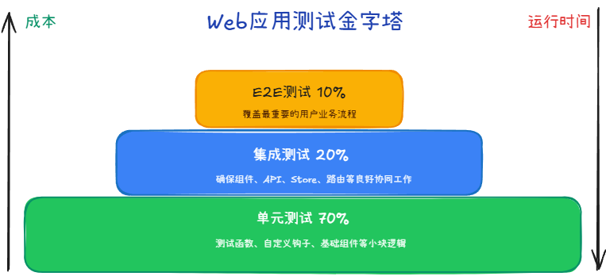
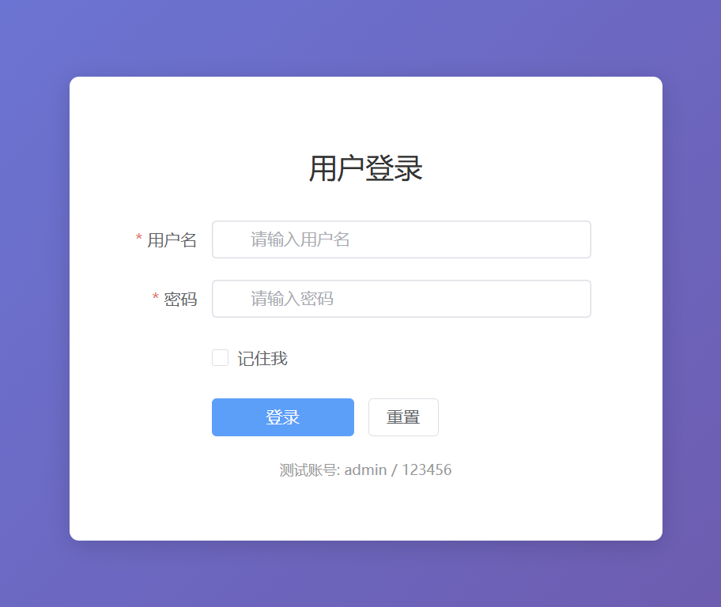
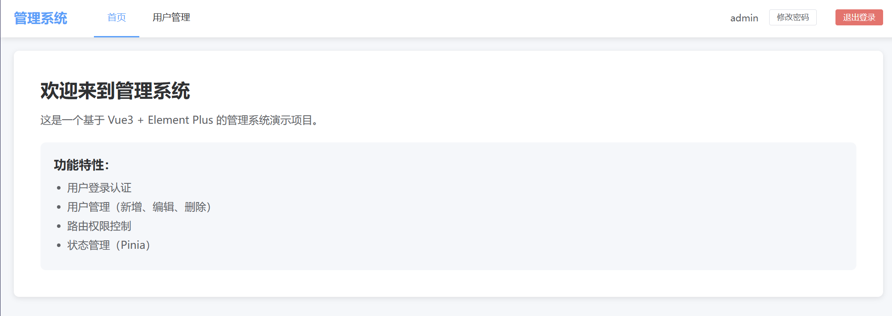
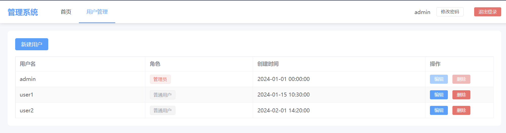
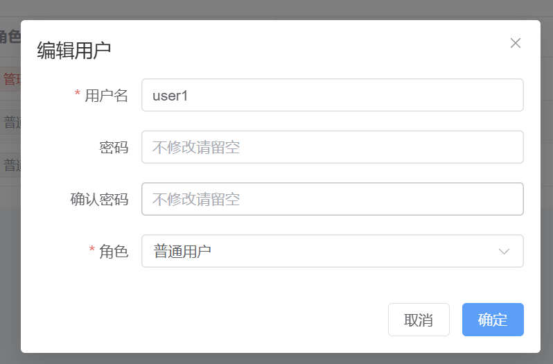
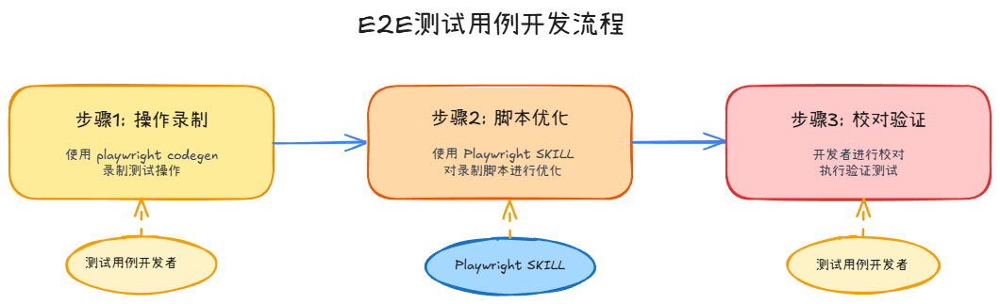
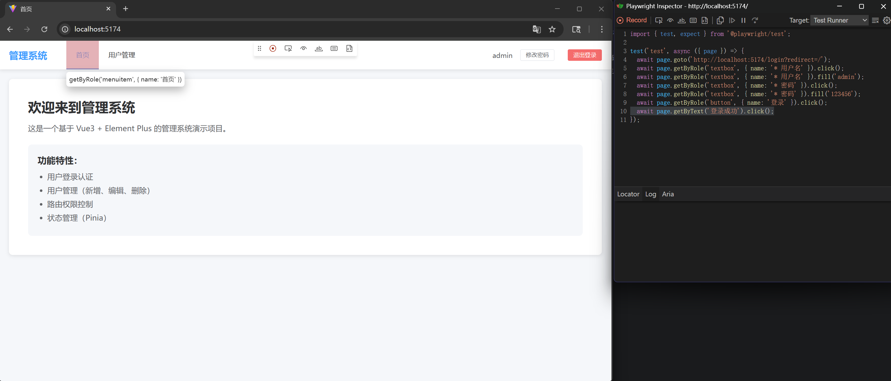
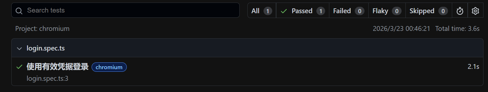

# Web自动化测试

> 首发于 2026-03-23

## Web测试基本原则

### 测试金字塔原则

理想的Web应用测试组合应该遵循金字塔结构：

- 底层：单元测试，测试函数、自定义钩子、基础组件等小块逻辑，占测试总量的70%左右
- 中层：集成测试，确保组件、API、Store、路由等良好协同工作，占测试总量的20%左右
- 顶层：E2E测试，覆盖最重要的用户业务流程，占测试总量的10%左右



### 编写Web自动化测试用例的原则

#### E2E测试原则

- 核心聚焦：E2E测试用例一般只实现核心业务流程或者重复执行率较高的功能
- 正向验证：选择以正向逻辑的验证为主
- 合理选择：不是所有手工用例都可以使用自动化测试来执行
- 无依赖设计：每个测试用例可以独立运行，尽量减少多个用例脚本之间的依赖
- 状态恢复：E2E测试用例执行完毕之后，一般需要回归原点

#### 单元测试原则

单元测试运行在内存中，速度极快（毫秒级）。编写核心是“**逻辑全覆盖**”和“**隔离性**”。

**逻辑全覆盖**

- 不同于E2E只测“正向逻辑”，单元测试必须关注边界值。
- 必须关注**异常流**（如“用户名为空时是否抛出错误”，“接口调用失败是否有错误处理机制”）。

**隔离性**

- 不要测真实数据库：单元测试中不应真的去调用API接口。必须使用 Mock技术虚拟这些外部依赖。


#### 集成测试原则

集成测试介于E2E测试和单元测试之间，它关注的是**模块间的接口契约**和**数据流转**。

- ✅ 组件集成测试：父子组件通信、组件生命周期
- ✅ Hook集成测试：多Hook协同、副作用
- ✅ 状态管理集成测试：Redux/Pinia的数据流+UI同步
- ✅ 路由集成测试：页面跳转、路由守卫、参数传递
- ✅ 表单集成测试：多字段联动、验证、提交
- ✅ 数据获取集成测试：Loading/Error/Success状态循环
- ✅ DOM交互集成测试：用户操作触发的连锁反应
- ❌ 不测：单个函数的逻辑（这是单元测试的事）
- ❌ 不测：完整用户点击流程（这是E2E的事）


#### 总结

下表对各个测试层级应该测什么东西进行了总结：

| 测试层级 | 测试对象 | 典型示例 |
| :--- | :--- | :--- |
| **单元测试** | Utility 函数、Composable 逻辑、Class 类、展示型组件 | `formatDate()`, `calculateTax()`, `<Button />`, `<Card />`, `<EmptyState />` |
| **集成测试** | 容器型组件、页面、路由、状态管理、数据获取 | `<LoginForm />`, `<UserTable />`, `Router`, `Store`, `Mock API` |
| **E2E 测试** | 完整应用流程 | 从登录到添加设备的全流程 |

## 实践方案架构

### React生态

```
React 测试工具栈
├─────────────────────────────────────────────────────────────
│                     E2E 层                                  
│  Playwright (推荐) / Cypress / TestCafe                     
├─────────────────────────────────────────────────────────────
│                   集成测试层                                 
│  ├─ 组件渲染: @testing-library/react                        
│  ├─ 用户行为: @testing-library/user-event                    
│  ├─ API Mock: MSW (Mock Service Worker)                     
│  ├─ 状态管理:                                                
│  │   ├─ Redux Toolkit + React Testing Library               
│  │   ├─ Zustand + testing-library                           
│  │   └─ Context + RTL                                       
│  ├─ 数据获取:                                                
│  │   ├─ React Query + MSW                                   
│  │   └─ SWR + MSW                                           
│  └─ 路由: react-router-dom + MemoryRouter + RTL              
├─────────────────────────────────────────────────────────────
│                   单元测试层                                  
│  ├─ 测试运行器: Vitest / Jest                               
│  ├─ 断言库: Vitest 内置 (兼容 Jest API)                       
│  ├─ DOM环境: happy-dom (推荐) / jsdom                         
│  ├─ 纯函数测试: Vitest + @tsd (TypeScript类型测试)             
│  └─ Hook测试: @testing-library/react (renderHook)            
└─────────────────────────────────────────────────────────────
```

### Vue生态

```
Vue 测试工具栈
├─────────────────────────────────────────────────────────────
│                     E2E 层                                   
│  Playwright (推荐) / Cypress / Nightwatch                   
├─────────────────────────────────────────────────────────────
│                   集成测试层                                  
│  ├─ 组件渲染: @vue/test-utils                                
│  ├─ 用户行为: @testing-library/user-event                    
│  ├─ API Mock: MSW (Mock Service Worker)                      
│  ├─ 状态管理:                                                
│  │   ├─ Pinia + createPinia (测试工厂函数)                   
│  │   └─ Vuex + createLogger                                  
│  ├─ 路由: vue-router + createMemoryHistory                  
│  ├─ 组合式API:                                                
│  │   ├─ @vueuse/core (useCounter, useFetch)                  
│  │   └─ @vue/devtools                                       
│  └─ 数据获取: VueUse + MSW                                   
├─────────────────────────────────────────────────────────────
│                   单元测试层                                  
│  ├─ 测试运行器: Vitest / Jest                                
│  ├─ 断言库: Vitest 内置                                      
│  ├─ DOM环境: happy-dom (推荐) / jsdom                        
│  ├─ 纯函数测试: Vitest + @tsd                                
│  └─ Composable测试: @vue/test-utils + renderHook             
└─────────────────────────────────────────────────────────────
```

## 实操案例

> 以 Vue3 项目为例，展示如何使用测试工具栈进行Web自动化测试。

### 1 创建项目

```bash
pnpm create vite
```

```
PS D:\Code> pnpm create vite
...
│
◇  Project name:
│  vue3-test-demo
│
◇  Select a framework:
│  Vue
│
◇  Select a variant:
│  TypeScript
│
◇  Use rolldown-vite (Experimental)?:
│  No
│
◇  Install with pnpm and start now?
│  Yes
```

初始化 Git 仓库

```bash
git init
```

### 2 安装Vitest

```bash
pnpm add -D vitest
```

```
PS D:\Code\vue3-test-demo> pnpm add -D vitest
...
devDependencies:

+ vitest 4.0.18
```

在 `package.json` 中添加测试脚本：

```json
{
  "scripts": {
    "test": "vitest"
  }
}
```

修改 `vite.config.ts` 配置文件，如下所示是官方推荐做法，与 vite 的配置放在一起：

```typescript
/// <reference types="vitest/config" />
import { defineConfig } from 'vite'
import vue from '@vitejs/plugin-vue'

// https://vite.dev/config/
export default defineConfig({
  plugins: [vue()],
  test: {
    environment: 'happy-dom',
    coverage: {
      provider: 'v8' // or 'istanbul'
    },
  },
})
```

### 3 配置项目

引入 `element-plus` 组件库和 `vue-router`，如下所示：

```bash
pnpm add element-plus

pnpm add vue-router
```

再开发几个基础页面，方便后面测试使用。

代码太多不贴了，直接看 github 仓库：[vue3-test-demo](https://github.com/EagleClark/vue3-test-demo)。

下面是几个截图用于展示项目大致功能，就是一个极简的带登录的用户管理系统，该项目代码为AI生成。









### 4 编写单元测试用例与集成测试用例

其实最开始我在写这篇文章的时候想的是几种单元测试和几种集成测试分为举例去写对应的实战案例，但是AI时代我觉得没有必要搞这么复杂了，毕竟这么多测试用例我用AI一把就生成了，所以这里我就打算简单聊一下几种测试用例的概念，至于具体写法我觉得在AI时代真的不用太关注了，因为去关注那些细节太复杂了，这也是为什么我们在平时业务开发中很少去写测试用例的原因之一，因为实在成本高，可以结合[代码](https://github.com/EagleClark/vue3-test-demo/tree/main/tests)体会一下。

如果现在去开发一个功能，我想我会让AI先生成业务代码，再让它生成测试用例代码，而我只需要Check就行了。

下面简单介绍一下几种测试用例的概念：

**单元测试：**

1. 函数级单元测试：对代码中最小独立逻辑单元（函数 / 方法）进行测试，无外部依赖，只验证输入输出、边界条件、异常处理。
2. 组件级单元测试：对 Web 应用中的单个 UI 组件独立测试，小组件，只验证组件自身渲染、属性传参、事件响应、状态变化，不依赖页面、路由、接口、其他组件。

**集成测试：**

1. 组件集成测试：测试多个组件之间组合、嵌套、联动是否正常，验证父子组件通信、插槽、共享状态、事件传递等跨组件交互是否符合预期。
2. 路由集成测试：验证应用路由系统的行为是否正确。包括路由跳转、参数传递、路由守卫、权限控制、页面匹配、重定向等整体流程。
3. 状态管理集成测试：对全局状态（如 Vuex/Pinia/Redux）进行多模块、多操作联动测试。验证状态更新、异步 action、模块化状态、状态持久化、状态跨组件共享是否正常。
4. API 集成测试：测试前端 / 后端与真实或模拟接口的交互流程。包括请求发送、参数处理、响应解析、异常处理、重试、缓存、数据格式正确性。
5. 可访问性集成测试：从整体应用层面验证可访问性（a11y）是否达标。包括键盘导航、屏幕阅读器兼容、语义化标签、颜色对比度、焦点管理等是否符合规范。
6. 性能集成测试：在集成环境下对页面 / 功能的整体性能表现进行测试。包括加载速度、渲染耗时、内存占用、长任务、卡顿、包体积、接口响应等综合指标。

为什么要在实操环境废话一堆概念呢，其实这些概念就是提示词，结合前面的方案架构。

比如：我要写一个 API 集成测试，那么我的提示词就可以是“写一下xx文件的API集成测试用例，API数据Mock使用MSW (Mock Service Worker)，注意异常处理，结合API文档（给个路径）”。

生成完用例就可以执行 `pnpm test` 看效果了，也可以执行 `pnpm vitest run --coverage` 查看测试覆盖率。

### 5 编写E2E测试用例

我这里选择[Playwright`](https://playwright.dev/)来做E2E测试。基础使用方法如下：

```bash
# 引入工具
pnpm create playwright

# 启动测试
pnpm exec playwright test

# UI交互模式启动测试
pnpm exec playwright test --ui

# 测试特定浏览器
pnpm exec playwright test --project=chromium

# debug模式启动测试
pnpm exec playwright test --debug

# 测试特定用例文件
pnpm exec playwright test example

# 启动测试代码生成器，录制操作
pnpm exec playwright codegen

# 查看测试报告
pnpm exec playwright show-report
```

如果需要对E2E进行配置，则需要修改 `playwright.config.ts`，具体配置不在此展开，需要直接查[文档](https://playwright.dev/docs/test-configuration)即可。

E2E测试用例，传统的开发方式往往是要先去学习 playwright 的各种操控浏览器和DOM元素的API的，然后再去页面上到处扒DOM元素，所以 E2E 测试用例编写的成本是比较高的。

但是现在有了 AI，就可以大大提高 E2E 测试用例的开发效率。

#### 开发流程



至于为什么要这么干，见下表：

| 工具 / 环节        | 优势                                                         | 短板                                                         |
| ------------------ | ------------------------------------------------------------ | ------------------------------------------------------------ |
| Playwright Codegen | 自动录制用户操作，0 代码基础也能生成可运行脚本               | 生成的代码冗余（含无关操作）、无容错 / 封装、硬编码（如固定等待时间） |
| Playwright SKILL     | 智能优化代码（精简逻辑、补异常处理）、规范化写法、解释代码逻辑 | 无法凭空生成「贴合具体操作路径」的脚本                       |

#### SKILL配置

[Playwright SKILL官方地址](https://github.com/microsoft/playwright-cli) 可以下载使用。

我这里使用[https://skills.sh/](https://skills.sh/)安装这个SKILL：

```bash
npx skills add https://github.com/microsoft/playwright-cli --skill playwright-cli
```

#### Codegen生成脚本

直接执行 `pnpm exec playwright codegen`，弹出操作界面，进行正常操作即可，如下图所示：



`login.spec.ts`

```ts
import { test, expect } from '@playwright/test';

test('test', async ({ page }) => {
  await page.goto('http://localhost:5174/login?redirect=/');
  await page.getByRole('textbox', { name: '* 用户名' }).click();
  await page.getByRole('textbox', { name: '* 用户名' }).fill('admin');
  await page.getByRole('textbox', { name: '* 密码' }).click();
  await page.getByRole('textbox', { name: '* 密码' }).fill('123456');
  await page.getByRole('button', { name: '登录' }).click();
  await page.getByText('登录成功').click();
});
```

可以看到生成的脚本确实不太规范，也没有断言，根本不是有效的测试用例。

#### SKILL优化测试用例

直接显式调用，如下图所示：


优化后，如果代码有报错，直接让AI继续修复即可。

新的测试用例已经可以正常执行，建议在生成测试用例的提示词里面可以增加一些限制，比如：限制测试用例描述的语言、要根据现有操作进行测试用例补全不要自由发挥等。

新的测试用例如下：

```ts
import { test, expect } from '@playwright/test';

test('使用有效凭据登录', async ({ page }) => {
  await page.goto('http://localhost:5174/login');

  await page.getByRole('textbox', { name: '* 用户名' }).fill('admin');
  await page.getByRole('textbox', { name: '* 密码' }).fill('123456');
  await page.getByRole('button', { name: '登录' }).click();

  await expect(page.getByText('登录成功')).toBeVisible();
});
```

执行成功，如下图所示：



#### E2E 测试用例编写注意事项

##### 1 关于选择器的使用

编写用例的时候要“像用户一样测试”，你的选择器（Selectors）应该反映用户如何与页面交互，而不是反映代码如何实现页面。

我们要尽量避免使用 id 选择器，虽然 id 在 HTML 规范中应该是唯一的，且在传统 Selenium 测试中被广泛使用。但在现代前端开发和 Playwright 的最佳实践中，它通常不是首选，原因如下：

1. 耦合了实现细节：id 往往是开发人员为了方便样式编写或逻辑绑定随意命名的，如果代码重构、更换UI库等，测试就会立即实现，即使用户看到的功能和界面完全没变化，这会导致测试变得脆弱。
2. 在现代框架或库（React, Vue, Angular）中，id 多是动态生成的（开发者大多数情况下根本不写），每次重新渲染或部署，id 可能就变了，而且这些 id 通常缺乏语义化，比如：id="Device-232"
3. id 的使用、修改应该由开发者完全控制，如果实在要增加测试用的 id 可以增加类似“data-testid”这样的属性。

选择器使用优先级从高到低依次为：

- getByRole()：查找具有特定角色（如 button, link, checkbox, heading）的元素
- getByLabel()：查找表单控件关联的 `<label>` 文本。
- getByPlaceholder()：查找输入框的占位符文本。
- getByText()：查找包含特定文本的元素。
- getByAltText() / getByTitle()：针对图片 (``) 或带有 title 提示的元素。
- getByTestId()：查找带有特定 `data-testid` 属性的元素。
- 传统选择器：CSS选择器、XPath。

##### 2 不要使用硬编码等待 (sleep)

Playwright 的断言和操作（如 click, fill, expect）内置了自动等待。它们会轮询直到元素满足条件（可见、可操作）或超时。

不要使用 `await page.waitForTimeout(5000)`。

如果必须等待特定状态，使用 await page.waitForLoadState('networkidle') 或 await expect(locator).toBeVisible()。

##### 3 测试用户行为，而非内部状态

- 不要测试“变量是否为 true”，要测试“页面上是否显示了成功消息”。
- 不要测试“函数是否被调用”，要测试“点击后是否跳转到了新页面”。

##### 4 保持测试独立性 (Isolation)

每个测试用例应该是独立的。利用 beforeEach 创建全新的 BrowserContext（相当于无痕模式），确保每个测试都有干净的 Cookie、LocalStorage 和会话，互不干扰。

##### 5 使用 Page Object Model (POM) 模式

将页面元素定位和操作封装成类，避免在测试脚本中重复写 page.locator(...)。当页面结构变化时，只需修改 POM 类，无需修改所有测试用例。

#### Playwright 对比 Agent-browser

Playwright的适用场景：

- 正规 E2E 测试、回归测试、CI/CD 集成
- 复杂业务流程、断言多、需要稳定可复现
- 网络拦截、Mock、多浏览器 / 设备、并行执行
- 团队协作、版本管理、可维护性优先

Agent-browser的适用场景：

- AI Agent 控制浏览器（自然语言 / 简单指令）
- 快速抓取、简单点击填表、轻量自动化
- 想少写代码、降低 LLM Token 消耗
- 原型验证、个人小脚本

Playwright写的测试用例稳定性高，可调试、可复现、适合生产级。

Agent Browser写的测试用例稳定性一般，依赖 AI 识别，偶发不稳定，尤其复杂场景难以维护。
