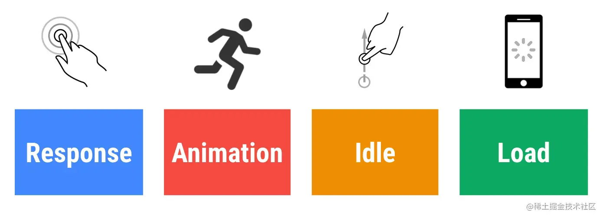
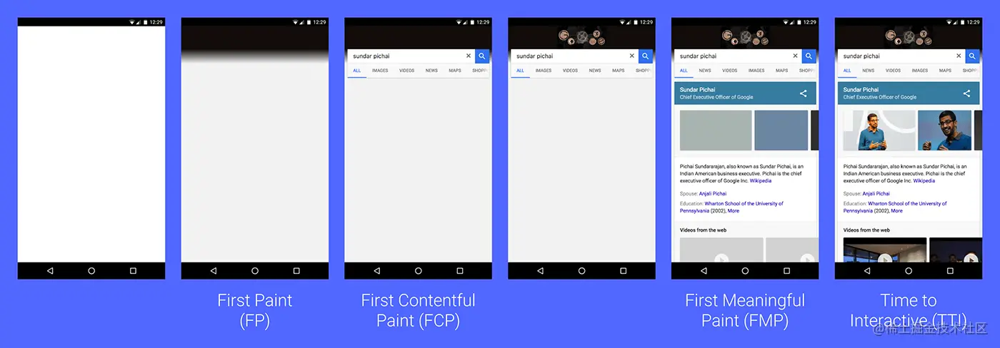
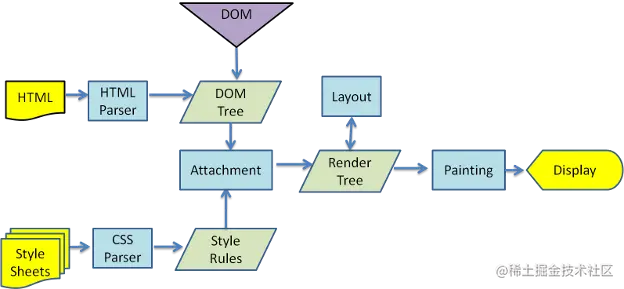
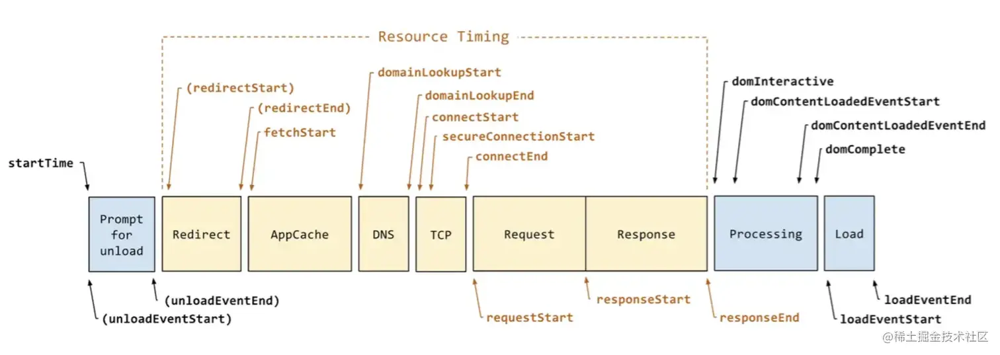
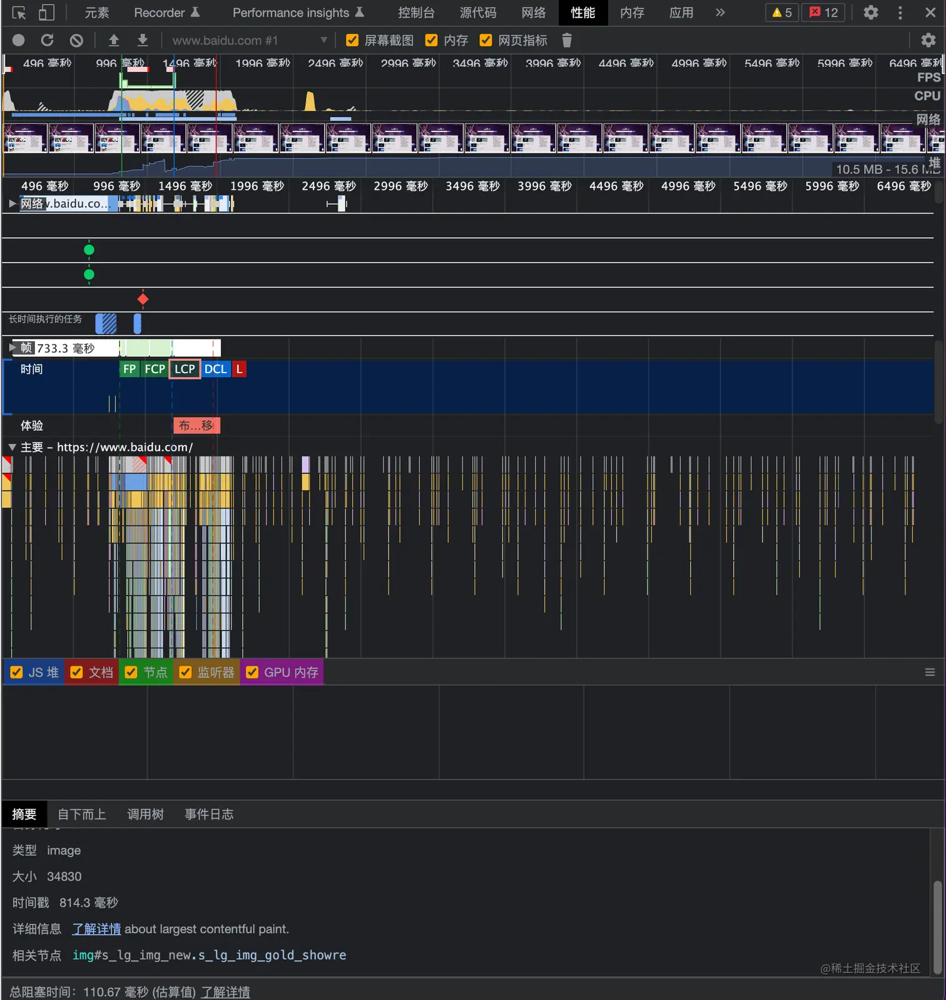
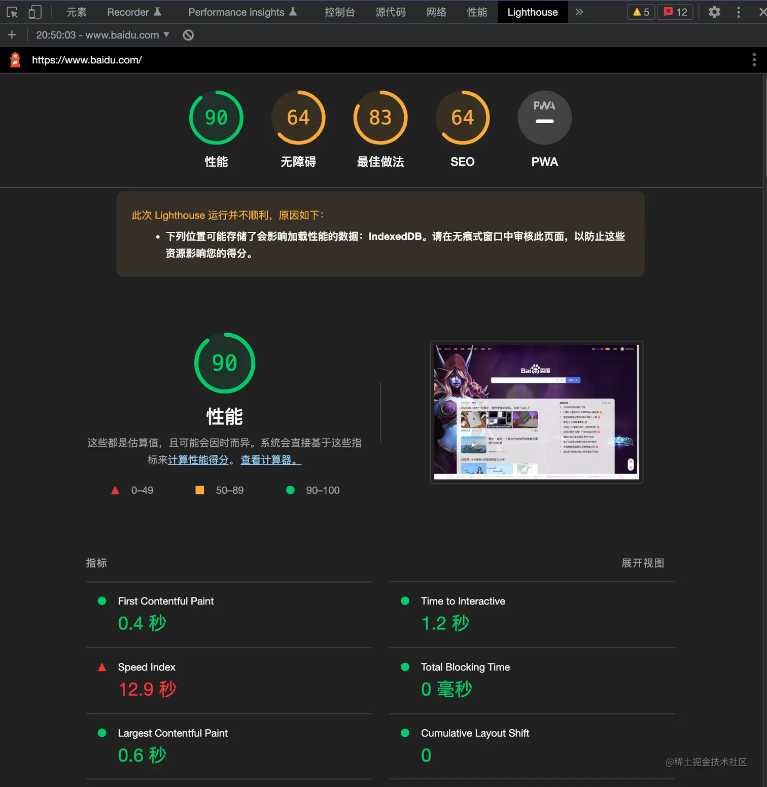
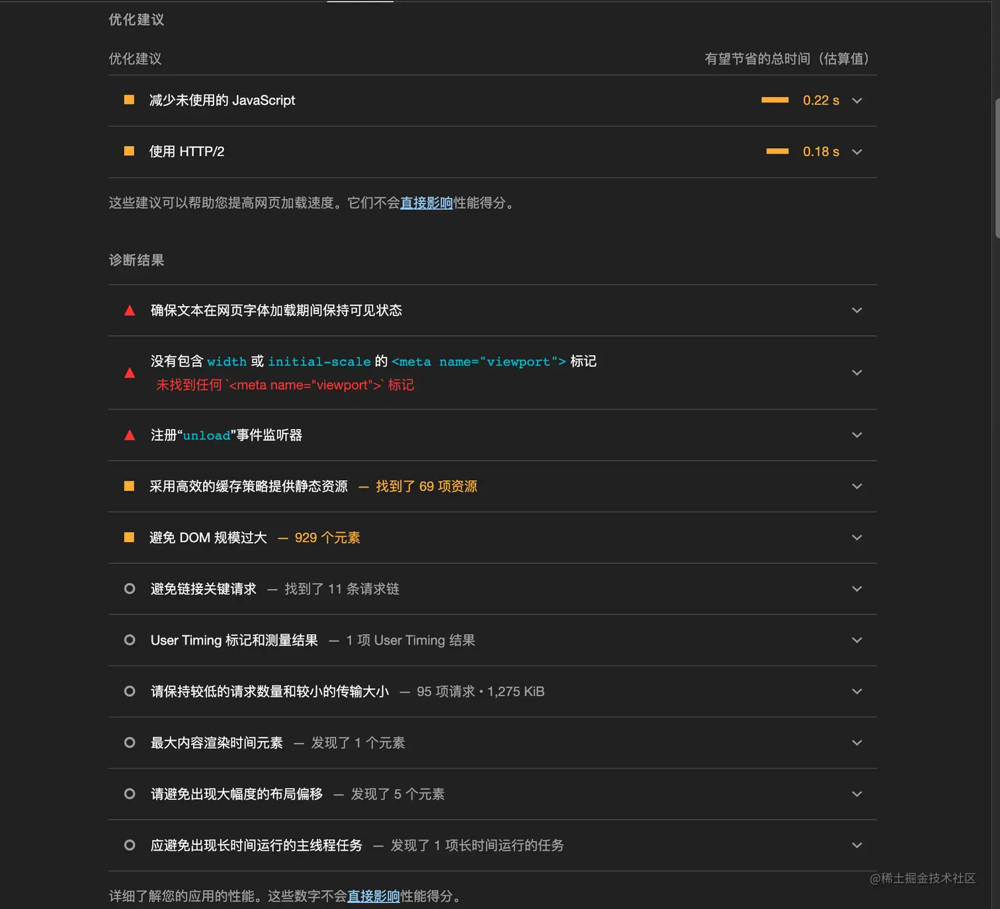
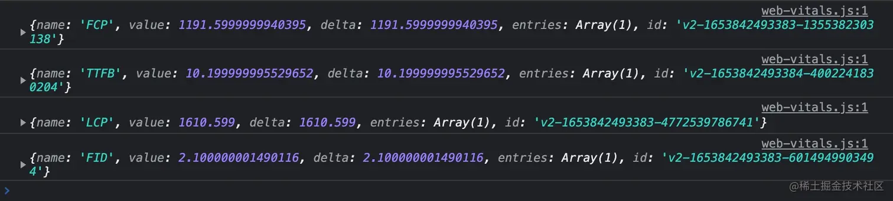

# 浅谈前端性能指标

> 首发于：2022-06-02

## 前端性能如何衡量

前端性能应该如何来衡量呢，其实这个问题 Google 的开发者早就提出了一个 `RAIL 模型` 来解决这个问题。

`RAIL` 是 `Response`、`Animation`、`Idle` 和 `Load` 的首字母缩写，由 Google Chrome 团队于2015年提出的性能模型，用于提升浏览器内的用户体验和性能。




`RAIL` 把交互分为四个阶段：页面加载、空闲、响应用户输入、滚动和动画。按首字母缩写顺序，其主要原则是：

- **响应**：应该尽可能快速的响应用户，应该在 100ms 或者 100ms 以内响应用户输入。
- **动画**：在展示动画的时候，每一帧应该以 16ms 进行渲染，这样可以保持动画效果的一致性，并且避免卡顿。
- **空闲**：当使用 JavaScript 主线程的时候，应该把任务划分到执行时间小于 50ms 的片段中去，这样可以释放线程以进行用户交互。
- **加载**：应该在小于 1s 的时间内加载完成你的网站，并可以进行用户交互。

## 前端衡量性能的指标

过去通常会使用 FP、FCP、FMP、TTI 等指标来衡量前端的性能，如下图所示：



但是随着前端的发展，现在越来越多地使用 `LCP`、`FID`、`CLS` 等来作为指标衡量前端的性能。下面我将一一对前面提到的以及没有提到的一些指标进行一个简介。

### FP

`First Paint` 首次绘制，指浏览器从开始请求网站内容（导航阶段）到首次向屏幕绘制像素点的时间，刚到 `Painting` 阶段（如下图所示），所以 `FP` 也可以理解为是白屏时间。




`FP` 的获取方法：

```typescript
// 此方法如果执行时机过早可能会报错
window.performance.getEntriesByType('paint')[0].startTime
```

```typescript
// 更推荐使用 Promise 封装获取
const observerWithPromise = new Promise<PerformanceObserverEntryList>((resolve, reject) => {
  new PerformanceObserver(resolve).observe({
    entryTypes: ['paint'],
  });
});
    
observerWithPromise
  .then(entryList => {
    return entryList.getEntries().filter(entry => {
      return entry.name === 'first-paint';
    })[0];
  })
  .then(entry => console.log(entry.startTime));
```

### FCP

`First Contentful Paint`，首次内容绘制，指浏览器渲染出第一个内容的时间，内容可以是文本、img标签、SVG元素等，但是不包括 iframe 和白色背景的 Canvas  元素。详见 [First Contentful Paint 首次内容绘制 (FCP) (web.dev)](https://web.dev/i18n/zh/fcp/)。

`FCP` 通常和 `FP` 非常相近，一般来说，`FCP >= FP` 。

`FCP` 的获取方法与 `FP` 相似：

```typescript
// 此方法如果执行过早可能会报错
window.performance.getEntriesByType('paint')[1].startTime
```

```typescript
// 更推荐使用 Promise 封装获取
const observerWithPromise = new Promise<PerformanceObserverEntryList>((resolve, reject) => {
  new PerformanceObserver(resolve).observe({
    entryTypes: ['paint'],
  });
});
    
observerWithPromise
  .then(entryList => {
    return entryList.getEntries().filter(entry => {
      return entry.name === 'first-contentful-paint';
    })[0];
  })
  .then(entry => console.log(entry.startTime));
```

`FCP` 时间如果在 0-1.8 秒之间就是一个比较优秀的指标；1.8-3.0 秒之间就比较中等了，稍微有点儿慢；超过 3 秒就是非常慢了。

### FMP

`First Meaning Paint`，首次关键内容绘制，指浏览器渲染出第一个关键内容的时间。不过“关键内容”是难有一个明确定义的，根据应用不同其关键内容也是不一样的。

比如：一个技术博客，其中间的文章部分就是它的关键内容；一个视频播放页面，其视频播放器是关键内容；一个电商网站，其商品列表或者详情才是关键内容。

`FMP` 通常也被用来衡量**首屏时间**。不过 `FMP` 的计算过于复杂，所以无法使用 API 直接获取，就算计算出来了也不一定就准确，所以连 `Lighthouse` 在 **6.0** 版本之后都不再计算这个指标了，取而代之的是 `LCP`。

### LCP

`Largest Contentful Paint`，最大内容绘制，指可视区内容最大的可见元素出现在屏幕上的时间，**衡量加载性能的核心指标**。

`LCP` 获取方法：

```typescript
const observerWithPromise = new Promise<PerformanceObserverEntryList>((resolve, reject) => {
    new PerformanceObserver(resolve).observe({
      entryTypes: ['largest-contentful-paint'],
    });
  });
  observerWithPromise
    .then(entryList => {
      const entries = entryList.getEntries();
      const lastEntry = entries[entries.length - 1];
      console.log(lastEntry.startTime);
    });
```

`LCP` 的计算其实也有很多需要注意的地方，详见 [Largest Contentful Paint 最大内容绘制 (LCP) (web.dev)](https://web.dev/i18n/zh/lcp/)。

`LCP` 时间如果在 0-2.5 秒之间就是一个比较优秀的指标；2.5-4 秒之间就比较中等了，稍微有点儿慢；超过 4 秒就是非常慢了。

### TTI

`Time to Interactive`，可交互时间，该指标用于测量页面从开始加载到主要子资源完成渲染，并能够快速、可靠地响应用户输入所需的时间。简单的讲，`TTI` 是安静窗口之前最后一个[长任务](https://web.dev/custom-metrics/#long-tasks-api)（超过 50 毫秒的任务）的结束时间（如果没有找到长任务，则与 FCP 值相同）。

`TTI` 的具体定义见 [Time to Interactive 可交互时间 (TTI) (web.dev)](https://web.dev/i18n/zh/tti/)。

`TTI` 的测算建议使用 `Lighthouse`。

虽然 `TTI` 可以在实际情况下进行测量，但我们不建议这样做，因为用户交互会影响您网页的 `TTI`，从而导致您的报告中出现大量差异。如需了解页面在实际情况中的交互性，您应该测量 `FID`。

`TTI` 时间如果在 0-3.8 秒之间就是一个比较优秀的指标；3.9-7.3 秒之间就比较中等了，稍微有点儿慢；超过 7.3 秒就是非常慢了。

### FID

First Input Delay ，首次输入延迟，测量从用户第一次与页面交互（例如当他们单击链接、点按按钮或使用由 JavaScript 驱动的自定义控件）直到浏览器对交互作出响应，并实际能够开始处理事件处理程序所经过的时间，`FID` 是**衡量交互性的核心指标**。详见 [First Input Delay 首次输入延迟 (FID) (web.dev)](https://web.dev/i18n/zh/fid/)。

`FID` 的计算：

```typescript
const observerWithPromise = new Promise<PerformanceObserverEntryList>((resolve, reject) => {
    new PerformanceObserver(resolve).observe({
      entryTypes: ['first-input'],
    });
  });
  observerWithPromise
    .then(entryList => {
      for (const entry of entryList.getEntries()) {
        // eslint-disable-next-line no-undef
        const delay = (entry as PerformanceEventTiming).processingEnd - entry.startTime;
        console.log(delay);
      }
    });
```

`FID` 时间如果在 0-100 毫秒之间就是一个比较优秀的指标；100-300 毫秒之间就比较中等了，稍微有点儿慢；超过 300 毫秒就是非常慢了。

### TBT

`Total Blocking Time`，总阻塞时间，指 `FCP` 与 `TTI` 之间的总时间，这期间，主线程被阻塞的时间过长，无法做出输入响应。任务持续时间小于 50 毫秒的阻塞时间记为 0，超过 50 毫秒的任务阻塞时间就是这个任务执行的时间减去 50 毫秒得到的时间，一个页面的总阻塞时间是在 FCP 和 TTI 之间发生的每个长任务（超过 50 毫秒的任务）的阻塞时间总和。

详见 [Total Blocking Time 总阻塞时间 (TBT) (web.dev)](https://web.dev/i18n/zh/tbt/)。

`TBT` 的测算建议使用 `Lighthouse`。

`TBT` 时间如果在 0-200 毫秒之间就是一个比较优秀的指标；200-600 毫秒之间就比较中等了，稍微有点儿慢；超过 600 毫秒就是非常慢了。

### CLS

`Cumulative Layout Shift`，累积布局偏移，测量整个页面生命周期内发生的所有意外布局偏移中最大一连串的布局偏移分数。

```
布局偏移分数 = 影响分数 * 距离分数
```

上面的这样的描述可能有点儿抽象，简单的讲就是页面因为一些动态改变的 DOM 或者一些异步的资源加载，导致页面元素发生了位移，这样就会让用户找不到先前阅读的位置或者点击到不期望点击的地方。

详见 [Cumulative Layout Shift 累积布局偏移 (CLS) (web.dev)](https://web.dev/i18n/zh/cls/)。

`CLS` 是**衡量视觉稳定性的核心指标**。

`CLS` 的计算：

```typescript
let clsValue = 0;
let clsEntries = [];

let sessionValue = 0;
let sessionEntries: PerformanceEntry[] = [];
const observerWithPromise = new Promise<PerformanceObserverEntryList>((resolve, reject) => {
  new PerformanceObserver(resolve).observe({
    entryTypes: ['layout-shift'],
  });
});
observerWithPromise
  .then(entryList => {
    for (const entry of entryList.getEntries()) {
      // 只将不带有最近用户输入标志的布局偏移计算在内。
      // @ts-ignore
      if (!entry.hadRecentInput) {
        const firstSessionEntry = sessionEntries[0];
        const lastSessionEntry = sessionEntries[sessionEntries.length - 1];

        // 如果条目与上一条目的相隔时间小于 1 秒且
        // 与会话中第一个条目的相隔时间小于 5 秒，那么将条目
        // 包含在当前会话中。否则，开始一个新会话。
        if (sessionValue &&
            entry.startTime - lastSessionEntry.startTime < 1000 &&
            entry.startTime - firstSessionEntry.startTime < 5000) {
          // @ts-ignore
          sessionValue += entry.value;
          sessionEntries.push(entry);
        } else {
          // @ts-ignore
          sessionValue = entry.value;
          sessionEntries = [entry];
        }

        // 如果当前会话值大于当前 CLS 值，
        // 那么更新 CLS 及其相关条目。
        if (sessionValue > clsValue) {
          clsValue = sessionValue;
          clsEntries = sessionEntries;

          // 将更新值（及其条目）记录在控制台中。
          console.log('CLS:', clsValue, clsEntries);
        }
      }
    }
  });
```

`CLS` 如果在 0-0.1 之间就会有一个比较好的稳定性；0.1-0.25 之间就比较中等了；超过 0.25 就是非常不稳定了。

### SI

`Speed Index`，首屏展现平均值，这是 `Lighthouse` 的六项性能指标之一。

详见 [Speed Index (web.dev)](https://web.dev/speed-index/)。

`SI` 的测算建议使用 `Lighthouse`。

`SI` 时间如果在 0-3.4 秒之间就是一个比较优秀的指标；3.4-5.8 秒之间就比较中等了，稍微有点儿慢；超过 5.8 秒就是非常慢了。

### TTFB

`Time to First Byte`，表示浏览器请求资源到响应第一个字节回来的时间。它有助于识别 web 服务器响应请求的速度。在导航并请求 HTML 文件的时候就发生了，它先于所有其他有意义的加载性能指标。

详见 [Time to First Byte (TTFB) (web.dev)](https://web.dev/ttfb/)。

下图就是 `TTFB` 的一个图解：



以上信息可以通过 `performance API` 获取：

```typescript
window.performance.timing;
```

或者

```typescript
const observerWithPromise = new Promise<PerformanceObserverEntryList>((resolve, reject) => {
    new PerformanceObserver(resolve).observe({
      entryTypes: ['navigation'],
    });
  });
  observerWithPromise
    .then(entryList => {
      const [pageNav] = entryList.getEntriesByType('navigation');
      console.log(pageNav);
    });
```

下面按照各个时间节点的顺序一一做一下说明，参考 [PerformanceTiming - Web API 接口参考 | MDN (mozilla.org)](https://developer.mozilla.org/zh-CN/docs/Web/API/PerformanceTiming)：

- startTime：请求开始时间，返回 0
- unloadEventStart：等于用户代理程序开始前一个文档的卸载事件之前的时间
- unloadEventEnd：等于用户代理程序完成前一文档的卸载事件之后的时间
- redirectStart：重定向开始时间的时间戳，没发生则为 0
- redirectEnd：重定向完成时间的时间戳，没发生则为 0
- fetchStart：表征了浏览器准备好使用 HTTP 请求来获取(fetch)文档的时间戳，这个时间点会在检查任何应用缓存之前
- domainLookupStart：是一个无符号long long 型的毫秒数，表征了域名查询开始的UNIX时间戳。如果使用了持续连接(persistent connection)，或者这个信息存储到了缓存或者本地资源上，这个值将和 `PerformanceTiming.fetchStart` 一致。
- domainLookupEnd：是一个无符号long long 型的毫秒数，表征了域名查询结束的UNIX时间戳。如果使用了持续连接(persistent connection)，或者这个信息存储到了缓存或者本地资源上，这个值将和 `PerformanceTiming.fetchStart` 一致。
- connectStart：请求连接被发送到网络之时的Unix毫秒时间戳。如果传输层报告错误并且连接的建立重新开始，则把最后建立连接的开始时间作为该值。如果一个持久连接被使用，则该值与 `PerformanceTiming.fetchStart` 相同。
- secureConnectionStart：为安全连接握手开始的时刻的 Unix毫秒时间戳。如果只要你过的连接没有被请求，则它返回 0。
- connectEnd：代表了网络链接建立的时间节点。如果传输层报告了错误或者链接又被重新建立，则采用最后一次链接建立的时间。如果链接是长久的，那么这个值等同于 `PerformanceTiming.fetchStart`。链接被认为打开以所有的链接握手，SOCKS认证结束为标志。
- requestStart：为浏览器发送从服务器或者缓存获取实际文档的请求之时的 Unix毫秒时间戳。如果传输层在请求开始之后发生错误并且连接被重新打开，则该属性将会被设定为新的请求的相应的值 。
- responseStart：为浏览器从服务器、缓存或者本地资源接收到响应的第一个字节之时的 Unix毫秒时间戳。
- responseEnd：为浏览器从服务器、缓存或者本地资源接收响应的最后一个字节或者连接被关闭之时的 Unix毫秒时间戳。
- domInteractive：为在主文档的解析器结束工作，即 `Document.readyState` 改变为 `'interactive'` 并且相当于 `readystatechange (en-US)` 事件被触发之时的 Unix毫秒时间戳。
- domContentLoadedEventStart：为解析器发出 `DOMContentLoaded` 事件之前，即所有的需要被运行的脚本已经被解析之时的 Unix毫秒时间戳。
- domContentLoadedEventEnd：这个时刻为所有需要尽早执行的脚本不管是否按顺序，都已经执行完毕，即 DOM Ready
- domComplete：为主文档的解析器结束工作，`Document.readyState` 变为 `'complete'且相当于` `readystatechange` 事件被触发时的 Unix毫秒时间戳。
- loadEventStart：为 `load` 事件被现在的文档触发之时的 Unix时间戳。如果这个事件没有被触发，则他返回 `0。`
- loadEventEnd：为 `load` 事件处理程序被终止，加载事件已经完成之时的 Unix毫秒时间戳。如果这个事件没有被触发，或者没能完成，则该值将会返回0。

通过上面的这些信息我们可以做一些加载指标的计算：

| 指标             | 计算公式                                | 备注           |
| ---------------- | --------------------------------------- | -------------- |
| 页面加载总时间   | loadEventEnd - startTime                | onload事件触发 |
| DNS解析时间      | domainLookupEnd - domainLookupStart     |                |
| TCP连接耗时      | connectEnd - connectStart               |                |
| SSL连接耗时      | connectEnd - secureConnectionStart      | https 协议才有 |
| 网路请求耗时     | responseStart - requestStart            |                |
| 数据传输耗时     | responseEnd-responseStart               |                |
| DOM解析耗时      | domContentLoadedEventEnd - responseEnd  |                |
| 资源加载耗时     | loadEventEnd - domContentLoadedEventEnd |                |
| 页面渲染耗时     | loadEventEnd - responseEnd              |                |
| 页面完全加载时间 | loadEventEnd - startTime                |                |
| HTML加载完时间   | responseEnd - startTime                 |                |
| 首次可交互时间   | domInteractive - startTime              |                |


## 指标的测量方法

### Chrome Performance

Chrome 的 Performance 页签算是最基础的性能测试工具了，但是其只是给出了部分指标，像 `FID`、`CLS` 这样的核心指标无法在此获得。



### Lighthouse

[Lighthouse](https://chrome.google.com/webstore/detail/lighthouse/blipmdconlkpinefehnmjammfjpmpbjk) 是一个 Chrome 插件，可以帮助我们很好地测量页面的性能指标，顺手测了一下百度的指标，如下图所示：





不仅给出指标，还会给出优化建议，可以说是非常良心了。

### web-vitals

不知道大家有没有发现，`React` 脚手架创建的项目里面就有这个东西：

`reportWebVitals.ts`

```typescript
import { ReportHandler } from 'web-vitals';

const reportWebVitals = (onPerfEntry?: ReportHandler) => {
  if (onPerfEntry && onPerfEntry instanceof Function) {
    import('web-vitals').then(({ getCLS, getFID, getFCP, getLCP, getTTFB }) => {
      getCLS(onPerfEntry);
      getFID(onPerfEntry);
      getFCP(onPerfEntry);
      getLCP(onPerfEntry);
      getTTFB(onPerfEntry);
    });
  }
};

export default reportWebVitals;
```

`index.tsx`

```typescript
import ReactDOM from 'react-dom';
import 'antd/dist/antd.less';
import App from './App';
import reportWebVitals from './reportWebVitals';
import { HashRouter } from 'react-router-dom';

ReactDOM.render(
  <HashRouter>
    <App/>
  </HashRouter>,
  document.getElementById('root'),
);

// If you want to start measuring performance in your app, pass a function
// to log results (for example: reportWebVitals(console.log))
// or send to an analytics endpoint. Learn more: https://bit.ly/CRA-vitals
reportWebVitals(console.log); // 这里通常没加 console.log 加上之后就能打印指标到控制台了
```

效果图如下所示：



我这里没有 `CLS` 是因为我的页面未发生任何偏移，所以没捕获到此指标，实际上就是意味着这个页面的 `CLS === 0`。

当然 `web-vitals` 并不是仅限 `React` 中使用的，在任何项目中都可以引用它帮你获取页面的性能指标，而且兼容性也有保障。比起我在上文中写的各种计算指标的代码，`web-vitals` 才是更推荐的方式。

更多用法参见 [GoogleChrome/web-vitals: Essential metrics for a healthy site. (github.com)](https://github.com/GoogleChrome/web-vitals)
