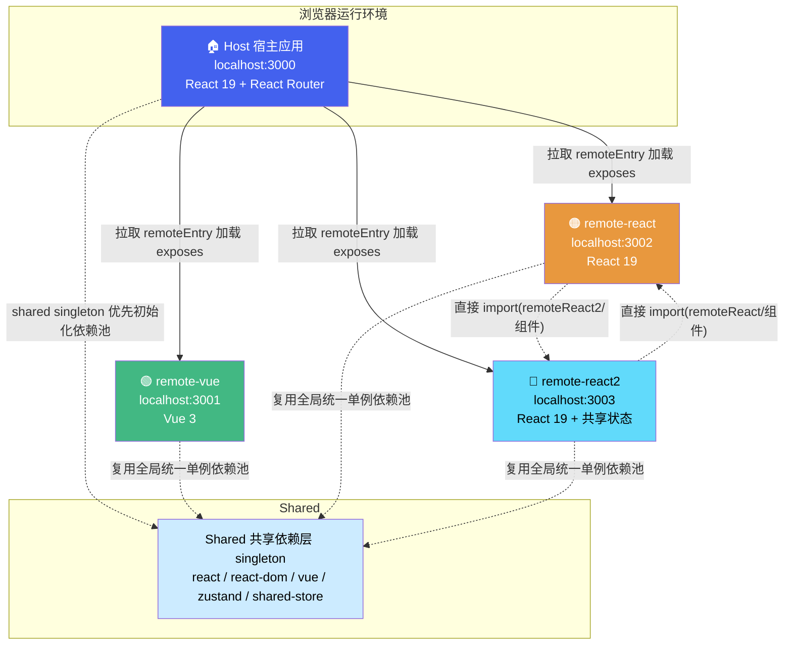
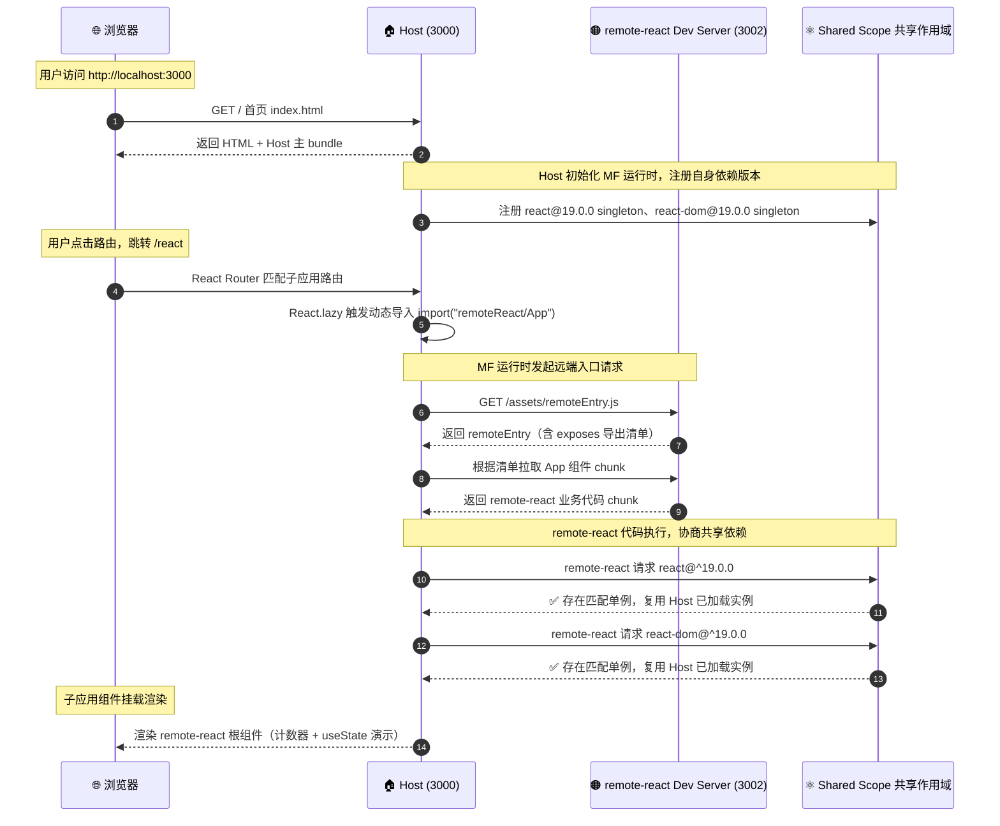
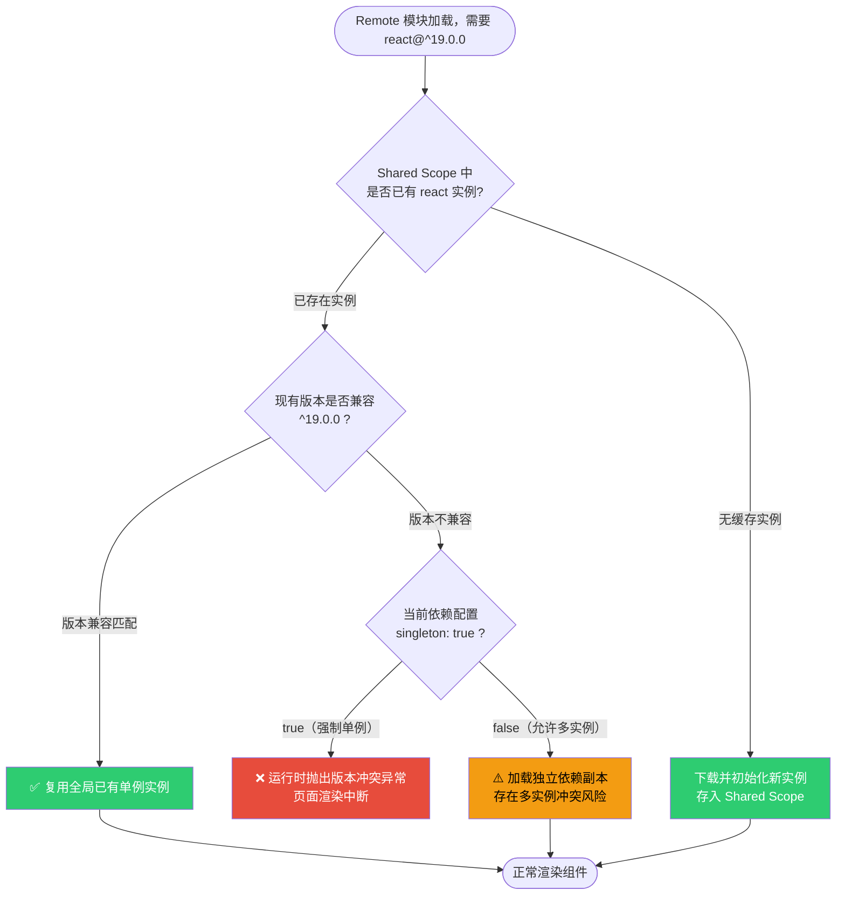
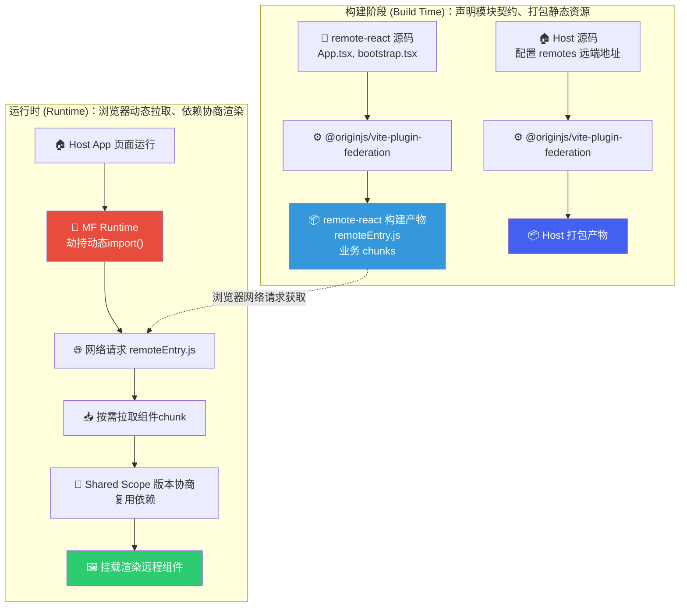
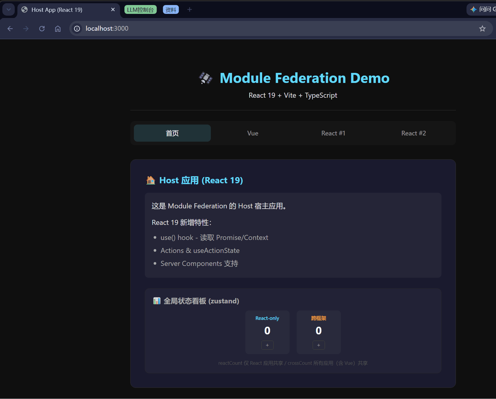

# 微前端——模块联邦

```
首发于：2026-07-19
本文部分内容使用AI辅助生成
```

---

## 什么是模块联邦（Module Federation）

**Module Federation** 是 Webpack 5 中引入的一个新功能，但它的历史可以追溯到 2017 年。当时，Webpack 团队开始研究一种在多个应用程序之间共享代码的方法。

- 2018 年，Webpack 4.20 发布，引入了 module 钩子，这为 Module Federation 的开发奠定了基础。
- 2019 年，Webpack 5 发布，正式引入了 Module Federation 功能。

此后生态迅速跟进——社区将这一能力扩展到 Vite、Rspack、esbuild 等主流构建工具，Module Federation 已从 Webpack 专属特性演变为**构建工具无关的通用微前端基础设施**。Module Federation 已经成为构建现代 Web 应用程序的强大工具。

核心理念一句话概括：

> **Module Federation（模块联邦）允许相互独立打包、独立发布的前端项目，通过构建配置声明对外导出模块与依赖共享规则；在浏览器 / Node.js 等运行环境中，动态远程拉取其他项目的打包产物，实现跨应用代码、组件、工具库的无耦合复用，是微前端跨项目代码共享的标准方案。**


## 在微前端领域的地位

微前端（Micro Frontends）概念经过多年演进，目前主流实现方案分为四大流派：

| 流派 | 代表方案 | 集成时机 | 优势 | 典型痛点 |
|------|----------|----------|------|----------|
| **iframe** | 原生 iframe | 运行时 | 天然完整隔离（JS/样式/全局变量完全隔离）、零改造接入、实现成本极低 | 多独立JS运行时导致性能差、公共资源重复加载；路由URL不同步、弹窗层级无法穿透父页面；兼容性与SEO表现差，用户体验割裂 |
| **NPM 包** | 业务组件/子应用打包发布为 NPM 包 | 构建时 | 支持完整 TS 类型校验、本地调试简单、代码集成稳定、无运行时侵入 | 强版本耦合，子应用更新后宿主必须重新构建部署；公共依赖无法共享，重复打包导致产物体积臃肿，无法实现线上动态迭代 |
| **Web Components** | Custom Elements + Shadow DOM | 运行时 | 浏览器原生标准、框架无关、轻量化样式隔离、无构建工具绑定 | 生态成熟度不足、SSR 支持薄弱；跨应用状态通信复杂、主题定制与样式穿透问题多；多框架并存时会产生多份框架实例，性能损耗明显 |
| **Module Federation** | Webpack MF / Vite MF | 运行时 | 支持运行时动态远程加载、细粒度公共依赖全局去重、应用完全独立构建部署、无版本耦合 | 跨应用调用栈断裂，调试体验较差；需要严格的模块契约管理；存在构建工具绑定问题；无原生隔离，需手动处理样式与全局变量污染 |

综上，Module Federation 是目前微前端领域中**唯一同时具备「运行时动态加载」+「细粒度公共依赖去重」核心能力**的架构方案。

它规避了 NPM 构建时耦合、iframe 性能割裂、Web Components 生态短板等各类问题，在应用独立性、迭代灵活性、运行时性能三者之间取得最优平衡，是 Webpack 5 时代之后微前端架构的**行业事实标准**。同时需接受其调试短板，通过严格的契约管理抵消工程缺陷，保障项目长期可维护性。


## 一个 MF 项目的原理图解

### 1. 整体架构概览



整体运行在同一浏览器环境中，分为宿主应用、远端微应用、全局共享依赖三层：

1. 宿主 Host 作为页面基座，运行时加载 remote-vue、remote-react、remote-react2 三个独立部署的远端微应用；
2. React 子应用间可直接互相调用对方暴露的组件（remote-react ↔ remote-react2），无需 Host 中转；
3. 所有应用共用一套 singleton 全局共享依赖池（react / react-dom / vue / zustand / shared-store），实现依赖全局单例复用，避免重复打包、多实例冲突问题。

> Host 在绝大多数微前端项目中等同于 Shell，是项目的基座、外壳应用。这是整个页面的外层容器、全局路由、布局框架、侧边栏、顶部导航、全局权限、全局弹窗、公共状态所在。

### 2. Remote 暴露模块 → Host 消费模块 全流程



1. 用户访问宿主页面，浏览器加载 Host 主资源；
2. Host 初始化 Module Federation 运行时，向全局共享作用域注册自身框架依赖，并开启 singleton 单例模式；
3. 路由跳转触发动态导入远端模块，Host 请求 remote-react 的 remoteEntry.js 模块清单；
4. 通过清单地址拉取 remote-react 业务代码；
5. remote-react 执行时向共享作用域申请框架依赖，直接复用 Host 已加载的全局单例，不重复下载；
6. remote-react 暴露的组件完成加载，在宿主页面正常渲染使用。

---

### 3. Shared Scope 版本协商机制



1. Remote 执行时，先向全局 Shared Scope 查询目标依赖（如 react、vue、zustand 等）；
2. 无缓存实例：下载对应版本依赖，初始化后存入共享域，直接使用；
3. 存在缓存实例：校验版本范围是否兼容：

- 版本兼容：直接复用全局单例，无重复资源加载；
- 版本不兼容：
  - 若开启 `singleton: true`：全局仅允许一份实例，直接抛出版本冲突报错，页面中断；
  - 若关闭 `singleton`: 单独加载一份独立副本，会出现两套框架实例，易引发 Hooks、上下文失效等隐性 Bug。


### 4. 构建阶段 vs 运行时



**构建阶段**

Host 和 Remote 分别独立构建，通过 MF 插件完成两件事：

1. Remote：通过 `exposes` 声明对外导出的组件 / 模块，打包生成 `remoteEntry.js` 模块清单；

2. Host：通过 `remotes` 配置远端应用地址，记录要加载的远程模块标识；

   构建产物各自独立部署，互不依赖。

**运行时**

1. Host 页面加载完成后，触发动态导入远程模块；
2. MF Runtime 拦截 `import()`，通过网络请求拉取远端 `remoteEntry.js`；
3. 根据清单地址按需加载对应组件 chunk；
4. 进入 Shared Scope 做依赖版本协商，复用全局单例依赖；
5. 远程组件实例完成初始化并渲染到宿主页面。

## 项目实战

[FM Demo](https://github.com/EagleClark/fm-project)

效果如下：



宿主项目一个、React项目两个、VUE项目一个、共享Store项目一个。

### 典型文件结构

```
fm-project/
├── pnpm-workspace.yaml             # pnpm monorepo 工作空间声明
├── package.json                    # 根脚本：dev / build / preview / stop
├── pnpm-lock.yaml
├── .gitignore
├── start-servers.sh                # 一键启动所有 dev server
├── packages/
│   ├── host/                       # 🏠 宿主应用（React 19）
│   │   ├── package.json
│   │   ├── vite.config.ts          # MF 插件配置 + remotes 声明
│   │   ├── tsconfig.json
│   │   ├── index.html
│   │   └── src/
│   │       ├── main.tsx            # ReactDOM.createRoot 入口
│   │       ├── App.tsx             # 路由 + lazy() 消费远程模块
│   │       ├── App.css
│   │       └── vite-env.d.ts       # remote 模块 TS 类型声明
│   ├── remote-react/               # 📦 React 远程子应用
│   │   ├── package.json
│   │   ├── vite.config.ts          # MF 插件配置 + exposes 声明
│   │   ├── tsconfig.json
│   │   ├── index.html
│   │   └── src/
│   │       ├── main.tsx            # 独立开发入口
│   │       ├── App.tsx             # 对外暴露的业务组件
│   │       ├── bootstrap.tsx       # mount() 导出（供 Host 调用）
│   │       └── vite-env.d.ts
│   ├── remote-react2/              # 📦 React 远程子应用 2（共享状态演示）
│   │   ├── package.json            # 依赖 shared-store + zustand
│   │   ├── vite.config.ts          # shared: ['shared-store', 'zustand', ...]
│   │   ├── tsconfig.json
│   │   ├── index.html
│   │   └── src/
│   │       ├── main.tsx
│   │       ├── App.tsx             # 跨框架共享状态消费示例
│   │       ├── bootstrap.tsx
│   │       └── vite-env.d.ts
│   ├── remote-vue/                 # 📦 Vue 3 远程子应用
│   │   ├── package.json
│   │   ├── vite.config.ts          # MF 插件配置 + exposes 声明
│   │   ├── tsconfig.json
│   │   ├── index.html
│   │   └── src/
│   │       ├── main.ts
│   │       ├── App.vue             # 对外暴露的业务组件
│   │       ├── bootstrap.ts        # mount() 导出（供 Host 调用）
│   │       └── env.d.ts
│   └── shared-store/               # 🔧 共享状态包（跨框架）
│       ├── package.json            # exports: ./reactStore, ./crossStore
│       ├── tsconfig.json
│       └── src/
│           ├── index.ts
│           ├── reactStore.ts       # zustand create — 仅 React
│           └── crossStore.ts       # zustand/vanilla — React + Vue 通用
```

> **上图为 Monorepo（单仓多包）结构**——所有应用在同一 Git 仓库中，通过 pnpm workspace 统一管理依赖和脚本。这是开发阶段最便捷的组织方式。
>
> **如果子应用在别的代码仓（Multi-repo 多仓模式）**，其实没有太大区别，只是类型契约（TS类型）不能像 Monorepo 那样直接 `import`，需要额外手段保证 Host 端知道 Remote 的组件签名。

### 宿主应用关键配置

#### vite.config.ts — 声明要加载哪些 Remote

```typescript
import { defineConfig } from 'vite'
import react from '@vitejs/plugin-react'
import federation from '@originjs/vite-plugin-federation'

export default defineConfig({
  plugins: [
    react(),
    federation({
      name: 'host',
      remotes: {
        remoteVue: {
          external: 'http://localhost:3001/assets/remoteEntry.js',
          format: 'esm',
          from: 'vite',
          externalType: 'url',
        },
        remoteReact: {
          external: 'http://localhost:3002/assets/remoteEntry.js',
          format: 'esm',
          from: 'vite',
          externalType: 'url',
        },
        remoteReact2: {
          external: 'http://localhost:3003/assets/remoteEntry.js',
          format: 'esm',
          from: 'vite',
          externalType: 'url',
        },
      },
      shared: {
        react: {
          version: '19.0.0',
          requiredVersion: '^19.0.0',
          singleton: true,
          eager: true,
          shareScope: 'default',
        },
        'react-dom': {
          version: '19.0.0',
          requiredVersion: '^19.0.0',
          singleton: true,
          eager: true,
          shareScope: 'default',
        },
        'react-router-dom': {
          version: '7.18.1',
          requiredVersion: '^7.0.0',
          singleton: true,
          eager: true,
          shareScope: 'default',
        },
        'shared-store': {
          singleton: true,
          eager: true,
          shareScope: 'default',
        },
        zustand: {
          version: '5.0.14',
          requiredVersion: '^5.0.0',
          singleton: true,
          eager: true,
          shareScope: 'default',
        },
      },
      shareScope: 'default',
    }),
  ],
  build: {
    target: 'esnext',
  },
})

```


#### App.tsx — 消费远程模块


```tsx
import { useEffect, useRef, useState } from 'react'
import { NavLink, Route, Routes } from 'react-router-dom'
import { mount as mountVue } from 'remoteVue/bootstrap'
import { useSyncExternalStore } from 'react'
import { useReactStore } from 'shared-store/reactStore'
import { crossStore, type CrossState } from 'shared-store/crossStore'
import './App.css'

/** 加载 federation remote 模块并取 default 导出 */
function useRemoteDefault<T>(importer: () => Promise<Record<string, unknown>>): T | null {
  const [mod, setMod] = useState<T | null>(null)
  useEffect(() => {
    let cancelled = false
    importer().then((raw) => {
      if (!cancelled) setMod(() => (raw.default ?? raw) as T)
    })
    return () => { cancelled = true }
  }, [])
  return mod
}

function HomePage() {
  const reactState = useReactStore()
  const crossState = useSyncExternalStore<CrossState>(
    crossStore.subscribe,
    crossStore.getState,
  )

  return (
    <section className="page page-home">
      <h2>🏠 Host 应用 (React 19)</h2>
      <div className="card">
        <p>这是 Module Federation 的 Host 宿主应用。</p>
        <p style={{ marginTop: '0.75rem' }}>React 19 新增特性：</p>
        <ul>
          <li>use() hook - 读取 Promise/Context</li>
          <li>Actions & useActionState</li>
          <li>Server Components 支持</li>
        </ul>
      </div>

      {/* ── 全局状态面板 ── */}
      <div className="state-panel">
        <h3>📊 全局状态看板 (zustand)</h3>
        <div className="state-row">
          <div className="state-item state-react">
            <span className="state-label">React-only</span>
            <span className="state-value">{reactState.reactCount}</span>
            <button onClick={() => useReactStore.setState({ reactCount: reactState.reactCount + 1 })}>+</button>
          </div>
          <div className="state-item state-cross">
            <span className="state-label">跨框架</span>
            <span className="state-value">{crossState.crossCount}</span>
            <button onClick={() => crossStore.setState({ crossCount: crossState.crossCount + 1 })}>+</button>
          </div>
        </div>
        <p className="state-hint">
          reactCount 仅 React 应用共享 / crossCount 所有应用（含 Vue）共享
        </p>
      </div>
    </section>
  )
}

function VuePage() {
  const containerRef = useRef<HTMLDivElement>(null)

  useEffect(() => {
    const el = containerRef.current
    if (!el) return
    mountVue(el)
    return () => { el.innerHTML = '' }
  }, [])

  return (
    <section className="page page-vue">
      <h2>🟢 Vue 3 远程子应用</h2>
      <p className="page-hint">通过 Module Federation 动态加载，独立 Vue 运行时</p>
      <div ref={containerRef} />
    </section>
  )
}

function ReactPage() {
  const RemoteApp = useRemoteDefault<React.ComponentType>(
    () => import('remoteReact/App') as Promise<Record<string, unknown>>,
  )
  return (
    <section className="page page-react">
      <h2>🟠 React 19 远程子应用 #1</h2>
      <p className="page-hint">通过 Module Federation 动态加载，共享 Host 的 React 实例</p>
      {RemoteApp ? <RemoteApp /> : <p className="loading">加载中...</p>}
    </section>
  )
}

function React2Page() {
  const RemoteApp = useRemoteDefault<React.ComponentType>(
    () => import('remoteReact2/App') as Promise<Record<string, unknown>>,
  )
  return (
    <section className="page page-react2">
      <h2>🔵 React 19 远程子应用 #2</h2>
      <p className="page-hint">演示全局状态共享：React-only + 跨框架</p>
      {RemoteApp ? <RemoteApp /> : <p className="loading">加载中...</p>}
    </section>
  )
}

function App() {
  return (
    <div className="app">
      <header className="app-header">
        <h1>🛰️ Module Federation Demo</h1>
        <p>React 19 + Vite + TypeScript</p>
      </header>
      <nav className="nav">
        <NavLink to="/" end className={({ isActive }) => `nav-link${isActive ? ' active' : ''}`}>
          首页
        </NavLink>
        <NavLink to="/vue" className={({ isActive }) => `nav-link${isActive ? ' active' : ''}`}>
          Vue
        </NavLink>
        <NavLink to="/react" className={({ isActive }) => `nav-link${isActive ? ' active' : ''}`}>
          React #1
        </NavLink>
        <NavLink to="/react2" className={({ isActive }) => `nav-link${isActive ? ' active' : ''}`}>
          React #2
        </NavLink>
      </nav>
      <main className="app-main">
        <Routes>
          <Route path="/" element={<HomePage />} />
          <Route path="/vue" element={<VuePage />} />
          <Route path="/react" element={<ReactPage />} />
          <Route path="/react2" element={<React2Page />} />
        </Routes>
      </main>
    </div>
  )
}

export default App

```


#### vite-env.d.ts — TypeScript 类型声明

```typescript
/// <reference types="vite/client" />

declare module 'remoteVue/App' {
  import type { Component } from 'vue'
  const component: Component
  export default component
}

declare module 'remoteVue/bootstrap' {
  export function mount(el: HTMLElement): void
}

declare module 'remoteReact/App' {
  const App: React.ComponentType
  export default App
}

declare module 'remoteReact2/App' {
  const App: React.ComponentType
  export default App
}

declare module 'shared-store/reactStore' {
  import type { UseBoundStore } from 'zustand/react'
  import type { StoreApi } from 'zustand/vanilla'
  import type { ReactState } from 'shared-store/src/reactStore'

  type S = UseBoundStore<StoreApi<ReactState>>
  export const useReactStore: S
  export type { ReactState }
}

declare module 'shared-store/crossStore' {
  import type { StoreApi } from 'zustand/vanilla'
  import type { CrossState } from 'shared-store/src/crossStore'

  export const crossStore: Omit<StoreApi<CrossState>, 'destroy' | 'getInitialState'>
  export type { CrossState }
}

```

### 子应用暴露组件关键配置

#### vite.config.ts — 暴露组件

```typescript
import { defineConfig } from 'vite'
import react from '@vitejs/plugin-react'
import federation from '@originjs/vite-plugin-federation'

export default defineConfig({
  plugins: [
    react(),
    federation({
      name: 'remoteReact',
      filename: 'remoteEntry.js',
      exposes: {
        './App': {
          import: './src/App.tsx',
          name: 'ReactApp',
          dontAppendStylesToHead: false,
        },
        './bootstrap': {
          import: './src/bootstrap.tsx',
          name: 'ReactBootstrap',
          dontAppendStylesToHead: false,
        },
      },
      shared: {
        react: {
          version: '19.0.0',
          requiredVersion: '^19.0.0',
          singleton: true,
          eager: true,
          shareScope: 'default',
        },
        'react-dom': {
          version: '19.0.0',
          requiredVersion: '^19.0.0',
          singleton: true,
          eager: true,
          shareScope: 'default',
        },
        'shared-store': {
          singleton: true,
          eager: true,
          shareScope: 'default',
        },
        zustand: {
          version: '5.0.14',
          requiredVersion: '^5.0.0',
          singleton: true,
          eager: true,
          shareScope: 'default',
        },
        'react/jsx-runtime': {
          singleton: true,
          eager: true,
          shareScope: 'default',
        },
        'react/jsx-dev-runtime': {
          singleton: true,
          eager: true,
          shareScope: 'default',
        },
      },
      shareScope: 'default',
    }),
  ],
  build: {
    target: 'esnext',
  },
})

```

### 全局状态

Module Federation 本身不提供跨应用状态共享能力，需要自行设计。项目通过 `shared-store` 包提供两种模式：

| 模式 | 适用场景 | 底层方案 | 消费方式 |
|------|----------|----------|----------|
| React-only | 全部子应用都是 React | `zustand` `create()` | `useReactStore()` hook |
| 跨框架 | React + Vue 等异构场景 | `zustand/vanilla` `createStore()` | React: `useSyncExternalStore` / Vue: 直接 `subscribe` |

#### shared-store — React-only（zustand create）

```typescript
// packages/shared-store/src/reactStore.ts
import { create } from 'zustand'

export interface ReactState {
  reactCount: number
  reactMessage: string
}

// 放入 window 确保 federation singleton 下同窗口多实例安全
const win = typeof window !== 'undefined' ? window as any : null

export const useReactStore = win?.__mf_react_store__ ?? (() => {
  const s = create<ReactState>(() => ({
    reactCount: 0,
    reactMessage: 'Hello from React Store',
  }))
  if (win) win.__mf_react_store__ = s
  return s
})()
```

#### shared-store — 跨框架（zustand/vanilla）

```typescript
// packages/shared-store/src/crossStore.ts
import { createStore } from 'zustand/vanilla'

export interface CrossState {
  crossCount: number
  crossMessage: string
}

const win = typeof window !== 'undefined' ? window as any : null

export const crossStore = win?.__mf_cross_store__ ?? (() => {
  const s = createStore<CrossState>(() => ({
    crossCount: 0,
    crossMessage: 'Hello from Cross Store',
  }))
  if (win) win.__mf_cross_store__ = s
  return s
})()
```

> **关键设计**：通过 `window.__mf_*` 变量兜底——即便 MF singleton 偶尔失效，同一个浏览器窗口内仍然只有一份 Store 实例，避免状态分裂。

#### vite.config.ts 共享依赖声明

涉及共享状态的远程应用需在 `vite.config.ts` 中声明 `shared-store` 和 `zustand` 为 singleton：

```typescript
// packages/remote-react2/vite.config.ts（关键片段）
federation({
  name: 'remoteReact2',
  exposes: {
    './App': './src/App.tsx',
    './bootstrap': './src/bootstrap.tsx',
  },
  shared: {
    // ... react, react-dom 等
    'shared-store': { singleton: true, eager: true },
    zustand:        { singleton: true, eager: true, version: '5.0.14', requiredVersion: '^5.0.0' },
  },
})
```

> **Host 也需要同样配置** `shared-store` + `zustand` 到 `shared` 中，否则 Host 端无法感知这些依赖。

#### 消费示例（React 端）

```tsx
// packages/remote-react2/src/App.tsx
import { useSyncExternalStore } from 'react'
import { useReactStore } from 'shared-store/reactStore'
import { crossStore, type CrossState } from 'shared-store/crossStore'

function App() {
  // React-only 状态：直接用 zustand hook
  const reactState = useReactStore()

  // 跨框架状态：useSyncExternalStore 桥接 zustand/vanilla → React
  const crossState = useSyncExternalStore<CrossState>(
    crossStore.subscribe,
    crossStore.getState,
  )

  return (
    <div>
      {/* React-only */}
      <span>React Count: {reactState.reactCount}</span>
      <button onClick={() => useReactStore.setState({ reactCount: reactState.reactCount + 1 })}>
        +1
      </button>

      {/* 跨框架 —— Vue 端也在同时读写这个 Store */}
      <span>Cross Count: {crossState.crossCount}</span>
      <button onClick={() => crossStore.setState({ crossCount: crossState.crossCount - 1 })}>
        -1
      </button>
    </div>
  )
}
```

> **跨框架消费要点**：
> - **React 端**用 `useSyncExternalStore` 订阅 `zustand/vanilla` 的 Store——这是 React 19 官方推荐的 external store 订阅方式。
> - **Vue 端**直接调用 `crossStore.subscribe(callback)` + `crossStore.getState()`，或封装成 composable。

#### 消费示例（Vue 端）

```typescript
// Vue 3 中消费跨框架 Store（示意）
import { crossStore } from 'shared-store/crossStore'
import { ref, onMounted, onUnmounted } from 'vue'

export function useCrossStore() {
  const state = ref(crossStore.getState())

  const unsub = crossStore.subscribe((s) => {
    state.value = s
  })

  onUnmounted(unsub)

  return {
    state,
    increment: () => crossStore.setState({ crossCount: state.value.crossCount + 1 }),
    decrement: () => crossStore.setState({ crossCount: state.value.crossCount - 1 }),
  }
}
```

### 远端地址动态化

Demo 中 Remote 地址硬编码在 `vite.config.ts` 里。实际部署到测试 / 预发 / 生产环境时 CDN 地址不同，每次切环境改代码重新构建显然不现实。根据 **Remote 名称是否在构建时已知**，分两种方案。

#### 方案一：地址动态、名称固定（推荐）

适用于绝大多数场景——Remote 有哪些是确定的，只是不同环境 URL 不一样。

vite.config.ts 中把 `external` 从字符串换成一个返回 Promise 的函数：

```typescript
// packages/host/vite.config.ts
federation({
  name: 'host',
  remotes: {
    remoteReact: {
      externalType: 'promise',
      external: () => fetch('/api/remotes')
        .then(r => r.json())
        .then(d => d.remoteReact),
      format: 'esm',
      from: 'vite',
    },
  },
})
```

仅此而已。Host 端业务代码**完全不动**——`import("remoteReact/App")` 照常写，MF 运行时在真正发起网络请求前才调用 `external` 拿地址：

```tsx
const RemoteReactApp = lazy(() => import('remoteReact/App')) // 跟静态写法一模一样
```

后端只需要一个极简接口，按 Remote 名返回对应 CDN 地址：

```json
// GET /api/remotes
{
  "remoteReact": "https://cdn.example.com/remote-react/1.2.3/assets/remoteEntry.js",
  "remoteVue":   "https://cdn.example.com/remote-vue/2.0.1/assets/remoteEntry.js"
}
```

> **提示**：如果只是环境切换（测试 / 生产），连 API 都不需要——用 `import.meta.env` 在 `vite.config.ts` 里直接拼地址就行，构建时确定，零运行时开销。

---

#### 方案二：名称和地址都动态（插件 / 租户场景）

当 Remote **名字本身**也是运行时才能确定——比如 SaaS 平台每个租户有自己的子应用、插件市场用户按需安装——才需要这方案。

与方案一的核心区别：`vite.config.ts` 的 `remotes` 字段留空，完全靠运行时 API 注册。

> **这些 `__federation_method_*` 方法从哪来的？**
>
> 它们是 `@originjs/vite-plugin-federation` 在构建时注入到 window 上的运行时 API，Host 应用加载后即可用，无需 `import`。
>
> TypeScript 不认识这些裸函数，需要在 `vite-env.d.ts` 中补充声明：
>
> ```typescript
> // packages/host/src/vite-env.d.ts
> declare function __federation_method_setRemote(
>   name: string,
>   config: { url: string; format: 'esm' | 'var' | 'systemjs'; from: 'vite' | 'webpack' }
> ): void
>
> declare function __federation_method_ensure(name: string): Promise<void>
>
> declare function __federation_method_getRemote(
>   name: string,
>   expose: string
> ): Promise<() => any>
> ```

**步骤 1 — 应用启动时拉取 Remote 清单并注册**

```typescript
// packages/host/src/remoteRegistry.ts
interface RemoteConfig {
  name: string
  entry: string
  enabled: boolean
}

export async function initRemotes() {
  const res = await fetch('/api/remotes')
  const list: RemoteConfig[] = await res.json()

  for (const r of list.filter(r => r.enabled)) {
    __federation_method_setRemote(r.name, {
      url: r.entry,
      format: 'esm',
      from: 'vite',
    })
  }

  return list
}
```

**步骤 2 — 按需加载 Remote 组件**

```typescript
async function loadRemoteComponent(name: string, exposeKey = './App') {
  // ensure: 下载 remoteEntry.js 并初始化
  await __federation_method_ensure(name)
  // getRemote: 拿到 exposes 中声明的模块
  return await __federation_method_getRemote(name, exposeKey)
}
```

**步骤 3 — 动态路由 + 消费**

```tsx
// packages/host/src/App.tsx
function App() {
  const [remotes, setRemotes] = useState<RemoteConfig[]>([])

  useEffect(() => {
    initRemotes().then(setRemotes)
  }, [])

  return (
    <Routes>
      <Route path="/" element={<HomePage />} />
      {remotes.map(r => (
        <Route
          key={r.name}
          path={`/${r.name}/*`}
          element={<RemotePage remoteName={r.name} />}
        />
      ))}
    </Routes>
  )
}

function RemotePage({ remoteName }: { remoteName: string }) {
  const [Comp, setComp] = useState<React.ComponentType | null>(null)

  useEffect(() => {
    loadRemoteComponent(remoteName).then(mod => setComp(() => mod.default ?? mod))
  }, [remoteName])

  return Comp ? <Comp /> : <div>⏳ 加载中...</div>
}
```

**步骤 4 — 后端接口约定**

```json
// GET /api/remotes
[
  { "name": "tenant-a", "entry": "https://a.example.com/assets/remoteEntry.js", "enabled": true },
  { "name": "tenant-b", "entry": "https://b.example.com/assets/remoteEntry.js", "enabled": true },
  { "name": "tenant-c", "entry": "https://c.example.com/assets/remoteEntry.js", "enabled": false }
]
```

---

#### 两种方案对比

| | 方案一 `externalType: 'promise'` | 方案二 `__federation_method_*` |
|---|---|---|
| **适用场景** | 环境切换、A/B 测试、Remote 固定 | 多租户、插件市场、Remote 不固定 |
| **构建时知悉 Remote 名** | ✅ 已知 | ❌ 未知 |
| **vite.config.ts** | 声明 remote 名 + promise 函数 | `remotes` 可留空 |
| **业务代码改动** | 零改动 | 路由、加载逻辑全部动态化 |
| **代码量** | 3 行配置 | ~50 行（注册 + 加载 + 路由） |
| **首次加载时机** | 首次 `import()` 时按需调用 `external` | `initRemotes()` 启动时全量注册 |

