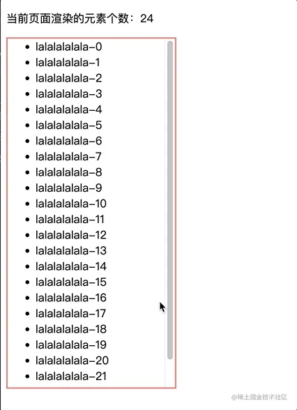
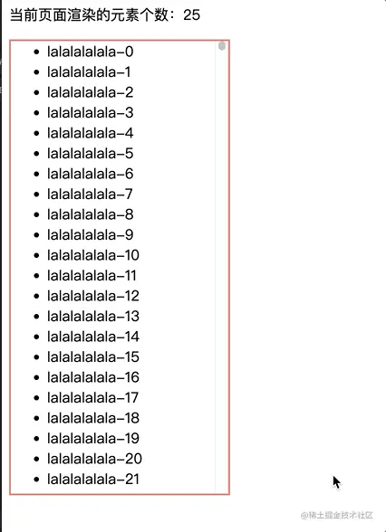

# 超长列表渲染（虚拟列表、虚拟滚动）

> 首发于：2023-03-17

> 本文主要讲解超长列表渲染的实现方案，当然这个技术又被称为“虚拟列表”、“虚拟滚动”、“无限滚动列表”或者“虚拟列表滚动”等，很多个名字，不管怎么叫吧，总之我们就是要解决一个问题，即前端手里现在有很多数据，但是如果我一次性渲染出来，前端就可能会很卡，那么我们就需要一些特殊的处理技巧来解决这种场景的问题。

## 背景

在项目中，我们可能经常会遇到一个问题，就是后端存储的数据很多，比如：一个用户信息的列表，正好这个项目做好之后可能会有上千数量级的用户，每个用户可能又有若干个字段，要知道如果我们真的一次性把这个系统所有用户的数据请求回来可能这一个请求的返回体就能有MB级别的数据。这么多数据一次性全部渲染到浏览器上浏览器很可能撑不住，就算撑得住可能也很卡，那么这个问题怎么解决呢？

有几种解决思路：

1. 后端把页面的信息分片，最常见的就是分页表格，我们每次只请求指定页的数据。
2. 后端一次性把数据返回给前端，但是前端做一个和后端分页一样的效果，每次就显示指定页的数据，触发翻页之后再显示其它页的数据。
3. 后端一次性把数据返回给前端，但是前端也不做分页效果，前端只渲染我们目前能够看到的区域的内容，而其它不在可视范围内的数据暂不渲染，随着我们滚动鼠标滚轮就能丝滑切换当前需要显示的内容。
4. 后端把页面的信息分片，但是前端也不做分页效果，前端只渲染我们目前能够看到的区域的内容，当我们滚动鼠标滚轮到底时再去请求新的数据。

当然前两种解决思路并不是我们今天要讨论的东西，因为这两个方案都要手动去点击切换，交互没有没有丝滑，方案1每次翻页都要请求数据交互效率就更低了，还有就是这种分页会增加业务逻辑的整体复杂度。

## 原理与简单实例

### 懒渲染式

这里的懒渲染就是一边滚动一边追加图素进行渲染。核心计算方式如下：

- 当前视口距离滚动元素顶部的最大距离（可滚动的最大距离） = 滚动元素的总高度 - 元素可视高度

当前视口距离滚动元素顶部的最大距离（可滚动的最大距离）- 当前视口到滚动元素顶部的距离 < 一个阈值，我们就可以追加新的图素进行渲染了。示例代码如下：

`App.tsx`

```tsx
import { useRef, useState, UIEvent, useMemo } from 'react';
import './App.css';

const TOTAL = 10000;
const MY_DATA: string[] = [];
for (let i = 0; i < TOTAL; i++) {
  MY_DATA.push(`lalalalalala-${i}`);
}
const UL_HEIGHT = 500;
const ITEM_HEIGHT = 21;

const App: React.FC = () => {
  const onePageNum = Math.ceil(UL_HEIGHT / ITEM_HEIGHT);
  const [count, setCount] = useState(onePageNum);
  const ulRef = useRef<HTMLUListElement | null>(null);
  const dataForShow = useMemo(() => {
    return MY_DATA.slice(0, count);
  }, [count]);

  const handleScroll = (e: UIEvent<HTMLUListElement>) => {
    // 当前视口距离滚动元素顶部的最大距离（可滚动的最大距离） = 滚动元素的总高度 - 元素可视高度
    const maxScrollTop = e.currentTarget.scrollHeight - UL_HEIGHT;
    // 当前视口到滚动元素顶部的距离
    const currentScrollTop = e.currentTarget.scrollTop;

    if (maxScrollTop - currentScrollTop < 20) {
      if (count <= MY_DATA.length) {
        setCount(count + onePageNum);
      }
    }
  }

  return (
    <>
      <p>当前页面渲染的元素个数：{count}</p>
      <ul ref={ulRef} className="my-ul" onScroll={handleScroll}>
        {dataForShow.map(item => <li key={item}>{item}</li>)}
      </ul>
    </>
  );
}

export default App;
```

`App.css`

```css
.my-ul {
  height: 500px;
  width: 200px;
  border: 2px solid salmon;
  overflow: auto;
}
```

效果如下：



这个方案的缺点和局限：

- 随着下拉滚动的持续，元素会持续暴增
- 滚动条一直在跳动
- 数据很多的情况下是无法一下拉到底的，要拉到底可能会非常费劲

### 可视区域渲染式

可视区域就是我们当前界面需要显示的区域，比较一个数据量巨大的列表我们不需要也不可能一眼看完所有吧，所以我们只渲染需要被看见的区域，这样不就能少渲染大多数不可见元素了吗。

实现策略：

- 使用一个 phantom（幽灵）元素来进行站位，把需要滚动的父元素撑开，这样滚动条看起来就会像真的已经渲染好所有元素了一样
- 根据滚动的距离、滚动元素的高度计算出需要渲染的数据的开始和结束 index，这样我们就知道了要渲染那几个数据了
- 在滚动时使用 `transform: translateY(ypx)`来修改真实显示区域的偏移，这样真实区域看起来就像随滚动条在移动似的

示例代码如下：

`App.tsx`

```tsx
import { useRef, useState, UIEvent, useMemo } from 'react';
import './App.css';

const TOTAL = 10000;
const MY_DATA: string[] = [];
for (let i = 0; i < TOTAL; i++) {
  MY_DATA.push(`lalalalalala-${i}`);
}
const UL_HEIGHT = 500;
const ITEM_HEIGHT = 21;

const App: React.FC = () => {
  const visibleCount = Math.ceil(UL_HEIGHT / ITEM_HEIGHT);
  const [start, setStart] = useState(0);
  const [end, setEnd] = useState(visibleCount);
  const divRef = useRef<HTMLDivElement | null>(null);
  const dataForShow = useMemo(() => {
    return MY_DATA.slice(start, end);
  }, [start, end]);

  const handleScroll = (e: UIEvent<HTMLUListElement>) => {
    // 当前视口到滚动元素顶部的距离
    const currentScrollTop = e.currentTarget.scrollTop;
    
    const s = Math.floor(currentScrollTop / ITEM_HEIGHT);
    setStart(s);
    setEnd(s + visibleCount);
    
    if (divRef.current) {
      divRef.current.style.transform = `translateY(${s * ITEM_HEIGHT}px)`;
    }
  }

  return (
    <>
      <p>当前页面渲染的元素个数：{end - start + 1}</p>
      <ul className="my-ul" onScroll={handleScroll}>
        <div className="phantom" style={{ height: `${TOTAL * ITEM_HEIGHT}px` }}></div>
        <div ref={divRef}>
          {dataForShow.map(item => <li key={item}>{item}</li>)}
        </div>
      </ul>
    </>
  );
}

export default App;
```

`App.css`

```css
.my-ul {
  height: 500px;
  width: 200px;
  overflow: auto;
  position: relative;
  border: 2px solid salmon;
}

.phantom {
  width: 10px;
  position: absolute;
  z-index: -1;
}
```

效果如下：



可以看出可视区域渲染式已经完全改善了懒渲染式的痛点，不过它仍然还有一些不足之处：

- 实际项目中我们的每一个元素可能高度并不相同，那么我们可视区域的计算方式就会改变，想要完美解决这个问题就需要更加复杂的高度计算（不过我觉得这个优化点并非必要，我们把元素高度放宽一点多渲染一点可视区域外的元素对性能的影响并不大，和海量的列表数据比起来这根本算不上什么，从工程的角度讲兼顾代码的复杂度和性能其实更加重要）。
- 可视区域高度不做限制，可以根据外层元素大小自适应。
- 如果是异步加载列表的数据，那么可能需要提前请求并缓存后面的数据，而且最好是可视区域临近的上下都有缓存数据，这样可以使体验更加丝滑。
- 渲染防抖与节流，我们滚动一圈鼠标滚轮 onscroll 事件会非常快地执行数次，那么我们的页面就会重复渲染多次，如果是异步加载就会多次请求数据，会极大地造成性能浪费。

## 成熟的虚拟滚动库推荐

[GitHub - NeXTs/Clusterize.js: Tiny vanilla JS plugin to display large data sets easily](https://github.com/NeXTs/Clusterize.js)

[GitHub - bvaughn/react-window: React components for efficiently rendering large lists and tabular data](https://github.com/bvaughn/react-window)

[GitHub - Akryum/vue-virtual-scroller: ⚡️ Blazing fast scrolling for any amount of data](https://github.com/Akryum/vue-virtual-scroller)
