# 重学CSS

> 首发于：2023-07-07

> 我已经从事Web前端开发多年了，CSS 平时用起来也挺熟练的，但是总觉得自己对它理解得又不够透彻，所以一直想再系统的学习总结一遍，所以本文的重点并是不堆砌基础知识，在很多基础的地方会有省略、一笔带过。至于重点是什么，我觉得应该就是那些我踩过的坑，我没有理解透彻的东西，平时用的时候需要反复调试，去试验才能调出来的东西，亦或是一些我一直说不清楚的概念吧。

## 盒模型

### 基础概念

*注：IE 以及淘汰了，故不再讨论 IE 的盒模型。*

所有 HTML 元素都可以看成盒子，盒子的构成可以用一个盒模型来描述。

盒模型的组成：外边距（margin）、边框（border）、内边距（padding）、内容（content）。如下图所示：

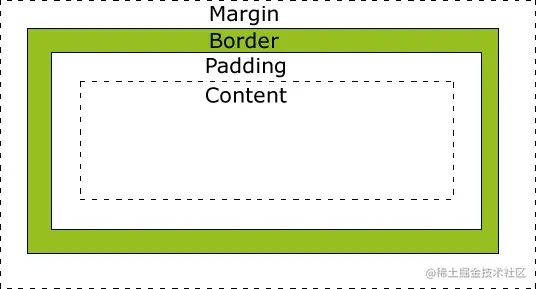

举个例子：

```css
.test {
    width: 200px;
    height: 200px;
    margin: 50px;
    padding: 50px;
    border: 50px solid black;
    background-color: brown;
}
```

```html
<body>
    <div class="test"></div>
</body>
```

界面效果：

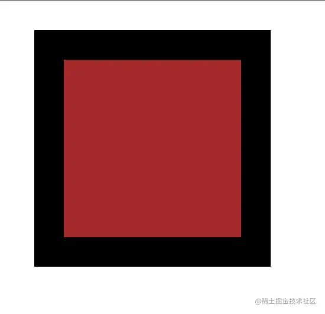

控制台查看其盒模型效果：

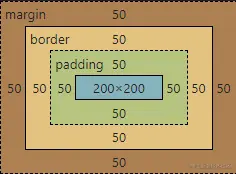

元素的 width 和 height 指的就是其中间的 content 的大小，元素的总宽高是由 content 的大小以及 margin、padding、border 共同决定的。

`background-color` 默认会影响 content 与 padding 的背景颜色，除非改变 `background-clip` 的配置。

### 轮廓（Outline）

轮廓（outline）是绘制于元素周围的一条线，位于边框边缘的外围，可起到突出元素的作用。他的位置如下图所示，`outline` 不会占用元素的宽高等，即使空间不够用他也不会对元素的位置产生影响。

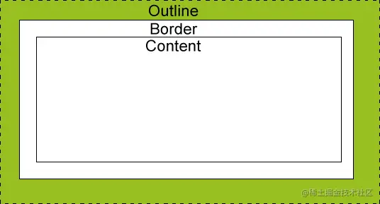

举例：

```css
.test {
    width: 200px;
    height: 200px;
    margin: 50px;
    padding: 50px;
    border: 50px solid black;
    outline: 20px dotted green;
    background-color: brown;
}
```

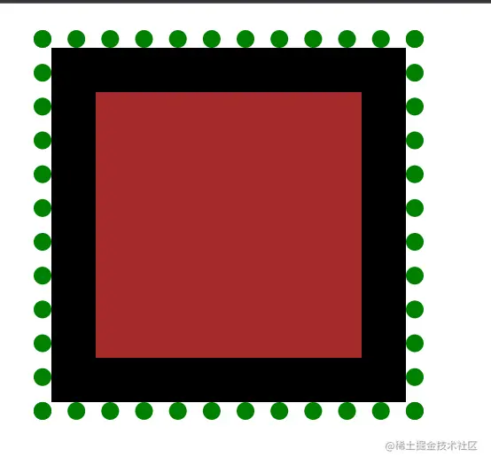


### BFC

BFC (Block Formatting Context) 即块格式化上下文，它是一个独立的布局环境，其中的元素不受外界的影响。

要搞清楚 BFC 的作用，我们先来看下面几个问题。

#### margin 坍塌问题

同级元素垂直方向上的坍塌（水平方向上不会坍塌），比如：上面的元素设置了 `margin-bottom`，下面的元素设置了 `margin-top`，这种情况下，会按照较大者去显示。

把`基础概念`那个例子的 html 修改一下：

```html
<body>
    <div class="test"></div>
    <div class="test"></div>
</body>
```

显示效果如下：

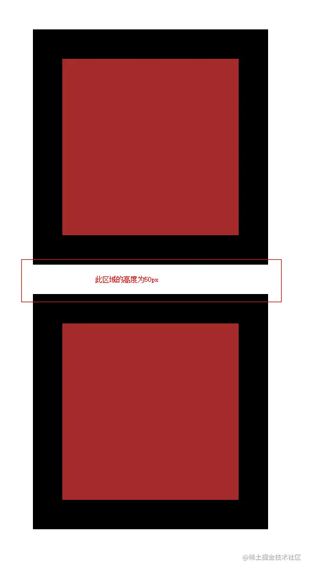

修改代码解决问题：

```css
.container {
  overflow: hidden;
}
```


```html
<div class="container">
  <div class="test"></div>
</div>
<div class="container">
  <div class="test"></div>
</div>
```


父子元素之间的坍塌，也是垂直方向上会坍塌，水平方向上不会坍塌。比如：父元素设置了 `margin-top`，子元素也设置了 `margin-top`，这种情况下，会按照较大者去显示，或者只设置子元素的 `margin-top`，那么父元素会随子元素一起掉下来。

例子如下：

```css
.father {
  width: 300px;
  height: 300px;
  margin-top: 50px;
  margin-left: 50px;
  background-color: brown;
}

.son {
  width: 100px;
  height: 100px;
  margin-top: 60px;
  margin-left: 60px;
  background-color: black;
}
```

```html
<body>
    <div class="father">
        <div class="son"></div>
    </div>
</body>
```


显示效果如下：

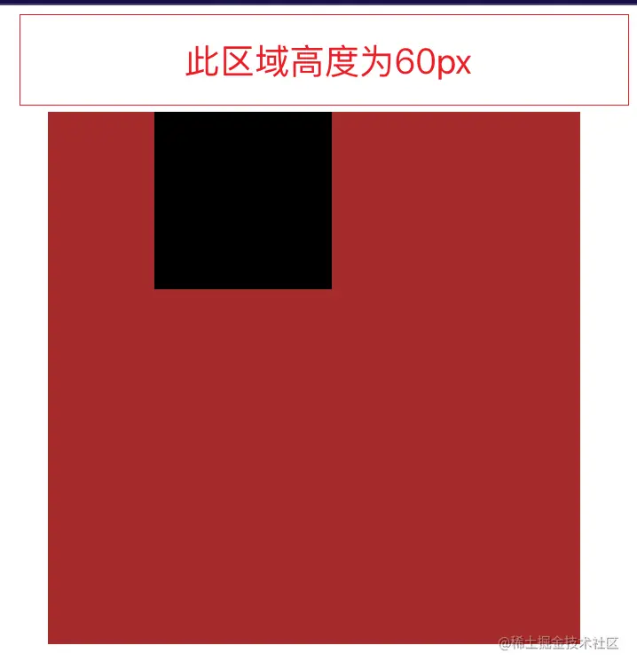

修改代码解决问题：

```css
.container {
  overflow: hidden;
}
```


```html
<div class="father">
  <div class="container">
    <div class="son"></div>
  </div>
</div>
```


#### 浮动塌陷问题

元素设置了 float 之后会，会脱离文档流，原本父元素会包裹住子元素，但是子元素脱离了文档流，所以子元素就会变成未被父元素包裹的样子，父元素本应该被撑开的高度也会坍塌。

```css
.container {
  border: 1px solid red;
}

.test {
  width: 100px;
  height: 100px;
  background-color: blue;
  float: left;
}
```

```html
<div class="container">
  <div class="test"></div>
</div>
```

显示效果如下图所示：

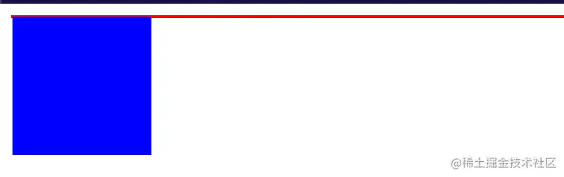


修改代码解决问题：

```diff
.container {
  border: 1px solid red;
+ overflow: hidden;
}
```


#### 浮动元素覆盖问题

一个元素设置了浮动，另一个元素未设置浮动，浮动元素会覆盖未添加浮动的元素。

```css
.test1 {
  width: 100px;
  height: 100px;
  background-color: blue;
  float: left;
}

.test2 {
  width: 200px;
  height: 200px;
  background-color: red;
}
```


```html
<div class="test1"></div>
<div class="test2"></div>
```


显示效果如下图所示：

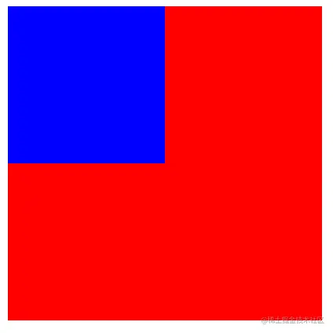

修改代码解决问题：

```diff
.test2 {
  width: 200px;
  height: 200px;
  background-color: red;
+ overflow: hidden;
}
```


#### 总结

BFC 的作用：

- 解决 margin 塌陷问题
- 清除浮动
- 阻止元素被浮动元素覆盖

BFC 如何创建：

- 根元素（`<html>`）
- 浮动元素（元素的 float 不是 none）
- 绝对定位元素（元素的 position 为 absolute 或 fixed）
- display 为 inline-block、table-cell、table-caption、table、table-row、table-row-group、table-header-group、table-footer-group、inline-table、flow-root、flex 或 inline-flex 或 inline-grid
- overflow 值不为 visible 的块元素
- contain 值为 layout、content 或 paint 的元素
- 多列容器（元素的 column-count 或 column-width 不为 auto，包括 column-count 为 1）


### 物理属性与逻辑属性

#### 书写模式

书写模式是为了支持不同语言的书写习惯而生的，比如：中文、英文、法语等都是从左到右书写的，而文言文是从上到下书写的，但是阿拉伯语则是从右往左书写的。

下面是一个例子：

```html
<body>
  <div style="width: 100px;">Hello World 1234我就是一段普普通通的文字，默认效果</div>
  <br />
  <div style="width: 100px; writing-mode: horizontal-tb;">Hello World 1234我就是一段普普通通的文字，从左往右从上到下水平书写的</div>
  <br />
  <div style="height: 100px; writing-mode: vertical-lr;">Hello World 1234我就是一段普普通通的文字，从上到下从左到右垂直书写的</div>
  <br />
  <div style="height: 100px; writing-mode: vertical-rl;">Hello World 1234我就是一段普普通通的文字，从上到下从右到左垂直书写的</div>
</body>
```

效果图如下：

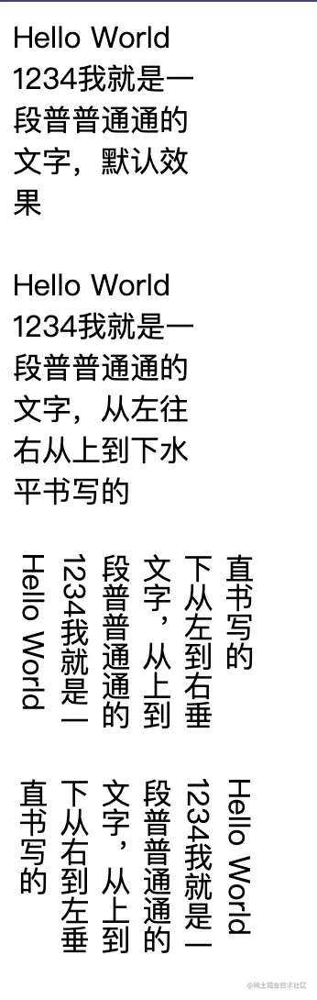

配合 HTML 的 `dir` 属性和 CSS 的 `direction` 属性还可以改变元素从左到右排还是从右到左排，他们在配合 `writing-mode` 使用之后会有不同的效果。

```html
<body dir="rtl">
  <div>Hello World 1234我就是一段普普通通的文字</div>
  <br />
  <div style="direction: ltr;">Hello World 1234我就是一段普普通通的文字</div>
</body>
```

效果：

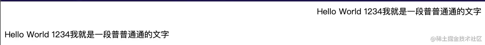

#### 物理属性

物理属性即含有 `left`、`right`、`top` 和 `bottom` 物理位置关键字的属性，它们与你看到的屏幕紧密相关，左永远是左，不管文本流动的方向如何。

物理属性在我们修改书写模式之后可能会存在一些问题，请看下面这个例子：

首先是中文：

```html
<body>
  <div style="direction: ltr;">
    <div style="margin-left: 20px; margin-top: 10px;">中文TITLE</div>
  </div>
</body>
```

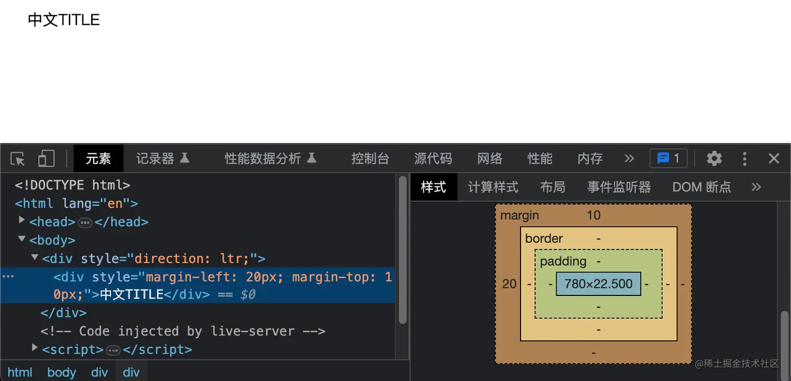

然后是阿拉伯语：

```html
<body>
  <div style="direction: rtl;">
    <div style="margin-left: 20px; margin-top: 10px;">کوردیی ناوەندی</div>
  </div>
</body>
```

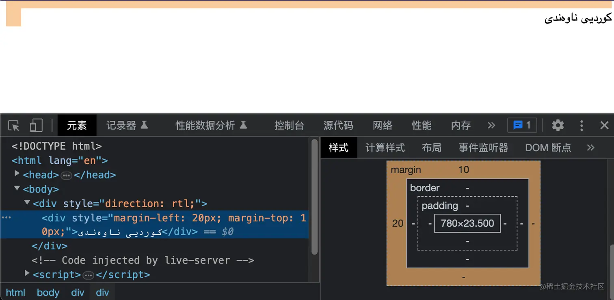

看出问题了吗？如果我们是一个国际化的项目，当我们切换成阿拉伯语之后，按照阿拉伯语的书写习惯，margin 应该在右侧才对，那么只是单纯的切换 direction 还不行，还得改 CSS 代码。不过使用逻辑属性编写就不需要修改 CSS 代码了。

#### 逻辑属性

逻辑属性定义了在相对方向下与对应的实体属性相等价的属性。

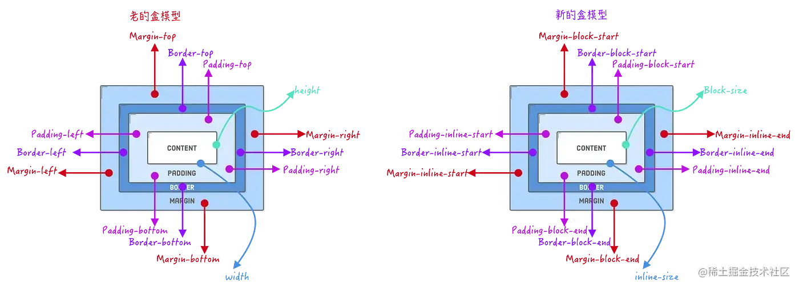

现在我们就可以利用逻辑属性来解决上面的问题了：

```html
<body>
  <div style="direction: rtl;">
    <div style="margin-inline-start: 20px; margin-block-start: 10px;">کوردیی ناوەندی</div>
  </div>
</body>
```


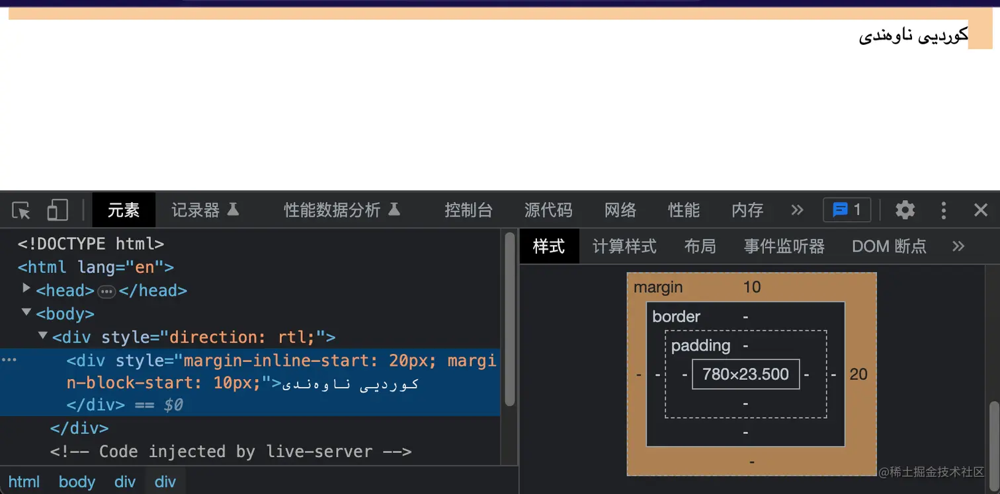

## 选择器

选择器优先级从高到低依次为：

- `!important`
- 内联选择器(style)
- ID选择器
- 类选择器 == 属性选择器 == 伪类选择器(:hover、:active、:visited、:focus、:first-child、:last-child、:nth-child(n)等)
- 元素选择器(div、p、span等) == 伪元素选择器(::before、::after、::first-letter、::first-line)
- 通配符选择器(*) == 子选择器(#parent > .child) == 相邻选择器(#first + p) == 后代选择器(#menu li)。

如果有多个选择器的优先级相同，则后面的选择器会覆盖前面的选择器。同时，选择器的优先级计算是针对单个元素的，当一个元素同时被多个选择器选中时，会根据它们的优先级进行选择。

## 布局

了解一下布局的发展史。

### 文档布局

大概出现在1991年，最最最古早的布局，其实也算不上什么布局，仅仅依靠 HTML 的文档顺序来组织和展示 Web 页面信息。

### 表格布局

大概出现在1996年，table 其实本来不是用来布局的，但是表格布局在Web早期应用中是很流行的一种布局方式，不过可维护性不高，现在基本不会再用到了。

### 流式布局

1996年，CSS 出现将 Web 的结构（HTML）和样式分离。流式布局也逐渐出现，因为要适应不同屏幕的不同分辨率，于是出现了很多相对单位（例如百分比，所以流式布局也常被称为**百分比布局**）。流式布局之所以叫这个名字也是因为页面中的元素会像水一样，容器有多大，元素就会自适应变化。

### 浮动布局/定位布局

1998年，CSS 2.0发布，这也使得 Web 的布局进入到了一个新时代。

浮动布局就是靠 `float` 属性实现的，定位布局就是靠 `position` 属性实现的，它们都是 CSS 2.0 的特性。

### 响应式布局

响应式布局（RWD，Responsive Web Design），是一种可以在不同设备和屏幕大小上均能自适应的 Web 设计方法，我们开发的 Web 页面会“响应”用户的设备尺寸而自动调整布局，它的出现最早可以追溯到2010年。

响应式的出现和移动端 Web 场景的需求密切相关，很长一段时间里，很多网站的移动端和 PC 端是各自有一个版本，极大增加了适配工作量。

实现响应式主要用到了[Flex布局](http://ruanyifeng.com/blog/2015/07/flex-grammar.html)、[Grid布局](http://ruanyifeng.com/blog/2019/03/grid-layout-tutorial.html)以及[媒体查询](https://developer.mozilla.org/zh-CN/docs/Learn/CSS/CSS_layout/Media_queries)三种技术。


## 文本相关

### 文本空格及断行处理

#### word-break

指定单词内断行方式。

- `normal`：默认断行规则，单词之间自动断行，CJK (CJK 指中文/日文/韩文) 文本按单个字断行。
- `break-all`：对于 non-CJK 文本，可在任意字符间断行。
- `keep-all`：CJK 文本不断行。Non-CJK 文本表现同 `normal`。

```css
div {
  width: 130px;
}

.break1 {
  word-break: normal;
}

.break2 {
  word-break: break-all;
}

.break3 {
  word-break: keep-all;
}
```


```html
<div class="break1">
  Hello World! Hello World! Hello World! Hello World! 你好世界！ 你好世界！ 你好世界！ 你好世界！
</div>
<div class="break2">
  Hello World! Hello World! Hello World! Hello World! 你好世界！ 你好世界！ 你好世界！ 你好世界！
</div>
<div class="break3">
  Hello World! Hello World! Hello World! Hello World! 你好世界！ 你好世界！ 你好世界！ 你好世界！
</div>
```


效果如下图所示：

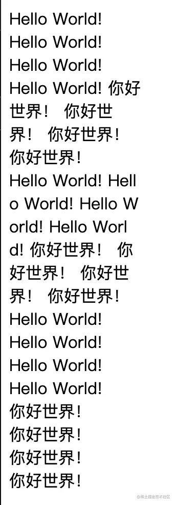

#### word-wrap

指定长单词或URL地址的换行规则。

- `normal`：不换行，可能会超出容器。
- `word-break`：允许长单词或URL地址根据容器宽度进度换行。

```css
div {
  width: 100px;
  border: 1px solid red;
}

.wrap1 {
  word-wrap: normal;
}

.wrap2 {
  word-wrap: break-word;
}
```


```html
<div class="wrap1">
  https://juejin.com
</div>
<div class="wrap2">
  https://juejin.com
</div>
```


效果如下图所示：

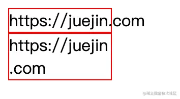


#### white-space

指定处理元素中空白（空格、制表符、换行符等）的策略。

- `normal`：连续的空白符会被合并，换行符会被当作空白符来处理。
- `nowrap`：和 `normal` 一样，连续的空白符会被合并。但文本内的换行无效。
- `pre`：连续的空白符会被保留。在遇到换行符或者 `<br>` 元素时才会换行。
- `pre-wrap`：连续的空白符会被保留。在遇到换行符或者 `<br>` 元素，或者需要为了填充容器时才会换行。
- `pre-line`：连续的空白符会被合并。在遇到换行符或者 `<br>` 元素，或者需要为了填充容器时会换行。

- `break-spaces` 与 `pre-wrap`的行为相同，除了：
  1. 任何保留的空白序列总是占用空间，包括在行尾。
  2. 每个保留的空格字符后都存在换行机会，包括空格字符之间。
  3. 这样保留的空间占用空间而不会挂起，从而影响盒子的固有尺寸（最小内容大小和最大内容大小）。

```javascript
for (let i = 1; i <= 6; i++) {
  const div = document.getElementById(`ws${i}`);

  div.innerHTML =
`But ere she from the church-door stepped
     She smiled and told us why:
'It was a wicked woman's curse,'
     Quoth she, 'and what care I?'

She smiled, and smiled, and passed it off
     Ere from the door she stept—`;
}
```


```css
div {
  width: 232px;
  border: 1px solid red;
}
```


```html
<div id="ws1" style="white-space: normal;"></div>
<div id="ws2" style="white-space: nowrap;"></div>
<div id="ws3" style="white-space: pre;"></div>
<div id="ws4" style="white-space: pre-wrap;"></div>
<div id="ws5" style="white-space: pre-line;"></div>
<div id="ws6" style="white-space: break-spaces;"></div>
```


效果如下图所示：

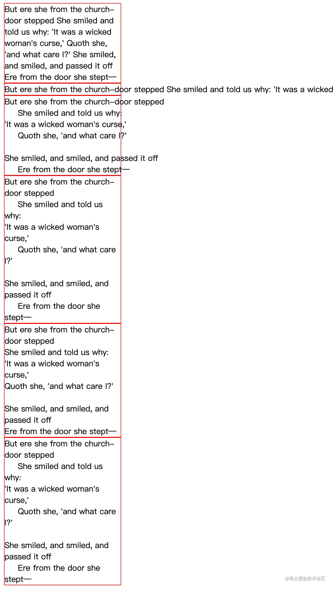

#### word-spacing

控制单词之间的空格长度。

```css
.space1 {
  word-spacing: normal;
}

.space2 {
  word-spacing: 1rem;
}
```


```html
<div class="space1">
  Hello World，你 好 世 界
</div>
<div class="space2">
  Hello World，你 好 世 界
</div>
```


效果如下图所示：

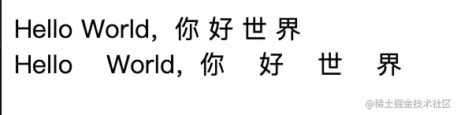

### font-family

`font-family` 其实不能简单理解为字体，它实际上是一个优先级从高到低的一个字体列表或者字体族名列表，前面的字体（或族名）如果系统没有就继续找后面的字体（或族名），直到找到为止。另外，我们通常写的 `serif`、`monospace`、`monospace`、`Helvetica` 等也不是字体，而是字体族名，是用来描述一组相似设计风格的字体的名称，它们通常由一个主要的字体家族名称和一些特定字体样式组成。例如，`Helvetica` 是一个常见的字体族名，其中包含了 `Helvetica Regular`、`Helvetica Bold`、`Helvetica Italic` 等字体样式。

常见字体族名：

- `serif`：带衬线字体，笔画结尾有特殊的装饰线或衬线。
- `sans-serif`：无衬线字体，即笔画结尾是平滑的字体。
- `monospace`：等宽字体，即字体中每个字宽度相同。
- `cursive`：草书字体。这种字体有的有连笔，有的还有特殊的斜体效果。因为一般这种字体都有一点连笔效果，所以会给人一种手写的感觉。
- `system-ui`：从浏览器所处平台处获取的默认用户界面字体。由于世界各地的排版习惯之间有很大的差异，因此为那些不适合其他通用字体的字体提供了这个通用字体。

```html
<div>Hello World! 你好世界！</div>
<div style="font-family: serif;">serif Hello World! 你好世界！</div>
<div style="font-family: sans-serif;">sans-serif Hello World! 你好世界！</div>
<div style="font-family: monospace;">monospace Hello World! 你好世界！</div>
<div style="font-family: cursive;">cursive Hello World! 你好世界！</div>
<div style="font-family: system-ui;">system-ui Hello World! 你好世界！</div>
<div style="font-family: Arial, Helvetica, sans-serif;">Arial, Helvetica, sans-serif Hello World! 你好世界！</div>
<div style="font-family: 'Courier New', Courier, monospace">'Courier New', Courier, monospace Hello World! 你好世界！</div>
```


效果如下图所示：

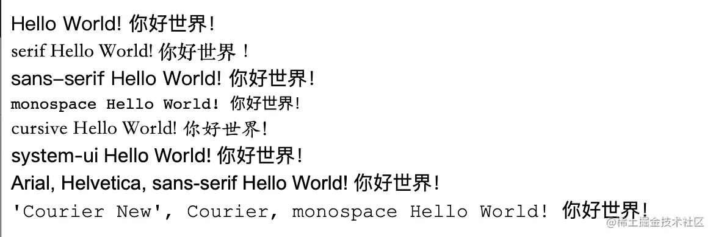


### 外部字体引入

外部字体引入的第一步是定义字体，使用 `@font-face` 关键字定义字体，然后再用 `font-famliy` 使用即可。

比如，我这里在网上下了一个字体叫”美神勇兔生肖“

```css
@font-face {
  font-family: MeiShenYongTuShengXiao;
  src: url('./MeiShenYongTuShengXiao.ttf');
}
```


```html
<h1 style="font-family: MeiShenYongTuShengXiao;">Hello World! 你好世界！</h1>
```


效果如下图所示：


### 字体图标

字体图标是一种矢量图形，用于代表各种不同的符号、图标或图形，我们可以使用 CSS 去修改其样式就像字体一样，小巧方便，要比图片要轻很多。

比较流行的字体图表库有：

- [FontAwesome](https://fontawesome.com.cn/)
- [iconfont-阿里巴巴矢量图标库](https://www.iconfont.cn/)
- [Material Icons](https://mui.com/material-ui/material-icons/)

具体的使用方式直接看官方文档就好了。


## CSS 变量

以 `--` 开头，靠 `var()` 来使用。

两种用法展示：

局部变量

```css
div {
  --main-bg-color: brown;
}

.one {
  color: var(--main-bg-color);
}
```


```html
<div class="one">Hello World! 你好世界！</div>
<p class="one">Hello World! 你好世界！</p>
```


效果如下图所示：

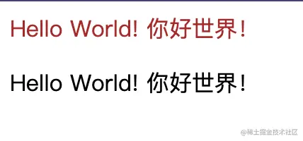

如果把 `div` 改为 `:root`，就可以全局使用这个变量了。


## 各种 deep 写法

`deep` 写法其实不是 CSS 的写法，这是在各个框架搞出了带作用域（`scoped`）的 `style` 之后才需要的东西。

举个例子，假设我现在正在使用 `Ant Design Vue`，我想用它的按钮组件，并且需要简单修改一下这个按钮组件的样式， 我在一个 div 下放了三个这样的按钮组件：

子组件：

```vue
<script setup lang="ts"></script>

<script lang="ts">
export default { name: 'MyBtns' };
</script>

<template>
  <div>
    <a-button type="primary">{{ 'btn1' }}</a-button>
    <a-button type="primary">{{ 'btn2' }}</a-button>
    <a-button type="primary">{{ 'btn3' }}</a-button>
  </div>
</template>

<style scoped lang="less"></style>
```

父组件：

```vue
<script setup lang="ts">
import MyBtns from './btns.vue';
</script>

<template>
  <my-btns />
</template>

<style scoped lang="less">
.ant-btn {
  color: orange;
}
</style>
```

如果这样写子组件的按钮的颜色肯定是不会变的，因为 `.ant-btn` 是放在父组件的样式作用域里面的，子组件有自己的作用域，他们就被隔离起来了，如果要想子组件中的 `.ant-btn` 样式也能生效就需要加 `:deep` 函数。

```css
:deep(.ant-btn) {
  color: orange;
}
```

过去 `:deep()` 函数还有各种写法：`::deep`、`>>>`、`/deep/`、`v-deep` 等，但是这些写法都被淘汰了，就不要再用了。

React 中要实现类型功能需要用到 `:global`，当然 Vue 中也有 `:global()` 函数，相比之下 Vue 提供的方案更加全面。

Angular 中的 `:host ::ng-deep` 就和`:deep()` 函数的效果一样，如果不加 `:host` 会直接作用于全局。


## 原子化 CSS

原子化 CSS 是一种 CSS 编写的方法论，它的主要思想是将 CSS 样式规则拆分成小的、独立的、可复用的部分，这些部分被称为“原子类”

在原子化 CSS 中，每个原子类只包含一个很小的样式规则，比如设置颜色、字体大小、边距、背景等。通过将这些小的样式规则组合起来，可以构建出复杂的页面。

原子化 CSS 的优势包括：

1. 可复用性：由于样式规则被拆分成独立的原子类，可以在不同的元素上重复使用。这样可以减少代码冗余并提高代码的可维护性。

2. 灵活性：通过组合不同的原子类，可以快速构建出不同样式和布局的组件。

3. 性能优化：由于原子类是独立的小样式规则，可以利用浏览器的缓存机制，减少下载和解析的数据量，从而提高页面加载速度。

4. 易于维护：每个原子类只包含一个样式规则，修改和扩展样式更加清晰和方便。

尽管原子化 CSS 有一些好处，但也存在一些缺点和考虑因素：

1. 学习曲线：原子化 CSS 需要掌握一套新的类命名规则和组合方式，这可能需要一定的学习曲线。特别是对于团队中新加入的开发人员，需要一定的时间来适应和理解原子化 CSS 的工作方式。
2. 类名冲突：当原子类命名不规范或命名空间不清晰时，可能会导致类名冲突的问题。如果不小心定义了相同的类名，可能会造成样式的混乱和冲突。
3. 管理成本：由于原子化 CSS 以小的样式单元为基础，可能会导致样式表的冗余和重复。在大型项目中，管理和维护大量的原子类可能会变得复杂，并需要额外的工具和规范来确保一致性和可维护性。
4. 语义性问题：原子化 CSS 通常使用简短的类名来表示样式规则，这可能会导致语义性的丧失。开发人员和设计师可能需要花费额外的时间来理解每个类名的含义和作用。
5. 深度嵌套的问题：原子化 CSS 通常倾向于使用多个类名来定义样式，这可能导致在 HTML 标记中出现深度嵌套的问题。这可能会增加 HTML 的复杂性，并可能使选择器的性能受到影响。

因此，在决定是否使用原子化CSS时，需要考虑项目的规模、团队的技术能力以及维护成本等因素，权衡好其中的利与弊。

原子化 CSS 最流行的框架应该就是 [Tailwind CSS](https://tailwindcss.com/) 了。
