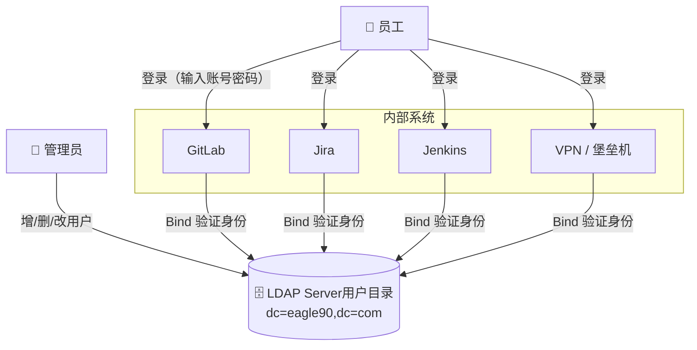

# LDAP

> 首发于：2026-07-06
>
> 本文部分内容使用AI辅助生成

## 概述

LDAP（Lightweight Directory Access Protocol，轻量级目录访问协议）是一个开放的、跨平台的、用于访问和维护分布式目录信息服务的应用层协议。它基于 [X.500](https://baike.baidu.com/item/X.500) 标准，但更轻量，因此得名"轻量级"。

> **X.500** 是 ITU-T（国际电信联盟）定义的一套目录服务标准，包含完整的目录访问协议（DAP）、目录系统协议（DSP）等。不过 X.500 协议栈基于 OSI 七层模型，实现复杂且资源消耗大。LDAP 把核心功能搬到了 TCP/IP 栈上，去掉了很多不常用的部分，用更简单的字符串格式（LDIF）代替了 ASN.1 二进制编码，使其变得"轻量"，成为目前目录服务的事实标准。

一句话理解：**LDAP 是专门为"读多写少"场景设计的数据库，最常见的用途是统一管理企业内部的用户账号和权限，百万级用户规模下查询速度极快。**

它解决的典型问题：

- 公司有 10 个内部系统（GitLab、Jira、Jenkins、VPN...），每入职一人就得在每个系统建账号，离职得逐个禁用
- LDAP 统一存用户账号 → 所有系统对接同一套 LDAP → 入职建一次，离职禁一次

### 典型部署架构



> 每个系统不再自己存密码，而是把用户输入的账号密码转发给 LDAP 做 **Bind 验证**。验证通过即登录成功。管理员只在 LDAP 里操作一次，所有系统自动生效。

## 核心概念

我们以一家公司 `eagle90.com` 为例，一步步搭建一棵目录树。每一步都引入一个新概念。

### 第一层：根 —— dc 与 Base DN

一棵树先有根。把域名 `eagle90.com` 按 `.` 拆开，就得到了 LDAP 目录树的根：

```
dc=eagle90,dc=com
```

- **`dc`**（Domain Component）：域名组件。`dc=eagle90,dc=com` 就是域名 `eagle90.com` 在 LDAP 里的表示方式。
- **Base DN**：这棵树的根 DN，后续所有查询都以此为起点。类似文件系统的根目录 `/`。

### 第二层：分支 —— ou 与 ObjectClass

公司内部要分部门。在 LDAP 里用 **`ou`**（Organizational Unit，组织单元）来表示分支：

```
dc=eagle90,dc=com
├── ou=People
└── ou=Groups
```

这里引出一个核心问题：**什么东西决定 `ou=People` 这个节点可以有哪些属性？** 答案就是 **ObjectClass**。

ObjectClass 类似 TypeScript 的 interface——它规定了某个节点**必须**和**可以**包含哪些属性。创建节点时，管理员从 Schema 预定义的"菜单"里选一个 ObjectClass 赋给它。`ou=People` 和 `ou=Groups` 都是分支节点，所以管理员给它们选了 `organizationalUnit` 这个 ObjectClass：

```
dc=eagle90,dc=com
├── ou=People                  ← objectClass: organizationalUnit
└── ou=Groups                  ← objectClass: organizationalUnit
```

### 第三层：叶子——用户条目

有了 `ou=People` 分支，往里加人。每个用户是树的一个**条目（Entry）**——ObjectClass 只是"规则"，Entry 是遵守规则的"实例"。

以 alice 为例，管理员创建时给她选了 3 个 ObjectClass（层层叠加）：`top`（所有条目的基类，必须）→ `person`（要求必须有 cn、sn）→ `inetOrgPerson`（额外可选 mail、uid）。然后填入具体值：

```
dc=eagle90,dc=com
├── ou=People                  ← objectClass: organizationalUnit
│   └── uid=alice              ← objectClass: inetOrgPerson
│       ├── cn: Alice Wang
│       ├── sn: Wang
│       ├── uid: alice
│       ├── mail: alice@eagle90.com
│       └── userPassword: ****
└── ou=Groups                  ← objectClass: organizationalUnit
```

这个 Entry 的 [LDIF](#ldif-格式) 表示：

```
dn: uid=alice,ou=People,dc=eagle90,dc=com
objectClass: top
objectClass: person
objectClass: inetOrgPerson
cn: Alice Wang
sn: Wang
uid: alice
mail: alice@eagle90.com
mail: alice.wang@gmail.com
userPassword: {SSHA}xxxxxxx
```

这里面出现的属性：

| 属性 | 全称 | 含义 |
|------|------|------|
| `cn` | Common Name | 通用名称，人的全名或组的显示名 |
| `sn` | Surname | 姓，`person` 要求必须有 |
| `uid` | User ID | 用户登录名，组织内唯一 |
| `mail` | Email Address | 邮箱，一个条目可以有多个（上面 alice 有两个） |
| `userPassword` | — | 密码，以 `{SSHA}` 等服务端哈希格式存储 |

> 这些属性由 Schema 预定义，每个都有唯一的 OID，不能随意改名。

#### DN 与 RDN

- **DN**（Distinguished Name）：条目在树中的完整路径，全局唯一。比如 alice 的 DN 是 `uid=alice,ou=People,dc=eagle90,dc=com`——从叶子一路追溯到根，类比文件系统的绝对路径。
- **RDN**（Relative Distinguished Name）：条目的本地名称，同级唯一。比如 `uid=alice`。

### 第三层（另一分支）：用户组

到此为止只有"人"，还没有"组"。在 `ou=Groups` 分支下创建组条目，管理员选 `groupOfNames` 这个 ObjectClass，用 `member` 属性引用成员的完整 DN：

```
dc=eagle90,dc=com
├── ou=People                  ← objectClass: organizationalUnit
│   └── uid=alice              ← objectClass: inetOrgPerson
│       ├── cn: Alice Wang
│       ├── sn: Wang
│       ├── uid: alice
│       ├── mail: alice@eagle90.com
│       └── userPassword: ****
└── ou=Groups                  ← objectClass: organizationalUnit
    └── cn=engineers           ← objectClass: groupOfNames
        └── member: uid=alice,ou=People,dc=eagle90,dc=com
```

- **`member`**：组成员引用，值是成员的完整 DN。一个组可以有多个 member。
- 有了组，应用的权限系统就可以查"alice 是否属于 engineers 组"来决定她能不能访问某个接口。

### 回顾：ObjectClass 一览

回顾整棵树，不同层级用了不同的 ObjectClass。这些 class 都定义在 LDAP 标准 RFC 中，是 Schema 的一部分：

| ObjectClass | 用途 | 来源 | 树中的体现 |
|-------------|------|------|-----------|
| `top` | 所有 class 的基类 | RFC 4512 | 每个条目都继承它 |
| `organizationalUnit` | 组织单元，构成树的分支 | RFC 4519 | `ou=People`、`ou=Groups` |
| `person` | 基本人员（必须含 cn、sn） | RFC 4519 | alice 的 cn、sn |
| `inetOrgPerson` | 在 person 上增加 mail、uid 等 | RFC 2798 | alice 的 uid、mail |
| `groupOfNames` | 用户组，通过 member 引用成员 | RFC 4519 | `cn=engineers` |

### 规则从哪来 —— Schema 与 OID

所有 ObjectClass 和属性都来自 **Schema**。OpenLDAP 安装时自带标准 Schema 文件：

```sh
ls /etc/ldap/schema/
# core.schema            ← person、organizationalUnit、groupOfNames 等核心定义
# inetorgperson.schema   ← inetOrgPerson（RFC 2798）
# cosine.schema          ← 早期扩展属性
# nis.schema             ← posixAccount 等 POSIX 相关
```

每个属性还有全局唯一的 **OID**（Object Identifier）：

| 属性 | OID |
|------|-----|
| `cn` | 2.5.4.3 |
| `sn` | 2.5.4.4 |
| `uid` | 0.9.2342.19200300.100.1.1 |
| `mail` | 0.9.2342.19200300.100.1.3 |
| `userPassword` | 2.5.4.35 |

你也可以编写自定义 Schema 来添加自己的 ObjectClass 和属性。

## LDAP 协议基础

### TCP 端口

- **389**：明文 LDAP（支持 StartTLS 升级加密）
- **636**：LDAPS（LDAP over SSL/TLS，从连接开始即加密）

### 基本操作

| 操作 | 描述 |
|------|------|
| **Bind** | 认证（"登录"），发送 DN + 密码 |
| **Search** | 查询目录 |
| **Add** | 新增条目 |
| **Delete** | 删除条目 |
| **Modify** | 修改条目属性 |
| **ModifyDN** | 移动/重命名条目 |
| **Unbind** | 断开连接 |
| **Compare** | 判断某条目的某属性是否等于给定值 |

### LDAP 认证模式

**1. 简单绑定（Simple Bind）**

客户端发送 DN + 明文密码，服务端验证。

```
客户端发送：
  BindRequest
    dn: uid=alice,ou=People,dc=eagle90,dc=com
    password: s3cret

服务端响应（校验密码后）：
  BindResponse → success 或 invalidCredentials
```

**2. SASL 绑定**

通过外部认证机制（Kerberos、证书等）进行身份验证，更安全但更复杂。

### Search Filter（搜索过滤器）

这是 LDAP 最常用的功能。Filter 语法类似布尔表达式，前缀表示法：

```
(objectClass=person)                          ← 查找所有 person 条目
(&(objectClass=person)(uid=alice))            ← AND：找出 uid=alice 的 person
(|(uid=alice)(uid=bob))                       ← OR：找出 alice 或 bob
(!(uid=alice))                                ← NOT：uid 不是 alice 的条目
(mail=*)                                      ← mail 属性不为空
(&(objectClass=person)(|(cn=A*)(cn=B*)))      ← 组合：名字以 A 或 B 开头的人

# 子字符串匹配（少见但有用）
(cn=王*)                                      ← cn 以"王"开头
(cn=*明)                                      ← cn 以"明"结尾
(cn=*小*)                                     ← cn 包含"小"
```

常用操作符：

| 操作符 | 含义 |
|--------|------|
| `=` | 等于 |
| `>=` | 大于等于 |
| `<=` | 小于等于 |
| `=*` | 属性存在（有值） |
| `~=` | 近似匹配（soundex） |

## 安装与配置 OpenLDAP

LDAP 是一个**协议**，不是软件。要跑起来，你需要一个实现了 LDAP 协议的服务端。常见选择：

| 服务端 | 说明 |
|--------|------|
| **OpenLDAP** | 最主流的开源实现，Linux/Unix 标配，轻量高效 |
| 389 Directory Server | Red Hat 系，功能更全但更重 |
| Apache Directory Server | Java 实现，跨平台 |
| Active Directory | 微软的，绑定 Windows Server，不仅 LDAP 还包含 Kerberos、DNS、GPO 等 |

本文选 **OpenLDAP**——最通用、跨平台、社区最大，也是生产环境中最常见的 LDAP 服务端。

### macOS

```sh
brew install openldap
```

### Ubuntu/Debian

```sh
sudo apt update
sudo apt install slapd ldap-utils
# slapd  = Standalone LDAP Daemon，OpenLDAP 的服务端进程
# ldap-utils = ldapsearch、ldapadd、ldapmodify 等命令行工具

# 安装过程中会提示设置 admin 密码
# 安装完成后重新配置
sudo dpkg-reconfigure slapd
```

### Docker 方式（推荐开发调试）

用 [osixia/openldap](https://hub.docker.com/r/osixia/openldap) 镜像，一行命令即可启动 LDAP 服务端。各环境变量的作用见注释：

```sh
docker run -d \
  --name ldap-server \
  -p 389:389 \
  -p 636:636 \
  -e LDAP_ORGANISATION="Eagle90" \     # 组织名称（仅描述用途）
  -e LDAP_DOMAIN="eagle90.com" \        # 域名 → 自动生成 dc=eagle90,dc=com
  -e LDAP_ADMIN_PASSWORD="admin123" \   # 管理员密码
  -e LDAP_CONFIG_PASSWORD="config123" \ # cn=config 配置密码
  --restart unless-stopped \
  osixia/openldap:latest
```

> 这个镜像会根据 `LDAP_DOMAIN` **自动创建** Base DN 和管理员账号。管理员 DN 固定为 `cn=admin,dc=eagle90,dc=com`（`cn=admin` 是镜像内置的，不需要额外配置）。

同时跑一个 Web 管理界面方便查看和编辑：

```sh
# phpLDAPadmin：基于 Web 的 LDAP 浏览器
docker run -d \
  --name phpldapadmin \
  -p 8080:80 \
  -e PHPLDAPADMIN_HTTPS=false \
  -e PHPLDAPADMIN_LDAP_HOSTS=ldap-server \
  --link ldap-server \
  --restart unless-stopped \
  osixia/phpldapadmin:latest
```

> `--link` 是 Docker 早期网络模式，本地开发够用。生产环境建议用 `docker network create` + `--network` 代替。

启动后访问 `http://localhost:8080`，用以下凭据登录：

```
Login DN: cn=admin,dc=eagle90,dc=com
Password: admin123
```

## 命令行操作

LDAP 服务端跑起来之后，怎么操作数据？所有增删改查都通过命令行工具完成，而这些工具统一使用 **LDIF**（LDAP Data Interchange Format）作为数据描述格式。

### LDIF 格式

LDIF 是 LDAP 的"DSL"——一个纯文本格式，用来描述目录数据。每条命令的输出是 LDIF，输入也是 LDIF。

格式规则很简单：

```
# 1. 井号开头是注释（必须独占一行，行内 # 会被当成值）
# 2. 每个条目以 dn: 开头，后面跟若干 key: value
# 3. 条目之间用空行分隔
# 4. 多值属性重复 key 即可（比如两个 mail）
```

### ldapadd —— 新增

回到前面的例子，把整棵 `eagle90.com` 目录树写成 LDIF 文件，用 `ldapadd` 一次性导入：

```ldif
# add-tree.ldif

dn: ou=People,dc=eagle90,dc=com
objectClass: organizationalUnit
ou: People

dn: ou=Groups,dc=eagle90,dc=com
objectClass: organizationalUnit
ou: Groups

dn: uid=alice,ou=People,dc=eagle90,dc=com
objectClass: top
objectClass: person
objectClass: inetOrgPerson
cn: Alice Wang
sn: Wang
uid: alice
mail: alice@eagle90.com
userPassword: s3cret123

dn: uid=bob,ou=People,dc=eagle90,dc=com
objectClass: top
objectClass: person
objectClass: inetOrgPerson
cn: Bob Li
sn: Li
uid: bob
mail: bob@eagle90.com
userPassword: s3cret456

dn: cn=engineers,ou=Groups,dc=eagle90,dc=com
objectClass: groupOfNames
cn: engineers
member: uid=alice,ou=People,dc=eagle90,dc=com
member: uid=bob,ou=People,dc=eagle90,dc=com
```

```sh
ldapadd -x -H ldap://localhost:389 \
  -D "cn=admin,dc=eagle90,dc=com" -w admin123 \
  -f add-tree.ldif
```

### ldapmodify —— 修改

修改和新增不同，LDIF 里需要用 `changetype: modify` 声明操作类型，配合 `replace` / `add` / `delete` 指定字段级别的变更：

```ldif
# modify.ldif

# 替换 alice 的邮箱
dn: uid=alice,ou=People,dc=eagle90,dc=com
changetype: modify
replace: mail
mail: alice_new@eagle90.com

# 给 alice 加手机号
dn: uid=alice,ou=People,dc=eagle90,dc=com
changetype: modify
add: mobile
mobile: +86 13800138000

# 删除 alice 的手机号
dn: uid=alice,ou=People,dc=eagle90,dc=com
changetype: modify
delete: mobile

# 把 alice 加入 designers 组
dn: cn=designers,ou=Groups,dc=eagle90,dc=com
changetype: modify
add: member
member: uid=alice,ou=People,dc=eagle90,dc=com
```

```sh
ldapmodify -x -H ldap://localhost:389 \
  -D "cn=admin,dc=eagle90,dc=com" -w admin123 \
  -f modify.ldif
```

### ldapdelete —— 删除

```sh
# 删除单个条目
ldapdelete -x -H ldap://localhost:389 \
  -D "cn=admin,dc=eagle90,dc=com" -w admin123 \
  "uid=alice,ou=People,dc=eagle90,dc=com"

# 递归删除整个分支（谨慎！）
ldapdelete -x -H ldap://localhost:389 \
  -D "cn=admin,dc=eagle90,dc=com" -w admin123 \
  -r "ou=People,dc=eagle90,dc=com"
```

### ldapsearch —— 查询

```sh
# 查询所有条目（常用参数）
ldapsearch -x \                    # 简单认证（非 SASL）
  -H ldap://localhost:389 \         # LDAP 服务器地址
  -D "cn=admin,dc=eagle90,dc=com" \ # Bind DN（管理员账号）
  -w admin123 \                     # 密码（或 -W 交互输入）
  -b "dc=eagle90,dc=com" \          # Base DN（搜索起点）
  "(objectClass=person)"            # Filter

# 只返回 dn 和 cn（减少输出）
ldapsearch -x -H ldap://localhost -D "cn=admin,dc=eagle90,dc=com" -w admin123 \
  -b "dc=eagle90,dc=com" "(objectClass=person)" dn cn

# 精确搜索 + 组合条件
ldapsearch -x -H ldap://localhost -D "cn=admin,dc=eagle90,dc=com" -w admin123 \
  -b "dc=eagle90,dc=com" "(&(objectClass=person)(uid=alice))"

# 匿名查询（如果服务端允许）
ldapsearch -x -H ldap://localhost -b "dc=eagle90,dc=com" "(uid=alice)"
```

### ldapwhoami —— 验证身份

```sh
# 测试 bind 是否成功，返回当前用户的 DN
ldapwhoami -x \
  -H ldap://localhost:389 \
  -D "uid=alice,ou=People,dc=eagle90,dc=com" \
  -w alice_password

# 输出：dn:uid=alice,ou=People,dc=eagle90,dc=com
```

### ldappasswd —— 修改密码

```sh
ldappasswd -x \
  -H ldap://localhost:389 \
  -D "cn=admin,dc=eagle90,dc=com" \
  -w admin123 \
  -s newPassword \
  "uid=alice,ou=People,dc=eagle90,dc=com"
```

## 启用 LDAPS

前面一直用明文 389 端口跑，生产环境必须加密。LDAP 有两种加密方式：

| | LDAPS（端口 636） | StartTLS（端口 389） |
|------|------|------|
| **原理** | 连接即 TLS 握手，从第一个字节开始加密 | 先明文连接，客户端发 `StartTLS` 请求，双方协商升级为 TLS |
| **优点** | 默认安全——不解密就连不上，不存在降级可能；不同端口 = 不同安全策略，防火墙规则清晰 | 复用标准 389 端口，无需额外开防火墙；IANA 官方推荐的加密方式（已取消 LDAPS 的 deprecated 标记） |
| **缺点** | 多占一个端口 | **默认不安全**——如果服务端没有显式禁止明文操作，中间人可以拦截 StartTLS 请求让连接回退到明文 |

**StartTLS 的降级攻击可以完全消除**——只需在服务端加一条配置，禁止在 TLS 建立之前执行任何 LDAP 操作：

```sh
# 在 cn=config 中设置：TLS 未完成前拒绝所有请求
dn: cn=config
changetype: modify
add: olcSecurity
olcSecurity: tls=1
```

加了这行之后，客户端在完成 StartTLS 握手之前连 `Bind` 都发不出去，降级攻击就无从下手。但问题在于 **LDAPS 默认就是安全的，而 StartTLS 默认不安全、要靠管理员记得加这行配置**——现实中忘记配的情况很常见，这就是降级攻击案例多的根源。

> **结论**：两者配置正确都可以安全使用。选 LDAPS 的理由不是它"更安全"，而是它 **fail-safe**——不做任何额外配置就已经是安全的，不会因为遗漏一行配置而暴露。

本节以 LDAPS 为例，覆盖自签证书 + 服务端配置 + 客户端验证。StartTLS 的配置只需在上述 LDIF 中加上 `olcSecurity: tls=1` 并改用 389 端口即可，其余步骤完全一致。

### 生成 TLS 证书

开发环境用自签证书，生产环境用 Let's Encrypt 或内部 CA。

```sh
# 生成私钥 + 自签证书（有效期 365 天）
openssl req -x509 -nodes -days 365 \
  -newkey rsa:2048 \
  -keyout /etc/ldap/ssl/ldap.key \
  -out /etc/ldap/ssl/ldap.crt \
  -subj "/C=CN/ST=Shanghai/L=Shanghai/O=Eagle90/CN=ldap.eagle90.com"

# 修改权限：私钥只允许 openldap 用户读取
chmod 640 /etc/ldap/ssl/ldap.key
chown root:openldap /etc/ldap/ssl/ldap.key
```

### 配置 slapd 加载证书并监听 636

OpenLDAP 运行时配置存在 `cn=config` 目录（它本身也是一棵 LDAP 树）。用 LDIF + `ldapmodify` 写入 TLS 证书路径，然后编辑 init 脚本让 slapd 监听 636：

```ldif
# tls-config.ldif

dn: cn=config
changetype: modify
add: olcTLSCACertificateFile
olcTLSCACertificateFile: /etc/ldap/ssl/ldap.crt
-
add: olcTLSCertificateFile
olcTLSCertificateFile: /etc/ldap/ssl/ldap.crt
-
add: olcTLSCertificateKeyFile
olcTLSCertificateKeyFile: /etc/ldap/ssl/ldap.key
-
add: olcTLSVerifyClient
olcTLSVerifyClient: never
```

```sh
# 通过 Unix socket 以 root 身份操作 cn=config（免密码）
ldapmodify -Y EXTERNAL -H ldapi:/// -f tls-config.ldif

# 编辑服务启动参数，添加 ldaps:/// 监听
# Debian/Ubuntu
echo 'SLAPD_SERVICES="ldap:/// ldapi:/// ldaps:///"' >> /etc/default/slapd

# 重启生效
systemctl restart slapd
```

> Docker 镜像（`osixia/openldap`）已自带自签证书并默认监听 636，不需要手动配置。

### 验证 LDAPS 是否生效

```sh
# 用 ldaps:// 协议连接（自签证书需 -Z 或 LDAPTLS_REQCERT=never）
LDAPTLS_REQCERT=never ldapsearch -x \
  -H ldaps://localhost:636 \
  -D "cn=admin,dc=eagle90,dc=com" -w admin123 \
  -b "dc=eagle90,dc=com" "(objectClass=person)" dn

# 测试 StartTLS（在 389 端口上先明文连接再升级加密）
ldapsearch -x -Z \
  -H ldap://localhost:389 \
  -D "cn=admin,dc=eagle90,dc=com" -w admin123 \
  -b "dc=eagle90,dc=com" "(objectClass=person)" dn
```

> `-Z` 是 `ldapsearch` 的 StartTLS 选项（相当于 `ldap_start_tls_s()` 调用）。`LDAPTLS_REQCERT=never` 只在开发环境对自签证书使用，生产环境必须用合法 CA 证书。

## 参考资料

- [LDAP Wiki](https://en.wikipedia.org/wiki/Lightweight_Directory_Access_Protocol)
- [OpenLDAP Documentation](https://www.openldap.org/doc/)
- [RFC 4511 - LDAP Protocol](https://tools.ietf.org/html/rfc4511)
- [LDAP for Rocket Scientists (Zytrax OpenLDAP Guide)](https://www.zytrax.com/books/ldap/)
