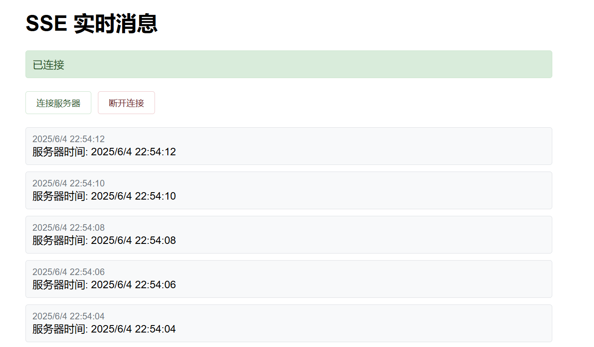
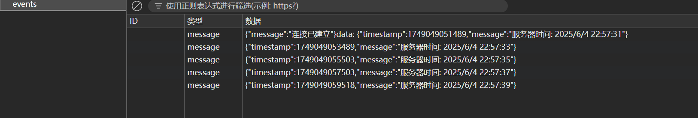

# 什么是SSE

SSE 即 Server-Sent Events，允许服务端向客户端推送事件的技术，是一种单向数据推送的技术。

客户端通过这项技术可以与服务器建立持久连接，服务器可以持续发现事件流，但是客户端无法通过同一连接反向发送数据。

SSE 基于 HTTP 协议，而不是像 WebSocket 一样使用了一套独立的协议。SSE 利用 HTTP/1.1的持久连接或HTTP/2的多路特性进行实现，不过相比 HTTP/1.1，HTTP/2的最大连接数会大很多（HTTP/1.1是6个，而HTTP/2 默认是100个）。

## 对比轮询

轮询（Polling）是我们平时最常用的客户端向服务端周期性请求数据的手段。

轮询的优点就是实现简单，服务端无需做任何特殊处理，但是缺点也很明显，浪费资源，可能会增加服务器负载。

## 对比长轮询

长轮询（Long Polling）则是客户端在向服务器请求数据的时候，如果服务器的数据有更新或超时时才会有响应并关闭连接，客户端收到数据之后等到轮询周期到达再次发起请求，长轮询与轮询相比肯定是更高效的，不过缺点也很明显，就是请求的响应时间可能比较长，不可控。

## 对比WebSocket

WebSocket 是一个全双工的通讯协议，服务端和客户端能互相发送消息，但是服务端与客户端都需要支持 WebSocket 协议，所以实现相对复杂。

## 总结

综上所述，如果仅需服务端向客户端发送数据，且又要实现相对简单高效，那么最合适的就是用 SSE。

适合场景（高频、实时、小数据）：

- 实时数据（股票行情、新闻、社交媒体动态等）推送
- AI生成内容推送
- 轻量级监控数据推送

# 实例

> 代码均由Trae生成

## 服务端代码

NodeJS 编写，package.json 的 `type` 字段设置为 `module`。

```js
import http from 'http';

// 创建 HTTP 服务器
const server = http.createServer((req, res) => {
    // 设置 CORS 头，允许跨域访问
    res.setHeader('Access-Control-Allow-Origin', '*');
    res.setHeader('Access-Control-Allow-Headers', 'Content-Type');
    
    if (req.url === '/events') {
        // 设置 SSE 相关的响应头
        res.writeHead(200, {
            'Content-Type': 'text/event-stream',
            'Cache-Control': 'no-cache',
            'Connection': 'keep-alive'
        });

        // 发送初始连接消息
        res.write(`data: ${JSON.stringify({message: '连接已建立'})}`);

        // 创建定时发送消息的间隔器
        const intervalId = setInterval(() => {
            const data = {
                timestamp: Date.now(),
                message: `服务器时间: ${new Date().toLocaleString()}`
            };
            res.write(`data: ${JSON.stringify(data)}\n\n`);
        }, 2000);

        // 监听连接关闭事件
        req.on('close', () => {
            clearInterval(intervalId);
            console.log('客户端断开连接');
        });
    } else {
        // 对于其他请求返回 404
        res.writeHead(404);
        res.end();
    }
});

const PORT = 3000;
server.listen(PORT, () => {
    console.log(`SSE 服务器运行在 http://localhost:${PORT}`);
});
```

运行效果

```
node server
SSE 服务器运行在 http://localhost:3000
```


## 客户端代码

```html
<!DOCTYPE html>
<html lang="zh-CN">
<head>
    <meta charset="UTF-8">
    <meta name="viewport" content="width=device-width, initial-scale=1.0">
    <title>SSE 测试</title>
    <style>
        body {
            font-family: Arial, sans-serif;
            max-width: 800px;
            margin: 20px auto;
            padding: 0 20px;
        }
        .status {
            padding: 10px;
            margin-bottom: 20px;
            border-radius: 4px;
        }
        .connected {
            background-color: #d4edda;
            color: #155724;
            border: 1px solid #c3e6cb;
        }
        .disconnected {
            background-color: #f8d7da;
            color: #721c24;
            border: 1px solid #f5c6cb;
        }
        .message {
            padding: 10px;
            margin: 10px 0;
            background-color: #f8f9fa;
            border: 1px solid #dee2e6;
            border-radius: 4px;
        }
        .timestamp {
            color: #6c757d;
            font-size: 0.85em;
        }
        .controls {
            margin: 20px 0;
            display: flex;
            gap: 10px;
        }
        button {
            padding: 8px 16px;
            border-radius: 4px;
            border: 1px solid #ccc;
            background-color: #fff;
            cursor: pointer;
            transition: all 0.3s ease;
        }
        button:hover {
            background-color: #f8f9fa;
        }
        button.connect {
            color: #155724;
            border-color: #c3e6cb;
        }
        button.connect:hover {
            background-color: #d4edda;
        }
        button.disconnect {
            color: #721c24;
            border-color: #f5c6cb;
        }
        button.disconnect:hover {
            background-color: #f8d7da;
        }
    </style>
</head>
<body>
    <h1>SSE 实时消息</h1>
    <div id="connectionStatus" class="status disconnected">未连接</div>
    <div class="controls">
        <button id="connectButton" class="connect">连接服务器</button>
        <button id="disconnectButton" class="disconnect">断开连接</button>
    </div>
    <div id="messages"></div>

    <script>
        const messagesDiv = document.getElementById('messages');
        const statusDiv = document.getElementById('connectionStatus');
        const connectButton = document.getElementById('connectButton');
        const disconnectButton = document.getElementById('disconnectButton');
        let eventSource = null;

        function connect() {
            if (eventSource) {
                eventSource.close();
            }

            eventSource = new EventSource('http://localhost:3000/events');

            eventSource.onopen = function() {
                statusDiv.textContent = '已连接';
                statusDiv.className = 'status connected';
                connectButton.disabled = true;
                disconnectButton.disabled = false;
            };

            eventSource.onmessage = function(event) {
                const data = JSON.parse(event.data);
                const messageDiv = document.createElement('div');
                messageDiv.className = 'message';
                
                const timestamp = new Date(data.timestamp || Date.now()).toLocaleString();
                messageDiv.innerHTML = `
                    <div class="timestamp">${timestamp}</div>
                    <div class="content">${data.message}</div>
                `;
                
                messagesDiv.insertBefore(messageDiv, messagesDiv.firstChild);
            };

            eventSource.onerror = function() {
                statusDiv.textContent = '连接断开，请手动重新连接';
                statusDiv.className = 'status disconnected';
                connectButton.disabled = false;
                disconnectButton.disabled = true;
            };
        }

        function disconnect() {
            if (eventSource) {
                eventSource.close();
                eventSource = null;
                statusDiv.textContent = '已断开连接';
                statusDiv.className = 'status disconnected';
                connectButton.disabled = false;
                disconnectButton.disabled = true;
            }
        }

        // 绑定按钮事件
        connectButton.onclick = connect;
        disconnectButton.onclick = disconnect;

        // 初始状态设置
        disconnectButton.disabled = true;
    </script>
</body>
</html>
```

显示效果如下图所示：



浏览器Network收到消息如下图所示：


