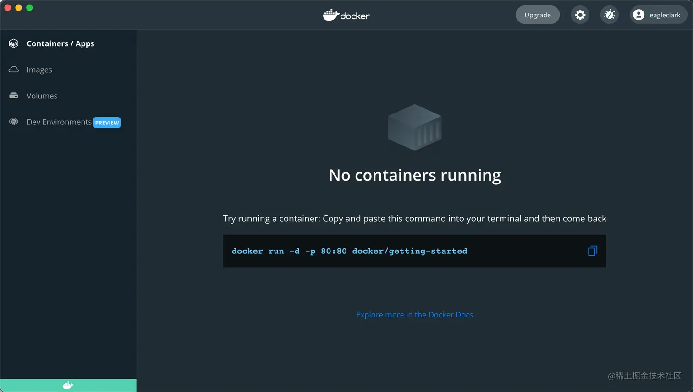
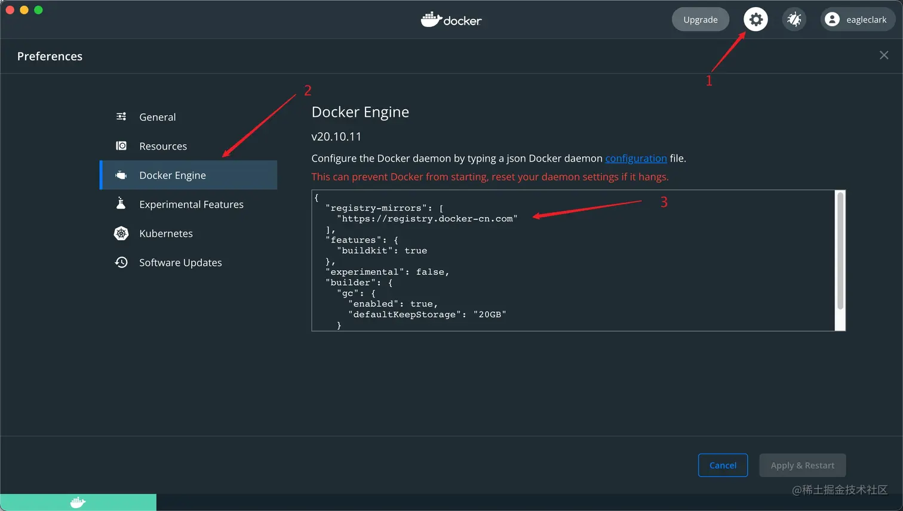
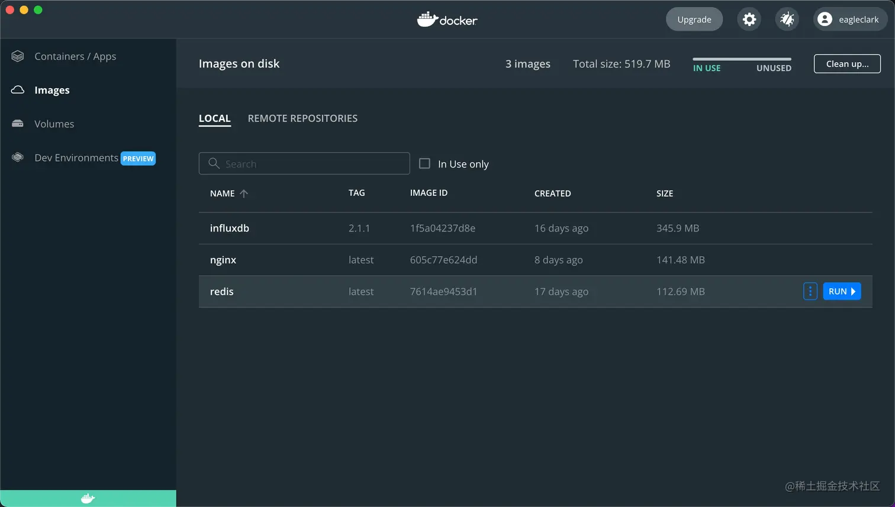
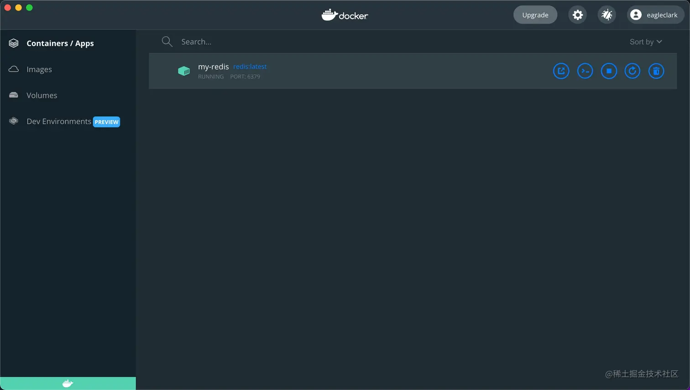
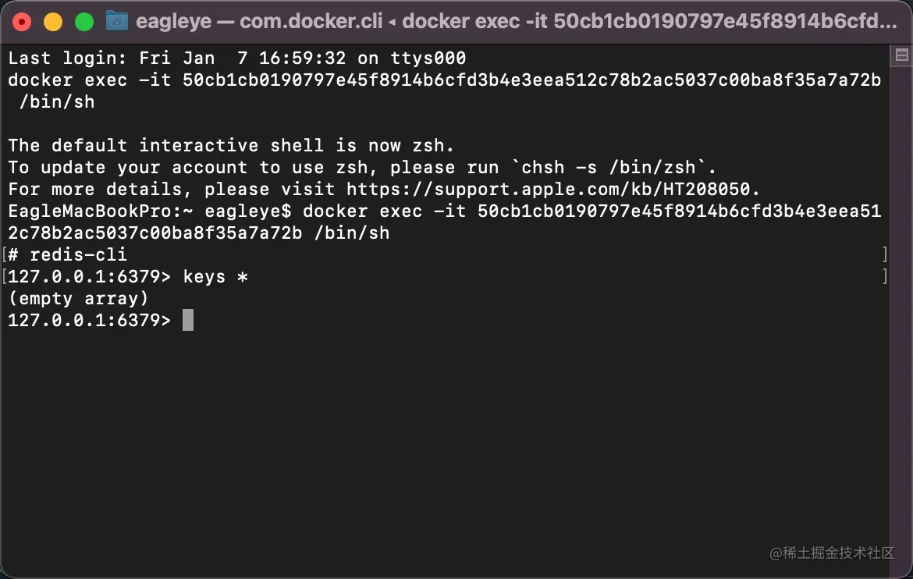
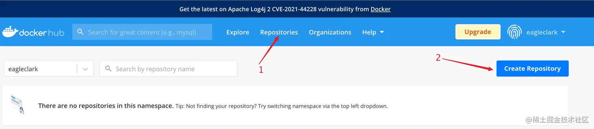
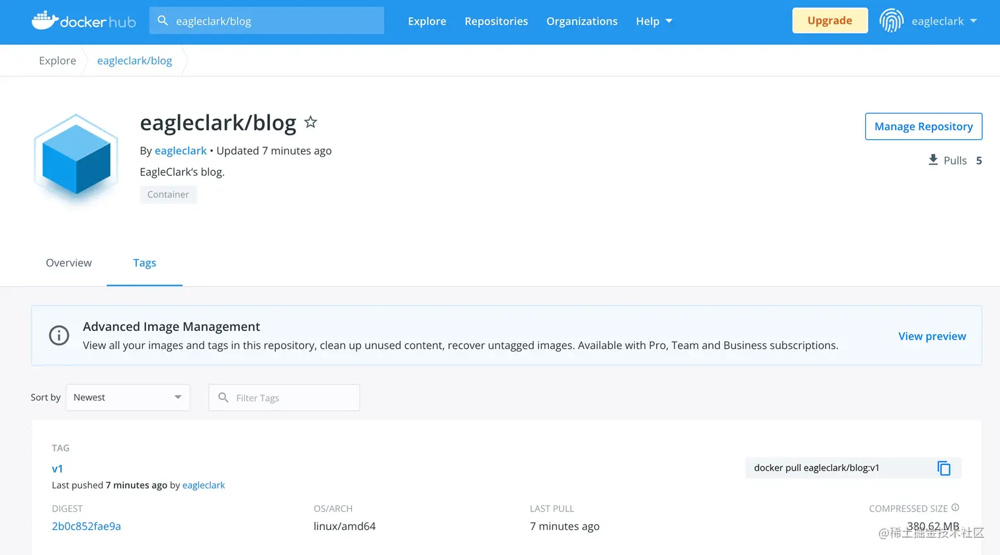
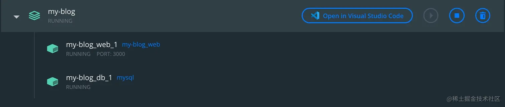

# Docker

> 首发于：2022-01-08

## 简介

Docker 是一个基于 Go 语言开发的开源（遵从 Apache 2.0 协议）的应用容器引擎，让开发者可以打包他们的应用以及依赖包到一个可移植的镜像中，然后发布到任何流行的 `Linux`、`MacOS` 或 `Windows` 操作系统的机器上，也可以实现虚拟化。容器是完全使用沙箱机制，相互之间不会有任何接口。

Docker 与虚拟机有一些相似之处，你也可以把 Docker 理解为一个轻量的虚拟机，它只虚拟你软件需要的运行环境，而普通的虚拟机则是一个完整而庞大的系统。

在我看来，Docker 其实也是一个应用程序，它的安装也与普通应用程序安装无异，安装好 docker 之后通常会在 docker 里面再去安装其它的软件，比如：Redis、MySQL、NGINX 等。装好之后这些软件还是跑在 docker 中的，不过你可以将你本地端口和 Docker 内部的端口进行映射，这样你就可以像访问本地应用一样访问 docker 中的应用了。

不过话说回来，为什么我们要这样去安装和使用软件呢，直接装不行吗？

举个几个例子：

1. Redis，官网上没有 windows 版本的安装包，想要在 windows 搞一个 Redis 可能需要费点儿劲，但是有了 docker，你只需要一行命令。
2. MySQL，以前做项目的时候安装 MySQL 的时候安装程序总会检查半天安装环境，通常都会检查出来缺这个依赖缺那个依赖的，然后找半天，装上依赖，才能开始装软件，很麻烦，但是在 docker 中安装还是只需要一行命令。

另外，电脑要是安装了一堆软件，是会拖慢电脑速度的，而且不同的系统软件安装方式可能都不一样，但是在 docker 中都一样，也不会影响宿主机的性能。

## 安装 Docker

Docker 是基于 Linux 内核功能实现的，所以理论上用 Linux 系统性能最好。不过我是在 MacOS 上进行使用的，直接上[官网](https://www.docker.com/)下载安装包，然后“麻瓜式”安装就好啦。Mac 版本和 windows 版本安装好之后都是有界面的。windows 上安装可能会有一些 wsl 的坑需要踩。安装好之后效果如下图所示：



## 在 Docker 中安装软件

找几个常用的软件来演示一下安装和配置 docker 中的软件。

我们要安装一款软件首先要找到这款软件的镜像（上图的 Images），镜像可以去[官网](https://hub.docker.com/)上查找。

### 配置镜像加速

要知道镜像服务器一般都在国外，所以速度比较慢，这里就来配置一下国内的几个镜像加速器。

**镜像加速源**

| 镜像加速器          | 镜像加速器地址                          |
| ------------------- | --------------------------------------- |
| Docker 中国官方镜像 | https://registry.docker-cn.com          |
| DaoCloud 镜像站     | http://f1361db2.m.daocloud.io           |
| Azure 中国镜像      | https://dockerhub.azk8s.cn              |
| 科大镜像站          | https://docker.mirrors.ustc.edu.cn      |
| 阿里云              | https://<your_code>.mirror.aliyuncs.com |
| 七牛云              | https://reg-mirror.qiniu.com            |
| 网易云              | https://hub-mirror.c.163.com            |
| 腾讯云              | https://mirror.ccs.tencentyun.com       |

**打开配置窗口添加配置**

```json
{
  "registry-mirrors": [
    "https://registry.docker-cn.com",
    "http://f1361db2.m.daocloud.io"
  ],
}
```




### Redis

#### 安装

直接打开控制台输入命令：

```sh
docker pull redis
# 或
docker pull redis:latest
# 或
docker pull redis:6.2.6
```

然后等待下载就装好了，然后 Images 下就会出现这个镜像，镜像可以理解为虚拟机的快照（snapshot），里面包含了你要部署的应用程序，以及它所关联的所有库，通过镜像可以创建多个容器。



然后使用图形界面的 `Run` 按钮，或者使用如下命令就可以将 Redis运行起来：

```sh
docker run --name my-redis -d -p 6379:6379 redis:latest
# 或
docker run --name my-redis -dp 6379:6379 redis:latest
```

解释一下上面的命令：

- docker run 就是要运行一个应用了
- --name 就是给这个应用起个名字
- -d 是指在后台运行
- -p 是指使用什么端口，“:”前面那个端口是宿主机的端口，“:”后面那个是 docker 的端口，也就是将 docker 的 6379 端口暴露给宿主机的 6379 端口
- redis:latest 使用 redis 这个镜像的 lasted 版本

运行起来之后就可以在 `Containers/Apps` 页签里面看到现在运行的实例了：



我们可以有多个容器（`Containers/Apps`），每个容器就像是一台运行起来的虚拟机，每个容器之间是相互隔离的。

这时我们本地使用工具去连接 Redis 已经就可以连上了。上图的五个按钮依次是：打开浏览器、打开命令行客户端、停止服务/启动服务、重启服务、删除。

打开命令行之后我们就可以对 Redis 就行操作了：



#### 配置

虽然我们的 Redis 是运行起来了，也连上了，但是用过 Redis 的小伙伴都知道 Redis 是有配置文件的，可配置的功能也非常丰富，但是在 docker 中我们并没有找到 `redis.conf`，这时就需要去网上找一个配置文件了，[下载地址](http://download.redis.io/redis-stable/)，选择 `redis.conf` 下载。下载好文件我随便放到一个本地目录下，比如：`/Users/eagleye/Downloads/my-configs`

```sh
docker run -dp6379:6379 -v /Users/eagleye/Downloads/my-configs/redis.conf:/usr/local/etc/redis/redis.conf --name my-redis2 redis:latest redis-server /usr/local/etc/redis/redis.conf
```

命令解释：

- -v 挂载目录（也可以是文件路径），规则和端口映射相同，“:”前面代表宿主机的配置文件路径，“:”后面代表 docker 中的文件路径
- redis-server /usr/local/etc/redis/redis.conf 是使用配置文件进行 Redis 启动的命令

### NGINX

#### 安装与启动

```sh
# 安装
docker pull nginx
# 创建实例并启动
docker run --name my-nginx -d -p 8080:80 nginx
```

这时已经可以使用 http://localhost:8080 访问了。

#### 配置

同样的 NGINX 经常需要配置 `nginx.conf` 和修改 `www（或 html）` 目录下的文件。

文件我随便放到一个本地目录下，比如：`/Users/eagleye/Downloads/my-configs`

**注意**：这里需要改一下宿主机中的 `nginx.conf`，将 `root` 字段的 `html` 改为 `/usr/share/nginx/html`。

`nginx.conf` 片段

```
server {
        listen       8080;
        server_name  localhost;

        #charset koi8-r;

        #access_log  logs/host.access.log  main;

        location / {
            root   /usr/share/nginx/html;
            index  index.html index.htm;
        }
}
```

再执行命令：

```sh
docker run --name my-nginx -v /Users/eagleye/Downloads/my-configs/nginx.conf:/etc/nginx/nginx.conf -v /Users/eagleye/Downloads/my-configs/www:/usr/share/nginx/html -dp 80:8080 nginx
```

配置完成。

## Dockerfile 创建镜像

Dockerfile 就像是一个自动化脚本，它主要被用来创建镜像，类似于在虚拟机中安装操作系统和软件，有了它我们就可以自定义我们自己的镜像了。

我们可以在 vscode 中安装扩展 `Docker`，可以高亮我们的 Dockerfile 语法。Dockerfile 的文件名就是“Dockerfile”，不带任何后缀名。

下面我们来创建一个入门级的自己的镜像。为一个 web 项目构建镜像，比如把我自己的博客页面打包成一个镜像。

### Step 0 准备项目

项目代码地址 [https://github.com/EagleClark/blog](https://github.com/EagleClark/blog)，先下载代码。

本项目是 React 写的，所以会依赖 React。

下载好项目之后通常需要先安装 `NodeJS` 环境、执行  `npm install` 安装依赖、执行 `npm start` 运行项目，之后就能打开 http://localhost:3000/ 进行正常访问了。不过做一个 Docker 镜像就可以简化这个过程。

### Step1 编写 Dockerfile

此文件放在下载好的代码的根目录下。

```dockerfile
# FROM 配置 NodeJS 环境
FROM node:16
# ADD 复制代码
# ADD <本地路径> <docker 中的路径>
# 复制 Dockerfile 所在路径的文件到 docker 的 app 文件夹下
# 或者使用 COPY 也行
ADD . ./app

# WORKDIR 设置容器启动后的默认工作路径
# 也就是会在这个路径下去执行下面的命令
WORKDIR /app

# RUN 运行命令，可以有多个，是创建容器的时候使用的
# 例如 RUN npm install && cd /app && mkdir logs
# 安装依赖
RUN npm install --registry=https://registry.npm.taobao.org

# CMD 指令只能一个，是容器启动后执行的命令，算是程序的入口。
# 如果还需要运行其他命令可以用 && 连接，也可以写成一个shell脚本去执行。
# 例如 CMD cd /app && ./start.sh
CMD npm start
```

我们还可以更多用法请参考 [Dockerfile 官方文档](https://docs.docker.com/engine/reference/builder/)。

### Step2 创建镜像

此命令在 Dockerfile 所在目录下执行：

```sh
docker build -t eagleclark-blog:v1 .
```

解释一下上面的命令：

- -t 指定了镜像的名称和版本号
- “.” 告诉 docker 在当前目录下寻找 Dockerfile

编译可能需要一些时间，需要耐心等待。

更多用法请参考 [docker build 官方文档](https://docs.docker.com/engine/reference/commandline/build/)

### Step3 运行

```sh
docker run -dp 3000:3000 --name blog eagleclark-blog:v1
```

打开 http://localhost:3000/ 就可以正常进行访问了。

### Step4 发布

我们制作的镜像是可以发布到 Docker 官方提供的一个[镜像库](https://hub.docker.com/)。

先[注册一个账号](https://hub.docker.com/)，然后再创建一个镜像库，如下图所示：



我创建了一个 `repository` 名字为 `eagleclark/blog`。

```sh
# 首先登录，语法如下
# docker login -u username
docker login -u eagleclark
# 然后创建 tag，语法如下
# docker tag local-image:tagname new-repo:tagname
docker tag eagleclark-blog:v1 eagleclark/blog:v1
# 最后推送，语法如下
# docker push new-repo:tagname
docker push eagleclark/blog:v1
```

推送可能需要要点时间，如果失败了，可以多试几次。

```sh
# 这样就可以下载镜像了
docker pull eagleclark/blog:v1
```



## 集合多个服务

我们平时做项目的时候通常不是孤立的去使用某一个软件，比如：我的 web 应用很可能还需要 MySQL、Redis 等三方软件，所以可能需要多个容器进行配合使用，但是我们知道每个容器天然就是隔离的，那么这个问题就需要解决。

### 多容器通信

多容器通信就是把多个容器放进同一个网络里，这里就需要创建一个虚拟网络了。

```sh
docker network create v-net
```

比如：我要给我的 blog 项目配置一个 MySQL。

```sh
# 拉取 MySQL 镜像
docker pull mysql
# 运行
docker run --name mysql --network v-net -e MYSQL_ROOT_PASSWORD=my-secret-pw -d mysql
```

```sh
# 运行我的 web 项目
docker run -dp 3000:3000 --name blog --network v-net eagleclark-blog:v1
```

可以通过下面命令来测试，是可以通的：

```sh
docker exec -it blog ping mysql
```

### Docker-Compose

如过说就一个 web 项目 + 一个数据库像上面那样去建立多容器通信还不算复杂，但是实际上一个项目往往并不止这点儿第三方软件需要依赖，那么上面方案就显得比较复杂了，所以 `docker-compose` 就派上用途了。

如果安装的是桌面版的 Docker，就不需要额外安装 Docker Compose了，如果没有图形界面就需要单独安装了 [安装文档](https://docs.docker.com/compose/install/#install-compose-on-linux-systems)，可以使用 `docker-compose` 检查是否安装成功。

#### Step1 编写脚本

脚本[参考文档](https://docs.docker.com/compose/)。首先我们需要在项目中编写一个 `docker-compose.yml` 文件。

```yaml
version: "3.9"

services:
  web:
    build: .
    ports:
      - 3000:3000
  db:
    image: "mysql"
    environment:
      MYSQL_DATABASE: myblog
      MYSQL_ROOT_PASSWORD: secret
```

#### Step2 运行

在 `docker-compose.yml` 文件所在目录执行

```sh
docker-compose up -d
```

就可以把项目运行起来。

运行之后会根据 Dockerfile 的配置来构建 web 项目，然后拉取 mysql 镜像，创建 mysql 实例，效果图如下所示：



更多相关命令：

```sh
# 停止并移除项目
docker-compose down
# 停止、移除项目并删除 volumes
docker-compose down --volumes
# 停止项目
docker-compose stop
# 重启项目
docker-compose restart
# 重启单个服务
docker-compose restart service-name
# 进入容器命令行
docker-compose exec service-name sh
# 查看容器运行log
docker-compose logs [service-name]
```


## 常用命令

```sh
# 显示镜像列表
docker images
# 显示运行的实例
docker ps
# 显示 volume 列表
docker volume ls
# 启动指定 id 的容器
docker start container-id
# 重启指定 id 的容器
docker restart container-id
# 停止指定 id 的容器
docker stop container-id
# 删除指定 id 的容器
docker rm container-id
# 删除指定 id 的镜像
docker rmi image-id
# 启动一个远程 Shell
docker exec -it container-id /bin/bash
# 查看网络列表
docker network ls
```
