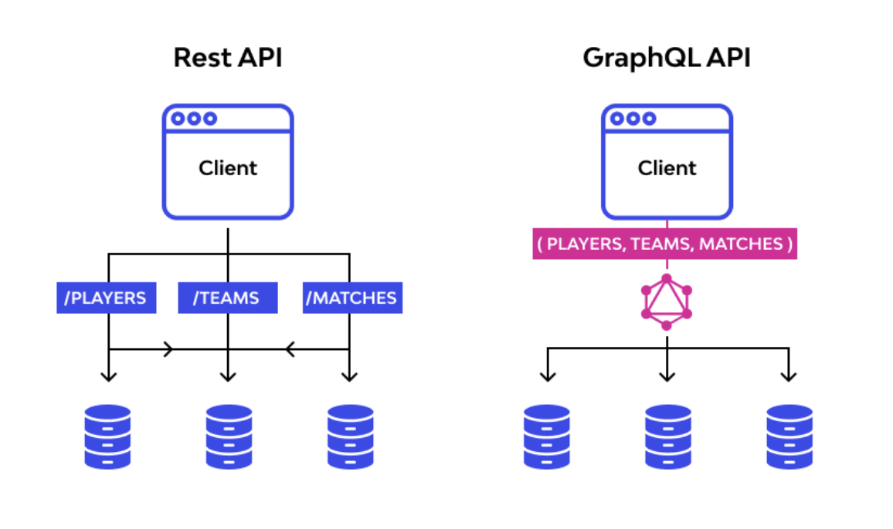
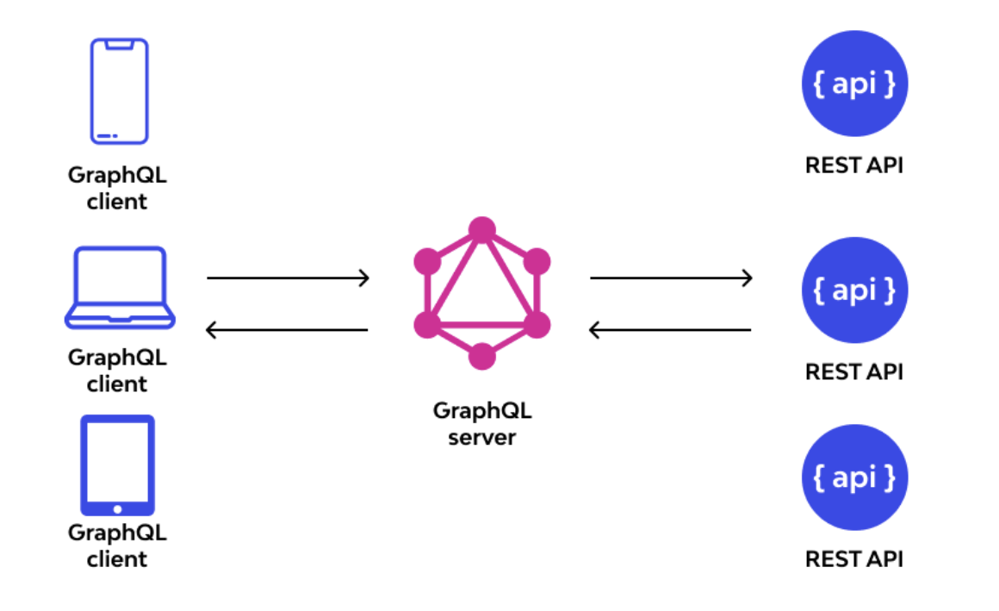
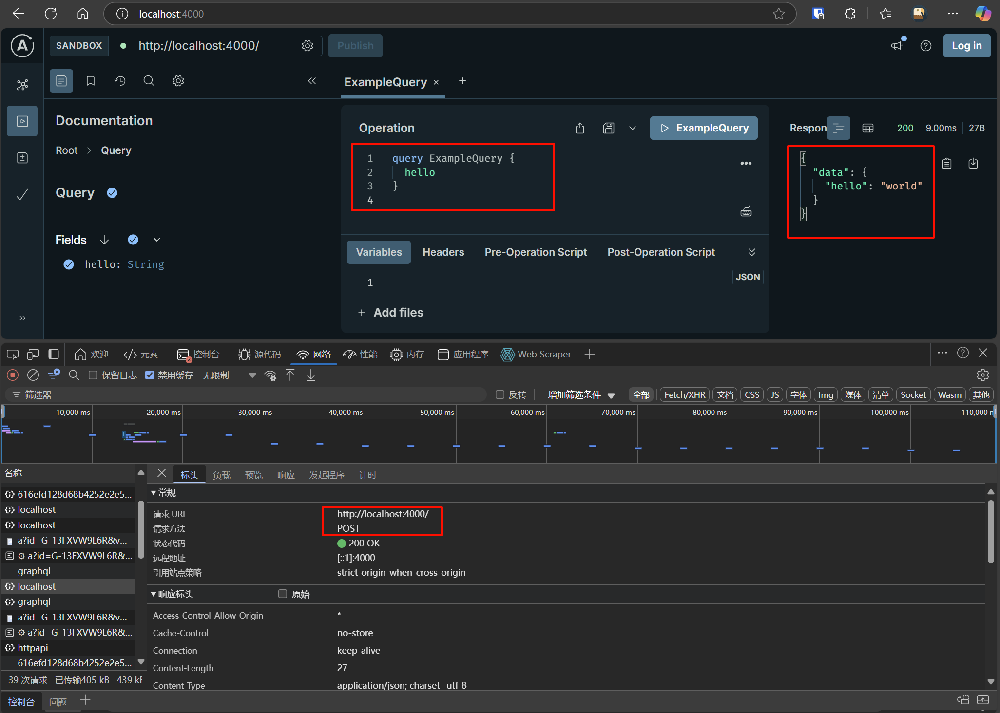
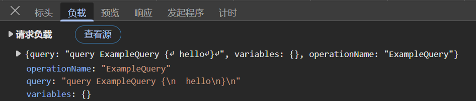
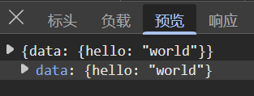
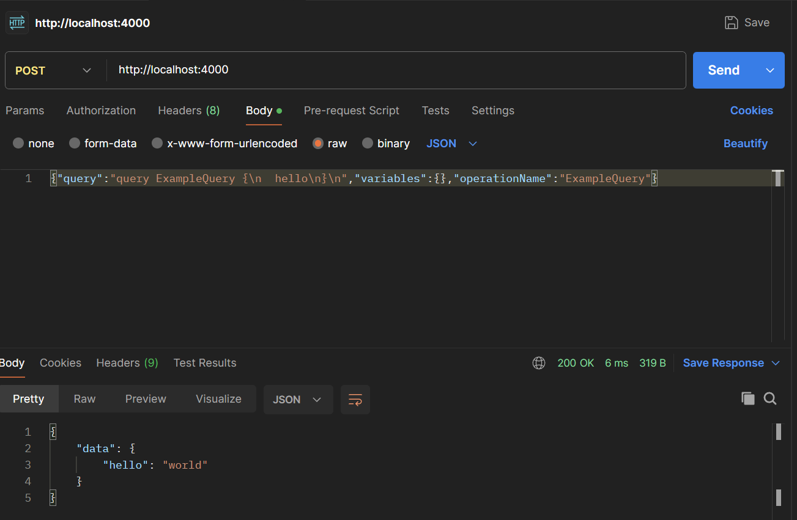
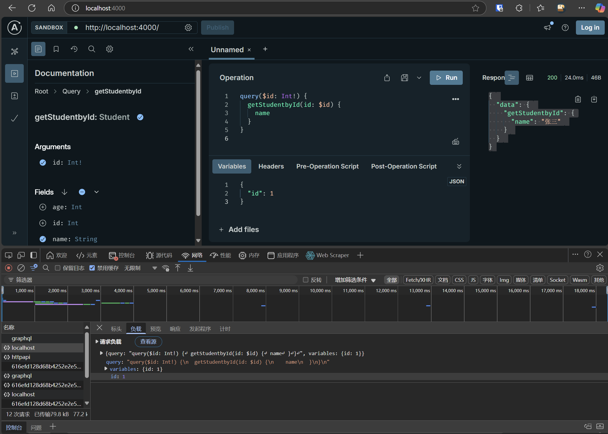
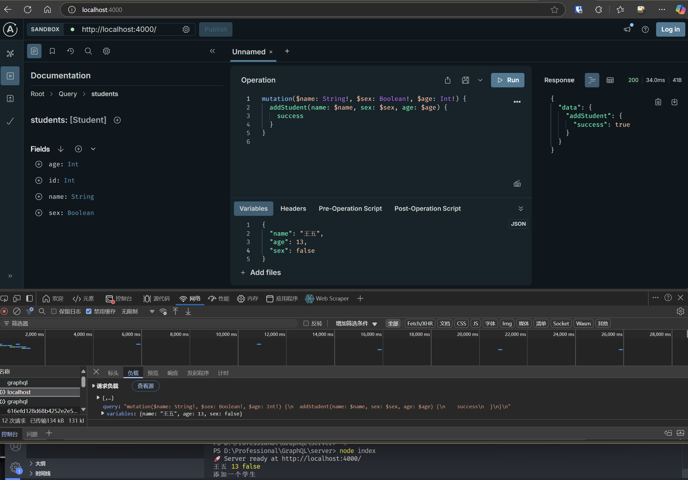
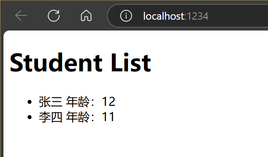
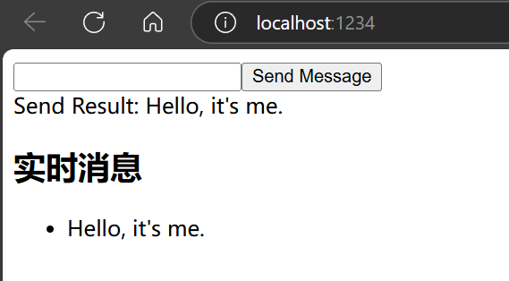

# GraphQL

> 首发于：2025-05-19

## 简介

GraphQL是一种用于 API 查询的语言，最初由 Facebook 技术团队开发，2015年开源。

GraphQL 为 API 中的数据提供了一个完整且可理解的描述，使得客户端能够精确地请求他们想要的内容。

GraphQL 核心定位是作为前后端协作的中间层，通过统一的查询语言和协议实现高效的数据交互。

本文仅介绍部分用法，详见[官方文档](https://graphql.org/)。

## 为什么需要 GraphQL

GraphQL 主要是为了解决 REST API 请求数据不太灵活，客户端无法决定要获取哪些数据的痛点。

举个例子： 

```
REST API
Get /api/student/1
返回
{
  "id": 1,
  "age": 12,
  "name": "张三",
  ...
}
获取ID为1的学生的信息，一般来讲可能就会返回一大堆信息。
```

```
GraphQL
query($id: Int!) {
  getStudentbyId(id: $id) {
    name
  }
}
variables: {id: 1}
返回
{
  "data": {
    "getStudentbyId": {
      "name": "张三"
    }
  }
}
获取ID为1的学生的信息，想取什么字段就取什么字段
```

GraphQL可以让客户端具备想拿什么字段就获取什么字段的能力，这就是客户端精确获取所需资源的能力。

结合下图理解一下：



### 优点

- 只需要一个POST接口就可以让客户端更加精确地获取所需资源
- 一次请求可以获取多种资源（REST API可能需要多次请求才能获取到所有数据）
- 简化返回数据，从而简化数据解析流程，从而简化客户端代码

### 缺点

- POST请求默认不缓存，会造成额外开销
- 过于复杂或者过深嵌套的查询可能对性能和安全性带来问题

### 适合场景

- 多终端适配（Web/iOS/Android），灵活字段减少冗余数据传输，如下图所示
- 快速原型开发，强类型Schema加速前后端协作，适合全栈开发



## 实例

### 最简单的Server

我们用nodejs创建一个服务器，使用 `@apollo/server` 库，代码如下：

```js
import { ApolloServer } from '@apollo/server';
import { startStandaloneServer } from '@apollo/server/standalone';

// The GraphQL schema
const typeDefs = `#graphql
  type Query {
    hello: String
  }
`;

// A map of functions which return data for the schema.
const resolvers = {
  Query: {
    hello: () => 'world',
  },
};

const server = new ApolloServer({
  typeDefs,
  resolvers,
});

const { url } = await startStandaloneServer(server);
console.log(`🚀 Server ready at ${url}`);
```

服务端代码核心就是要定义：

1. 类型（Type）和字段（Fields）
2. Schema，即客户端可以进行哪些操作（Query（必须）、Mutation、Subscription）
3. Resolve，即实际处理请求的函数

运行上面的代码后，直接访问 `http://localhost:4000/` 就可以看到一个GraphQL的客户端页面，如下图所示：







这个页面可以帮助我们快速构建GraphQL的查询并测试数据返回情况。同时当我们发起请求时也可以在控制台抓取到对应的网络请求，GraphQL的本质就是发送一个POST请求，请求体也是按照规定格式写的，所以在postman中去请求也是可行的，如下图所示：



### 带参数的查询

下面的示例代码是使用学生ID查询某个学生的某个字段。

```javascript
import { ApolloServer } from '@apollo/server';
import { startStandaloneServer } from '@apollo/server/standalone';

// The GraphQL schema
const typeDefs = `#graphql
  type Student {
    id: Int
    name: String
    sex: Boolean
    age: Int
  }

  type Query {
    students: [Student]
    getStudentbyId(id: Int!): Student
  }

  schema {
    query: Query
  }
`;

const students = [{
  id: 1,
  name: '张三',
  age: 12,
  sex: true,
},
{
  id: 2,
  name: '李四',
  age: 11,
  sex: false,
}];

// A map of functions which return data for the schema.
const resolvers = {
  Query: {
    students: () => students,
    getStudentbyId: async (...args) => {
      console.log(args);

      await '执行了一个异步查询'
      return students.filter(student => student.id === args[1].id)[0]
    }
  },
};

const server = new ApolloServer({
  typeDefs,
  resolvers,
});

const { url } = await startStandaloneServer(server);
console.log(`🚀 Server ready at ${url}`);
```

执行结果如下图所示：



### 带变更（Mutations）的实例

Mutations 主要是用来做增删改的。

```js
import { ApolloServer } from '@apollo/server';
import { startStandaloneServer } from '@apollo/server/standalone';

// The GraphQL schema
const typeDefs = `#graphql
  type Student {
    id: Int
    name: String
    sex: Boolean
    age: Int
  }

  type Res {
    success: Boolean
    id: String
  }

  type Query {
    students: [Student]
    getStudentbyId(id: Int!): Student
  }

  type Mutation {
    addStudent(name:String! age:Int! sex:Boolean!): Res

    updateStudent(id: String! name:String! age:Int! sex:Boolean!): Res

    deleteStudent(id: String!): Res
  }

  schema {
    query: Query
    mutation: Mutation
  }
`;

const students = [{
  id: 1,
  name: '张三',
  age: 12,
  sex: true,
},
{
  id: 2,
  name: '李四',
  age: 11,
  sex: false,
}];

async function addStudent (_, { name, age, sex }) {
  console.log(name, age, sex);
  console.log("添加一个学生");

  return {
    success: true,
    id: 'xxx'
  }
}

async function updateStudent (_, { id, name, age, sex }) {
  console.log(id, name, age, sex);
  console.log("更新一个学生");

  return {
    success: true,
    id: 'xxx'
  }
}

async function deleteStudent (_, { id }) {
  console.log(id);
  console.log("删除一个学生");

  return {
    success: true,
    id: 'xxx'
  }
}

// A map of functions which return data for the schema.
const resolvers = {
  Query: {
    students: () => students,
    getStudentbyId: async (...args) => {
      console.log(args);

      await '执行了一个异步查询'
      return students.filter(student => student.id === args[1].id)[0]
    },
  },
  Mutation: {
    addStudent: addStudent,
    updateStudent: updateStudent,
    deleteStudent: deleteStudent,
  },
};

const server = new ApolloServer({
  typeDefs,
  resolvers,
});

const { url } = await startStandaloneServer(server);
console.log(`🚀 Server ready at ${url}`);
```


 执行效果如下图所示：



### React 中使用 `@appollo/client` 查询的实例

```js
// apolloClient.js
import { ApolloClient, InMemoryCache } from '@apollo/client';

const client = new ApolloClient({
  uri: 'http://localhost:4000', // 示例公共 GraphQL API
  cache: new InMemoryCache(),
});

export default client;
```

```js
// index.js
import React from 'react';
import { createRoot } from 'react-dom/client';
import { ApolloProvider } from '@apollo/client';
import client from './apolloClient';
import App from './App';

// 创建根节点
const container = document.getElementById('root');
const root = createRoot(container);

root.render(
  <ApolloProvider client={client}>
    <App />
  </ApolloProvider>
);
```

```jsx
// App.js
import React from 'react';
import { useQuery, gql } from '@apollo/client';

// 定义 GraphQL 查询
const GET_STUDENT = gql`
  query Query {
    students {
      id
      name
      age
    }
  }
`;

function App() {
  const { loading, error, data } = useQuery(GET_STUDENT);

  if (loading) return <p>Loading...</p>;
  if (error) return <p>Error: {error.message}</p>;

  return (
    <div>
      <h1>Student List</h1>
      <ul>
        {data.students.map((student, index) => (
          <li key={index}>
            {student.name}{" 年龄："}{student.age}
          </li>
        ))}
      </ul>
    </div>
  );
}

export default App;
```

index.html

```html
<!DOCTYPE html>
<html lang="en">
<head>
    <meta charset="UTF-8">
    <meta name="viewport" content="width=device-width, initial-scale=1.0">
    <title>Document</title>
</head>
<body>
    <div id="root"></div>
    <script src="apolloClient.js"></script>
    <script src="index.js"></script>
    <script src="App.js"></script>
</body>
</html>
```

效果如下图所示：



### 带订阅（Subscriptions）的实例

为了实现订阅功能，这里需要使用到 Websocket 技术，相对来说代码复杂性会较前面增加不少。

#### 服务端

```js
import { ApolloServer } from '@apollo/server';
import { startStandaloneServer } from '@apollo/server/standalone';
import { PubSub } from 'graphql-subscriptions';
import { createServer } from 'http';
import { WebSocketServer } from 'ws';
import { useServer } from 'graphql-ws/use/ws';
import { makeExecutableSchema } from '@graphql-tools/schema';

// 创建 PubSub 实例，用于订阅-发布功能
const pubsub = new PubSub();

// 定义 Schema
const typeDefs = `#graphql
  type Message {
    id: ID!
    content: String!
  }

  type Query {
    dummy: String
  }

  type Mutation {
    sendMessage(content: String!): Message!
  }

  type Subscription {
    messagePosted: Message!
  }
`;

// 定义 Resolver
const resolvers = {
  Query: {
    dummy: () => "Hello",
  },
  Mutation: {
    sendMessage: (_, { content }) => {
      console.log(content)
      const newMessage = { id: Date.now(), content };
      // 发布事件到订阅
      pubsub.publish('MESSAGE_POSTED', { messagePosted: newMessage });

      return newMessage;
    },
  },
  Subscription: {
    messagePosted: {
      // 订阅
      subscribe: () => pubsub.asyncIterableIterator(['MESSAGE_POSTED']),
    },
  },
};

// 创建可执行 Schema
const schema = makeExecutableSchema({ typeDefs, resolvers });

// 创建 Apollo Server 实例
const server = new ApolloServer({
  schema,
});

// 启动 HTTP 服务
const { url } = await startStandaloneServer(server, {
  listen: { port: 4000 },
});

// 创建 WebSocket 服务
const httpServer = createServer();
const wsServer = new WebSocketServer({
  server: httpServer,
  path: '/graphql',
});

useServer(
  { 
    schema, 
    onConnect: (ctx) => console.log('客户端已连接'),
    onDisconnect: (ctx) => console.log('客户端断开'),
  }, 
  wsServer
);

httpServer.listen(4001, () => {
  console.log(`🚀 WebSocket Server ready at ws://localhost:4001/graphql`);
});

console.log(`🚀 HTTP Server ready at ${url}`);
```

#### 客户端

客户端还是使用 React 和 `@appollo/client` 来实现。

`index.js` 与 `index.html` 代码同 `React 中使用 `@appollo/client` 查询的实例` 的代码。

```js
// apolloClient.js
import { ApolloClient, InMemoryCache, split, HttpLink } from '@apollo/client';
import { GraphQLWsLink } from '@apollo/client/link/subscriptions';
import { getMainDefinition } from '@apollo/client/utilities';
import { createClient } from 'graphql-ws';

// 创建WebSocket链接
const wsLink = new GraphQLWsLink(
  createClient({
    url: 'ws://localhost:4001/graphql',
  })
);

// 创建HTTP链接
const httpLink = new HttpLink({
  uri: 'http://localhost:4000',
});

// 拆分链接
const splitLink = split(
  ({ query }) => {
    // 根据操作类型选择链接
    const definition = getMainDefinition(query);
    return (
      definition.kind === 'OperationDefinition' &&
      definition.operation === 'subscription'
    );
  },
  wsLink,
  httpLink
);

// 创建 Apollo Client
const client = new ApolloClient({
  link: splitLink,
  cache: new InMemoryCache(),
});

export default client;
```

```jsx
// App.js
import React from 'react';
import { gql, useMutation, useSubscription } from '@apollo/client';

// 定义 GraphQL
const SEND_MESSAGE = gql`
  mutation($content: String!){
    sendMessage(content: $content) {
      id
      content
    }
  }
`;

// 发起订阅
const MESSAGE_SUBSCRIPTION = gql`
  subscription messagePosted {
    messagePosted {
      id
      content
    }
  }
`;

function App() {
  let input;
  const [sendMessage, { data }] = useMutation(SEND_MESSAGE);
  const { data: subscriptionData } = useSubscription(
    MESSAGE_SUBSCRIPTION,
    {
      onData({ data }) {
        console.log(data)
      }
    }
  );

  return (
    <div>
      <form
        onSubmit={e => {
          e.preventDefault();
          sendMessage({ variables: { content: input.value } });
          input.value = '';
        }}
      >
        <input
          ref={node => {
            input = node;
          }}
        />
        <button type="submit">Send Message</button>
      </form>

      <div>Send Result: {data?.sendMessage?.content ?? "--"}</div>
      <div>
        <h2>实时消息</h2>
        <ul>
          {subscriptionData?.messagePosted && (
            <li key={subscriptionData.messagePosted.id}>{subscriptionData.messagePosted.content}</li>
          )}
        </ul>
      </div>
    </div>
  );
}

export default App;
```

效果如下图所示：


