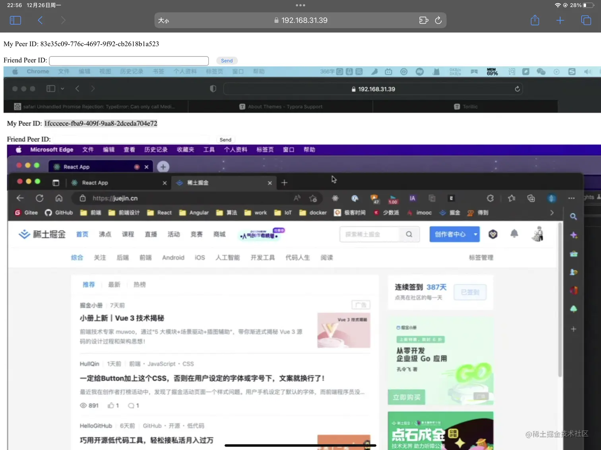

# 什么是PeerJS

> 首发于：2022-12-26

首先还是祭出官网地址 [PeerJS](https://peerjs.com/)。

PeerJS 包装了浏览器的 WebRTC(Web Real Time Communication，网络实时通信) API，帮助我们轻松地实现P2P（点对点）连接，简单的说，P2P 就是一个对等计算机网络，它可以使两台计算机直接通信，互为服务器与客户端，而不再需要一个传统的 Server-Client 结构。

基于这样的特质我们就可以使用纯前端的方案就能实现屏幕共享，而不需要一个屏幕视频流服务器+视频流接收器的结构。

如果我们直接使用 WebRTC API 其实也是完全可以实现这些功能的，只是需要的前置技术点比较多，API 的调用也相对复杂一些，而 PeerJS 帮我们简化了这一系列操作，你甚至都不需要知道什么是 P2P 通讯。

## 创建 Peer 服务器

前面不是说 P2P 通信不需要服务器吗，那 Peer 服务器是什么呢？

其实 P2P 也不是在所有情况下都能完全脱离服务器的，很多时候我们的通讯都可能被防火墙之类的东西阻隔，所以这是我们就需要一个类似中介的 Peer 服务器来帮助两个节点能够互相找到对方，当然这个中介服务器并不会被用于数据传输，“牵完线搭完桥，它就撤了”。

### 使用 PeerServer 来创建自己的服务器

[GitHub - peers/peerjs-server: Server for PeerJS](https://github.com/peers/peerjs-server)

#### 安装

```bash
pnpm i peer
```

#### 代码实现

```js
const { PeerServer } = require('peer');
const peerServer = PeerServer({ port: 9000, path: '/myPeerServer' });
```

#### Web 页面使用

```typescript
new Peer({ host: 'localhost', port: 9000, path: '/myPeerServer' })
```

### 使用 PeerServer Cloud 提供的服务器

[PeerJS - Sign up for PeerServer Cloud](https://peerjs.com/peerserver)

#### 安装

```bash
pnpm i peerjs
```

#### Web 页面使用

```typescript
new Peer()
```

其实我们在使用 PeerJS 直接 new 的时候它会自动连接 PeerJS 为我们提供的免费 PeerServer Cloud service。

## 节点之间的消息发送

### 关键代码

```typescript
// 发送
const conn = peer.current.connect(friendId);
conn.on('open', () => {
  console.log('Connected.');
  conn.send({ id, msg: 'Hello, my friend!' });
});

// 接收
peer.current.on('connection', conn => {
  conn.on('data', data => {
    const received = data as SendData;
      console.log(`Data from Peer(id: ${received.id}) => ${received.msg}`);
    });
});
```


### 效果


## 共享桌面视频流捕获及传输

### 关键代码

```typescript
// 发送桌面视频流
const sendMediaStream = () => {
  try {
    window.navigator.mediaDevices.getDisplayMedia({ video: true })
      .then(mediaStream => {
        peer.current.call(friendId, mediaStream);
      });
  } catch (e) {
    console.error(e);
    alert('Send failed.');
  }
};

// 接收桌面视频流信息
peer.current.on('call', call => {
  call.answer();
  call.on('stream', remoteStream => {
    if (myVideo.current) {
      myVideo.current.srcObject = remoteStream;
      myVideo.current.play();
    }
  });
});
```

### 效果

我搭建了一个本地web页面，我在我自己的电脑上打开一个页面，作为一个 Peer。

再在我的 iPad 上也打开这个页面，作为另一个 Peer。

*我把电脑屏幕分享到 iPad 的 Web 页面上*，这是 iPad 上的截图：



## 完整代码

```tsx
import { ChangeEvent, useEffect, useRef, useState } from 'react';
import { Peer } from 'peerjs';

interface SendData {
  id: string;
  msg: string;
}

function App() {
  const [id, setId] = useState('');
  const [friendId, setFriendId] = useState('');
  const peer = useRef(new Peer());
  const myVideo = useRef<HTMLVideoElement>(null);

  const handleFriendIdChange = (e: ChangeEvent<HTMLInputElement>) => {
    setFriendId(e.target.value);
  };

  const sendMediaStream = () => {
    try {
      window.navigator.mediaDevices.getDisplayMedia({ video: true })
        .then(mediaStream => {
          peer.current.call(friendId, mediaStream);
        });
    } catch (e) {
      console.error(e);
      alert('Send failed.');
    }
  };

  const sendData = () => {
    if (!friendId) {
      return;
    }

    const conn = peer.current.connect(friendId);
    conn.on('open', () => {
      console.log('Connected.');
      conn.send({ id, msg: 'Hello, my friend!' });
      sendMediaStream();
    });
  };

  useEffect(() => {
    peer.current.on('open', peerId => {
      setId(peerId);
    });
  }, []);

  // 用于接收其它节点发送过来的消息和流媒体信息
  useEffect(() => {
    if (!id) {
      return;
    }
    peer.current.on('connection', conn => {
      conn.on('data', data => {
        const received = data as SendData;
        console.log(`Data from Peer(id: ${received.id}) => ${received.msg}`);
      });
    });
    peer.current.on('call', call => {
      call.answer();
      call.on('stream', remoteStream => {
        if (myVideo.current) {
          myVideo.current.srcObject = remoteStream;
          myVideo.current.play();
        }
      });
    });
  }, [id]);

  return (
    <>
      <p>My Peer ID: {id}</p>
      <div>
        <span>Friend Peer ID: </span>
        <input type="text" value={friendId} onChange={handleFriendIdChange} style={{ width: 350 }} />
        <input type="button" value="Send" onClick={sendData} style={{ marginInlineStart: 16 }} />
      </div>
      <video ref={myVideo} />
    </>
  );
}

export default App;
```

## 结语

在开发上述项目的时候也遇到许多坑，包括但不限于：

- 浏览器权限：我们需要设置浏览器共享屏幕或者访问摄像头、音频等的权限，有时候可能需要设置之后重启浏览器
- 尽量使用 https 协议，否则在其它设备上访问的时候可能会导致 `window.navigator.mediaDevices.getDisplayMedia` 等 API 不可用，浏览器控制台直接就报错了，不过它并不会告诉你什么不安全或者权限不足之类的，而是告诉你没这个方法
- P2P 能不能连上很可能受到当前所在网络设置、防火墙等限制，至于什么情况下会被限制，其实我也理解得不怎么透彻......

以上功能仅仅展示了一些 PeerJS 的很小一部分功能，事实上，视频流的质量、分辨率等都是可以调节和配置的，以上项目并未做展示，大家如果在项目中有需要可以去找相关 API 进行完善。

最后，不得不说，我们不仅可以用 `PeerJS` 或者说 `WebRTC` 来做屏幕共享，也可以做实时视频聊天、直播、远程桌面等，总之功能非常强大。
