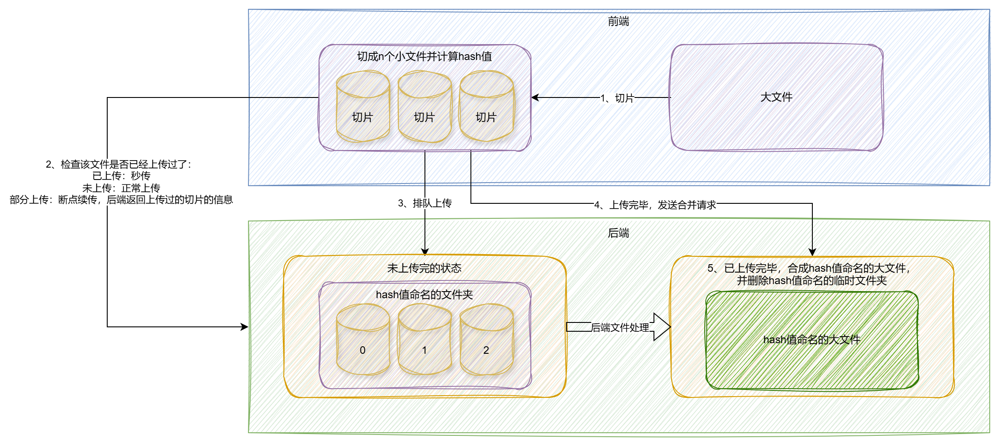

# 实现大文件分片上传、断点续传、秒传

> 首发于：2023-01-30

> 技术栈：pnpm、Node.JS、koa、TypeScript、React、Axios

## 整体方案



## 实现最简单的文件上传

### 前端代码

前端实现使用 `input` 标签的 `file` 类型特性来进行文件读取，然后使用 `axios` 来发文件传输的请求，代码如下：

```tsx
import axios, { AxiosProgressEvent } from 'axios';
import { ChangeEvent, useState } from 'react';

const request = axios.create({
  baseURL: 'http://localhost:3000/api',
  timeout: 60000, 
}).request;

function App() {
  const [progress, setProgress] = useState('0');

  const handleUploadProgress = (progressEvent: AxiosProgressEvent) => {
    if (progressEvent.total) {
      setProgress(((progressEvent.loaded * 100) / progressEvent.total).toFixed(2));
    }
  };

  const uploadFile = (formData: FormData) => {
    request({
      url: '/upload',
      method: 'POST',
      data: formData,
      onUploadProgress: handleUploadProgress,
    })
      .then(() => {
        console.log('上传成功');
      })
      .catch(() => {
        console.log('上传失败');
      });
  };
  const handleFileChange = (evt: ChangeEvent<HTMLInputElement>) => {
    // 单文件直接取列表中的第一个
    const file = (evt.target.files as FileList)['0'];
    console.log(file);
    console.log(file.name); // 文件名
    console.log(file.size); // 文件大小
    console.log(file.type); // 文件的accept类型
    const formData = new FormData();
    formData.append('file', file);
    uploadFile(formData);
  };
  
  return (
    <>
      <label htmlFor="my-file">请选择一个文件：</label>
      <input
        type="file"
        id="my-file"
        name="my-file"
        accept="image/png, image/jpeg"
        onChange={handleFileChange}
      />
      { Number(progress) > 0 && <div>上传进度：{progress}%</div> }
    </>
  );
}

export default App;
```

以上代码是上传文件的一个最简单的实现，可查看上传进度等情况。

该前端请求需要代理到后台去，dev 模式下需要配置一下代理：

`src/setupProxy.js`

```js
const { createProxyMiddleware } = require('http-proxy-middleware');

module.exports = function (app) {
  app.use(
    createProxyMiddleware('/api', {
      target: 'http://localhost:4000',
      changeOrigin: true,
    }),
  )
};
```

### 后端代码

后端采用 `Node.js` + `koa` + `typescript` 编写，初始化项目及依赖安装：

```bash
pnpm --init

pnpm i @types/node -D

pnpm i typescript -D

pnpm i ts-node-dev -D

tsc --init

pnpm i koa

pnpm i @types/koa -D

pnpm i koa-router
pnpm i @types/koa-router -D

pnpm i koa-body
pnpm i @types/koa-body -D
```

`app.ts` 代码如下：

```typescript
import Koa, { DefaultContext, DefaultState } from 'Koa';
import Router from 'koa-router';
import { koaBody } from 'koa-body';
import path from 'node:path';
import fs from 'node:fs';

const app: Koa<DefaultState, DefaultContext> = new Koa();

const router = new Router({
  prefix: '/api',
});

router.post('/upload', koaBody({
  multipart: true,
  formidable: {
    uploadDir: path.join(__dirname, 'uploads'),
    keepExtensions: true,
    onFileBegin: (name, file) => {
      // 无论是多文件还是单文件上传都会重复调用此函数
      // 最终要保存到的文件夹目录
      const dir = path.join(__dirname, `/uploads`);
      // 检查文件夹是否存在如果不存在则新建文件夹
      if (!fs.existsSync(dir)) {
        fs.mkdirSync(dir);
      }
      // 文件名称去掉特殊字符但保留原始文件名称
      const fileName = file.originalFilename as string;
      file.newFilename = fileName;
      // 覆盖文件存放的完整路径（保留原始名称）
      file.filepath = `${dir}/${fileName}`;
    },
  },
}), ctx => {
  if (ctx.request.files) {
    const file = ctx.request.files.file;
    if (!Array.isArray(file)) {
      ctx.body = '上传文件成功';
    }
  } else {
    ctx.status = 400;
    ctx.body = '上传文件失败';
  }
});

app.use(router.routes());
app.listen(4000, () => {
	console.log('服务启动成功，running http://127.0.0.1:4000');
});
```

这个程序借助 `koa-body` 可以接收上传的文件，并保存到 `uploads` 目录下，但是多文件、文件校验、重复文件处理等都没有实现。

## 文件切片上传

### 前端文件切片

从第一步代码可以看出来，我们读取的文件在代码中体现为一个 `File` 类型的对象，这个对象并没有实现什么方法，它的方法都继承自 `Blob`，我们可以利用 `Blob.slice` 方法对文件进行切片读取，[Blob.slice - Web API 接口参考 | MDN (mozilla.org)](https://developer.mozilla.org/zh-CN/docs/Web/API/Blob/slice)。

改造一下第一步中的代码，以下是代码片段：

```tsx
interface FileChunk {
  chunkIndex: number;
  chunk: Blob;
}

const SIZE = 1024 * 1024 * 1; // 切片大小1MB
```

```tsx
const handleFileChange = (evt: ChangeEvent<HTMLInputElement>) => {
  const file = (evt.target.files as FileList)['0'];
  let chunkIndex = 0;
  const fileChunks: FileChunk[] = [];
  for (let cur = 0; cur < file.size; cur += SIZE) {
    fileChunks.push({
      chunkIndex: chunkIndex++,
      chunk: file.slice(cur, cur + SIZE),
    });
  }
  // ...
};
```

`fileChunks` 就是被我们切片好的文件，大小为 1MB。

### 前端文件切片上传

既然文件被切片了，自然就可以各自进行上传，也就是可以并发上传，但是并发上传也需要注意浏览器的并发限制。一般来说，同域名下 `chrome` 的并发请求是6个，所以如果我们的文件比较大就分片就会超过6，请求就会排队，从而可能会影响到其它请求，而且如果请求过多也可能造成前端崩溃。所以我们在切片上传时就需要考虑一个更合理的`并发数`。

以下是代码片段：

```tsx
const MAX_POOL = 3; // 最大并发数

const POOL: Promise<void>[] = []; // 并发池
```

使用并发池，对分片文件就行上传：

```tsx
const mergeFile = (filename: string) => {
  return request({
    url: '/merge',
    method: 'POST',
    data: { filename },
    headers: { 'Content-Type': 'application/json' },
  })
    .then(() => {
      console.log('合并成功');
    })
    .catch(() => {
      console.log('合并失败');
    });
};

const handleTask = (uplaodTask: Promise<void>) => {
  // 请求结束后将该Promise任务从并发池中移除
  const index = POOL.findIndex(t => t === uplaodTask);
  POOL.splice(index);
};

const sliceChunks = async (fileChunks: FileChunk[], fileName: string) => {
  for (let i = 0; i < fileChunks.length; i++) {
    const fileChunk = fileChunks[i];
    const formData = new FormData();
    formData.append('filename', fileName);
    formData.append('chunkIndex', String(fileChunk.chunkIndex));
    formData.append('file', fileChunk.chunk);

    const uplaodTask = uploadFile(formData);
    uplaodTask.then(() => handleTask(uplaodTask));
    POOL.push(uplaodTask);
    if (POOL.length === MAX_POOL) {
      // 并发池跑完一个任务之后才会继续执行for循环，塞入一个新任务
      await Promise.race(POOL);
    }
  }
  Promise.all(POOL)
    .then(() => {
      mergeFile(fileName);
    });
};
```

改造 `handleFileChange` :

```tsx
const handleFileChange = (evt: ChangeEvent<HTMLInputElement>) => {
  // ...
  POOL.length = 0;
  sliceChunks(fileChunks, file.name);
};
```

### 前端切片上传进度处理

分片上传的时候如果还使用第一步中的方案处理进度那么只会显示出某一个分片的进度，而且也分不出是哪个分片的进度，更不清楚总体进度会是多少，所以这里需要做一些计算，计算方法也很简单，就是将每个分片已经上传的文件大小进行累加，用总大小一除即可。

下面是代码片段：

```tsx
const totalSize = useRef(Number.MAX_SAFE_INTEGER);
const progressArr = useRef<number[]>([]);
```

```tsx
const handleUploadProgress = (progressEvent: AxiosProgressEvent, chunkIndex: number) => {
  if (progressEvent.total) {
    progressArr.current[chunkIndex] = progressEvent.loaded * 100;
    const curTotal = progressArr.current.reduce(
      (accumulator, currentValue) => accumulator + currentValue,
      0,
    );
    setProgress((curTotal / totalSize.current).toFixed(2));
  }
};

const uploadFile = (formData: FormData, chunkIndex: number) => {
  return request({
    url: '/upload',
    method: 'POST',
    data: formData,
    onUploadProgress: (progressEvent) => handleUploadProgress(progressEvent, chunkIndex),
  })
  // ...
};

const handleFileChange = (evt: ChangeEvent<HTMLInputElement>) => {
  // ...
  totalSize.current = file.size;
  for (let cur = 0; cur < file.size; cur += SIZE) {
  // ...
};
```

### 后端接收文件切片

我们引入 `@koa/multer` 来处理多文件，`fs-extra` 来更方便地操作文件。

```bash
pnpm i @koa/multer multer -S
pnpm i @types/koa__multer -D

pnpm i fs-extra -S
pnpm i @types/fs-extra -D
```

接收到文件后会使用文件名创建一个文件夹，片段就按照 hash 值（目前是 0、1、2、3 ......）作为名称保存起来。

代码片段：

```typescript
const UPLOAD_DIR = path.join(__dirname, 'uploads');

const getFilename = (req: IncomingMessage & { body: { filename: string; hash: string } }) => {
  const { filename } = req.body;
  const fname = filename.split('.')[0];
  const chunkDir = path.join(UPLOAD_DIR, fname);

  if (!fse.existsSync(chunkDir)) {
    fse.mkdirSync(chunkDir);
  }
  return chunkDir;
};

const storage = multer.diskStorage({
  destination(req, file, callback) {
    callback(null, getFilename(req as IncomingMessage & { body: { filename: string; chunkIndex: string } }))
  },
  filename(req, file, callback) {
    const request = req as IncomingMessage & { body: { filename: string; chunkIndex: string } };
    callback(null, request.body.chunkIndex);
  },
});

const upload = multer({
  storage,
});

router.post('/upload',
  upload.fields([
    {
      name: 'file',
      maxCount: 100,
    },
  ]),
  ctx => {
    if (ctx.files) {
      ctx.body = '上传文件成功';
    } else {
      ctx.status = 400;
      ctx.body = '上传文件失败';
    }
  }
);
```

### 后端进行文件合并

接收到前端发送的合并请求之后，后端会将上传的文件切片全部就行合并，生成一个完整的文件，然后再将切片文件夹删除。

代码片段：

```typescript
router.post('/merge', async ctx => {
  const { filename } = ctx.request.body;
  const fname = filename.split('.')[0];
  const chunkDir = path.join(UPLOAD_DIR, fname);
  const chunks = await fse.readdir(chunkDir);

  chunks
    .sort((a, b) => Number(a) - Number(b))
    .forEach(chunkPath => {
      // 合并文件
      fse.appendFileSync(
        path.join(UPLOAD_DIR, filename),
        fse.readFileSync(`${chunkDir}/${chunkPath}`)
      );
    });
  // 删除临时文件夹
  fse.removeSync(chunkDir);
  // 返回文件地址
  ctx.body = '合并成功';
});
```

到此为止我们实现了文件分片上传的所有基本功能，不过像`多客户端同时上传相同文件`、`部分切片上传失败的处理`等具体应用时会遇到的各种产生bug的情况都还有待完善。

## 断点续传、秒传

### 前端hash生成

断点续传、秒传功能都需要后端有办法能够判断我们的文件到底上没上传成功，用什么来判断呢？

当然使用文件的 hash 值，同一个文件的 hash 值计算出来是一样的。

我们可以使用使用 `spark-md5` 库来计算文件的 hash 值。

```bash
npm i spark-md5 -S
npm i @types/spark-md5 -D
```

代码片段：

```tsx
const handleFileUpload = async (file: File) => {
  // ...
  const spark = new SparkMD5.ArrayBuffer();
  for (let cur = 0; cur < file.size; cur += SIZE) {
    // ...
    spark.append(await file.slice(cur, cur + SIZE).arrayBuffer())
  }
  const hash = spark.end();
  // ...
};
```

### 文件秒传

要实现断点续传，我就得实现文件秒传，文件秒传的本质就是通过 hash 值的查询判断后端是否已经存在了该文件，如果存在那就不传了，这就是秒传的本质。

前端需要在上传文件之前先调接口查询文件是否存在：

- 如果存在则返回一个 `true`
- 如果不存在则返回 `false`
- 如果上传过一部分，则返回 `number[]`，里面按照 `chunkIndex` 存着各个分片的 `size`，以方便进度计算和判断是否需要重新上传该分片

代码片段：

```tsx
const filename = useRef('');
const fileChunks = useRef<FileChunk[]>([]);
```


```tsx
const verifyUpload = (filename: string, hash: string) => {
  return new Promise<number[]>((resolve, reject) => {
    request<number[]>({
      url: '/verify',
      method: 'POST',
      data: { filename, hash },
      headers: { 'Content-Type': 'application/json' },
    })
      .then((res) => {
        resolve(res.data);
      })
      .catch(err => {
        reject(err);
      });
  });
}

const handleFileUpload = async (hash: string) => {
  const verifyRes = await verifyUpload(filename.current, hash)
    .catch(e => {
      console.error(e);
    });
  if (verifyRes !== undefined) {
    if (typeof verifyRes === 'boolean') {
      if (verifyRes) {
        console.log('文件已经上传过，可以秒传');
        setProgress('100');
      } else {
        POOL.length = 0;
        sliceChunks(hash, fileChunks.current.map(() => 0));
      }
    } else {
      POOL.length = 0;
      sliceChunks(hash, verifyRes);
    }
  } else {
    console.log('验证失败');
  }
};

const handleFileChange = async (evt: ChangeEvent<HTMLInputElement>) => {
  const file = (evt.target.files as FileList)['0'];
  let chunkIndex = 0;
  totalSize.current = file.size;
  filename.current = file.name;
  const spark = new SparkMD5.ArrayBuffer();
  for (let cur = 0; cur < file.size; cur += SIZE) {
    fileChunks.current.push({
      chunkIndex: chunkIndex++,
      chunk: file.slice(cur, cur + SIZE),
    });
    spark.append(await file.slice(cur, cur + SIZE).arrayBuffer())
  }
  const hash = spark.end();
  progressArr.current = [];
  handleFileUpload(hash);
};
```

前面的代码存储上传的文件的时候是用的文件原始的名称，中间使用的临时文件夹也是用的文件的原始名称，从这里开始就改造为使用 hash 值来作为名称了。

后台接口实现：

```typescript
router.post('/verify', async ctx => {
  const { filename, hash } = ctx.request.body;
  const ext = filename.split('.')[1];
  const chunkDir = path.join(UPLOAD_DIR, hash);

  if (fse.existsSync(path.join(UPLOAD_DIR, `${hash}.${ext}`))) {
    ctx.body = true;
  } else if (fse.existsSync(path.join(UPLOAD_DIR, `${hash}`))) {
    const chunks = await fse.readdir(chunkDir);
    const res: number[] = [];
    chunks.forEach(name => {
      const index = Number(name);
      const chunk = fse.readFileSync(`${chunkDir}/${name}`);
      res[index] = chunk.length;
    });
    ctx.body = res;
  } else {
    ctx.body = false;
  }
});
```

### 停止正在进行的上传

停止上传可以是关闭当前页面或浏览器，也可以是后端掉线，还可以是使用前端的 API 主动停止。前面两种情况都是一些意外情况，这里我们主要讨论使用前端的 API 主动停止的情况。

利用 `Axios` 的 `Canceler` 就可以轻松实现，比较简单，直接上代码片段：

```tsx
const cancelFuncArr = useRef<Canceler[]>([]);
```

```tsx
const mergeFile = (filename: string, hash: string) => {
  if (!fileChunks.current.length) {
    return;
  }
  request({
    url: '/merge',
    method: 'POST',
    data: { filename, hash },
    headers: { 'Content-Type': 'application/json' },
  })
  // ...
};

const uploadFile = (formData: FormData, chunkIndex: number) => {
  return request({
    // ...
    cancelToken: new axios.CancelToken(cancelFunc => { cancelFuncArr.current[chunkIndex] = cancelFunc; }),
  })
  // ...
};

const handleStop = () => {
  cancelFuncArr.current.forEach(cancelFunc => {
    cancelFunc();
  });
  fileChunks.current = [];
  setProgress('0');
};
```

```tsx
return (
  <>
    {/* ... */}
    {Number(progress) > 0 && Number(progress) < 100 &&
      <input type="button" value="停止" onClick={handleStop} />
    }
    {/* ... */}
  </>
);
```

### 断点续传

断点续传就是在前面停止的传了一部分的基础上进行上传，之前传输的信息会通过 `verifyUpload` 接口进行告知，传完的切片就不会重新传了，没有传或者没有传完的切片就会重新传。

```tsx
const handleFinishedUploadProgress = (size: number, chunkIndex: number) => {
  progressArr.current[chunkIndex] = size * 100;
  const curTotal = progressArr.current.reduce(
    (accumulator, currentValue) => accumulator + currentValue,
    0,
  );
  setProgress((curTotal / totalSize.current).toFixed(2));
};

const sliceChunks = async (hash: string, chunksSize: number[]) => {
  for (let i = 0; i < fileChunks.current.length; i++) {
    const fileChunk = fileChunks.current[i];
    const formData = new FormData();
    formData.append('filename', filename.current);
    formData.append('chunkIndex', String(fileChunk.chunkIndex));
    formData.append('hash', hash);
    formData.append('file', fileChunk.chunk);
    
    if (chunksSize[i] !== fileChunk.chunk.size) { // size一样的说明已经上传完毕了，只传size不一样的
      const uplaodTask = uploadFile(formData, i);
      uplaodTask.then(() => handleTask(uplaodTask));
      POOL.push(uplaodTask);
      if (POOL.length === MAX_POOL) {
        // 并发池跑完一个任务之后才会继续执行for循环，塞入一个新任务
        await Promise.race(POOL);
      }
    } else {
      handleFinishedUploadProgress(chunksSize[i], i);
    }
  }

  Promise.all(POOL)
    .then(() => {
      mergeFile(filename.current, hash);
    });
};
```

## 完整源代码

### 前端代码

```tsx
import axios, { AxiosProgressEvent, Canceler } from 'axios';
import { ChangeEvent, useState, useRef } from 'react';
import SparkMD5 from 'spark-md5';

interface FileChunk {
  chunkIndex: number;
  chunk: Blob;
}

const SIZE = 1024 * 1024 * 1; // 切片大小1MB
const MAX_POOL = 3; // 最大并发数

const POOL: Array<Promise<void>> = []; // 并发池

const request = axios.create({
  baseURL: 'http://localhost:3000/api',
  timeout: 60000,
}).request;

function App() {
  const [progress, setProgress] = useState('0');
  const progressArr = useRef<number[]>([]);
  const cancelFuncArr = useRef<Canceler[]>([]);
  const totalSize = useRef(Number.MAX_SAFE_INTEGER);
  const filename = useRef('');
  const fileChunks = useRef<FileChunk[]>([]);

  const handleUploadProgress = (progressEvent: AxiosProgressEvent, chunkIndex: number) => {
    if (progressEvent.total) {
      progressArr.current[chunkIndex] = progressEvent.loaded * 100;
      const curTotal = progressArr.current.reduce(
        (accumulator, currentValue) => accumulator + currentValue,
        0,
      );
      setProgress((curTotal / totalSize.current).toFixed(2));
    }
  };

  const handleFinishedUploadProgress = (size: number, chunkIndex: number) => {
    progressArr.current[chunkIndex] = size * 100;
    const curTotal = progressArr.current.reduce(
      (accumulator, currentValue) => accumulator + currentValue,
      0,
    );
    setProgress((curTotal / totalSize.current).toFixed(2));
  };

  const mergeFile = (filename: string, hash: string) => {
    if (!fileChunks.current.length) {
      return;
    }
    request({
      url: '/merge',
      method: 'POST',
      data: { filename, hash },
      headers: { 'Content-Type': 'application/json' },
    })
      .then(() => {
        console.log('合并成功');
      })
      .catch(() => {
        console.log('合并失败');
      });
  };

  const handleTask = (uplaodTask: Promise<void>) => {
    // 请求结束后将该Promise任务从并发池中移除
    const index = POOL.findIndex(t => t === uplaodTask);
    POOL.splice(index);
  };

  const uploadFile = (formData: FormData, chunkIndex: number) => {
    return request({
      url: '/upload',
      method: 'POST',
      data: formData,
      onUploadProgress: (progressEvent) => handleUploadProgress(progressEvent, chunkIndex),
      cancelToken: new axios.CancelToken(cancelFunc => { cancelFuncArr.current[chunkIndex] = cancelFunc; }),
    })
      .then(() => {
        console.log('上传成功');
      })
      .catch(() => {
        console.log('上传失败');
      });
  };

  const verifyUpload = (filename: string, hash: string) => {
    return new Promise<boolean | number[]>((resolve, reject) => {
      request<boolean | number[]>({
        url: '/verify',
        method: 'POST',
        data: { filename, hash },
        headers: { 'Content-Type': 'application/json' },
      })
        .then((res) => {
          resolve(res.data);
        })
        .catch(err => {
          reject(err);
        });
    });
  }

  const sliceChunks = async (hash: string, chunksSize: number[]) => {
    for (let i = 0; i < fileChunks.current.length; i++) {
      const fileChunk = fileChunks.current[i];
      const formData = new FormData();
      formData.append('filename', filename.current);
      formData.append('chunkIndex', String(fileChunk.chunkIndex));
      formData.append('hash', hash);
      formData.append('file', fileChunk.chunk);

      if (chunksSize[i] !== fileChunk.chunk.size) { // size一样的说明已经上传完毕了，只传size不一样的
        const uplaodTask = uploadFile(formData, i);
        uplaodTask.then(() => handleTask(uplaodTask));
        POOL.push(uplaodTask);
        if (POOL.length === MAX_POOL) {
          // 并发池跑完一个任务之后才会继续执行for循环，塞入一个新任务
          await Promise.race(POOL);
        }
      } else {
        handleFinishedUploadProgress(chunksSize[i], i);
      }
    }

    Promise.all(POOL)
      .then(() => {
        mergeFile(filename.current, hash);
      });
  };

  const handleFileUpload = async (hash: string) => {
    const verifyRes = await verifyUpload(filename.current, hash)
      .catch(e => {
        console.error(e);
      });
    if (verifyRes !== undefined) {
      if (typeof verifyRes === 'boolean') {
        if (verifyRes) {
          console.log('文件已经上传过，可以秒传');
          setProgress('100');
        } else {
          POOL.length = 0;
          sliceChunks(hash, fileChunks.current.map(() => 0));
        }
      } else {
        POOL.length = 0;
        sliceChunks(hash, verifyRes);
      }
    } else {
      console.log('验证失败');
    }
  };

  const handleFileChange = async (evt: ChangeEvent<HTMLInputElement>) => {
    const file = (evt.target.files as FileList)['0'];
    let chunkIndex = 0;
    totalSize.current = file.size;
    filename.current = file.name;
    const spark = new SparkMD5.ArrayBuffer();
    for (let cur = 0; cur < file.size; cur += SIZE) {
      fileChunks.current.push({
        chunkIndex: chunkIndex++,
        chunk: file.slice(cur, cur + SIZE),
      });
      spark.append(await file.slice(cur, cur + SIZE).arrayBuffer())
    }
    const hash = spark.end();
    progressArr.current = [];
    handleFileUpload(hash);
  };

  const handleStop = () => {
    cancelFuncArr.current.forEach(cancelFunc => {
      cancelFunc();
    });
    fileChunks.current = [];
    setProgress('0');
  };

  return (
    <>
      <label htmlFor="my-file">请选择一个文件：</label>
      <input
        type="file"
        id="my-file"
        name="my-file"
        accept="image/png, image/jpeg"
        onChange={handleFileChange}
      />
      {Number(progress) > 0 && Number(progress) < 100 &&
        <input type="button" value="停止" onClick={handleStop} />
      }
      {Number(progress) > 0 && <div>上传进度：{progress}%</div>}
    </>
  );
}

export default App;
```

### 后端代码

```typescript
import Koa, { DefaultContext, DefaultState } from 'Koa';
import bodyParser from 'koa-body';
import Router from 'koa-router';
import multer from '@koa/multer';
import path from 'node:path';
import fse from 'fs-extra';
import { IncomingMessage } from 'node:http';

type ReqWithBody = IncomingMessage & { body: { filename: string; chunkIndex: string; hash: string } }

const app: Koa<DefaultState, DefaultContext> = new Koa();

const router = new Router({
  prefix: '/api',
});

const UPLOAD_DIR = path.join(__dirname, 'uploads');

const getFilename = (req: ReqWithBody) => {
  console.log(req.body);
  const { hash } = req.body;
  const chunkDir = path.join(UPLOAD_DIR, hash);

  if (!fse.existsSync(chunkDir)) {
    fse.mkdirSync(chunkDir);
  }
  return chunkDir;
};

const storage = multer.diskStorage({
  destination(req, file, callback) {
    callback(null, getFilename(req as ReqWithBody))
  },
  filename(req, file, callback) {
    const request = req as ReqWithBody;
    callback(null, request.body.chunkIndex);
  },
});

const upload = multer({
  storage,
});

router.post('/upload',
  upload.fields([
    {
      name: 'file',
      maxCount: 100,
    },
  ]),
  ctx => {
    if (ctx.files) {
      ctx.body = '上传文件成功';
    } else {
      ctx.status = 400;
      ctx.body = '上传文件失败';
    }
  }
);

router.post('/merge', async ctx => {
  const { filename, hash } = ctx.request.body;
  const ext = filename.split('.')[1];
  const chunkDir = path.join(UPLOAD_DIR, hash);
  const chunks = await fse.readdir(chunkDir);

  chunks
    .sort((a, b) => Number(a) - Number(b))
    .forEach(chunkPath => {
      // 合并文件
      fse.appendFileSync(
        path.join(UPLOAD_DIR, `${hash}.${ext}`),
        fse.readFileSync(`${chunkDir}/${chunkPath}`)
      );
    });
  // 删除临时文件夹
  fse.removeSync(chunkDir);
  // 返回文件地址
  ctx.body = '合并成功';
});

router.post('/verify', async ctx => {
  const { filename, hash } = ctx.request.body;
  const ext = filename.split('.')[1];
  const chunkDir = path.join(UPLOAD_DIR, hash);

  if (fse.existsSync(path.join(UPLOAD_DIR, `${hash}.${ext}`))) {
    ctx.body = true;
  } else if (fse.existsSync(path.join(UPLOAD_DIR, `${hash}`))) {
    const chunks = await fse.readdir(chunkDir);
    const res: number[] = [];
    chunks.forEach(name => {
      const index = Number(name);
      const chunk = fse.readFileSync(`${chunkDir}/${name}`);
      res[index] = chunk.length;
    });
    ctx.body = res;
  } else {
    ctx.body = false;
  }
});

app.use(bodyParser());
app.use(router.routes());
app.listen(4000, () => {
  console.log('服务启动成功，running http://127.0.0.1:4000');
});
```

## 遗留的优化点

本文意在展示大文件分片上传、断点续传、秒传的实现关键点，对于实际工程中可能会遇到的很多问题并没有进行处理，实际项目中去使用的时候可以从以下几点去进行优化和完善（包括但不限于这几点）：

- 多客户端同时上传相同文件的处理
- 部分切片上传失败的错误处理
- 未实现打开页面自动获取之前的上传进度，需要再手动选择一次
- 使用 API 手动停止之后无法直接恢复上传，需要刷新界面，再手动选择一次刚才的文件
- 进度的计算不够精确，有时候会稍微超出 100%（比如：100.03%）
- 文件校验
- 文件切片大小的策略
- 可以采用 `worker` 线程进一步优化页面性能
