> 首发于：2026-01-31

# 前言

我知道中国茶文化博大精深，不过以前喝茶对我来说与喝其它饮料一样，味道好就多喝点，味道不好就少喝、不喝。我很少自己泡茶喝，也很少会关注我喝的茶具体是什么茶，我只是知道一些叫法，比如：红茶、绿茶、老荫茶、茉莉花茶、龙井、毛尖......好多好多，至于为什么他们有这么多名字，各种茶都有什么特点我一概不知。

不过近些年，我也逐渐开始自己泡茶喝了。起初，茶都是别人给的，我就随手开水一泡，有些泡出来很好喝，有些喝着很苦很涩，有些茶价格还挺高的，但是喝着不如便宜的茶好喝。后来，自己去买茶喝，可是看着琳琅满目的茶，一时竟不知道该买什么茶来喝，要不然看谁包装好看，就买谁吧😂。

所以，是时候了解了解我们的茶文化了。

# 茶的分类

中国有六大茶系，按照**发酵程度**进行分类，再加上一些再加工茶，基本上就可以涵盖所有茶了。

**发酵程度**：

- **不发酵**：绿茶（Green Tea）
- **微发酵**：白茶（White Tea）
- **轻发酵**：黄茶（Yellow Tea）
- **半发酵**：乌龙茶（青茶）（Oolong Tea）
- **全发酵**：红茶（Black Tea）
- **后发酵**：黑茶（Dark Tea）

这里的"发酵"其实是多酚类物质的氧化过程，不是微生物发酵，但这个叫法已经约定俗成了。

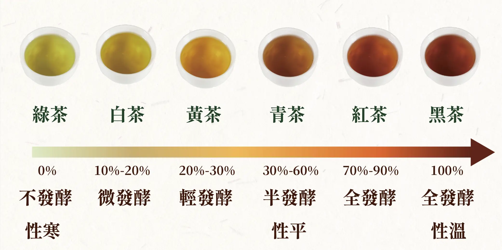

## 绿茶

### 产地分布

绿茶是中国产量最大、产地遍布最广的茶。分布在江南、江北、西南和华南四个茶区。河南、贵州、江西、安徽、浙江、江苏、四川、陕西、湖南、湖北、广西、福建等地均有分布，其中浙江、安徽、江西三省产量较高，质量较优。

### 加工工艺

主要工艺有**杀青、揉捻和干燥**三道工序。

> [!TIP] 杀青
> 通过高温快速破坏鲜叶中酶的活性，阻止茶多酚氧化，保留绿色和鲜爽口感。常见的杀青方式有炒青、蒸清、烘清和晒青。

### 特点

- 干茶绿
- 茶汤绿
- 叶底绿
- 入口鲜爽
- 绿茶富含叶绿素、维C，茶性较寒凉，茶碱含量高，较易剌激神经。
- 适合夏季解暑喝
- 提神效果好，睡前不要喝

### 代表性茶叶

- **西湖龙井**（浙江杭州）
- **洞庭碧螺春**（江苏苏州）
- **黄山毛峰**（安徽黄山）
- **六安瓜片**（安徽六安）
- **信阳毛尖**（河南信阳）
- **庐山云雾**（江西庐山）
- **太平猴魁**（安徽黄山）

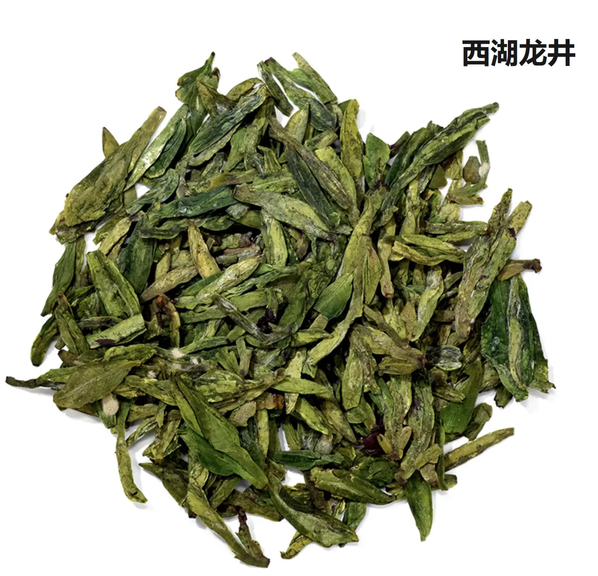

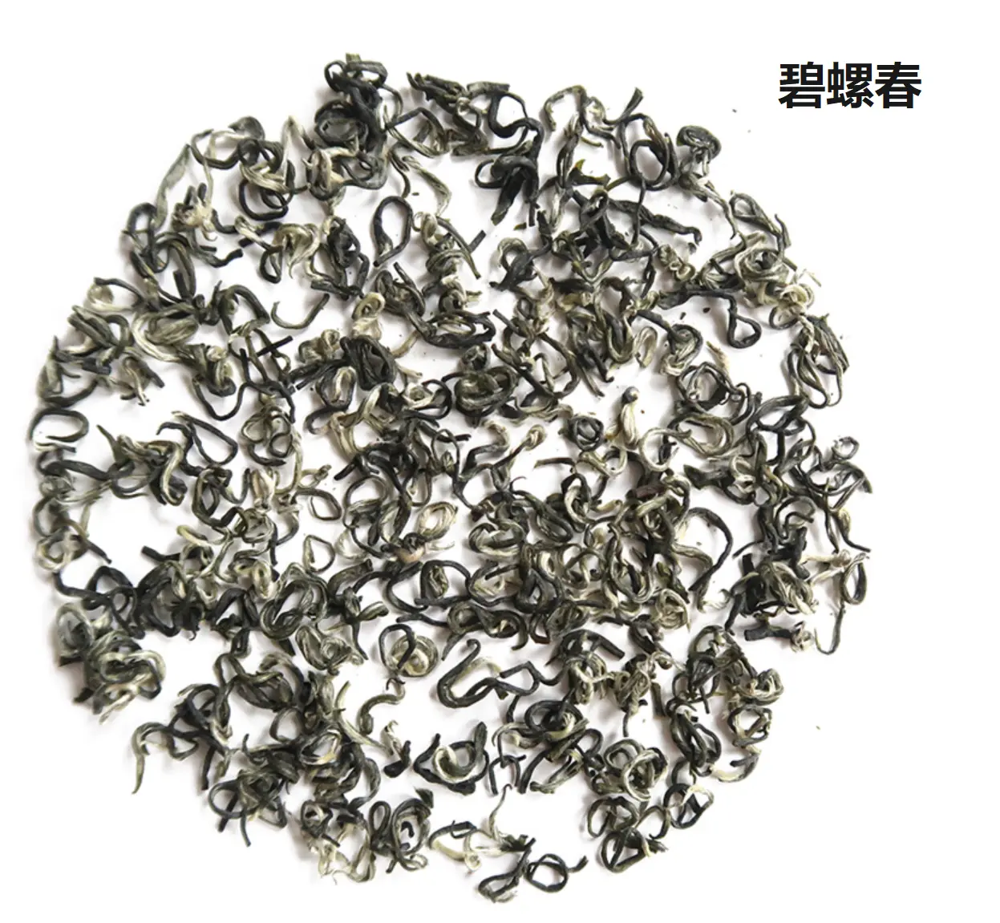

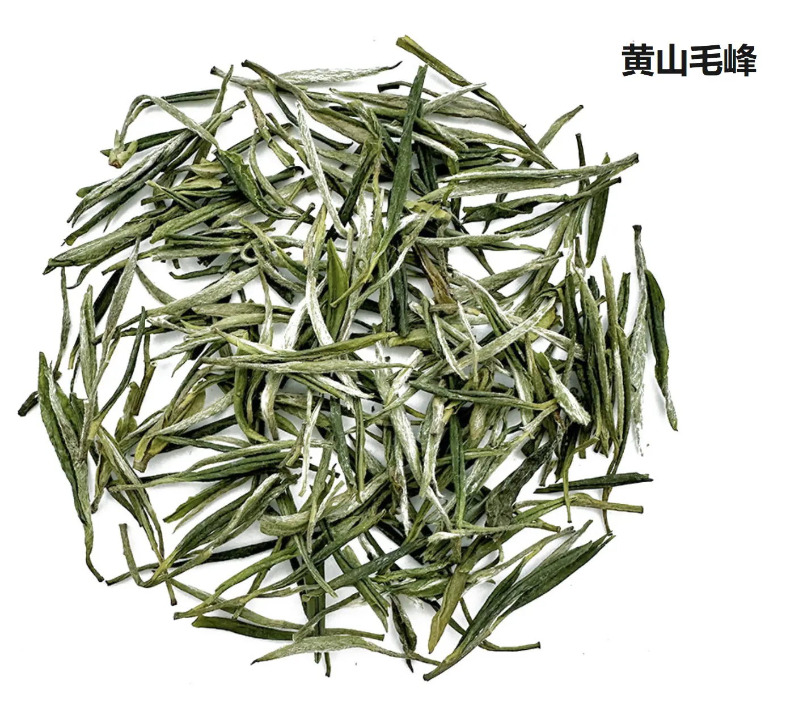

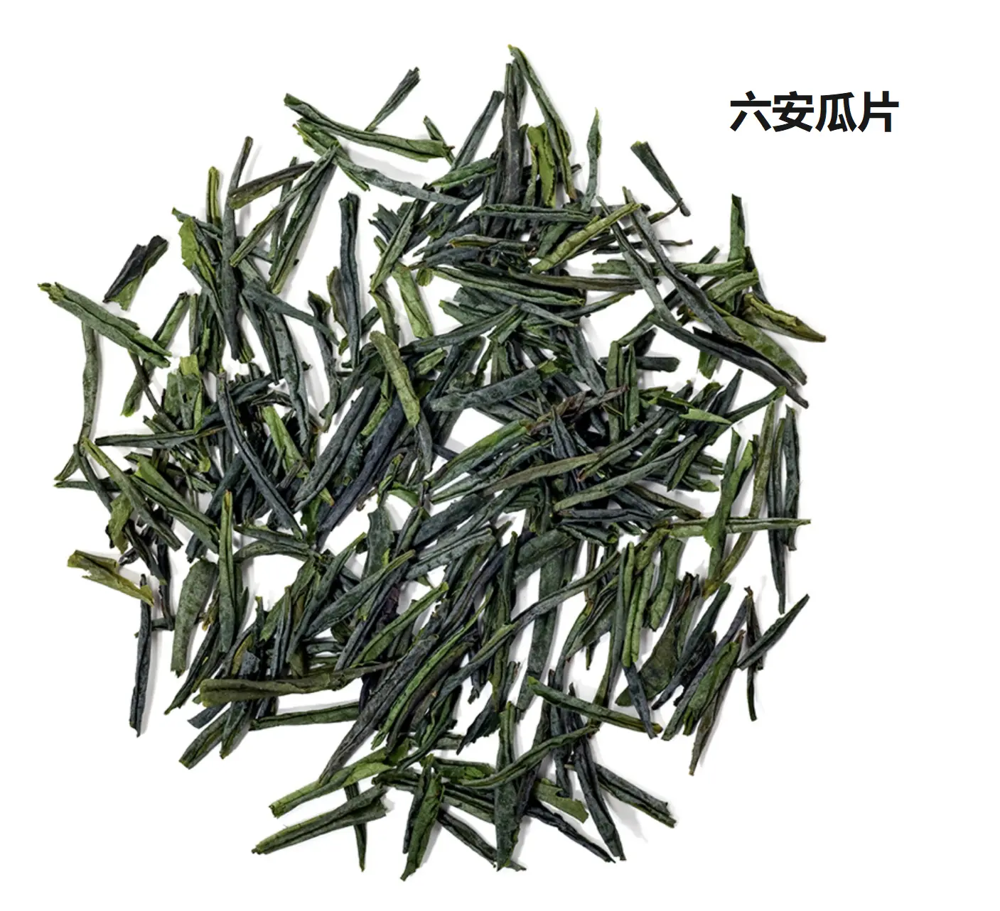

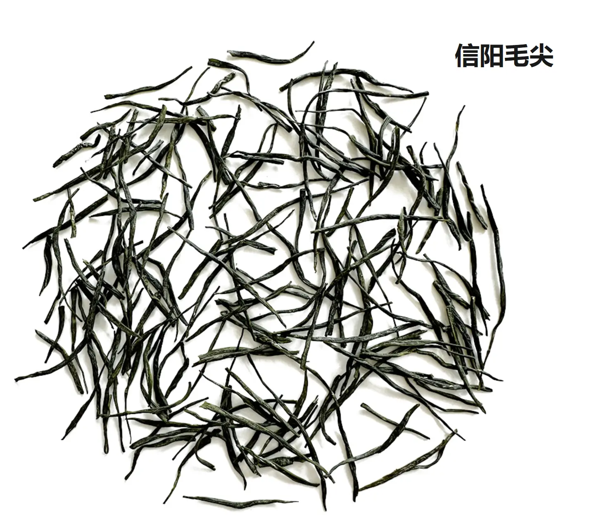

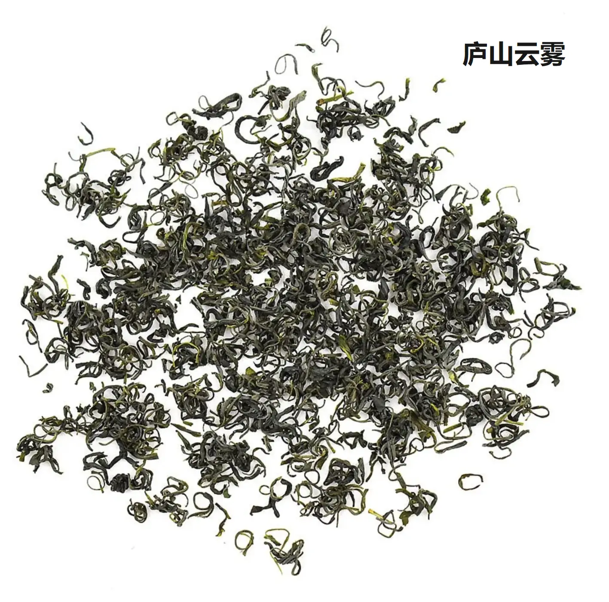

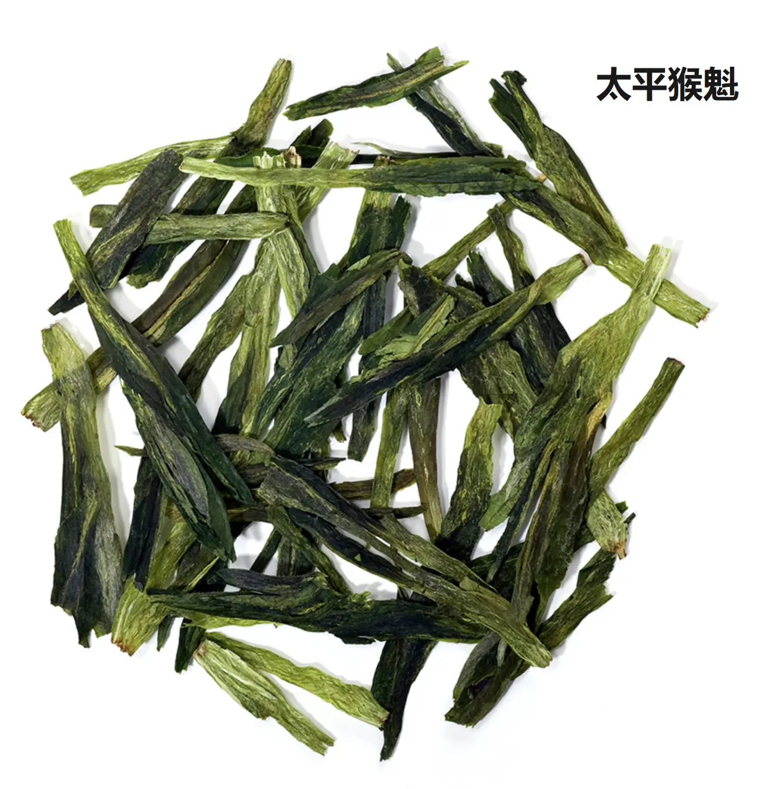

### 冲泡方式

水温不宜过高，一般在80°~85°即可，茶水比例1:50（1g茶配50ml水），可以选用玻璃杯、盖碗等散热较快的茶具。水温过高或者闷时间太长可能会导致茶汤发苦、发涩。

上投法（先注水再投茶，适合碧螺春、龙井）、中投法（投水1/3等待30s茶叶舒展再注水，适合黄色毛峰、庐山云雾）、下投法（先放茶叶再注满水，适合六安瓜片、太平猴魁）三种冲泡方式。

## 白茶

### 产地分布

当代白茶主要产于福建省福鼎、政和等地，以及武汉新洲旧街、云南景谷、湖南桑植等地，台湾省也有少量生产。

### 加工工艺

白茶不经杀青或揉捻，属于微发酵茶类，加工工艺主要为**萎凋及干燥**。

> [!TIP] 萎凋
> 萎凋是形成白茶品质的关键工序，把采下的新鲜茶叶薄薄地摊放在竹席上置于微弱的阳光下，或置于通风透光效果好的室内，让其自然萎凋。晾晒至七八成干时，再用文火慢慢烘干即可。

### 特点

- 干茶满披白毫，色泽银白灰绿。
- 汤色浅黄或杏黄，清澈透亮。
- 滋味鲜爽甘醇，毫香显露，像干草或豆浆的香气。
- 新白茶性微寒，清热降火；老白茶性温平，温润养生，所以白茶一年四季都可以喝。
- 老白茶和可以喝较淡的，不影响睡眠，新白茶有提神效果睡前尽量别喝。

### 代表性茶叶

- **白毫银针**是白茶中的 “皇后”，等级最高，原料全是肥壮的单芽头，满身白毛，口感极其清淡鲜爽，有 “毫香蜜韵”；
- **白牡丹**被称为 “茶中仙子”，原料为一芽一叶或一芽二叶，既有银针的毫香，又有叶子的甜味，花香明显；
- **贡眉**产量少，干茶毫香更明显，茶汤清甜鲜爽，回甘快，叶底柔软，新茶花香清淡，老茶转化后易出蜜香；
- **寿眉**产量最大，价格最亲民，叶子多、芽少，带有茶梗，新茶味重，但转化后口感极其醇厚，容易出枣香。

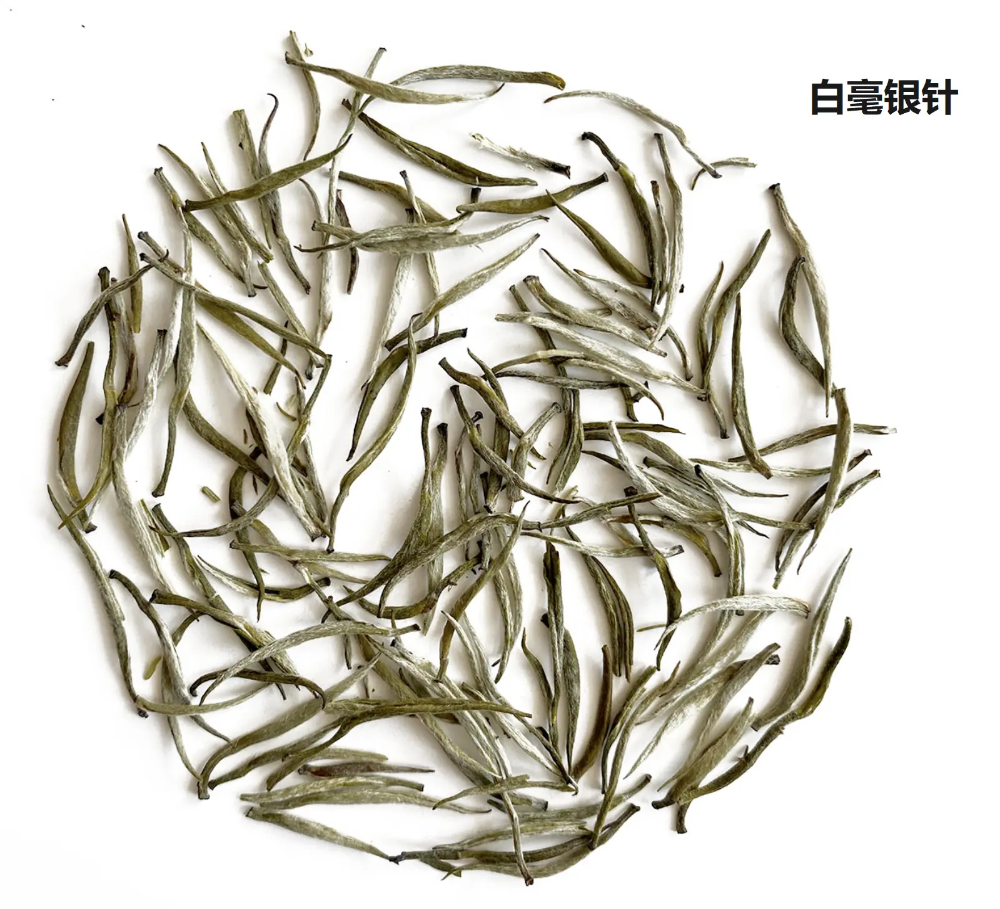

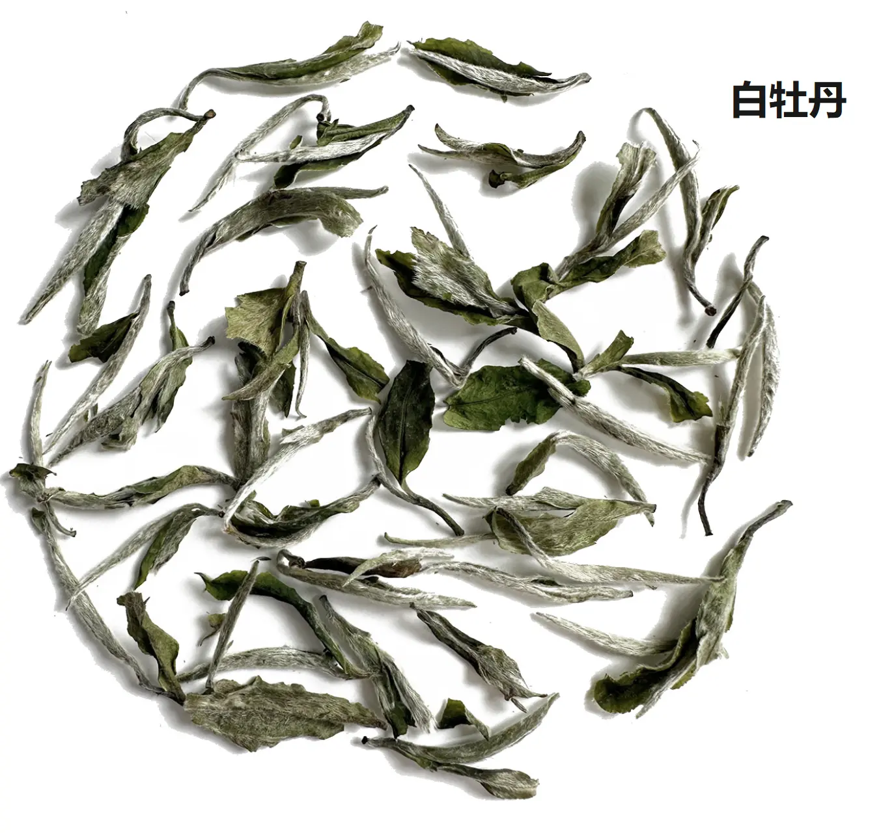

### 冲泡方式

- **白毫银针**比较嫩，不能用沸水泡，用85~90℃，不洗茶，第1-3泡5-10秒快出汤，第4泡后每泡延长5秒，可冲泡5-6泡。
- **白牡丹**嫩度次之，新茶 90-95℃，老茶 95-100℃，新茶不洗茶，老茶快速洗茶；第 1-3 泡 10 秒出汤，第 4 泡后每泡延长 10 秒，可冲泡 6-7 泡。
- **贡眉**新茶 90-95℃，老茶 100℃沸水，新茶不洗茶，老茶洗茶 1 次；第 1-2 泡 10 秒出汤，第 3 泡后每泡延长 10 秒，可冲泡 7-8 泡。
- **寿眉**新茶 95℃，老茶 100℃沸水（茶梗耐泡，高温才能激发茶香），新茶可洗茶 1 次（去除轻微青草香），老茶必洗茶；第 1 泡 15 秒出汤，第 2 泡后每泡延长 15-20 秒，可冲泡 8-10 泡（老寿眉甚至能泡 10 泡以上）

## 黄茶

### 产地分布

黄茶是我国特有茶类，较少见，产地分布较散，无大规模集中产区，多为各地产区的特色小众茶，核心产区集中在湖南、湖北、四川、安徽、浙江五省，部分产区仅少量种植，也是其产量低的原因之一。

### 加工工艺

黄茶在绿茶基础上加以闷黄工艺，因此形成黄叶黄汤。主要工艺有**杀青、闷黄和干燥**三道工序。

> [!TIP] 闷黄
> 闷黄工序对温度、湿度要求极高，耗时耗力，且原料多细嫩，采摘成本高；同时，黄茶的口感可被 “轻度发酵的绿茶” 或 “白茶” 替代，导致茶农种植和制作意愿低，成为六大茶类中最 “小众” 的品类，也让优质黄茶显得尤为珍贵。

### 特点

- 干茶呈嫩黄、金黄或暗黄
- 黄汤黄叶：冲泡后茶汤杏黄、橙黄或浅黄，清澈透亮，叶底嫩黄匀整
- 入口清甜醇和，鲜爽度稍逊于绿茶，但回甘绵柔，无绿茶的苦涩感和寒性，性质偏平和，脾胃偏寒的茶友也可饮用
- 比绿茶耐泡，比白茶稍弱，多数黄茶可冲泡 3~5 泡，滋味逐层释放
- 提神效果好，睡前不建议喝

### 代表性茶叶

- **黄芽茶**，顶级黄茶，原料最细嫩：君山银针（湖南岳阳洞庭湖君山岛）、蒙顶黄芽（四川雅安蒙顶山）、霍山黄芽（安徽六安霍山县）
- **黄小茶**，原料为一芽一叶/二叶，小众亲民：沩山毛尖（湖南长沙宁乡沩山）、鹿苑毛尖（湖北宜昌远安鹿苑寺）、平阳黄汤（浙江温州平阳）
- **黄大茶**，原料为一芽三叶/老叶，耐泡味浓：霍山黄大茶（安徽霍山、金寨等地）

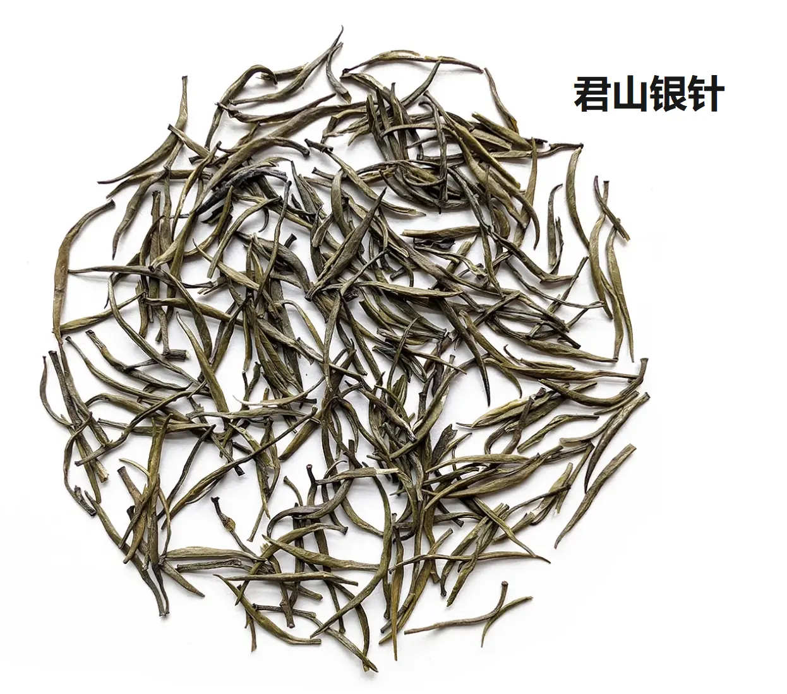

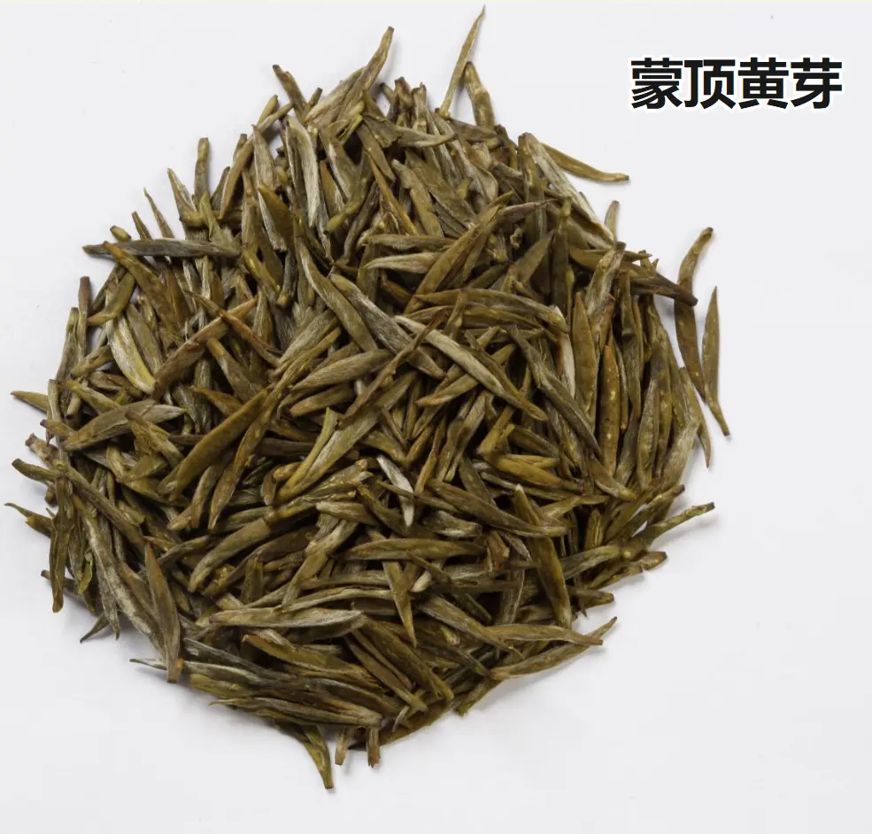

### 冲泡方式

黄茶的冲泡方式与绿茶类似。

**黄芽茶**适合用上投法（先注水至七分满，再投茶），80~85℃水温，静置30 秒～1分钟即可饮用，续泡时加水后静置时间延长30秒，可冲泡3~泡。

**黄小茶**适合中投法，85~90℃水温，第1泡50秒出汤，第2~3泡1分钟，第4泡后延长30秒，可冲泡4~5泡。

**黄大茶**时候下投法，90~95℃水温，可快速洗茶1次，第1泡40秒快出汤（避免闷泡出涩），第2~3泡1分钟，第4泡后延长1分钟，耐泡度高，可冲泡5~6泡。

## 乌龙茶（青茶）

### 产地分布

乌龙茶主要产于福建、广东、台湾等地区。

### 加工工艺

乌龙茶的工艺是六大茶类中最繁琐、精细的，核心是做青和焙火。

主要工艺：**萎凋、做青、杀青、做形、干燥、焙火**。

### 特点

- 乌龙茶的核心特点可以为香高、味浓，兼具绿茶的清香和红茶的醇厚，香气从清新花香到熟果香都有。
- 叶片中间为绿色，边缘呈红色，即标志性的绿叶红镶边
- 香气类型极其丰富，有兰花香、桂花香、栀子花香、蜜桃香、奶香、焦糖香、岩韵香等，且留香持久
- 茶汤醇厚饱满，回甘迅猛，喉韵明显。发酵轻的茶清爽鲜爽，发酵重、焙火足的茶温润绵柔，刺激性远低于绿茶，大部分茶性质温和。
- 乌龙茶茶性从偏凉到温和（关键差异在焙火程度），对应不同季节的需求
- 重焙火乌龙，可以喝淡的，基本不影响睡眠，其它乌龙茶提神效果较强，不建议睡前喝。

### 代表性茶叶

- **武夷岩茶**（闽北乌龙）：大红袍、肉桂、水仙
- **铁观音**（闽南乌龙）：清香型、浓香型、陈香型
- **凤凰单丛**（广东乌龙）：蜜兰香、鸭屎香、芝兰香、黄枝香，茶中香水。
- **台湾乌龙**：冻顶乌龙、高山茶

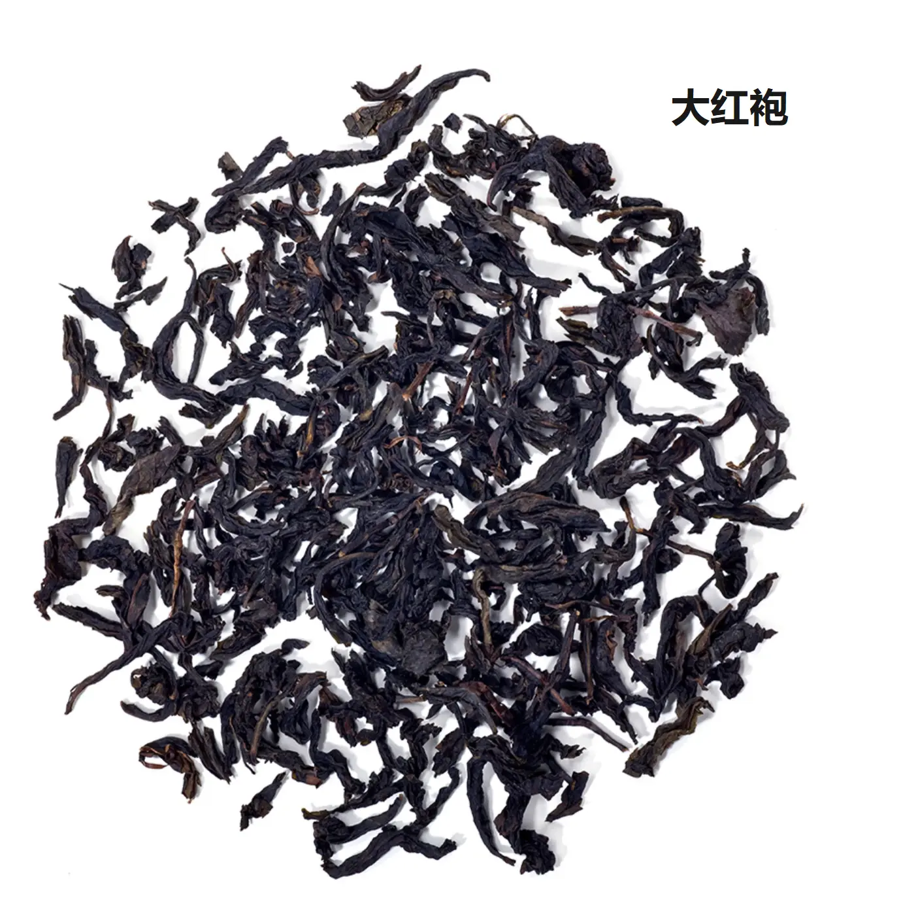

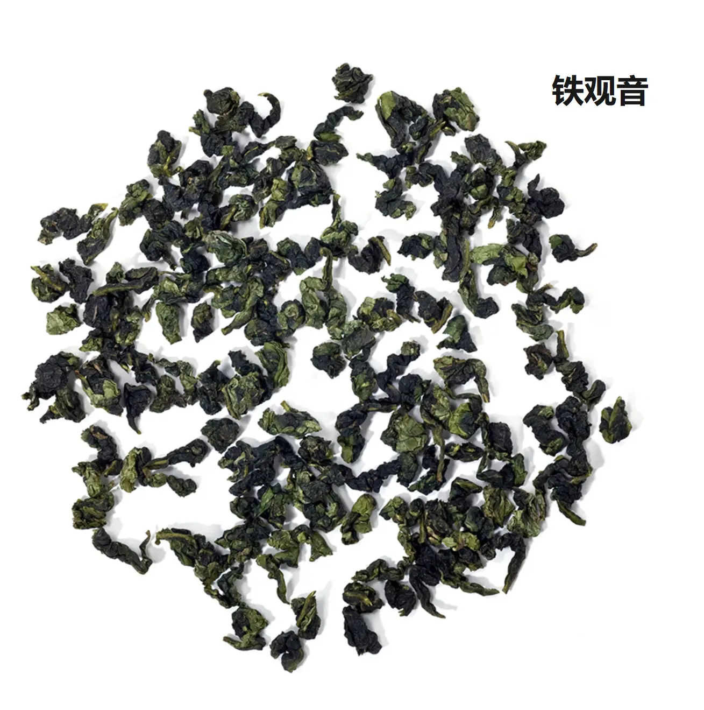

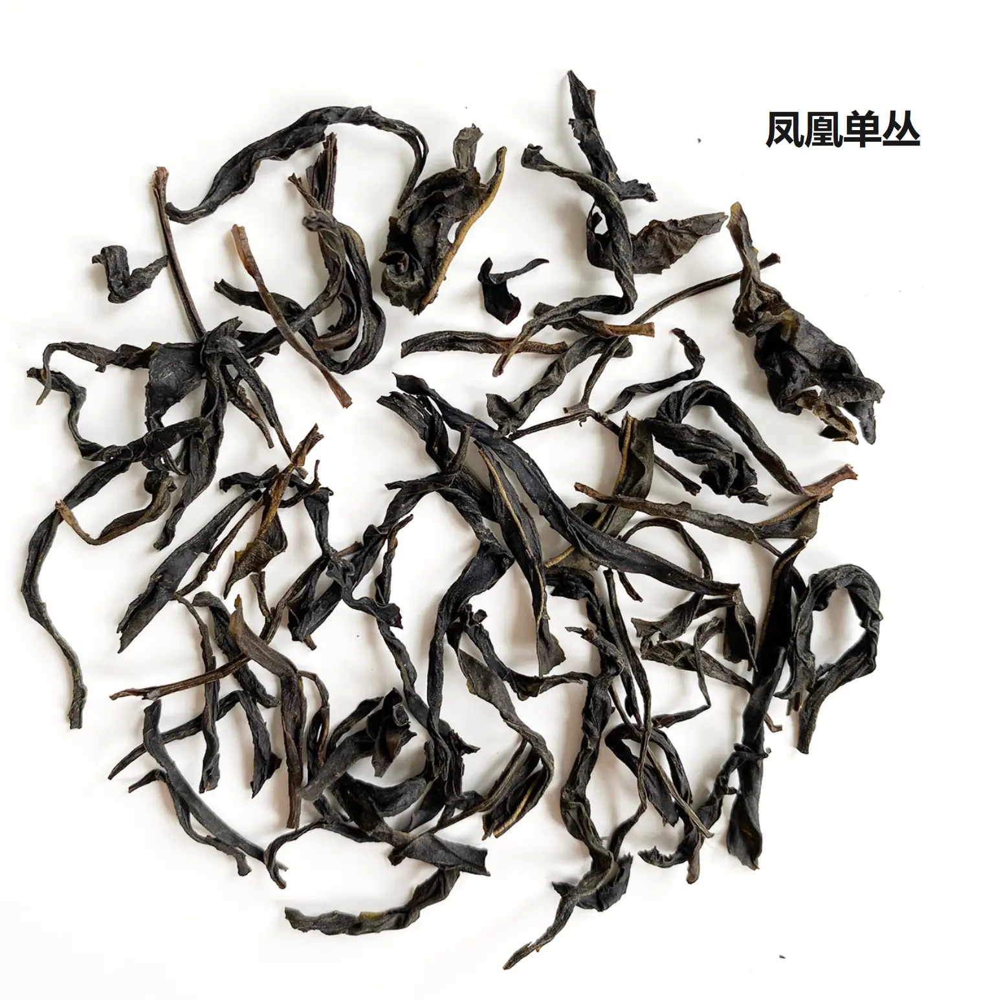

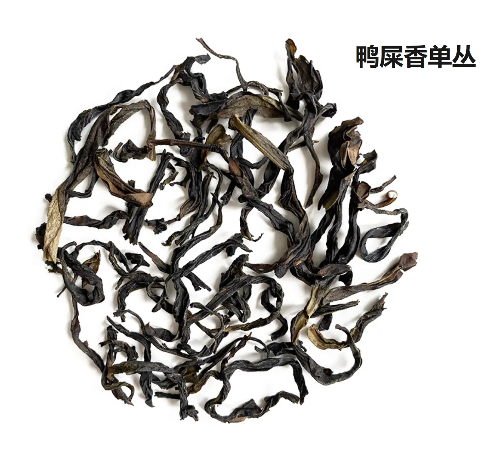

### 冲泡方式

乌龙茶是最讲究冲泡的茶类，核心原则：高温冲泡、茶水分离、快出汤、忌闷泡，才能最大限度激发香气，避免苦涩。

岩茶、单丛等重焙火茶适合用紫砂壶，盖碗适合所有乌龙茶。

水温 95~100℃，标准茶水比 1:15~1:20。

乌龙茶可以先用沸水快速洗茶，第1-3泡：5-10秒快速出汤；第 4-6 泡：每泡延长5-10秒；第7泡之后：根据滋味浓淡，每次延长10-20秒，优质茶可泡10泡以上。

## 红茶

### 产地分布

红茶原产于中国，是世界上最古老的茶类，如今产地遍布世界。国内产地主要有福建（发源地）、安徽、云南、广东等。四川、贵州、江西、浙江等地也有特色红茶出产。国际知名的产地有印度、斯里兰卡、肯尼亚等。

### 加工工艺

主要工艺为**萎凋、揉捻、发酵（关键工序）、干燥**。

> [!TIP] 发酵
> 在适宜的温湿度环境下，茶叶内含物质氧化，叶片由绿转红铜色，形成红茶特有的甜香、果香、蜜香，以及红汤红叶的基础。

### 特点

- 干茶多为乌黑（西方人叫它**Black Tea**就是因为干茶是黑色的）、金毫显露
- 汤色金黄、橙红、红艳，清澈明亮
- 叶底呈红色
- 香气有蜜香、花香、薯香松烟香、焦糖香、果香等，祁红有独特的 “祁门香”
- 滋味甜醇温润，几乎无苦涩，顺滑回甘，刺激性极低。
- 性温不寒不凉，适合多数体质，尤其适合脾胃偏弱、畏寒的人群
- 红茶有一定提神效果，睡前不建议喝，实在要喝也是喝淡茶。

### 代表性茶叶

- **正山小种**：福建武夷山桐木关，世界上最早的红茶，红茶鼻祖，传统工艺中还有浓郁的松烟香、桂圆汤香。
- **金骏眉**：福建武夷山桐木关，顶级红茶，属于正山小种的一个分支，以纯芽尖制成，干茶金、黄、黑相间，满披金毫，历史比较短，2005年才研制出来。
- **祁红工夫**：祁门红茶，安徽祁门，世界三大高香红茶之一（另外两个是印度大吉岭红茶、斯里兰卡乌瓦红茶），以其独特的“祁门香”而闻名。
- **滇红工夫**：云南临沧、保山、西双版纳等地，大叶种红茶。
- **英德红茶**：广东英德，香气甜润，带有明显的奶香、花香，茶汤红亮，滋味甜醇，非常适合加牛奶、柠檬调饮。
- **川红工夫**：四川宜宾、筠连等地，诞生于20世纪50年代，以独特的“橘糖香”为标志。
- **印度大吉岭红茶**：印度北部喜马拉雅山麓大吉岭高原，高海拔茶园，被誉为“红茶中的香槟”。
- **印度阿萨姆红茶**：印度东北部阿萨姆邦，布拉马普特拉河谷，阿萨姆奶茶那个茶。
- **锡兰（Ceylon）红茶**：斯里兰卡旧称 “锡兰”，红茶统称锡兰红茶，按产区海拔分风格，是世界最主流的袋泡茶与奶茶原料之一。锡兰红茶中的乌瓦（Uva）红茶，又称“乌沃红茶”、“乌伐红茶”，是世界三大高香红茶之一。

> [!TIP] 工夫
> “工夫” 指制作工艺繁复、耗时费工，而非“功夫”。

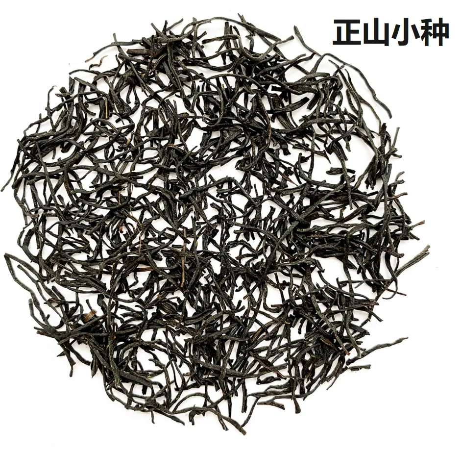

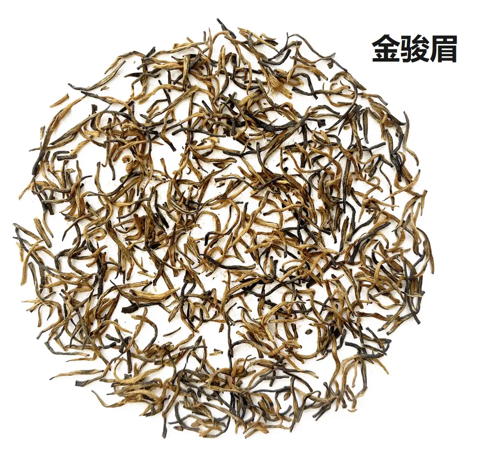

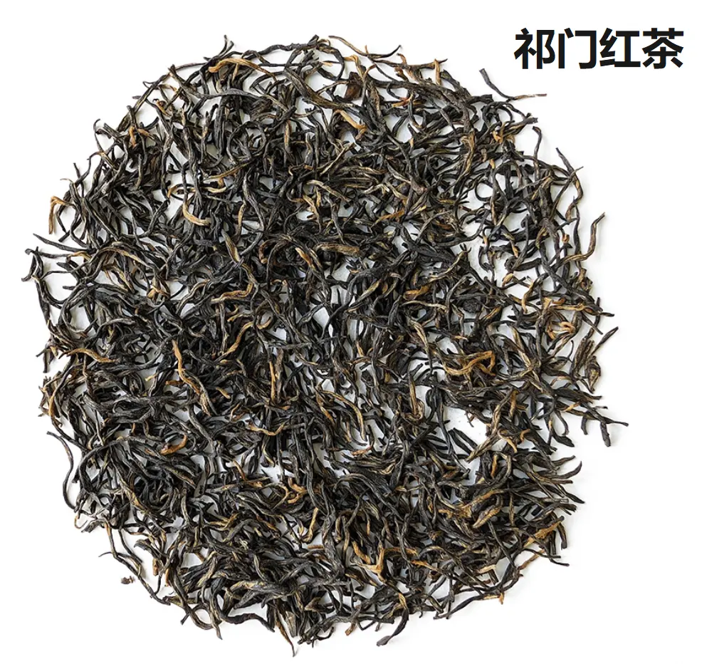

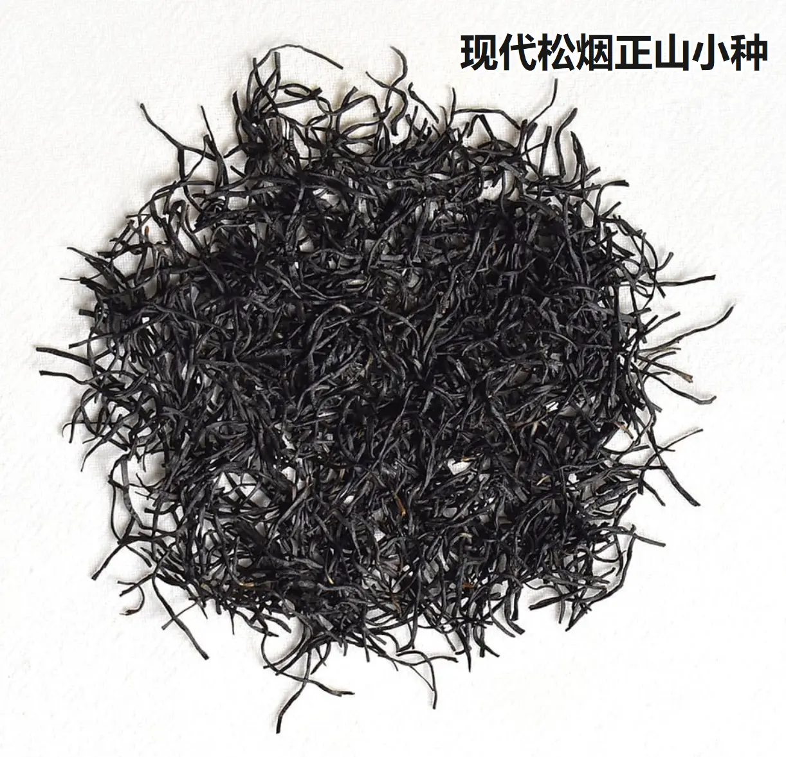

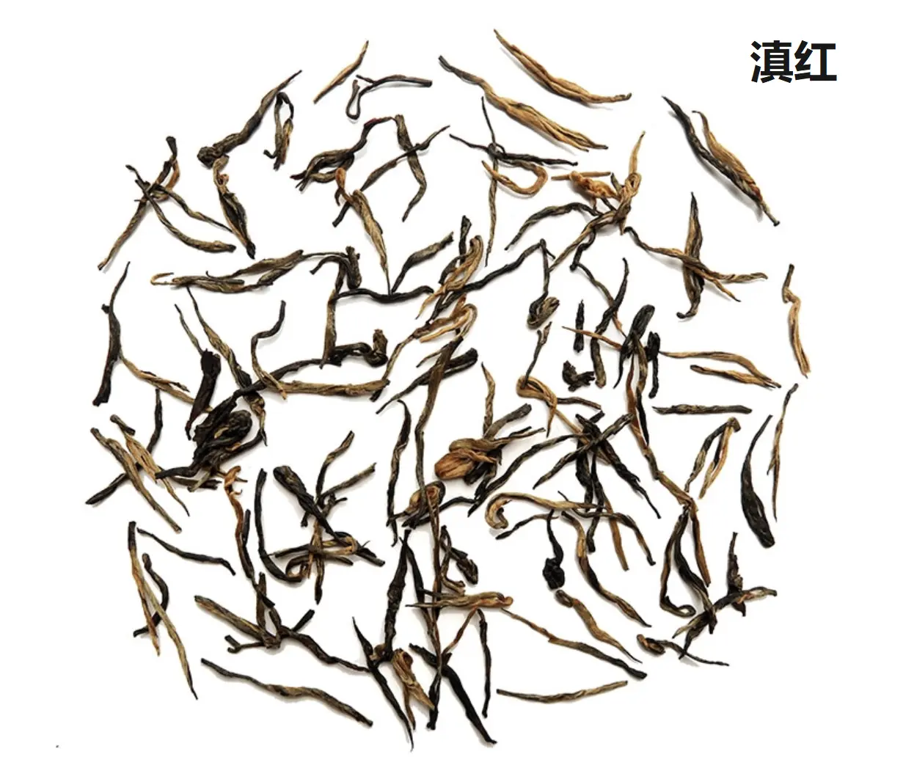

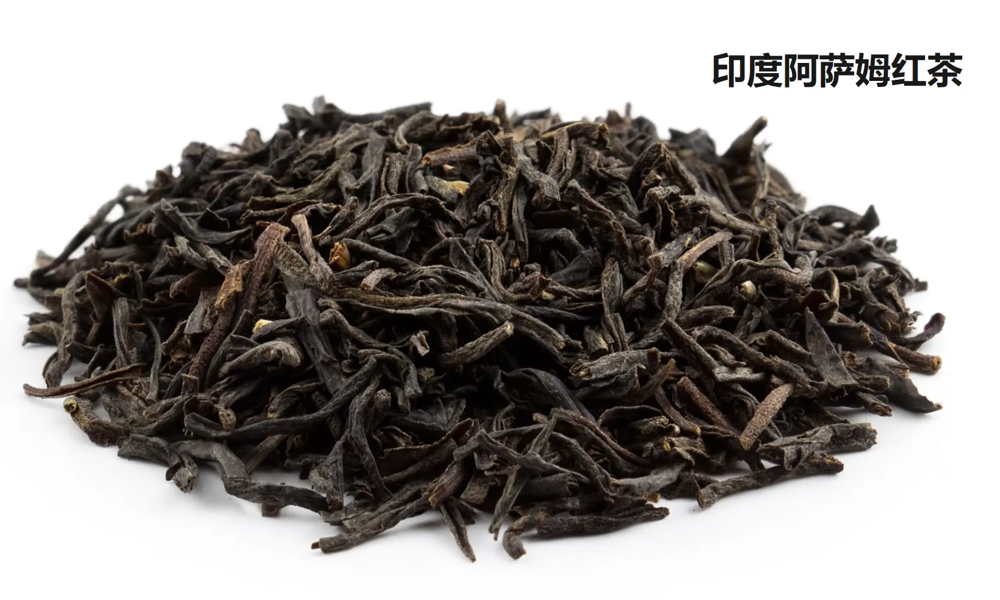

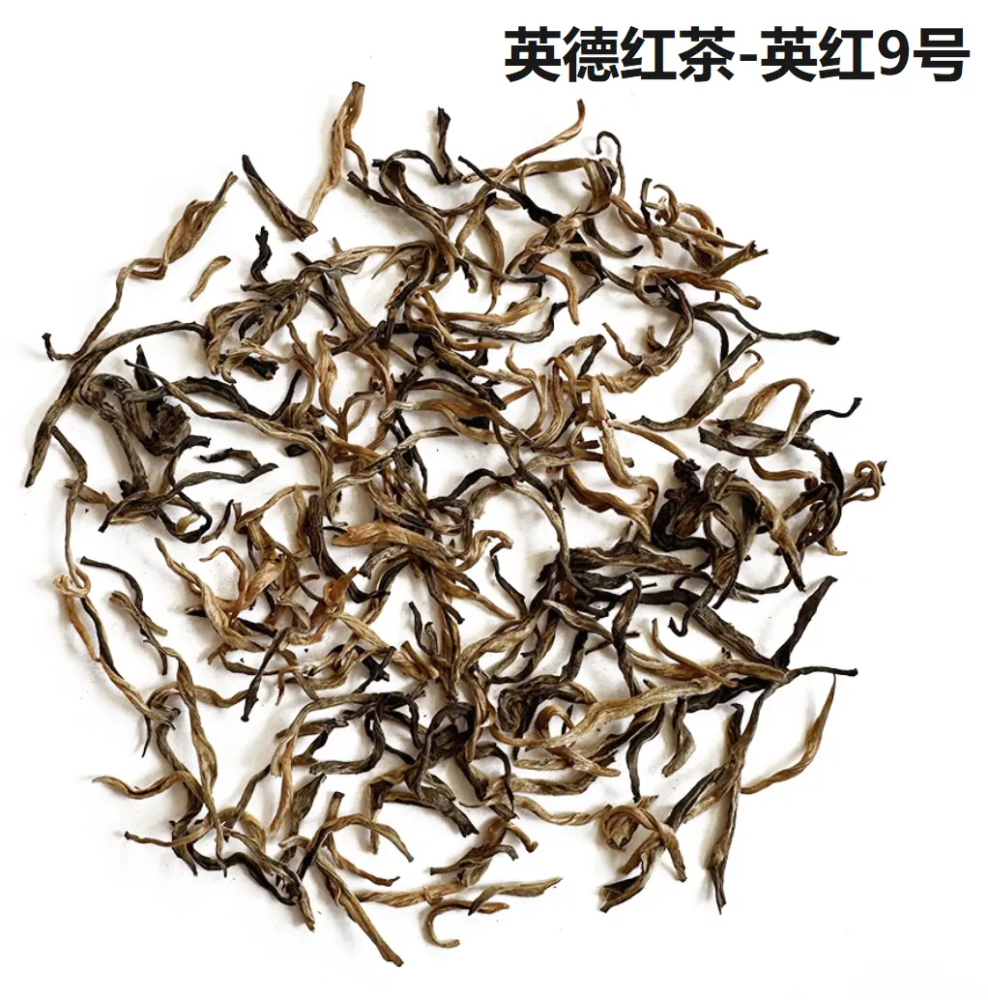

### 冲泡方式

盖碗、玻璃杯、瓷壶均可。细嫩红茶（金骏眉/祁红金针）90℃；普通工夫红茶/滇红 95℃。

金骏眉等单芽茶不洗；滇红、正山小种可快速润茶5秒。

投茶，沿壁注水，不直冲茶叶。第1–3泡：5–10 秒快出汤，第4泡起：每泡延长5–10秒，一般可泡5–8泡。

## 黑茶

### 产地分布

黑茶主要产于湖南、湖北、云南、四川、广西、陕西等地，为方便运输，多数被压制成紧压茶，如砖茶、沱茶等。

### 加工工艺

主要工艺为**杀青、揉捻、渥堆（关键工序）、干燥、蒸压成型、陈华**。

> [!TIP] 渥堆
> 将茶叶洒水、堆积，在适宜温湿度下，利用微生物（黑曲霉、酵母菌等）和湿热作用，进行深度发酵。这一步让茶叶由绿变褐，苦涩味转化，产生陈香、菌香、枣香等，茶性由寒转温。

### 特点

- 干茶为黑褐色、油润，多为压紧茶（砖、饼、柱形），散茶较少。
- 汤色橙红、深红、红褐，清澈透亮。
- 陈香为主，伴随菌香（金花）、枣香、药香、槟榔香、松烟香等。
- 口感醇厚，顺滑回甘，无苦涩。
- 茶性温和暖胃。
- 富含茶多糖、益生菌，解油腻、助消化、降血脂效果显著，是肉食为主人群的必备饮品。
- 基本不影响睡眠，可以睡前喝。

### 代表性茶叶

- **普洱熟茶**（云南普洱）
- **安化黑茶**（湖南安化）
- **六堡茶**（广西梧州六堡镇）
- **泾阳茯茶**（陕西泾阳）
- **雅安藏茶**（四川雅安）
- **青砖茶**（湖北咸宁赵李桥）

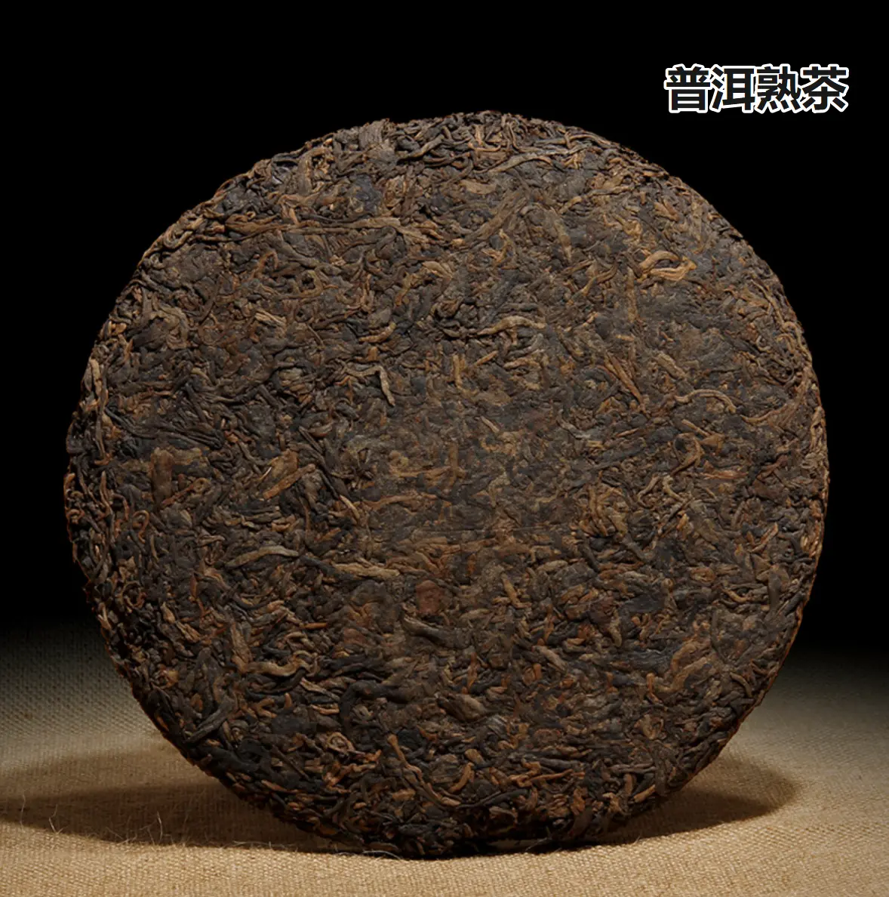

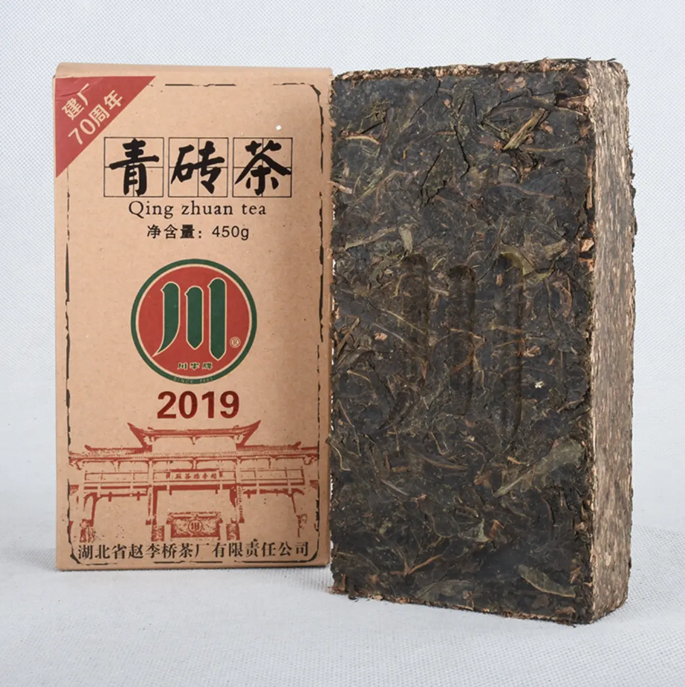

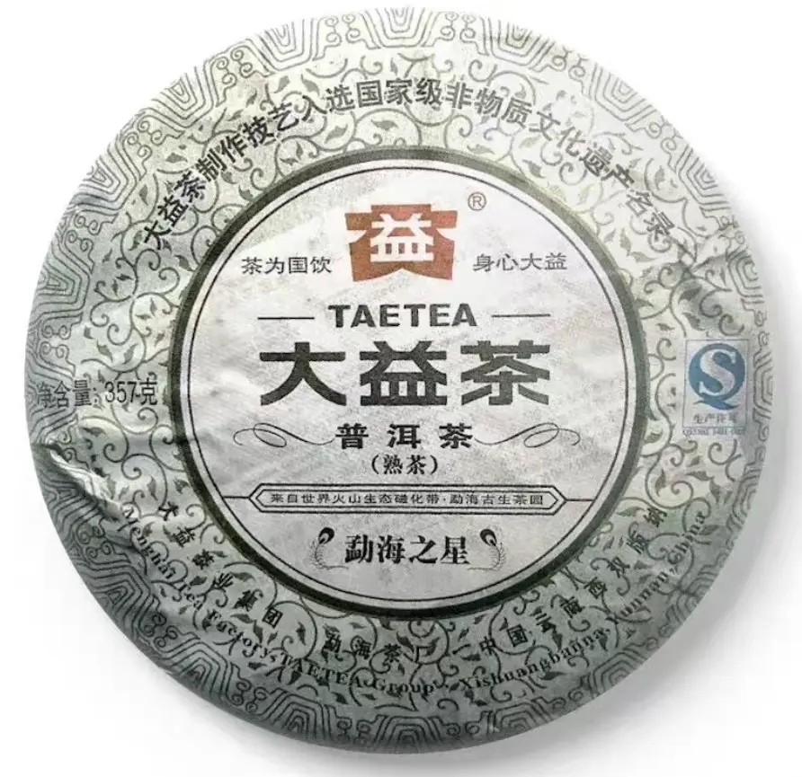

### 冲泡方式

温杯烫具，投茶，洗茶2次。沸水高冲注水，加盖闷泡。第1~5泡：10~20秒出汤，前几泡香气最足。第6~10泡：每泡延长10~20秒。第10泡后：可闷泡1~2分钟，依旧有滋味。

## 再加工茶和代用茶

除了六大基本茶类，还有许多再加工茶和代用茶。

**再加工茶**是含有茶树原料的，通过窨制、拼配、压制、调味等工艺二次加工而成，本质还是茶，只是多了附加风味或形态。

**代用茶**完全不用山茶科茶树鲜叶，以其他植物的叶、花、果、根茎为原料，按茶的方式冲泡饮用，行业标准正式名称为代用茶，民间也叫 “花草茶、草本茶、养生茶”。

以下是一些常见的再加工茶和代用茶：

- **花茶**：茉莉花茶、桂花红茶、玫瑰乌龙等。
- **紧压茶**：普洱茶饼、茶砖、沱茶、金瓜贡茶等。
- **果茶**：柠檬红茶、蜜桃乌龙、薄荷绿茶、百香果茶、蓝莓茶、山楂果茶等。
- **药茶**：减肥茶（山楂、决明子），润肺茶（罗汉果、胖大海），养肝茶（菊花、枸杞）。
- **萃取茶/速溶茶**：速溶红茶、茶粉、茶膏。
- **叶类代用茶**：老鹰茶（老荫茶）、苦丁茶、桑叶茶、柿叶茶。
- **花类代用茶**：纯干花冲泡，如玫瑰花茶、菊花茶、金银花茶、茉莉花（纯花）、桂花茶。
- **果类代用茶**：果实/果干冲泡，如红枣茶、枸杞茶、柠檬茶、山楂茶、胖大海茶。
- **根茎类代用茶**：植物根茎切片冲泡，如姜茶、牛蒡茶、葛根茶、茯苓茶。
- **混合代用茶**：多种草本拼配，如红豆薏米茶、陈皮茯苓茶、桂圆红枣茶。
