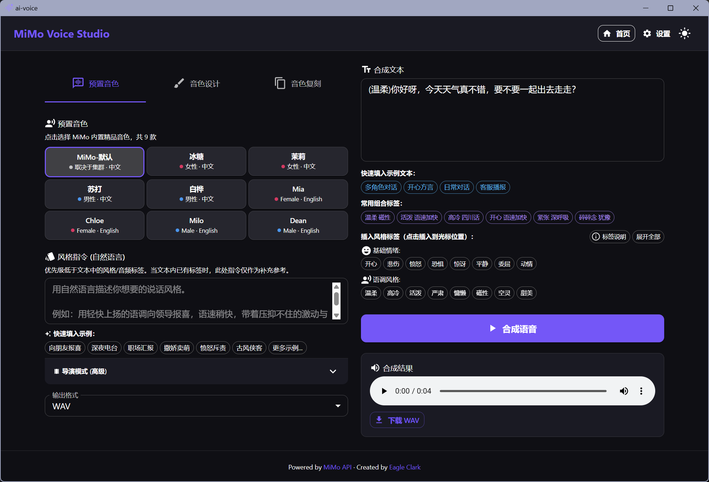
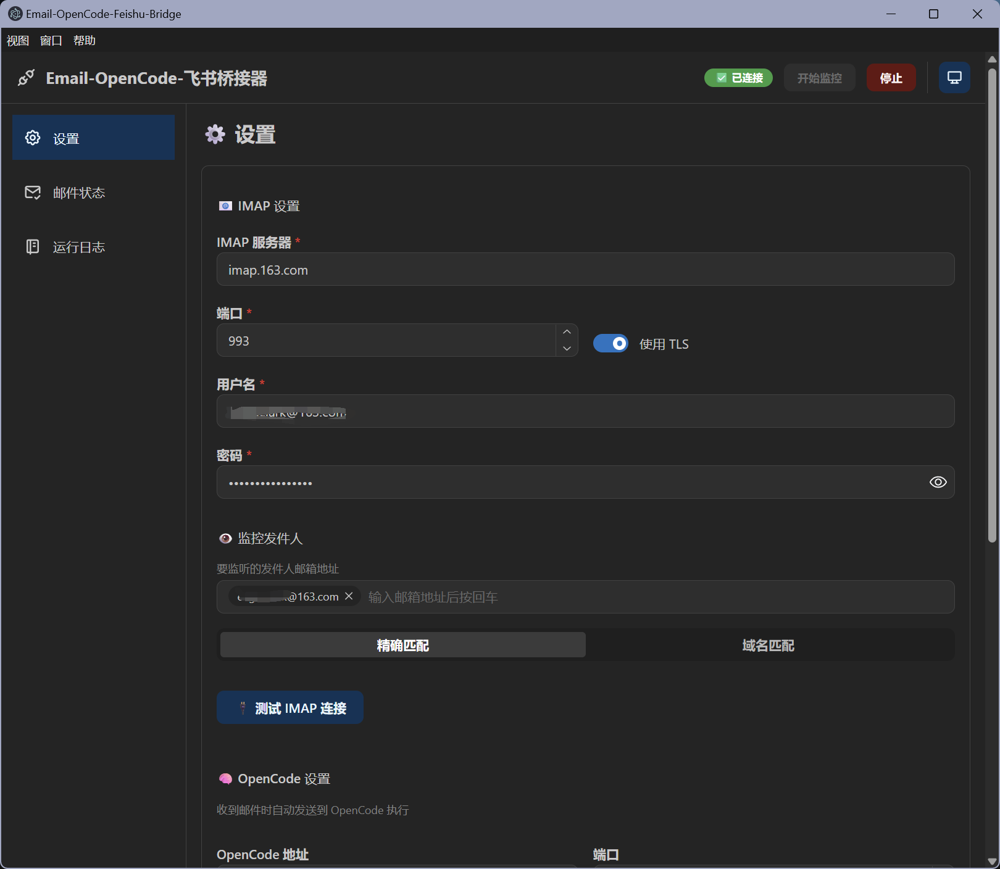
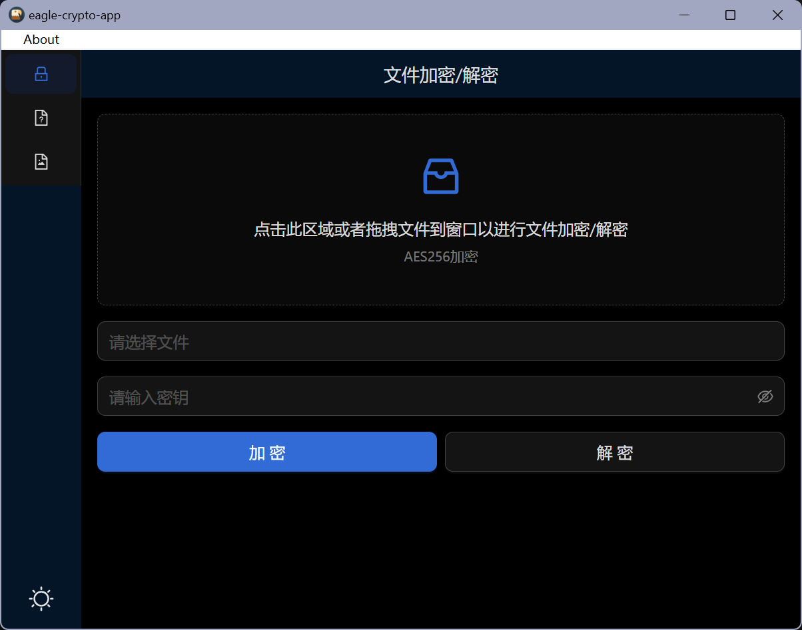
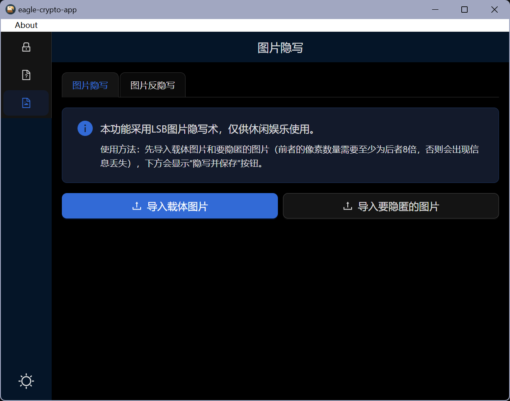

# 我的项目

> 首发于：2026-06-01

## AI声音生成

项目描述：Xiaomi MiMo的tts模型免费于是根据其官方的API开发的一个AI语音生成软件，支持声音生成、音色设计、音色复刻等功能。

项目地址：https://github.com/EagleClark/ai-voice

应用下载地址：https://github.com/EagleClark/ai-voice/releases

应用展示：

## Email-Opencode-飞书桥接器

项目描述：这是一款桥接器APP，接收邮件，发送给本地OpenCode执行，最后发送执行结果到飞书。在一些带有特殊限制的环境中，可以通过这种方式实现远程操控你的OpenCode帮你干活儿。

项目地址：https://github.com/EagleClark/email-opencode-feishu-bridge

应用下载地址：https://github.com/EagleClark/email-opencode-feishu-bridge/releases

应用展示：

## 加密解密图片隐写

项目描述：一个具备加密和解密文件、文本隐写、敏感词绕过、图片隐写等功能的轻量应用。

项目地址：https://github.com/EagleClark/eagle-crypto-app

应用下载地址：https://github.com/EagleClark/eagle-crypto-app/releases

应用展示：

## 带AI分析的周报系统

项目描述：一个全栈周报生成器应用，支持任务管理、周报汇总统计、AI 智能分析等功能。。

项目地址：https://github.com/EagleClark/work-report-generator

应用展示：见 [从0到1VibeCoding一个项目](/article/ai/从0到1VibeCoding一个项目/#项目成品展示)

## 我的博客

项目描述：当前网站项目，基于Vitepress开发，服务器使用的是Github的静态Web服务，域名是自己买的。

项目地址：https://github.com/EagleClark/blog/tree/vitepress
